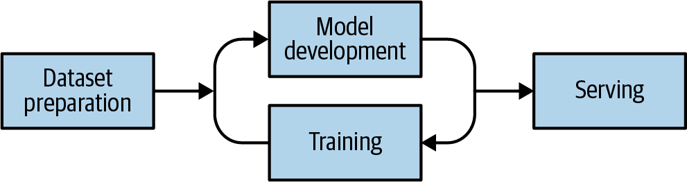
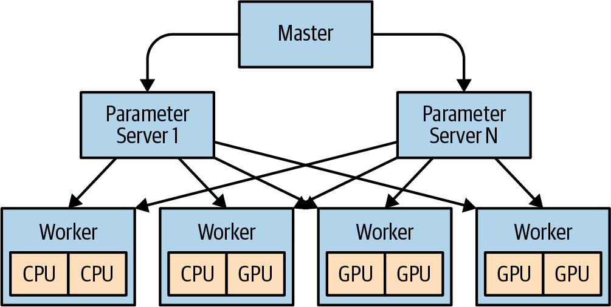

# Kubernetes Machine Learning, GPU Và Batch Workloads

## Overview

Machine learning workload trên Kubernetes thường là batch-heavy: dataset preparation, model development, training và serving có yêu cầu tài nguyên rất khác nhau. Platform team không chỉ cấp Pod chạy được, mà phải thiết kế GPU node pool, device plugin, storage path, network throughput, autoscaling và observability để training không biến thành workload đắt tiền nhưng idle.



## ML Workflow Mental Model

Workflow phổ biến:

```text
dataset preparation -> model development <-> training -> serving
```

- Dataset preparation cần storage, catalog, metadata và đường đọc ổn định.
- Model development thường dùng notebook hoặc tool self-service như JupyterHub/Kubeflow.
- Training là batch job tiêu thụ CPU/GPU/storage/network mạnh nhất.
- Serving là online workload cần latency, rollout, autoscaling và SLO riêng.

Đừng thiết kế một node pool duy nhất cho mọi pha. Training ưu tiên throughput và batch scheduling; serving ưu tiên latency, availability và rollout an toàn.

## GPU Và Device Plugin

Kubernetes biết GPU thông qua device plugin. Plugin thường chạy dạng DaemonSet, kiểm tra driver/runtime trên node rồi advertise extended resource như:

```text
nvidia.com/gpu
```

Ví dụ request GPU:

```yaml
apiVersion: batch/v1
kind: Job
metadata:
  name: train-model
spec:
  template:
    spec:
      restartPolicy: OnFailure
      containers:
      - name: trainer
        image: example.com/ml/train:1.0.0
        resources:
          limits:
            nvidia.com/gpu: 1
```

Checklist cho GPU node:

- driver, kernel module, CUDA/runtime và container runtime tương thích;
- device plugin chỉ advertise GPU khi node thật sự sẵn sàng;
- node label/taint rõ cho GPU pool;
- monitoring có GPU utilization, memory, temperature/throttling nếu cần;
- quota/LimitRange tránh một namespace chiếm toàn bộ GPU fleet.

Kubernetes scheduler chỉ quyết định dựa trên resource nó biết. Nếu plugin chỉ expose số lượng GPU, scheduler không hiểu topology GPU, bus locality, GPU memory fragmentation hoặc communication pattern của training job. Vì vậy GPU utilization thấp không phải lúc nào cũng là lỗi Kubernetes; có thể là bottleneck model, storage, network hoặc topology.

## Scheduling Và Autoscaling

GPU đắt, nên mặc định nên tách node pool:

```text
GPU node pool -> taint nvidia.com/gpu=present:NoSchedule -> Pod request GPU/toleration -> Cluster Autoscaler scale up/down
```

Best practices:

- Dùng taints/tolerations để workload thường không rơi vào node GPU.
- Bật autoscaling cho GPU node pool nếu provider hỗ trợ.
- Batch training job theo window hoặc queue nếu startup GPU node chậm.
- Dùng priority/preemption có kiểm soát cho job quan trọng.
- Tách serving GPU pool khỏi training nếu serving có SLO latency.

Upstream pattern hay dùng là taint node bằng key của extended resource, ví dụ `nvidia.com/gpu`, rồi dùng admission controller hoặc template để tự thêm toleration cho Pod có request GPU.

## Distributed Training

Distributed training chỉ đáng dùng khi model hoặc batch không fit trên máy lớn nhất khả dụng, hoặc khi lợi ích thời gian huấn luyện vượt chi phí đồng bộ. Nhiều workload sẽ nhanh và đơn giản hơn trên một node nhiều GPU so với nhiều node ít GPU.



Distributed training tạo traffic lớn giữa worker, parameter server hoặc collective communication layer. Bottleneck thường nằm ở:

- dataset đọc không đủ nhanh;
- checkpoint ghi chậm;
- network bandwidth/latency;
- GPU không được cấp dữ liệu đều;
- model/framework không scale tuyến tính.

Trước khi tăng node, đo GPU, CPU, storage và network utilization. Mục tiêu thực dụng là làm GPU trở thành bottleneck chính vì đó thường là tài nguyên đắt nhất.

## Storage Cho ML

Storage ảnh hưởng trực tiếp training:

- Dataset lớn có thể phù hợp object storage hoặc filesystem phân tán.
- Dataset nhỏ/trung bình có thể dùng block/shared filesystem tùy access pattern.
- Checkpoint và model artifact thường cần vị trí ghi ổn định, đôi khi cần `ReadWriteMany`.
- Dữ liệu training đa node cần locality/throughput; nếu kéo toàn bộ qua network chậm, GPU sẽ idle.

Production checklist:

- phân biệt dataset, checkpoint và model artifact;
- định nghĩa retention/lifecycle cho checkpoint;
- có backup/replication cho model artifact quan trọng;
- đo throughput đọc/ghi thật từ Pod;
- tránh để Secret/API key truy cập dataset nằm plaintext trong manifest.

## Networking

Training phân tán có thể nhạy với bandwidth và latency hơn workload web thông thường. Với mô hình parameter server hoặc collective communication, data exchange giữa worker có thể quyết định thời gian training.

Khi cần hiệu năng cao, cân nhắc:

- placement cùng zone/rack/node pool;
- network bandwidth của instance type;
- RDMA/InfiniBand nếu platform hỗ trợ;
- framework communication như MPI hoặc NCCL;
- NetworkPolicy không chặn nhầm worker-to-worker traffic.

## Troubleshooting

| Symptom | Kiểm tra |
|---|---|
| Pod Pending | GPU node capacity, taint/toleration, quota, node selector/affinity |
| Pod chạy CPU thay vì GPU | device plugin, runtime, driver mount, `nvidia.com/gpu` request |
| GPU utilization thấp | dataset throughput, CPU preprocessing, network, batch size, framework config |
| Job fail khi scale distributed | service discovery giữa worker, port, NetworkPolicy, framework rendezvous |
| Checkpoint chậm hoặc lỗi | RWX support, PVC events, storage latency, permission, capacity |
| Serving latency cao | model load time, GPU sharing, HPA metric, warmup, request batching |

Lệnh nền:

```bash
kubectl get nodes -o wide
kubectl describe node <gpu-node>
kubectl get pod -n <namespace> -o wide
kubectl describe pod <pod> -n <namespace>
kubectl logs <pod> -n <namespace>
```

## Best Practices

- Bắt đầu với một node nhiều GPU trước khi chọn distributed training nhiều node.
- Tách node pool GPU cho training và serving nếu SLO khác nhau.
- Dùng immutable image/digest cho training để kết quả reproducible hơn.
- Dùng GitOps/CI để version manifest, hyperparameter config và pipeline.
- Theo dõi GPU, CPU, memory, storage throughput, network throughput và job duration.
- Thiết kế cleanup cho Job, intermediate dataset và checkpoint cũ.
- Với workload nhiều tenant, dùng ResourceQuota, namespace boundary, RBAC và policy để tránh chiếm dụng GPU toàn cluster.

## Related Pages

- [Resources, Probes, Autoscaling Và Disruption](./01-resources-probes-autoscaling-and-disruption.md)
- [Scheduling, Affinity, Taints, Topology Và Priority](./03-scheduling-affinity-taints-topology-and-priority.md)
- [Kubernetes CRD, Operators, Policy Và Multicluster](../10-advanced/01-crd-operators-policy-and-multicluster.md)
- [Source Of Truth, Manifest Và Drift](../06-packaging-and-gitops/01-source-of-truth-manifest-and-drift.md)
