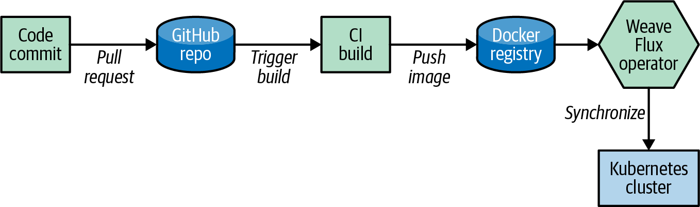
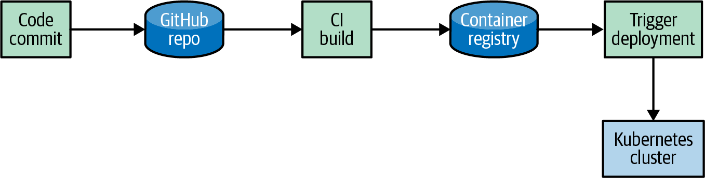

# Kubernetes GitOps, Argo CD, Flux Và Reconciliation

## Why This Exists

GitOps đưa Kubernetes release về cùng mental model với Kubernetes controller: desired state nằm trong Git, controller liên tục reconcile cluster để actual state khớp desired state. Điều này giúp audit, drift detection, rollback và multi-cluster rollout rõ ràng hơn.

## Mental Model

```text
Git desired state
-> GitOps controller watches repo
-> render manifests if needed
-> compare with cluster actual state
-> sync/apply
-> report health and drift
```

GitOps controller là một controller vận hành release. Nó không làm app đúng hơn nếu manifest sai, readiness sai hoặc dependency hỏng.


Điểm đáng nhớ: GitOps không phải “kubectl apply tự động” đơn thuần. Nó là vòng reconcile liên tục giữa Git, rendered manifests và cluster actual state. Vì vậy drift có thể đến từ người sửa tay trong cluster, admission webhook mutate field, controller khác cùng quản lý object, hoặc renderer sinh manifest không ổn định.


Trong fleet nhiều cluster, GitOps thường dùng Git làm source of truth chung, CI build/push image, rồi controller như Flux hoặc Argo CD sync từng cluster theo repo/path/branch phù hợp. Lợi ích chính không phải chỉ là deploy nhanh hơn, mà là giảm snowflake cluster và có audit trail cho thay đổi add-on, policy, monitoring, logging, ingress và workload.



OpenGitOps principles có thể nhớ gọn:

- Declarative: desired state được mô tả bằng manifest/config.
- Versioned and immutable: thay đổi đi qua Git history/commit.
- Pulled automatically: controller trong cluster kéo desired state từ source đã tin cậy.
- Continuously reconciled: actual state được so với desired state và sửa drift.

So với workflow truyền thống, GitOps giảm nhu cầu nhiều user/pipeline có quyền apply trực tiếp vào cluster.



Traditional deployment thường là CI build image rồi pipeline hoặc người vận hành trigger apply vào cluster. Cách này có thể vẫn tốt nếu kiểm soát chặt, nhưng dễ tăng drift, audit phân tán và credential rộng khi số app/cluster tăng.

## Core Objects / Components Involved

- Git repository và branch/path.
- Argo CD `Application` hoặc Flux `Kustomization`/`HelmRelease`.
- Kubernetes RBAC cho controller.
- Sync policy: manual hoặc automated.
- Health assessment và diff.
- Secret/config integration.

## How It Works

Flow phổ biến:

1. Sửa manifest/values/overlay trong Git.
2. PR được review.
3. GitOps controller phát hiện commit mới.
4. Controller render và diff với cluster.
5. Nếu policy cho phép, controller sync.
6. Controller báo trạng thái synced/out-of-sync/healthy/degraded.

## Minimal Example

Argo CD inspection:

```bash
kubectl get applications -n argocd
kubectl describe application <app> -n argocd
```

Flux inspection:

```bash
kubectl get kustomizations -A
kubectl get helmreleases -A
kubectl describe kustomization <name> -n <namespace>
```

## How To Inspect

Kiểm tra bốn lớp:

```bash
kubectl get pods -n <gitops-namespace>
kubectl get events -n <gitops-namespace> --sort-by=.lastTimestamp
kubectl auth can-i patch deployments --as=system:serviceaccount:<namespace>:<serviceaccount> -n <target-namespace>
kubectl get deploy,svc,ingress -n <target-namespace>
```

Nếu app out-of-sync liên tục, kiểm tra:

- webhook/admission mutate object;
- controller khác cùng quản lý object;
- server-side default field;
- RBAC thiếu quyền patch/update;
- generated name/secret/config thay đổi mỗi lần render.

## Common Confusions

| Confusion | Reality |
|---|---|
| GitOps tự động là an toàn | Tự động sync sai manifest vẫn gây outage nhanh hơn |
| GitOps thay CI | CI vẫn cần build image, test, scan, render và validate |
| OutOfSync luôn là lỗi | Một số drift do default/mutation có thể expected nhưng phải hiểu rõ |
| Rollback Git là rollback mọi thứ | Git rollback manifest; database/data/external service cần runbook riêng |

## Repo Structure

Không có repo layout duy nhất đúng cho mọi tổ chức. Quyết định layout phải theo ownership, blast radius và promotion model.

| Pattern | Khi phù hợp | Trade-off |
|---|---|---|
| Single monorepo | team nhỏ, muốn nhìn toàn bộ app/ops một chỗ | dễ lớn quá nhanh, khó tách quyền |
| Repo per team | ownership theo team rõ, platform muốn cân bằng quản trị và tự chủ | cần chuẩn folder/convention chung |
| Repo per application | app ownership độc lập, cần quyền riêng | khó quan sát toàn cảnh fleet nếu thiếu inventory |
| Branch per environment | promotion bằng merge branch đơn giản | dễ merge nhầm, conflict, khó dùng Helm/Kustomize overlay lâu dài |

Điểm khởi đầu thực dụng thường là repo/path theo team hoặc theo app, kèm folder per environment:

```text
apps/<app>/base
apps/<app>/overlays/dev
apps/<app>/overlays/staging
apps/<app>/overlays/prod
clusters/<cluster>/apps
clusters/<cluster>/platform-addons
```

Branch per environment chỉ nên dùng khi team thật sự hiểu trade-off. Với Kubernetes, folder/overlay per environment thường dễ review, diff và promotion hơn.

## Secrets In GitOps

Không đưa plaintext Secret vào Git và không bake secret vào container image. Kubernetes Secret mặc định chỉ base64 encode; muốn an toàn cần encryption at rest, RBAC tối thiểu và secret delivery model rõ.

Các chiến lược phổ biến:

- Sealed Secrets/SOPS: secret được encrypt trong Git, controller trong cluster decrypt.
- External Secrets/Vault/cloud secret manager: Git chỉ chứa reference, secret thật nằm trong secret backend.
- Manual pre-provisioned Secret: đơn giản nhưng dễ drift và thiếu audit nếu không có process.

Checklist:

- secret rotation có làm rollout không;
- ai có quyền decrypt/modify secret source;
- secret có bị log trong CI/render output không;
- cluster compromise có đọc được secret backend rộng hơn cần thiết không;
- disaster recovery có restore được secret controller key hoặc secret backend không.

## Tooling Choice

Flux, Argo CD và platform thương mại đều có thể phù hợp. Đánh giá theo:

- pull-based hay push-based boundary;
- RBAC multi-tenancy và project/team isolation;
- Helm/Kustomize support;
- drift detection và health model;
- secret integration;
- promotion workflow;
- UI/API/audit;
- bootstrap và disaster recovery;
- khả năng quản lý nhiều cluster.

## Production Notes

- Tách quyền GitOps controller theo namespace/team nếu có multi-tenancy.
- Bật automated sync theo mức rủi ro; production có thể cần manual sync hoặc sync window.
- Dùng policy validation trước merge, không chờ controller fail trong cluster.
- Không để hai GitOps controller quản lý cùng một object.
- Gắn alert cho app `Degraded`, `OutOfSync` lâu hoặc sync fail.
- Với multi-cluster, tách repo/path/credential theo blast radius. Một commit lỗi không nên có quyền phá toàn bộ fleet nếu chưa qua promotion gate.
- Với cluster fleet, ưu tiên promotion theo wave: dev/staging -> một cluster canary -> một region nhỏ -> toàn bộ region/fleet.
- Đừng để GitOps controller có credential rộng hơn phạm vi nó cần sync; nếu một controller quản lý nhiều cluster, credential compromise có blast radius tương ứng.
- Add-on nền như monitoring, logging, ingress, policy và security agent nên có version/promotion riêng với app business để rollback rõ ràng hơn.
- Bắt đầu với app nhỏ hoặc platform add-on ít rủi ro, rồi mở rộng GitOps coverage khi alert, rollback và ownership đã rõ.

## Related Pages

- [Source Of Truth, Manifest Và Drift](./01-source-of-truth-manifest-and-drift.md)
- [Environment Promotion, Release Và Rollback](./05-environment-promotion-release-and-rollback.md)
- [RBAC, Pod Security Và Admission](../04-security/01-rbac-pod-security-and-admission.md)
