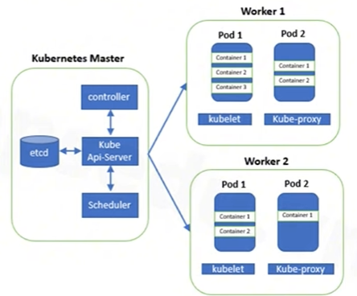

# Setup Cluster k8s 3 node 

## 0. Kiến trúc triển khai 
- Môi trường và công cụ: 
    - Ubuntu 24.04 LTS 
    - k3s 
    - Docker version

- Kiến trúc cụm :



## 1. Chuẩn bị môi trường 
### Setup hostname 
```bash
sudo hostnamectl set-hostname master-01  # trên master
sudo hostnamectl set-hostname worker-01  # trên worker-01   
sudo hostnamectl set-hostname worker-02  # trên worker-02


# Cập nhật /etc/hosts
cat << EOF | sudo tee /etc/hosts
192.168.199.10 node1 master-01
192.168.199.11 node2 worker-01
192.168.199.12 node3 worker-02
EOF

# Kiểm tra hostname
hostname -f

```

### Setup netplan 
```bash
# Disable network của cloud-init
echo "network: {config: disabled}" | sudo tee /etc/cloud/cloud.cfg.d/99-disable-network-config.cfg

# Xóa các file do cloud-init sinh ra
sudo rm -f /etc/netplan/50-cloud-init.yaml
sudo rm -f /etc/netplan/90-installer-network.yaml
sudo cloud-init clean --logs

# Viết lại file netplan config mới 
cat << 'EOF' | sudo tee /etc/netplan/01-netcfg.yaml
network:
  version: 2
  renderer: networkd
  
  ethernets:
    ens33:  
      dhcp4: true
    
    ens34:  
      dhcp4: no
      addresses:
        - 192.168.199.10/24
      routes:
        - to: default
          via: 192.168.199.1
      nameservers:
        addresses: [8.8.8.8, 1.1.1.1]
EOF

# Quyền hạn và bảo mật file 
sudo chmod 600 /etc/netplan/01-netcfg.yaml
sudo netplan apply

```