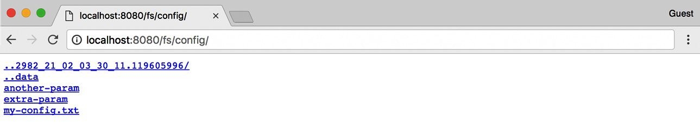

# Kubernetes ConfigMap, Secret, Downward API Và API Access

## Overview

Một image container tốt nên reusable. Khác biệt giữa dev/staging/prod nên đến từ runtime configuration, không phải build lại image cho từng môi trường. Kubernetes cung cấp ConfigMap, Secret, Downward API và ServiceAccount/API access để app nhận config và tương tác với cluster có kiểm soát.

## ConfigMap As Runtime Filesystem

ConfigMap có thể được hiểu như một filesystem nhỏ hoặc một tập key/value được ghép vào Pod ngay trước khi Pod chạy.



ConfigMap phù hợp cho:

- flag cấu hình;
- file config không nhạy cảm;
- endpoint không bí mật;
- feature toggle đơn giản.

Không dùng ConfigMap cho password, token hoặc private key.

## ConfigMap Consumption Modes

Environment variable:

```yaml
env:
- name: APP_MODE
  valueFrom:
    configMapKeyRef:
      name: app-config
      key: APP_MODE
```

Volume file:

```yaml
volumes:
- name: config
  configMap:
    name: app-config
```

Command argument:

```yaml
args:
- "--mode=$(APP_MODE)"
```

ConfigMap mounted as volume có cơ chế update file, nhưng app phải biết reload. Environment variable không tự đổi trong process đang chạy.


Khi mount ConfigMap/Secret thành volume, mỗi key thường trở thành một file trong mount path và nội dung file là value tương ứng. Đây là pattern tốt cho app có thể reload config từ file. Tránh dùng `subPath` cho config cần update động, vì mount qua `subPath` thường không nhận được update giống mount cả volume.

## Config Change Và Rollout

Một điểm dễ nhầm: đổi ConfigMap không luôn làm Pod restart.

| Cách dùng ConfigMap | Khi ConfigMap đổi |
|---|---|
| env var | process đang chạy không thấy giá trị mới |
| mounted volume | file có thể được update sau một khoảng trễ |
| mounted bằng `subPath` | thường không nhận update động như mount cả volume |
| command/args từ env | chỉ có hiệu lực khi container start lại |

Vì vậy production thường dùng một trong các pattern:

- rollout lại Deployment khi config quan trọng đổi;
- app tự reload file config an toàn;
- thêm checksum config vào Pod template annotation để trigger rollout qua GitOps/Helm/Kustomize;
- tách config thay đổi thường xuyên khỏi config yêu cầu restart.

Ví dụ checksum annotation:

```yaml
metadata:
  annotations:
    checksum/config: "<rendered-config-checksum>"
```

Không nên dựa vào việc volume update tự động nếu app không có cơ chế reload và verify.

Với Secret cũng tương tự: Secret đổi không đảm bảo process đang chạy tự dùng giá trị mới. Rotation phải có kế hoạch: app reload file, rollout Pod, hoặc cơ chế secret store/sidecar phù hợp. Trước khi rotate production secret, cần biết dependency cũ có còn chấp nhận credential cũ trong grace period không.

## Secret Handling

Secret giống ConfigMap về cách consume nhưng dùng cho dữ liệu nhạy cảm. Dù vậy, Secret không tự đủ an toàn nếu RBAC rộng hoặc encryption at rest chưa bật.


Checklist:

- Không commit secret thật vào Git.
- Không log secret qua env dump.
- Không truyền secret bằng command argument nếu có thể đọc qua process list/log.
- Hạn chế quyền `get/list/watch secrets`.
- Rotate secret và kiểm tra app reload/rollout.

Secret trong Kubernetes thường được base64-encode trong manifest, không phải encrypted theo nghĩa bảo mật đầu cuối. An toàn thực tế phụ thuộc vào:

- ai có quyền đọc Secret qua API;
- etcd có encryption at rest không;
- secret có bị sync ra Git/log/CI artifact không;
- Pod nào mount được Secret;
- secret rotation có làm app reload an toàn không.

Pattern tốt:

- dùng External Secrets/CSI Secret Store nếu tổ chức có vault/KMS riêng;
- tách Secret theo app thay vì một Secret lớn dùng chung;
- không cấp quyền list/watch toàn bộ Secret cho app;
- dùng projected volume hoặc env theo nhu cầu, nhưng tránh env nếu app/log dễ dump process environment;
- test rotation như một phần vận hành, không chỉ tạo Secret một lần.

### Secret Storage Và Size Guardrail

Secret trong Pod cuối cùng vẫn được app nhìn thấy ở dạng plaintext, dù Kubernetes lưu object bằng base64 trong manifest/API response. Vì vậy Secret object không phải là “vault” hoàn chỉnh. Cần phân biệt:

- Secret mounted vào node nên chỉ xuất hiện trên node có Pod cần dùng và thường được kubelet quản lý trong memory-backed volume.
- Secret trong API/etcd cần encryption at rest và kiểm soát access.
- Secret trong env var dễ bị lộ qua debug dump, crash report, app log hoặc tooling đọc environment.
- Secret lớn hoặc file binary lớn không nên nhét vào Kubernetes Secret; dùng secret manager/object storage phù hợp hơn.

Với private registry, `imagePullSecrets` có thể gắn qua ServiceAccount để Pod trong namespace dùng thống nhất, nhưng không nên patch `default` ServiceAccount trong namespace production nếu namespace chứa nhiều workload không cùng trust boundary.

### Config/Secret Precedence Và Rollout Discipline

Checklist trước khi thay ConfigMap/Secret production:

```bash
kubectl get deploy <deploy> -n <namespace> -o yaml
kubectl get configmap,secret -n <namespace>
kubectl describe pod <pod> -n <namespace>
```

Cần trả lời:

- app đọc config qua env, file volume hay command args;
- thay đổi có cần Pod restart/rollout không;
- key thiếu sẽ làm Pod không start hay chỉ bị skip;
- ConfigMap/Secret có cùng namespace với Pod không;
- rollout strategy có đảm bảo không cắt hết traffic cùng lúc không;
- secret cũ có grace period để rollback không.

Nếu dùng Helm/GitOps, checksum annotation trên Pod template là cách phổ biến để thay đổi config kích hoạt rollout có kiểm soát.

Một pattern đơn giản khác là version hóa tên ConfigMap, ví dụ `frontend-config-v1`, `frontend-config-v2`, rồi đổi reference trong Deployment. Cách này biến config change thành rollout có health check và rollback rõ hơn so với sửa ConfigMap tại chỗ. Trade-off là cần cleanup ConfigMap cũ theo release policy để không tạo rác lâu dài.

## Downward API

Downward API giúp app biết metadata của chính Pod:

```yaml
env:
- name: POD_NAME
  valueFrom:
    fieldRef:
      fieldPath: metadata.name
- name: POD_NAMESPACE
  valueFrom:
    fieldRef:
      fieldPath: metadata.namespace
```

Use case:

- log có Pod name/namespace;
- app biết replica identity;
- sidecar đọc labels/annotations;
- expose resource request/limit cho runtime tuning.

Downward API không phải REST endpoint. Đây là cơ chế kubelet/API server inject field vào env hoặc file. Nếu app chỉ cần Pod name, namespace, node name, labels hoặc resource limit/request, dùng Downward API thay vì cấp quyền gọi Kubernetes API.

## Command, Args Và Env Pitfalls

Trong Pod spec, `command` gần với Dockerfile `ENTRYPOINT`, còn `args` gần với Dockerfile `CMD`. Giá trị env/args trong YAML nên được quote khi dễ bị YAML hiểu nhầm thành boolean, number hoặc null.

```yaml
env:
- name: FEATURE_ENABLED
  value: "true"
- name: APP_VERSION
  value: "1.10"
```

Env được cấu hình theo từng container, không có env block global cho toàn Pod. Nếu cần share config giữa nhiều container, dùng ConfigMap/Secret volume hoặc lặp lại env một cách có kiểm soát qua template/Helm/Kustomize.

## Init Container Và Native Sidecar

Init container chạy tuần tự trước container chính và phải hoàn thành thành công trước khi bước tiếp theo chạy. Dùng init container cho việc chuẩn bị file/config trong shared volume, kiểm tra dependency, lấy certificate từ hệ thống ngoài, set permission hoặc giữ tool đặc quyền khỏi main image.

Native sidecar là init container có `restartPolicy: Always`. Nó khởi động trong init phase nhưng tiếp tục sống cùng Pod và dừng sau regular containers. Pattern này hữu ích khi sidecar phải sẵn sàng trước app chính hoặc khi Job cần sidecar nhưng không muốn sidecar chạy mãi làm Job không complete.

```yaml
initContainers:
- name: helper
  image: helper:1.0
  restartPolicy: Always
```

Không dùng init container để che giấu dependency yếu. Nếu init container chỉ loop chờ một service bên ngoài mà không có timeout/observability, Pod sẽ kẹt ở init phase và sự cố khó nhìn hơn.

## Calling Kubernetes API

App không nên gọi API Server chỉ để lấy Pod name hoặc namespace; dùng Downward API. App nên gọi API khi nó là:

- controller/operator;
- automation cần watch resource;
- service discovery đặc biệt;
- platform component.

Khi cần gọi API:

- dùng ServiceAccount riêng;
- Role tối thiểu;
- namespace scope nếu có thể;
- watch/list cẩn thận để không tạo tải API Server;
- handle reconnect, backoff, pagination.

Trong Pod, token ServiceAccount có thể được mount vào filesystem để client gọi API Server. Token bearer nghĩa là ai đọc được token thì có thể gọi API theo quyền của ServiceAccount đó. Vì vậy không `cat` token ra log, không copy token vào artifact debug và không cấp quyền rộng cho `default` ServiceAccount.

Read-only check trước khi cấp quyền:

```bash
kubectl auth can-i get pods --as=system:serviceaccount:<namespace>:<serviceaccount> -n <namespace>
kubectl get serviceaccount <serviceaccount> -n <namespace> -o yaml
kubectl get rolebinding,clusterrolebinding -A | grep <serviceaccount>
```

Guardrails:

- dùng client library và in-cluster config thay vì tự ghép URL/token bằng shell nếu viết app/controller thật;
- không bỏ qua TLS verify như thói quen dùng `curl -k` trong production automation;
- tắt `automountServiceAccountToken` cho Pod không cần gọi API;
- dùng ServiceAccount riêng theo workload, không dùng `default` cho app production;
- ưu tiên projected/bound ServiceAccount token có audience và TTL phù hợp khi cluster hỗ trợ;
- chỉ cấp `list/watch` khi app thật sự cần, vì watch rộng có thể tạo tải đáng kể lên API Server.

Khi viết controller hoặc automation, cần nhớ API Server là shared control plane. Một client watch/list không kiểm soát có thể tạo áp lực cho cluster. Các điểm cần có:

- dùng informer/cache nếu viết controller bằng client-go;
- giới hạn namespace nếu không cần cluster-wide;
- xử lý `resourceVersion` và reconnect;
- exponential backoff khi lỗi;
- cập nhật `status` thay vì chỉ log lỗi;
- metric cho queue depth, reconcile error, API latency.

## Ambassador Pattern

`Kubernetes in Action` có pattern ambassador container: một sidecar proxy xử lý TLS/auth/API proxy để main container nói chuyện đơn giản hơn. Pattern này hữu ích để tách logic platform khỏi app, nhưng ngày nay client library và in-cluster config thường là cách phổ biến hơn cho controller/operator.

## Adapter Và Sidecar Pattern

Ngoài ambassador, Pod nhiều container còn hay dùng:

- sidecar: bổ sung chức năng chạy song song như log shipper, proxy, config reloader;
- adapter: chuyển đổi output/app protocol sang format platform cần;
- init container: chuẩn bị config, permission hoặc dependency trước khi app chính chạy.

Các pattern này hữu ích khi container chính nên giữ đơn giản. Nhưng đừng lạm dụng: container trong cùng Pod share lifecycle. Nếu sidecar lỗi làm Pod không Ready, app chính cũng mất traffic. Nếu hai thành phần scale khác nhau, tách thành Service riêng thường tốt hơn.

## Related Troubleshooting

| Symptom | Kiểm tra |
|---|---|
| đổi ConfigMap nhưng app không đổi behavior | env var hay volume, app có reload không, Pod đã rollout chưa |
| Pod không start vì Secret/ConfigMap | `describe pod`, key name, namespace, volume mount |
| app gọi API bị 403 | ServiceAccount, RoleBinding, `kubectl auth can-i` |
| controller gây tải API | list/watch scope, retry/backoff, informer/cache |
| sidecar làm rollout kẹt | readiness của từng container, log sidecar, resource limit |

## Related Pages

- [Integration Overview](./overview.md)
- [Pods, Labels, Namespaces Và Metadata](../01-core-objects/01-pods-labels-namespaces-and-metadata.md)
- [RBAC, Pod Security Và Admission](../04-security/01-rbac-pod-security-and-admission.md)
