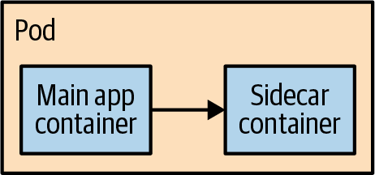
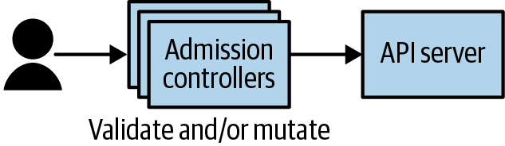
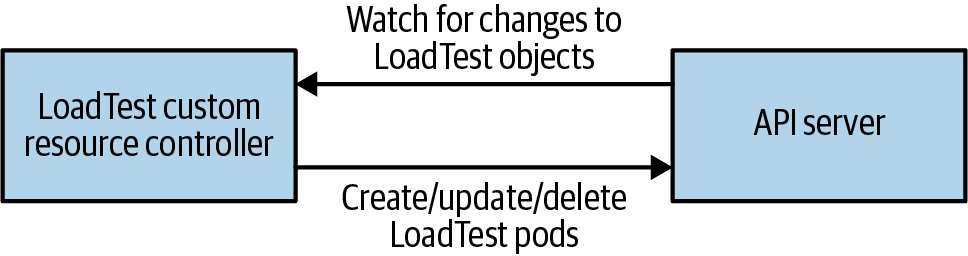
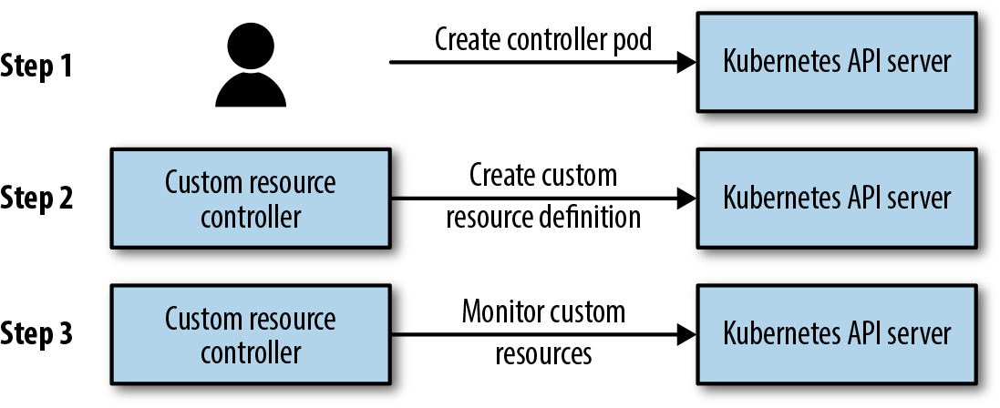
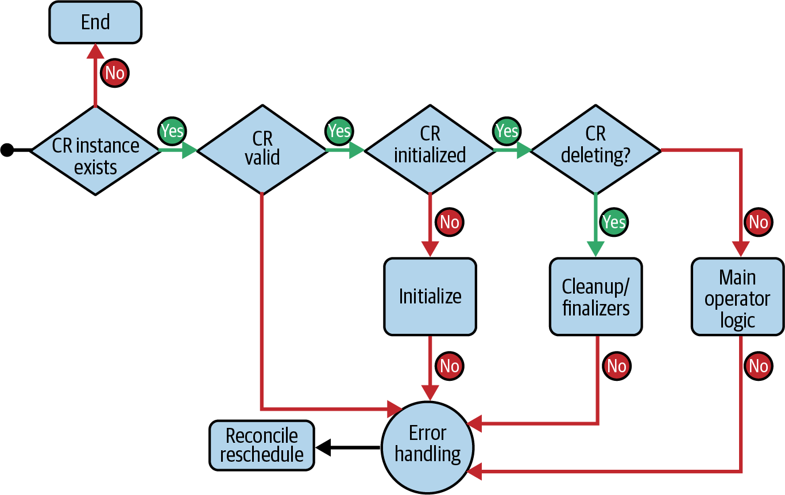
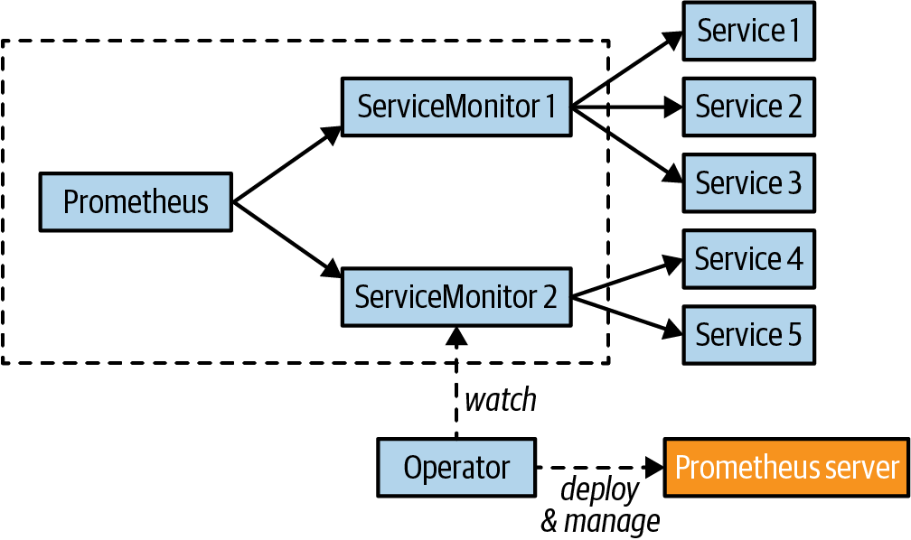
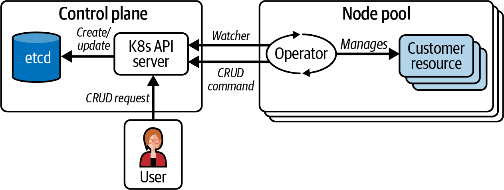

# Kubernetes CRD, Operators, Policy Và Multicluster

## Overview

Kubernetes mạnh vì nó không dừng ở built-in resources. Bạn có thể mở rộng API bằng CustomResourceDefinition, viết controller/operator để reconcile domain riêng, dùng admission/policy để enforce guardrail, và dùng multicluster khi một cluster không còn đủ về failure domain hoặc tổ chức.

## Platform Abstractions Trên Kubernetes

Khi xây platform trên Kubernetes, có hai hướng thiết kế:

| Hướng | Khi phù hợp | Rủi ro |
|---|---|---|
| Wrap Kubernetes như implementation detail | domain hẹp, user không cần biết Kubernetes, ví dụ ML pipeline hoặc FaaS nội bộ | dễ tạo walled garden, khó escape khi use case vượt khung |
| Extend Kubernetes bằng API/tooling native | developer platform tổng quát, cần tận dụng ecosystem Kubernetes | user vẫn phải hiểu một phần Kubernetes và platform team phải thiết kế API tốt |

Nguyên tắc thực dụng: abstraction tốt phải giảm thao tác lặp lại nhưng vẫn cho người dùng đi xuống layer thấp hơn khi cần. Nếu platform che hết Service, DNS, image, logs, metrics, rollout và Kubernetes object thật, lúc troubleshoot production sẽ rất khó nối hiện tượng app với actual state trong cluster.

Các extension point thường dùng:

- Sidecar thêm capability cạnh container chính, ví dụ proxy, mTLS, runtime helper hoặc distributed app API.
- Admission webhook validate hoặc mutate object trước khi lưu vào API Server.
- CRD thêm object model mới cho domain của platform.
- Controller/operator reconcile custom object thành built-in Kubernetes resources hoặc external resources.
- `kubectl` plugin hoặc UI riêng cải thiện developer UX mà vẫn giữ Kubernetes API làm nền.

Một cách phân loại extension hữu ích khi review platform:

| Loại extension | User có cần opt-in không | Ví dụ | Rủi ro vận hành |
|---|---|---|---|
| Cluster daemon | Không, tự áp dụng cho cluster/namespace | metrics collector, security scanner, log agent | hỏng âm thầm làm mất guardrail toàn cluster |
| Cluster assistant | Có, user khai báo annotation/CR/config | cert-manager, certificate helper, auth proxy generator | user phụ thuộc vào automation nhưng không biết chi tiết backend |
| API lifecycle extension | Áp vào request API qua admission | image registry policy, label/defaulting webhook | nằm trên write path của API Server, lỗi có thể chặn deploy |
| Custom API/CRD | User dùng resource type mới | `Certificate`, `KafkaCluster`, `BackupSchedule` | thêm API surface, storage, RBAC, versioning và controller lifecycle |
| Aggregated API server | API server delegate sang server khác | metrics/custom API phức tạp | phải vận hành API server/storage riêng |

Extension càng trong suốt với user thì platform team càng phải chủ động monitor, upgrade, document failure mode và có rollback. Một add-on "cài một lệnh" nhưng được mọi team dựa vào vẫn là production service.



Sidecar hữu ích khi capability có thể chạy cùng lifecycle Pod nhưng độc lập với app code. Tuy nhiên nếu developer phải tự nhớ inject sidecar, mount config và hiểu mọi edge case thì platform chưa thật sự giảm complexity.



Admission controller có thể tự inject sidecar hoặc reject manifest thiếu guardrail như requests/limits, label owner, security context. Với production, mọi mutation cần được document rõ vì object trong cluster có thể khác manifest trong Git.

Design guardrails cho platform:

- Luôn có escape hatch có kiểm soát cho advanced use case.
- Support export ra container image hoặc manifest chuẩn để tránh lock-in.
- Dùng Kubernetes Service/DNS cho interop thay vì tạo service discovery riêng nếu không bắt buộc.
- Push-to-deploy nên vẫn đi qua CI build/test/scan, registry, GitOps hoặc deployment controller có audit.
- Platform API nên expose status, events, logs và link tới object backend để debug được.
- Đừng dùng abstraction để che rủi ro bảo mật; RBAC, admission, NetworkPolicy và image policy vẫn cần rõ.

## CRD And Controller Mental Model

CRD định nghĩa loại object mới. Controller biến object đó thành hành động.



```text
Custom Resource spec -> controller watch -> create/update/delete dependent resources -> status
```

Ví dụ:

- `Certificate` -> cert-manager tạo Secret TLS.
- `KafkaCluster` -> operator tạo StatefulSet, Service, PVC, config.
- `BackupSchedule` -> controller tạo Job/snapshot.

CRD không có controller thì chỉ là dữ liệu lưu trong API Server. Giá trị thật nằm ở reconcile loop.

Trong Kubernetes API, cần tách rõ các khái niệm:

| Khái niệm | Cách hiểu |
|---|---|
| Object | Thực thể được lưu trong cluster state, ví dụ một Pod object hoặc một custom resource instance. |
| Resource | API endpoint/collection để thao tác object, ví dụ `pods`, `deployments`, `egapps`. |
| Kind | Kiểu object trong YAML/API, ví dụ `Pod`, `Deployment`, `EGApp`. |
| Group/version | Không gian API và version, ví dụ `apps/v1` hoặc `platform.example.com/v1alpha1`. |
| Scope | Resource là namespaced hay cluster-wide. |

CRD đăng ký resource type mới với API Server. Sau khi CRD được apply, `kubectl explain`, `kubectl get` và client Kubernetes có thể thao tác custom resource đó như resource native. Nhưng nếu chưa có controller/operator, object chỉ được validate rồi lưu trong etcd; không có workload, external resource hoặc lifecycle action nào tự xảy ra.



CRD + controller thường đi theo ba bước: cài controller/operator, đăng ký CRD với API Server, rồi controller watch custom resource để reconcile. Nếu xóa CRD, các custom resource thuộc loại đó cũng bị xóa khỏi API storage; đây là thao tác destructive và phải có backup/owner communication trước.

## Thiết Kế CRD

CRD tốt nên giống một API product nhỏ, không chỉ là YAML tùy ý.

Checklist:

- `spec` mô tả desired state, không chứa status runtime;
- `status` mô tả actual state, condition và reason rõ;
- field có default/validation schema càng rõ càng tốt;
- versioning có kế hoạch nếu API thay đổi;
- status condition giúp người vận hành biết vì sao reconcile fail;
- naming không trùng hoặc quá giống built-in resource;
- không đưa secret plaintext vào custom resource.

Ví dụ mental model:

```text
spec: user muốn gì
status: controller đã làm được gì, đang kẹt ở đâu
events/logs/metrics: vì sao kẹt
```

Nếu CRD chỉ thay một ConfigMap và không có lifecycle logic, chưa chắc cần CRD. CRD đáng giá nhất khi nó gom được workflow phức tạp thành API ổn định cho người dùng.

CRD schema nên dùng OpenAPI validation để reject object sai trước khi ghi vào etcd. Khi rule cần logic phức tạp hơn schema, dùng validating/defaulting webhook để validate hoặc set default trước khi lưu object. Validation trong reconcile loop vẫn cần như lớp phòng thủ cuối, nhưng lúc đó object đã tồn tại trong cluster nên controller phải cập nhật `status`/event rõ ràng thay vì chỉ log lỗi.



Một workflow phát triển operator thường đi theo chuỗi:

```text
scaffold API -> định nghĩa spec/status -> generate CRD manifests -> install CRD -> viết reconcile logic -> test controller -> package/deploy operator
```

Kubebuilder, Operator SDK, Java Operator SDK, Kopf, Helm/Ansible-based operator tooling đều nhằm giảm boilerplate. Tooling có thể sinh code, RBAC, CRD và webhook scaffolding, nhưng chất lượng operator vẫn phụ thuộc vào thiết kế API, idempotency, validation, status và lifecycle.


## API Server Request Flow


Request vào API Server có thể đi qua authentication, authorization, admission, validation và storage. CRD và admission webhook đều mở rộng Kubernetes nhưng ở các điểm khác nhau:

- CRD thêm resource type.
- Controller/operator xử lý desired state của custom resource.
- Admission webhook mutate/validate request trước khi object được lưu.

## Operator Pattern

Operator là controller mang kiến thức vận hành domain vào Kubernetes.





Ví dụ prometheus-operator biến Prometheus, ServiceMonitor và PrometheusRule thành API vận hành quen thuộc trong Kubernetes. Thay vì mỗi cluster tự quản nhiều Deployment/Service/config rời rạc, operator gom lifecycle domain vào CRD và reconcile loop.

Với stateful data systems như database, queue hoặc time-series store, operator có giá trị khi nó mã hóa được logic mà StatefulSet không biết: backup/restore, failover, leader/member registration, rolling upgrade an toàn và maintenance workflow theo engine.

Operator tốt cần:

- spec rõ, status rõ;
- reconcile idempotent;
- finalizer nếu cần cleanup external resource;
- backup/restore story;
- upgrade story;
- RBAC tối thiểu;
- metric/log/event để debug;
- không giấu lỗi trong controller log mà không cập nhật status.

Anti-pattern:

- CRD quá mỏng chỉ thay ConfigMap.
- operator có `cluster-admin` không cần thiết.
- status không nói được vì sao reconcile fail.
- upgrade operator làm thay đổi data path mà không có rollback.

## Reconciliation Và Idempotency

Controller/operator phải idempotent: chạy reconcile nhiều lần vẫn đưa hệ thống về cùng desired state, không tạo tài nguyên trùng hoặc phá state tốt.

Operator thường dùng level-based triggering: khi watch thấy event phù hợp, controller không chỉ xử lý delta của event đó mà đọc lại actual state rồi quyết định cần làm gì để kéo hệ thống về desired state. Cách này kém "tối ưu" hơn xử lý từng event nhỏ, nhưng hợp với distributed system vì event có thể bị gom, object có thể đã đổi tiếp, hoặc controller vừa restart.

Một vòng reconcile tốt thường:

1. đọc custom resource;
2. validate resource và default còn thiếu nếu cần;
3. kiểm tra deletion timestamp/finalizer;
4. đọc dependent resources hiện có;
5. so sánh desired và actual;
6. tạo/sửa/xóa phần thiếu;
7. cập nhật status/condition;
8. requeue nếu còn chờ dependency.

Nếu custom resource tạo object khác trong cluster, đặt owner reference để Kubernetes garbage collector có thể cleanup dependent resource khi CR bị xóa. Nếu operator tạo external resource hoặc resource không thể cleanup bằng owner reference, dùng finalizer để chặn deletion cho tới khi cleanup hoàn tất. Finalizer cần timeout, retry và status rõ; finalizer kẹt là một dạng incident production.

`status` nên là subresource riêng. Controller cập nhật status để phản ánh actual state như phase, condition, observed generation, endpoint, pod list hoặc lỗi gần nhất. Khi status update không làm đổi desired spec, controller nên tránh tự kích hoạt reconcile vô hạn; với controller-runtime thường dùng predicate để chỉ reconcile khi generation/spec hoặc dependent object liên quan thay đổi.

Reconcile implementation tối thiểu cần làm được các việc:

- fetch custom resource theo namespace/name;
- nếu object không còn tồn tại, xử lý path deletion/cleanup và kết thúc an toàn;
- tạo dependent resource khi thiếu;
- update dependent resource khi spec drift;
- list/read resource liên quan để tính status;
- update `status` khi observed state đổi;
- return error/requeue có chủ ý khi dependency chưa sẵn sàng.

Failure mode hay gặp:

- controller chỉ log lỗi nhưng không cập nhật status;
- reconcile phụ thuộc thứ tự thủ công và fail khi object đã tồn tại;
- finalizer không cleanup được external resource;
- controller restart làm mất state vì state nằm trong memory thay vì API/status;
- RBAC thiếu quyền nhưng error khó nhìn từ custom resource.
- status update làm controller tự reconcile liên tục;
- owner reference/finalizer thiếu làm sót Deployment, PVC hoặc external resource sau khi xóa CR.

Debug operator:

```bash
kubectl describe <custom-resource> <name> -n <namespace>
kubectl get events -n <namespace> --sort-by=.metadata.creationTimestamp
kubectl logs deployment/<operator> -n <operator-namespace>
kubectl auth can-i <verb> <resource> --as=system:serviceaccount:<ns>:<sa>
kubectl explain <custom-resource> --recursive
```

Với production, đừng chỉ xem controller log. Hãy kiểm tra `status.conditions`, event, RBAC của ServiceAccount, CRD schema, webhook availability, API Server admission latency và dependent resources mà operator quản lý.

## Operator Lifecycle Và Versioning

Operator là phần mềm production, không phải script chạy một lần. Nên quản lý nó như một product nhỏ: release version rõ, changelog, test, upgrade/downgrade plan, deprecation policy và compatibility với CRD versions đang tồn tại.

Maturity có thể tăng dần theo các mức:

| Mức | Năng lực |
|---|---|
| Basic install | Cài app và resource cơ bản. |
| Automated provisioning | Tự cấu hình app và dependency chính. |
| Seamless upgrades | Hỗ trợ patch/minor upgrade có kiểm soát. |
| Full lifecycle | Backup, restore, recovery, storage lifecycle và day-2 operations. |
| Deep insights | Metrics, alerts, logs và workload analysis. |
| Auto pilot | Auto scaling, auto tuning, anomaly detection và scheduling tuning. |

CRD versioning cần kế hoạch riêng. Khi một CRD phục vụ nhiều version, object có thể được served ở version khác với storage version. Nếu schema đổi đơn giản, conversion strategy `None` chỉ đổi `apiVersion`; nếu cần transform field hoặc logic phức tạp, dùng conversion webhook. Conversion phải tránh mất thông tin khi đổi qua lại giữa version, nhất là trong upgrade/rollback operator.

## Policy And Governance

Policy không chỉ là security. Nó là cách platform team giữ cluster nhất quán:

- naming/label convention;
- resource request/limit;
- approved registry;
- namespace baseline;
- security context;
- ingress host/domain rule;
- required runbook/owner annotation.

Admission policy nên triển khai theo mode:

```text
audit first -> warn developers -> enforce when clean
```

Policy tốt phải có exception path. Nếu policy chỉ "deny" nhưng không nói cách sửa, developer sẽ tìm đường vòng. Một policy vận hành tốt nên:

- có message rõ;
- có owner của policy;
- có môi trường audit/warn trước khi enforce;
- có nhãn/annotation exception có kiểm soát nếu cần;
- có dashboard cho violation;
- tránh gọi webhook chậm hoặc phụ thuộc service không HA.

Admission webhook nằm trên đường ghi object vào API Server. Webhook lỗi hoặc timeout có thể làm deploy toàn cluster bị chậm hoặc fail, nên webhook production cần timeout hợp lý, HA, monitoring và failure policy được chọn có chủ ý.

## Multicluster

Multicluster nên được xem là một kiến trúc mới, không phải chỉ "thêm cluster".


Lý do dùng:

- regional resilience;
- latency gần user;
- data residency/compliance;
- blast radius isolation;
- team/platform boundary;
- upgrade risk isolation.
- hard multitenancy khi namespace/RBAC/NetworkPolicy không đủ tách tenant không tin cậy nhau;
- workload chuyên biệt như HPC/ML cần hardware, performance profile hoặc runtime riêng.

Chi phí:

- routing phức tạp;
- config/secret drift;
- observability phân tán;
- data replication;
- rollout orchestration;
- incident response khó hơn.
- consolidation ratio thấp hơn và chi phí vận hành nhiều control plane hơn.

Decision model:

| Need | Namespace/single cluster có thể đủ khi | Nên tách cluster khi |
|---|---|---|
| Team isolation | teams tin cậy nhau, policy và quota rõ | tenant không tin cậy nhau hoặc cần hard boundary |
| Compliance | workload chung được phép chia sẻ control plane | PCI/HIPAA/HITRUST hoặc data residency yêu cầu boundary riêng |
| Regional serving | latency không nhạy, DR active/passive | cần in-region endpoint hoặc active/active đa vùng |
| Specialized workload | node pool/taint đủ tách hardware | workload cần cluster profile, runtime hoặc scaling pattern riêng |
| Blast radius | platform issue có thể chấp nhận ảnh hưởng rộng | một lỗi CNI/admission/upgrade không được phép hạ toàn bộ estate |

## Multicluster Operating Model

Khi có nhiều cluster, cần trả lời rõ:

- cluster nào là source of truth cho app nào;
- config/secret phân phối ra sao;
- DNS/global traffic routing hoạt động thế nào;
- log/metric/trace được gom ở đâu;
- incident theo region hay global;
- upgrade cluster theo wave nào;
- policy nào là global, policy nào là cluster-specific.

Multicluster không tự động tạo HA cho stateful data. Nếu app ghi dữ liệu, bạn cần chiến lược replication, conflict handling, backup và failover riêng. Với nhiều hệ thống, active/passive dễ vận hành hơn active/active dù latency có thể cao hơn.

Các design concern hay bị đánh giá thấp:

- Data replication: ứng dụng phải hiểu eventual consistency, conflict hoặc latency giữa vùng; database replication không tự làm app đúng.
- Service discovery: mỗi cluster có registry riêng; nếu cần cross-cluster discovery, phải chọn mesh/Consul/Cilium/Istio hoặc mô hình DNS/global LB rõ ràng.
- Network routing: Ingress thường gắn với một cluster; global traffic steering, egress giữa cluster và extra hop latency cần được thiết kế riêng.
- Operational management: cluster bootstrap, add-on, RBAC, policy, logging, monitoring và backup phải được tự động hóa để tránh snowflake cluster.
- Continuous delivery: nhiều API endpoint đồng nghĩa rollout cần wave, promotion gate và cách rollback theo cluster/region.

Automation baseline cho fleet:

```text
cluster IaC -> bootstrap add-ons -> policy baseline -> observability -> app GitOps sync
```

Terraform, Cluster API, managed-provider tooling hoặc platform API đều có thể dùng, nhưng yêu cầu chung là cluster configuration phải source-controlled, reproducible và có drift detection.

Best practices:

- Giới hạn blast radius theo region, tenant, compliance hoặc workload class.
- Dùng global load balancer hoặc DNS traffic steering cho app đa vùng, không để từng cluster tự quyết định global routing.
- Thiết kế replication/backup/failover trước khi chạy stateful workload đa cluster.
- Dùng operator cho operational tooling lặp lại như monitoring hoặc datastore, nhưng vẫn cần review RBAC, backup và upgrade story của operator.
- Chuẩn hóa kubeconfig/context tooling như `kubectx`/`kubens`, nhưng không dùng thao tác thủ công làm control plane cho fleet.

## Application Organization

`Up and Running` nhấn mạnh filesystem/Git là source of truth. Điều này rất gần GitOps:

```text
Git manifests -> review -> sync/apply -> observe -> rollback by revision
```

Một app nên có:

- folder rõ theo environment;
- labels chuẩn;
- owner/runbook annotation;
- image tag bất biến;
- config tách khỏi secret;
- release branch/tag strategy;
- feature flag cho rollout dần.

## Khi Nào Chưa Nên Dùng CRD/Operator

Không phải bài toán nào cũng cần mở rộng Kubernetes API. Tránh dùng operator khi:

- chỉ cần một Deployment/Service/ConfigMap bình thường;
- team chưa có năng lực vận hành controller riêng;
- lifecycle domain chưa ổn định, API sẽ đổi liên tục;
- không có test cho reconcile logic;
- failure của operator có thể ảnh hưởng quá rộng mà chưa có guardrail.

Một bước trung gian tốt là viết runbook/Job/Helm chart trước. Khi workflow lặp lại, có state machine rõ và cần self-healing, lúc đó operator mới đáng chi phí.

## Related Pages

- [Advanced Platform Patterns](./overview.md)
- [Integration, Configuration Và API Access](../09-application-integration/overview.md)
- [RBAC, Pod Security Và Admission](../04-security/01-rbac-pod-security-and-admission.md)
- [Deployment Models Và Cluster Setup](../07-cluster-lifecycle/overview.md)
