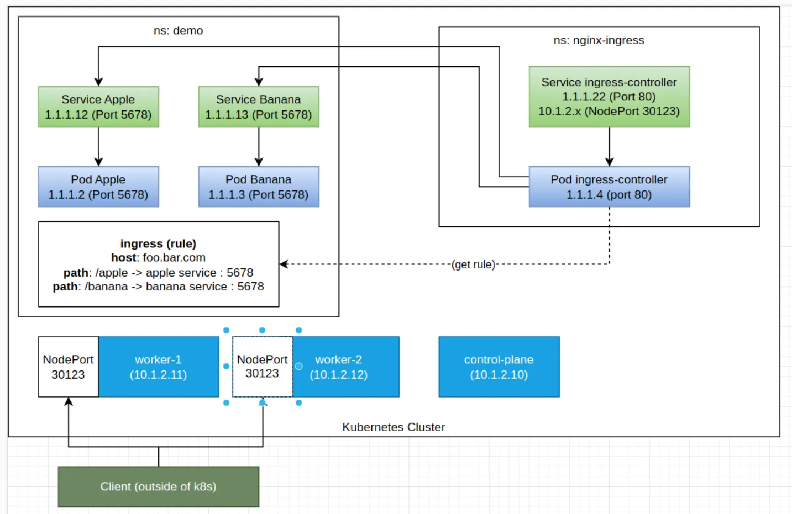

# Ingress And Service Troubleshooting Lab

## Overview

Note này chuyển hóa lab thô về troubleshoot Kubernetes Service và Ingress. Trọng tâm là đi theo request path thay vì sửa Ingress ngay khi bên ngoài không truy cập được.



## Model

Ví dụ lab có:

- namespace app: `demo`;
- Pod `apple` và `banana`;
- Service `apple-service` và `banana-service` dạng `ClusterIP`;
- Ingress Controller chạy ở namespace riêng như `ingress-nginx`;
- Ingress rule route `/apple` và `/banana` tới service tương ứng;
- Ingress Controller expose ra ngoài bằng NodePort hoặc LoadBalancer tùy môi trường.

Ingress object chỉ là cấu hình. Ingress Controller mới là component thực thi routing HTTP.

## Important Rules

- Ingress Controller có thể nằm namespace riêng.
- Ingress rule thường nên nằm cùng namespace với Service backend.
- Service backend phía sau Ingress thường chỉ cần `ClusterIP`.
- Có thể có nhiều Ingress Controller, nhưng cần `ingressClassName` rõ ràng.
- Nếu expose bằng NodePort, nhiều controller không được trùng NodePort.

## Triage Flow

Đi theo chuỗi:

```text
Client -> NodePort/LoadBalancer -> Ingress Controller Service -> Ingress Controller Pod -> Ingress Rule -> Service -> EndpointSlice -> Pod
```

## Step 1: Pod Và Service Backend

```bash
kubectl get pod -n demo -o wide --show-labels
kubectl get svc -n demo
kubectl get endpointslice -n demo
```

Kiểm tra từ trong cluster:

```bash
kubectl run tmp-curl -n demo --rm -it --image=curlimages/curl -- sh
curl http://apple-service:5678
curl http://banana-service:5678
```

Nếu Pod OK nhưng Service không OK, kiểm tra:

- Service selector có match label Pod không;
- `port` và `targetPort` đúng không;
- container thật sự listen port nào;
- Pod đã Ready chưa.

## Step 2: Ingress Object

```bash
kubectl get ingress -n demo
kubectl describe ingress <ingress-name> -n demo
```

Kiểm tra:

- namespace của Ingress có đúng với Service backend không;
- `ingressClassName` có match controller không;
- host/path có đúng không;
- annotation rewrite có phù hợp app không;
- backend service/port có tồn tại không.

## Step 3: Ingress Controller Từ Trong Cluster

```bash
kubectl get pod,svc -n ingress-nginx -o wide
kubectl logs -n ingress-nginx deploy/<ingress-controller-deployment> --tail=100
```

Test trực tiếp vào Service của Ingress Controller:

```bash
curl -H "Host: foo.bar.com" http://<ingress-controller-service-ip>/apple
curl -H "Host: foo.bar.com" http://<ingress-controller-service-ip>/banana
```

Nếu test này fail nhưng Service backend OK, lỗi thường nằm ở Ingress rule, `ingressClassName`, rewrite, controller config hoặc log của controller.

## Step 4: Từ Bên Ngoài Cluster

Nếu expose bằng NodePort:

```bash
curl -H "Host: foo.bar.com" http://<node-ip>:<node-port>/apple
curl -H "Host: foo.bar.com" http://<node-ip>:<node-port>/banana
```

Nếu tất cả node đều fail:

- kiểm tra NodePort có mở trên Service không;
- firewall/security group có allow dải NodePort không;
- route tới node có đúng không;
- Ingress Controller Service có đúng selector không.

Nếu chỉ một số node OK, kiểm tra `externalTrafficPolicy` hoặc `internalTrafficPolicy`. Với policy `Local`, node không có endpoint local có thể không forward như kỳ vọng.

## Common Mistakes

| Triệu chứng | Khả năng cao |
|---|---|
| Ingress báo backend not found | Ingress khác namespace với Service hoặc sai service name |
| Service không có endpoint | selector sai hoặc Pod chưa Ready |
| curl Service OK nhưng Ingress fail | rule/path/rewrite/ingressClass/controller |
| vào bằng private IP được, public IP không được | security group/firewall/routing |
| chỉ một node NodePort OK | traffic policy local hoặc controller Pod không nằm trên node đó |

## Related Pages

- [Kubernetes Service Discovery, Ingress Và Network Policy Deep Dive](../02-networking/01-service-discovery-ingress-and-network-policy.md)
- [Kubernetes Troubleshooting Overview](./overview.md)
