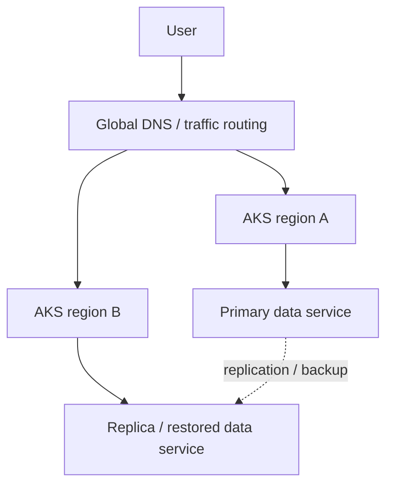

# AKS Security, Network, Storage And Enterprise Readiness

## Overview

Một AKS/Kubernetes cluster production cần được nhìn như một platform có nhiều lớp kiểm soát: API access, node security, image supply chain, pod runtime, network path, storage durability và disaster recovery. Nếu chỉ harden pod nhưng bỏ qua ingress, backup hoặc upgrade thì cluster vẫn chưa enterprise-ready.

## API Server And Cluster Access

Kubernetes API server là điểm điều khiển trung tâm. Mọi quyền ghi sai ở đây đều có thể biến thành thay đổi thật trong cluster.

Best practice:

- tích hợp identity provider và RBAC thay vì chia sẻ kubeconfig admin;
- giới hạn network path đến API server nếu môi trường yêu cầu;
- bật audit log hoặc tích hợp log platform để truy vết thay đổi;
- không mở SSH/RDP trực tiếp vào node cho tác vụ hằng ngày;
- dùng bastion/jump host hoặc private management path khi cần truy cập node khẩn cấp.

## Pod And Runtime Security

Pod nên chạy với quyền tối thiểu:

- không chạy container bằng root nếu app không cần;
- đặt `runAsNonRoot`, `runAsUser`, `readOnlyRootFilesystem` khi phù hợp;
- drop Linux capabilities không cần thiết;
- không bật privileged container trừ khi có lý do platform rõ ràng;
- dùng seccomp/AppArmor hoặc Pod Security Standards để giảm hành vi runtime nguy hiểm.

```yaml
apiVersion: v1
kind: Pod
metadata:
  name: hardened-app
spec:
  securityContext:
    runAsNonRoot: true
    seccompProfile:
      type: RuntimeDefault
  containers:
    - name: app
      image: example.com/app:1.0.0
      securityContext:
        allowPrivilegeEscalation: false
        readOnlyRootFilesystem: true
        capabilities:
          drop: ["ALL"]
```

## Image Management

Image là đầu vào trực tiếp của runtime. Nếu base image lỗi thời hoặc pipeline không scan, cluster sẽ trở thành nơi triển khai vulnerability có hệ thống.

Nên có các lớp:

- registry riêng hoặc registry được kiểm soát;
- image scan trong CI/CD;
- policy chỉ cho deploy image từ registry tin cậy;
- tag bất biến hoặc digest pinning cho release quan trọng;
- quy trình rebuild khi base image có CVE;
- tách quyền build, push và deploy.

## Networking And Ingress

Tài liệu Microsoft nhấn mạnh việc chọn network model đúng ngay từ đầu. Với AKS, Azure CNI thường phù hợp hơn cho production cần tích hợp VNet/on-prem/direct IP, còn kubenet đơn giản hơn nhưng có thêm lớp routing/NAT và hạn chế tích hợp.

Các quyết định quan trọng:

- CIDR cho pod/service/node không được trùng với on-prem hoặc VNet khác.
- Ingress controller chỉ là lớp route HTTP(S); với public workload nên đặt thêm WAF hoặc gateway phù hợp.
- NetworkPolicy cần chặn east-west traffic không cần thiết.
- Remote management vào node nên đi qua management network, không expose trực tiếp.

```yaml
apiVersion: networking.k8s.io/v1
kind: NetworkPolicy
metadata:
  name: allow-api-from-frontend
  namespace: app
spec:
  podSelector:
    matchLabels:
      app: api
  ingress:
    - from:
        - podSelector:
            matchLabels:
              app: frontend
      ports:
        - protocol: TCP
          port: 8080
  policyTypes:
    - Ingress
```

## Storage And Backup

Storage không chỉ là "pod cần disk". Cần tách rõ access mode, latency, throughput, backup và restore.

Mental model:

- Azure Disk tương đương block storage, thường hợp database hoặc workload cần RWO.
- Azure Files tương đương shared file, hợp nhiều pod cần mount chung nhưng cần kiểm tra latency/IOPS.
- StorageClass quyết định provisioning, reclaim policy, replication và performance tier.
- PVC giúp app request storage mà không tự quản lý disk.
- Backup phải kiểm tra cả dữ liệu và Kubernetes object đi kèm.

Không coi snapshot là backup đầy đủ nếu chưa test restore ở namespace/cluster khác.

## Enterprise Readiness

Một workload enterprise-ready cần tránh phụ thuộc vào một node, một zone, một cluster hoặc một region nếu yêu cầu availability cao.

Các lớp cần thiết:

- nhiều replica và PDB cho app stateless;
- node pool đủ capacity để chịu node drain/upgrade;
- zone-aware placement nếu region hỗ trợ;
- multi-region hoặc multi-cluster cho ứng dụng có RTO/RPO cao;
- external DNS/traffic manager/front door/gateway để chuyển hướng traffic;
- state đặt ngoài container, ưu tiên service có replication/backup rõ ràng;
- runbook restore được diễn tập, không chỉ viết trên giấy.



## Checklist

- API server access có identity, RBAC và audit.
- Node không mở remote management trực tiếp ra internet.
- Pod baseline security được enforce bằng label/policy.
- Image được scan và deploy từ registry tin cậy.
- Ingress public có TLS, WAF/gateway và logging.
- NetworkPolicy giảm traffic ngang không cần thiết.
- StorageClass/PVC được chọn theo workload, không chọn mặc định mù.
- Backup/restore đã được test bằng restore thật.
- Multi-region/multi-cluster được thiết kế theo RTO/RPO, không chỉ theo cảm giác "HA".
