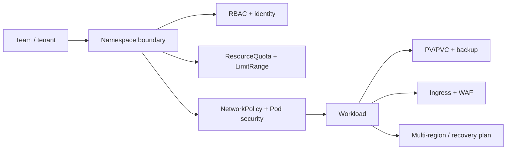
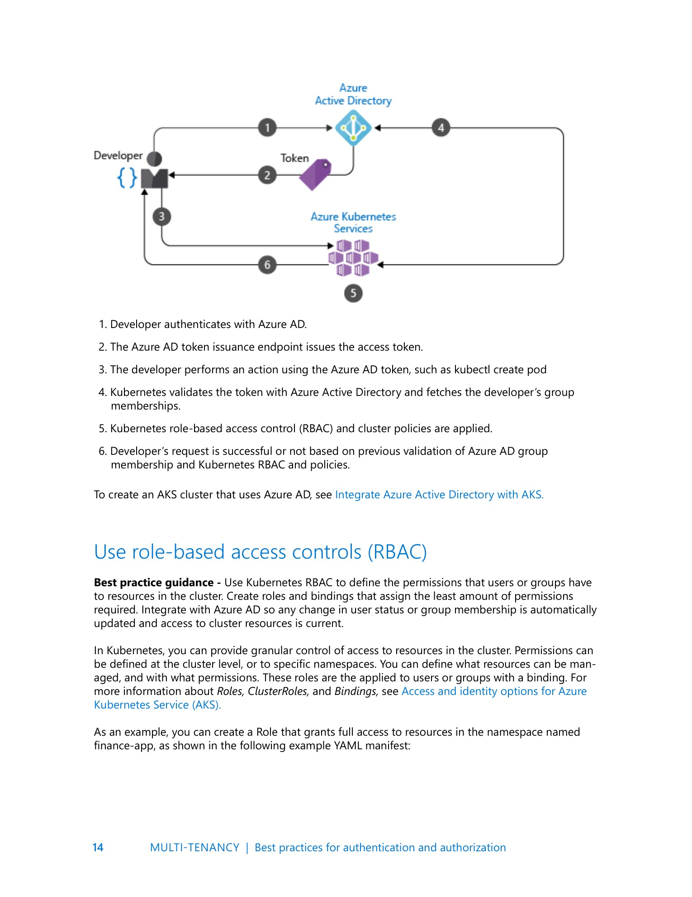
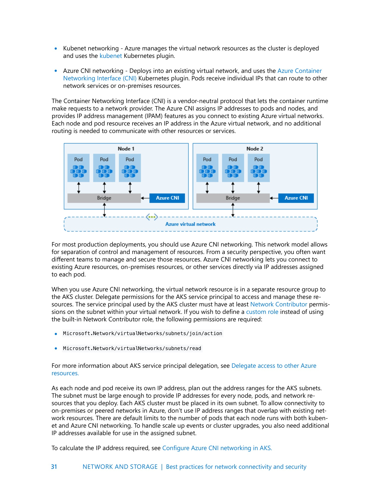
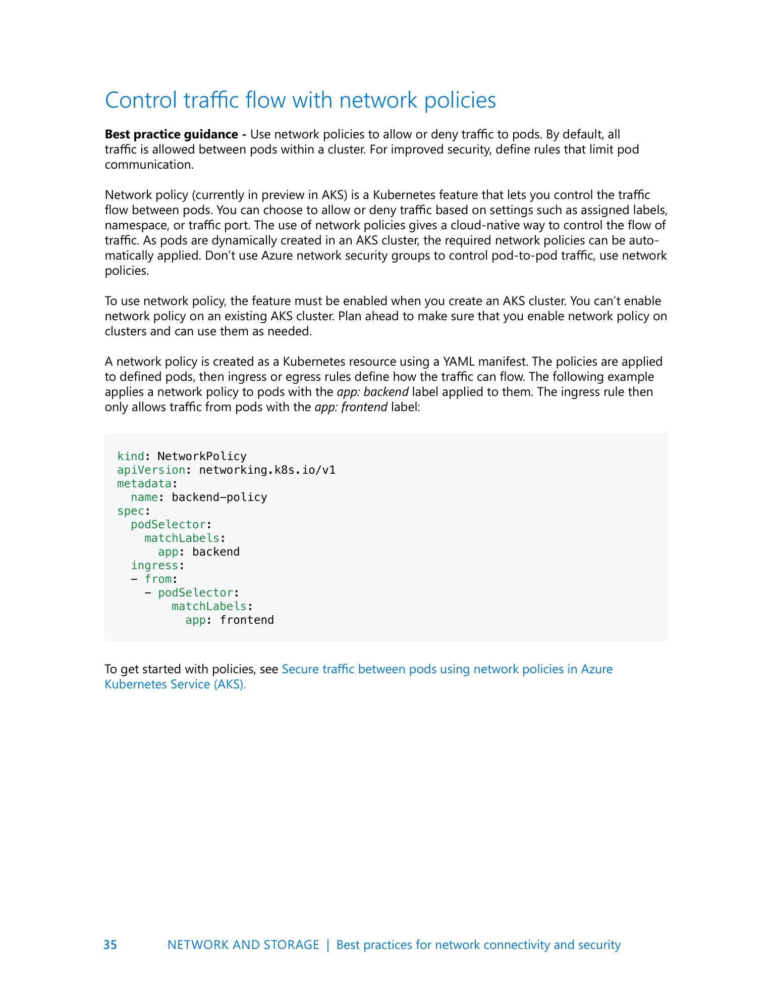
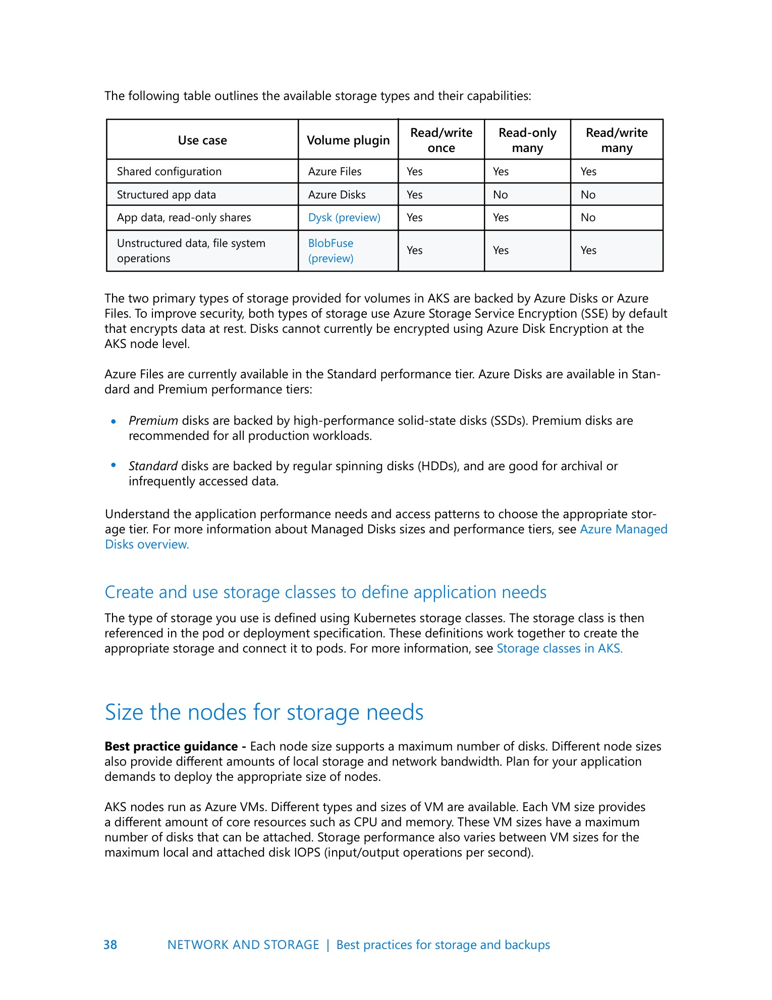
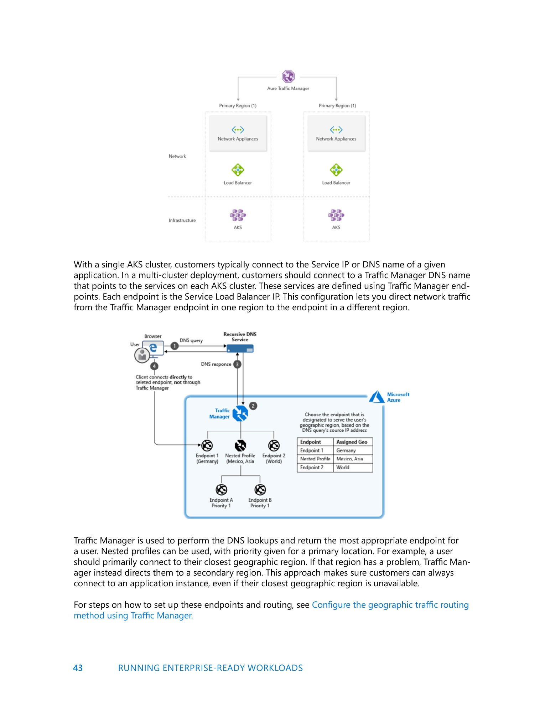
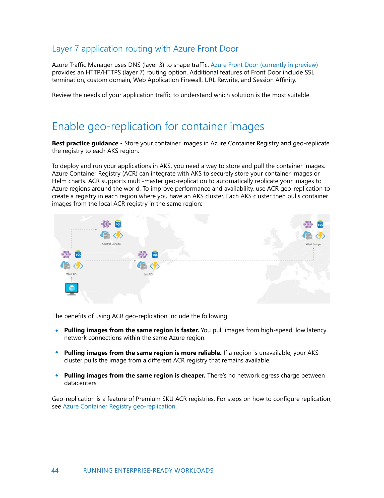

# Kubernetes Best Practices Microsoft Source Coverage

## Overview

> Trạng thái canonicalization: legacy source-derived note set. Các file dài trong bộ này cần được bóc thành knowledge atom, merge vào canonical Kubernetes notes, rồi giữ lại ở đây như coverage matrix ngắn.

Bộ note này đúc kết từ `_inbox/Kubernetes_Best_Practices_Microsoft_2023.docx`. Tài liệu gốc tập trung vào vận hành Kubernetes/AKS ở môi trường nhiều team, có yêu cầu security, network, storage và business continuity.

Điểm quan trọng nhất: đây không phải note học object Kubernetes từ đầu, mà là lớp best practice để trả lời câu hỏi "cluster này có đủ an toàn, đủ cô lập, đủ dễ vận hành và đủ chịu lỗi cho production chưa?".

## Knowledge Map

- [AKS Multi-Tenancy, Scheduling And Identity](./01-aks-multitenancy-scheduling-and-identity.md)
- [AKS Security, Network, Storage And Enterprise Readiness](./02-aks-security-network-storage-enterprise-readiness.md)

## Mental Model

Một cluster production không chỉ cần chạy được workload. Nó cần có ranh giới giữa team, ranh giới giữa workload, cơ chế cấp quyền, quota, placement rule, image hygiene, network policy, storage class đúng nhu cầu, backup/restore và thiết kế tránh single-region failure.

## Selected Original Visuals

Các ảnh dưới đây là page snapshot gốc được trích chọn lọc từ DOCX, dùng để giữ lại sơ đồ/khung minh họa quan trọng cho phần best practice.

| Topic | Image |
|---|---|
| Identity and RBAC flow |  |
| AKS network model guidance |  |
| Network policy guidance |  |
| Storage options and capability table |  |
| Multi-cluster traffic routing |  |
| Layer 7 routing and enterprise readiness |  |

## Notes About Modernization

- Tài liệu dùng nhiều tên "Azure AD"; trong tài liệu Microsoft hiện đại, tên sản phẩm đã đổi thành "Microsoft Entra ID".
- Một số ví dụ security cũ nhắc Pod Security Policy; với Kubernetes hiện đại nên ưu tiên Pod Security Admission/Pod Security Standards hoặc policy engine như Azure Policy/Gatekeeper/Kyverno.
- Các note ở đây giữ mental model bền vững, đồng thời tránh khóa chặt vào tên feature cũ của AKS.

## Related Pages

- [Kubernetes Security, RBAC And Pod Hardening](../../04-security/overview.md)
- [Kubernetes Operations, Resources And Observability](../../05-operations/overview.md)
- [Kubernetes Networking](../../02-networking/overview.md)
- [Kubernetes Storage](../../03-storage/overview.md)

## References

- Microsoft Learn: [New name for Azure Active Directory](https://learn.microsoft.com/en-us/entra/fundamentals/new-name)
- Microsoft Learn: [Use Pod Security Admission in AKS](https://learn.microsoft.com/en-us/azure/aks/use-pod-security-policies)
