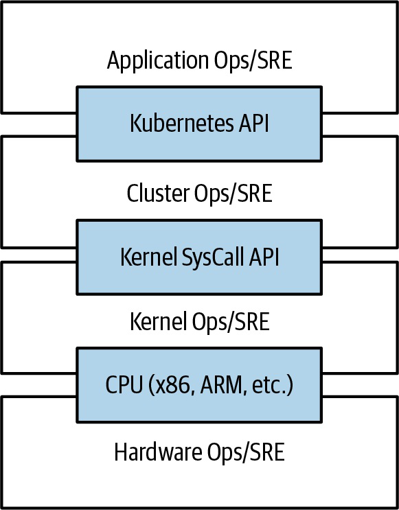

# Kubernetes Up And Running Foundations, Containers, Cluster And kubectl

## Overview

Note này đúc kết phần nền tảng từ `Kubernetes: Up and Running`: vì sao Kubernetes tồn tại, cách container image hoạt động, cách dựng cluster để học và các lệnh `kubectl` nền. Đây là phần rất quan trọng vì nó đặt Kubernetes vào bối cảnh cloud native, không chỉ là tool deploy YAML.

## Cloud Native Motivation

Sách đặt Kubernetes như một abstraction để xây dựng distributed systems đáng tin cậy, scalable và dễ vận hành hơn. Các lợi ích được nhấn mạnh:

- **velocity**: ship nhanh nhưng vẫn giữ availability;
- **scaling**: scale service và scale team;
- **infrastructure abstraction**: app team không cần biết chi tiết từng machine;
- **efficiency**: bin-pack tài nguyên tốt hơn;
- **cloud native ecosystem**: dùng chung API, tool, controller, policy và workflow.

Điểm sâu hơn: velocity không phải số lần deploy mỗi ngày bằng mọi giá. Velocity tốt là khả năng thay đổi thường xuyên mà vẫn giữ dịch vụ ổn định.

## Immutability, Declarative Config And Self-Healing

Ba ý xuyên suốt sách:

| Principle | Ý nghĩa |
|---|---|
| Immutable infrastructure | build artifact mới rồi thay thế, không sửa dần server đang chạy |
| Declarative configuration | khai báo desired state thay vì ra từng lệnh thủ công |
| Self-healing systems | controller liên tục reconcile actual state về desired state |

Mutable infrastructure tạo ra drift vì nhiều người sửa cùng một server qua thời gian. Immutable image + declarative manifest giúp rollback, review và tái tạo môi trường dễ hơn.

## Separation Of Concerns

Sách dùng hình API layer để giải thích cách Kubernetes tách trách nhiệm giữa team.



Ý nghĩa:

- application team thao tác với Kubernetes API;
- cluster/platform team vận hành cluster, node, CNI, CSI, policy;
- hardware/kernel layer nằm thấp hơn và không nên là thứ app team chạm trực tiếp;
- API ổn định giúp mỗi nhóm scale độc lập hơn.

Đây là lý do Kubernetes phù hợp cho tổ chức lớn: nó tạo contract giữa developer, operator và platform team.

## Containers And Images

Container image là artifact đóng gói application, dependency và filesystem layer. Các điểm quan trọng:

- image layer giúp cache và phân phối hiệu quả;
- Dockerfile mô tả cách build image;
- image registry là nơi node pull image;
- image tag nên được quản lý cẩn thận, production nên dùng tag bất biến hoặc digest;
- image càng nhỏ càng giảm attack surface và thời gian pull;
- multistage build giúp tách build dependency khỏi runtime image.

Sách nói Docker nhiều vì đó là entry point phổ biến, nhưng Kubernetes hiện đại chạy container qua CRI runtime như `containerd` hoặc CRI-O.

## Creating And Running Containers

Flow học:

```text
write app -> Dockerfile -> build image -> run local -> push registry -> run in Kubernetes
```

Khi học Kubernetes, phải hiểu vì sao image cần push registry: node trong cluster không nhìn thấy image chỉ tồn tại trên laptop. Nếu Pod `ImagePullBackOff`, hãy kiểm tra image name/tag, registry auth, pull secret và network từ node.

## Deploying A Cluster

Sách giới thiệu các lựa chọn:

- local cluster như `minikube` để học;
- Kubernetes-as-a-Service để tránh tự vận hành control plane;
- tự dựng cluster để hiểu node/control plane/networking.

Diễn giải thực tế:

- local cluster tốt cho dev/lab, không đại diện đầy đủ cho production policy/network/storage;
- managed Kubernetes giảm gánh control plane nhưng app, manifest, RBAC, NetworkPolicy, quota, observability vẫn là trách nhiệm của bạn;
- tự dựng cluster giúp hiểu, nhưng production cần upgrade/backup/HA/security runbook.

## kubectl Mental Model

`kubectl` là client nói chuyện với Kubernetes API. Những nhóm lệnh nền:

```bash
kubectl get <resource>
kubectl describe <resource> <name>
kubectl apply -f <file>
kubectl delete -f <file>
kubectl logs <pod>
kubectl exec -it <pod> -- <command>
kubectl port-forward <pod-or-service> <local>:<remote>
kubectl explain <resource>
```

Các nguyên tắc:

- luôn kiểm tra context/namespace trước khi thao tác;
- dùng `describe` và events để hiểu quyết định của control plane;
- dùng `apply`/GitOps cho thay đổi bền vững;
- dùng `exec`/`port-forward` để debug, không biến chúng thành operational dependency;
- dùng `kubectl top` khi metrics-server có sẵn để xem usage nhanh.

## Namespaces And Contexts

Namespace giúp scope thao tác, nhưng không tự tạo isolation bảo mật đầy đủ. Context trong kubeconfig kết hợp cluster, user và namespace mặc định.

Checklist trước khi sửa production:

```bash
kubectl config current-context
kubectl config view --minify
kubectl get ns
```

Nhiều sự cố bắt đầu bằng việc terminal đang trỏ nhầm cluster hoặc namespace.

## Canonical Links

- [Control Plane, Node Và Reconciliation](../../00-architecture/01-control-plane-node-and-reconciliation.md)
- [Application Release Và Environment Organization](../../07-cluster-lifecycle/01-application-release-and-environment-organization.md)
- [Kubernetes Operations Quick Reference](../../01-core-objects/00-kubernetes-operations-quick-reference.md)
