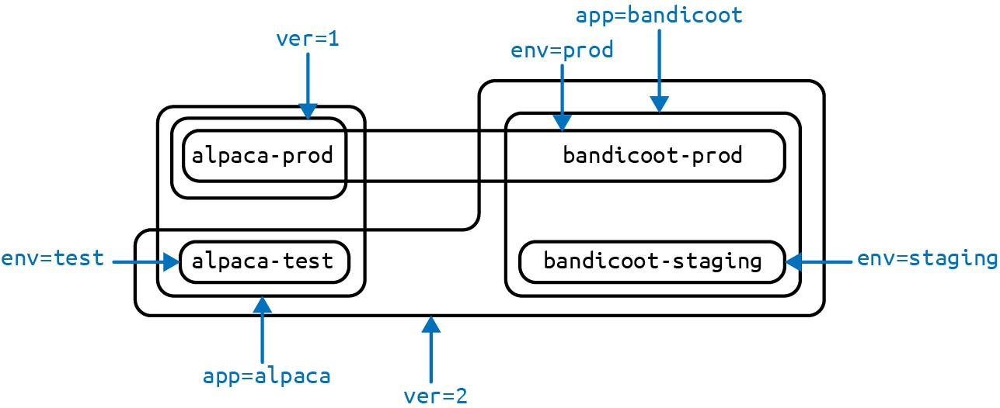
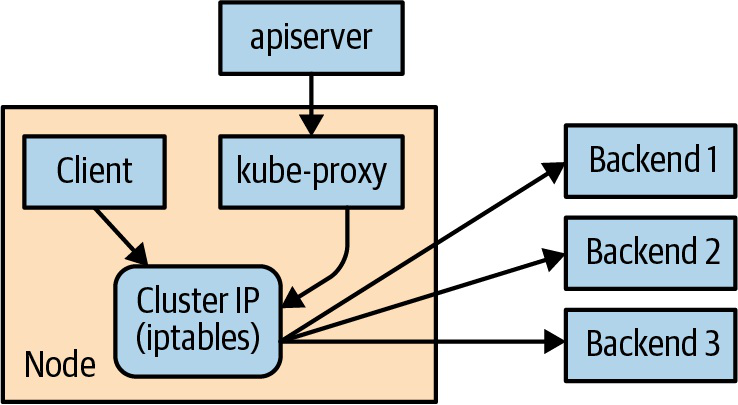
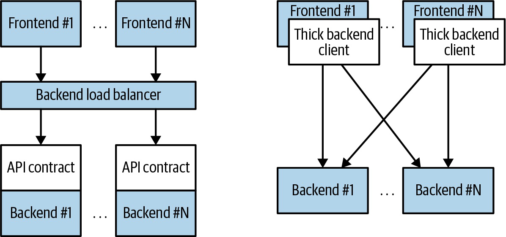

# Kubernetes Up And Running Core Objects, Networking And Rollouts

## Overview

Note này chuyển hóa các object cốt lõi để deploy service: Pod, labels/annotations, Service discovery, Ingress, ReplicaSet và Deployment. Cách nhìn quan trọng ở đây là "Kubernetes object là API contract", không chỉ là file YAML.

## Pods

Pod là đơn vị scheduling và lifecycle nhỏ nhất. Sách nhấn mạnh Pod có thể có nhiều container khi các container đó cần share network/filesystem/lifecycle.


Pod tốt thường:

- chạy một main application process;
- có sidecar/init container nếu cần tách concern;
- expose port rõ;
- có resource request/limit;
- có readiness/liveness/startup probe phù hợp;
- ghi log ra stdout/stderr.

Nếu hai container scale khác nhau, deploy/restart khác nhau hoặc ownership khác nhau, đừng nhét chung Pod.

## Pod Manifest And Thinking With Pods

Manifest Pod có:

- `metadata`: name, labels, annotations;
- `spec`: containers, volumes, env, probes, node placement;
- `status`: phase, conditions, container status do Kubernetes cập nhật.

Các câu hỏi khi thiết kế Pod:

- container nào thật sự phải colocate?
- config/secret đi vào bằng cách nào?
- container cần volume tạm hay persistent?
- health endpoint nào dùng cho readiness/liveness?
- Pod có cần gọi API Server không?
- ServiceAccount có quyền tối thiểu chưa?

## Labels And Annotations

Labels là hệ thống phân loại đa chiều. Sách dùng labels để kết nối:

- Service selector;
- ReplicaSet selector;
- Deployment rollout;
- filtering bằng `kubectl`;
- policy/governance;
- release/version/environment.



Annotations dùng cho metadata phụ: description, runbook, change-cause, checksum config, controller-specific hints. Không dùng annotations thay selector.

## Service Discovery

Service tạo endpoint ổn định cho nhóm Pod ephemeral. Chuỗi logic:

```text
Service -> selector -> EndpointSlice -> Pod IP/port -> kube-proxy/dataplane
```



Kubernetes hỗ trợ:

- Service DNS;
- ClusterIP;
- NodePort;
- LoadBalancer;
- headless Service;
- Service không selector để nối external resource.

Debug Service phải kiểm tra selector, EndpointSlice, Pod readiness và port mapping trước khi nghi ngờ Ingress.

## Looking Beyond The Cluster

Sách nói các pattern nối Kubernetes với external systems:

- Service `ExternalName`;
- Service không selector + Endpoints/EndpointSlice;
- LoadBalancer/NodePort để vào cluster từ bên ngoài;
- DNS và network policy để kiểm soát traffic.

Pattern này quan trọng khi migrate từ VM/legacy/managed database sang Kubernetes từng bước.

## Ingress

Service là Layer 4; Ingress là HTTP Layer 7 routing. Ingress object chỉ là configuration; Ingress controller mới thực thi routing.


Ingress dùng cho:

- virtual hosting theo host/path;
- TLS termination;
- path rewriting tùy controller;
- gom nhiều Service sau một external endpoint.

Điểm hiện đại: Gateway API là hướng mới hơn cho role model platform/app rõ hơn, nhưng Ingress vẫn phổ biến và ổn định cho use case HTTP cơ bản.

## ReplicaSets

ReplicaSet giữ số Pod replica theo selector. Mental model:

```text
desired replicas + selector + pod template -> actual Pods
```

ReplicaSet hữu ích để hiểu reconciliation, nhưng người dùng thường không tạo trực tiếp. Deployment quản lý ReplicaSet để rollout/rollback.

Điểm quan trọng:

- selector phải không mơ hồ;
- Pod template tạo Pod mới, không tự sửa Pod cũ;
- scale bằng cách đổi replica count;
- labels sai có thể làm controller "nhặt" hoặc "bỏ" Pod ngoài ý muốn.

## Deployments

Deployment là object chính cho stateless app lifecycle.



Deployment quản lý:

- tạo ReplicaSet;
- update image/spec;
- rollout strategy;
- rollback history;
- scale replica;
- pause/resume rollout.


RollingUpdate cần hiểu:

- `maxSurge`: số Pod vượt desired replica trong rollout;
- `maxUnavailable`: số Pod có thể mất trong rollout;
- readiness quyết định Pod mới có tính là healthy không;
- progress deadline giúp phát hiện rollout kẹt.

Rollback chỉ rollback Pod template. Nó không tự rollback database migration, external state, message schema hoặc feature flag.

## Canonical Links

- [Pods, Labels, Namespaces Và Metadata](../../01-core-objects/01-pods-labels-namespaces-and-metadata.md)
- [Workload Controllers Và Rollout](../../01-core-objects/02-workload-controllers-and-rollout.md)
- [Service Discovery, Ingress Và Network Policy](../../02-networking/01-service-discovery-ingress-and-network-policy.md)
- [Application Release Và Environment Organization](../../07-cluster-lifecycle/01-application-release-and-environment-organization.md)
