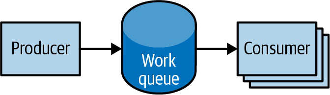
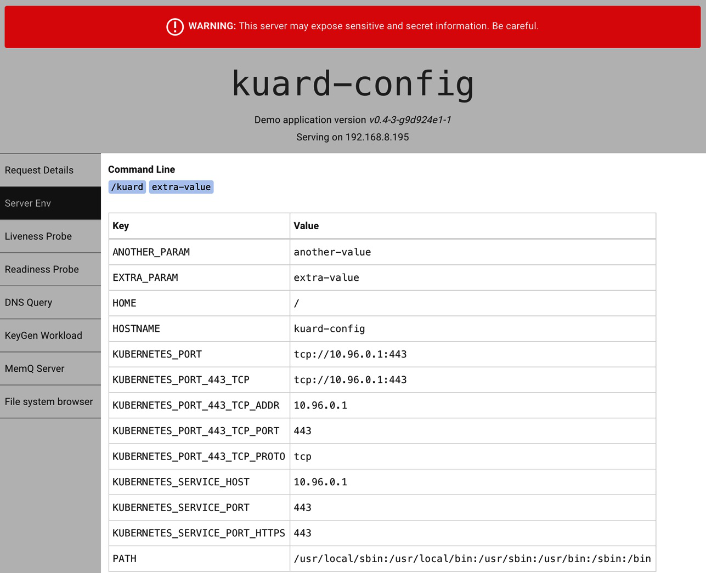

# Kubernetes Up And Running Workload Patterns, Config, RBAC, Mesh And Storage

## Overview

Note này chuyển từ web service stateless sang các workload và production concern: DaemonSet, Job, ConfigMap, Secret, RBAC, service mesh và storage. Đây là nhóm kiến thức dễ bị học rời rạc, nhưng trong thực tế chúng thường gặp cùng nhau khi vận hành platform.

## DaemonSets

DaemonSet đảm bảo một Pod chạy trên mỗi node phù hợp. Use case:

- log collector;
- monitoring agent;
- CNI/network component;
- storage node plugin;
- security agent.

Điểm cần nhớ:

- DaemonSet gắn với node, không dùng để scale theo traffic;
- có thể giới hạn node bằng label/selector/affinity;
- update DaemonSet cần quan tâm node disruption và agent availability;
- DaemonSet thường cần quyền cao hơn app thường, nên phải review security context/RBAC kỹ.

## Jobs And Work Queues

Job dùng cho workload có điểm kết thúc. Sách phân biệt one-shot, parallel job và work queue.



Pattern:

- one-shot Job cho migration/import/test;
- parallel Job cho nhiều task độc lập;
- work queue cho producer/consumer xử lý hàng đợi.

Checklist:

- task idempotent để retry an toàn;
- đặt `backoffLimit`;
- đặt deadline nếu có nguy cơ treo;
- lưu output ngoài Pod;
- biết cleanup completed Job/Pod;
- CronJob cần concurrency policy và missed schedule policy phù hợp.

## ConfigMaps And Secrets

ConfigMap dùng cho non-sensitive runtime config. Secret dùng cho sensitive value, nhưng cần hiểu Secret không tự đủ an toàn nếu RBAC/encryption/logging yếu.



Các cách consume:

- env var;
- volume files;
- command argument;
- projected volume.


Điểm quan trọng:

- env var không tự update trong process đang chạy;
- mounted file có thể update nhưng app phải reload;
- đổi ConfigMap/Secret thường cần rollout có kiểm soát;
- không commit secret thật vào Git;
- image pull secret phải nằm đúng namespace hoặc gắn vào ServiceAccount;
- tắt automount ServiceAccount token nếu Pod không gọi API.

## RBAC

RBAC giới hạn quyền truy cập Kubernetes API:

- Role + RoleBinding cho namespace;
- ClusterRole + ClusterRoleBinding cho cluster-wide;
- ServiceAccount cho workload identity;
- user/group thường đến từ identity provider bên ngoài.

Sách nhấn mạnh RBAC chống cả attacker lẫn tai nạn vận hành. Ví dụ một người thao tác nhầm namespace có thể phá production nếu quyền quá rộng.

Kiểm tra quyền bằng:

```bash
kubectl auth can-i <verb> <resource> -n <namespace>
kubectl auth can-i <verb> <resource> \
  --as system:serviceaccount:<namespace>:<serviceaccount> \
  -n <namespace>
```

Quyền nhạy cảm: `get/list/watch secrets`, `create pods`, `create rolebindings`, `impersonate`, wildcard verbs/resources.

## Service Meshes

Service mesh đưa các năng lực network/application vào sidecar hoặc dataplane:

- mTLS;
- traffic shaping;
- retries/timeouts;
- observability;
- service-to-service policy;
- canary/mirroring.

Nhưng service mesh không miễn phí. Nó thêm:

- latency/overhead;
- operational complexity;
- debugging khó hơn;
- version compatibility;
- policy layer chồng lên Kubernetes policy.

Câu hỏi trước khi dùng mesh:

- có cần mTLS service-to-service thật không?
- có cần traffic splitting ở layer 7 không?
- observability hiện tại có đủ không?
- team có đủ năng lực vận hành control plane mesh không?

Nếu chỉ cần basic Service/Ingress/NetworkPolicy, mesh có thể là quá sớm.

## Storage

Sách đi qua volumes, PV/PVC, dynamic provisioning, StatefulSet và external storage. Mental model:

```text
Pod -> PVC -> PV -> StorageClass/CSI -> backend
```

Các pattern:

- singleton database với PVC;
- StatefulSet cho identity + storage ổn định;
- dynamic provisioning qua StorageClass;
- external services khi database/storage nằm ngoài cluster;
- selectorless Service để đưa external endpoint vào service discovery.

Điểm vận hành:

- PVC/PV không thay thế backup;
- StatefulSet không tự biến database thành HA;
- volume zone/topology có thể ảnh hưởng scheduling;
- reclaim policy quyết định dữ liệu còn hay mất sau khi PVC bị xóa;
- external service thường thiếu health checking tự nhiên như Pod endpoints.

## Canonical Links

- [Workload Controllers Và Rollout](../../01-core-objects/02-workload-controllers-and-rollout.md)
- [ConfigMap, Secret, Downward API Và API Access](../../09-application-integration/01-configmap-secret-downward-api-and-api-access.md)
- [RBAC, Pod Security Và Admission](../../04-security/01-rbac-pod-security-and-admission.md)
- [Persistent Storage Và StatefulSet](../../03-storage/01-persistent-storage-and-statefulsets.md)
