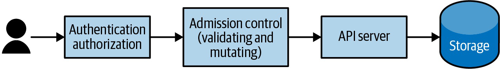

# Kubernetes Up And Running Extensibility, API Clients, Security And Policy

## Overview

Note này nhìn Kubernetes như một API platform có thể mở rộng và được quản trị bằng policy: CRD, operators, client libraries, Pod security, RuntimeClass, policy/governance và admission.

## Extending Kubernetes

Kubernetes mở rộng ở nhiều điểm:

- CRD thêm resource type;
- controller/operator reconcile resource custom;
- admission webhook mutate/validate request;
- aggregated API server cho API phức tạp hơn;
- scheduler/controller/runtime extension tùy nhu cầu platform.



CRD tốt cần:

- schema rõ;
- versioning;
- status conditions;
- validation/defaulting;
- RBAC tối thiểu;
- controller idempotent;
- finalizer nếu quản lý external resource.


CRD không có controller thì chỉ là dữ liệu được API Server lưu. Giá trị thật nằm ở reconcile loop.

## Operators

Operator là controller mang kiến thức vận hành domain vào Kubernetes. Ví dụ:

- database cluster operator;
- certificate operator;
- backup operator;
- workload/platform operator.

Operator tốt phải thể hiện trạng thái qua `status`, không chỉ log lỗi. Người vận hành cần nhìn custom resource và biết nó đang kẹt ở đâu.

Anti-pattern:

- operator có `cluster-admin` không cần thiết;
- spec quá giống ConfigMap;
- status nghèo thông tin;
- upgrade operator thay đổi data path không có rollback;
- finalizer làm resource không xóa được khi external system lỗi.

## API Clients And Programming Languages

Sách đi vào cách nói chuyện với Kubernetes API bằng Python, Java và .NET. Dù ngôn ngữ khác nhau, mental model giống nhau:

- kubeconfig hoặc in-cluster config;
- API group/version/resource;
- list/get/create/patch/delete;
- watch API để theo dõi thay đổi;
- logs/exec/port-forward là subresource/streaming operation;
- auth/RBAC vẫn áp dụng như `kubectl`.

Khi viết automation/controller:

- scope namespace nếu có thể;
- dùng backoff khi lỗi;
- tránh polling dày;
- dùng watch/informer/cache nếu phù hợp;
- cập nhật status/condition;
- đo metric reconcile error/API latency.

## Securing Applications

Sách nhấn mạnh defense in depth và least privilege. Kubernetes có nhiều API bảo mật, nhưng phải opt-in đúng:

- SecurityContext;
- PodSecurityContext;
- Pod Security Standards/Admission;
- RuntimeClass;
- NetworkPolicy;
- RBAC;
- image scanning/signing policy;
- Secret management.


SecurityContext cần review:

- `runAsNonRoot`;
- `allowPrivilegeEscalation`;
- capabilities drop/add;
- `readOnlyRootFilesystem`;
- seccomp;
- host namespace;
- hostPath;
- privileged mode.

Pod Security Standards có ba mức mental model: privileged, baseline, restricted. Với workload cũ, nên audit/warn trước khi enforce.

## RuntimeClass

RuntimeClass cho phép chọn runtime handler khác nhau, ví dụ sandboxed runtime. Nhưng nó phụ thuộc node/runtime setup. Không phải thêm field là chạy được.

Use case:

- workload cần isolation mạnh hơn;
- multi-runtime cluster;
- security boundary cho workload rủi ro cao.

Giới hạn: runtime sandbox không thay thế RBAC, NetworkPolicy, image policy hoặc secret hygiene.

## Policy And Governance

Policy/governance giúp platform team giữ cluster nhất quán:

- label/annotation bắt buộc;
- image registry được phép;
- Pod Security level;
- request/limit bắt buộc;
- cấm hostPath/privileged;
- Ingress host/domain rule;
- owner/runbook annotation.


Policy nên triển khai theo lộ trình:

```text
audit -> warn -> enforce
```

Sách nói Open Policy Agent/Gatekeeper như một hướng policy. Bài học chung:

- policy phải có message rõ;
- exception path phải có kiểm soát;
- webhook/policy controller cần HA và timeout hợp lý;
- policy không nên chặn production rollout bất ngờ;
- violation cần dashboard/metric để platform team theo dõi.

## Canonical Links

- [CRD, Operators, Policy Và Multicluster](../../10-advanced/01-crd-operators-policy-and-multicluster.md)
- [RBAC, Pod Security Và Admission](../../04-security/01-rbac-pod-security-and-admission.md)
- [ConfigMap, Secret, Downward API Và API Access](../../09-application-integration/01-configmap-secret-downward-api-and-api-access.md)
