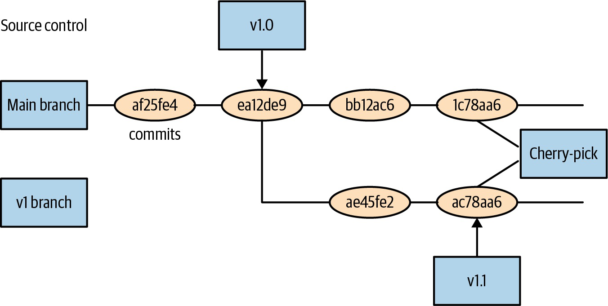
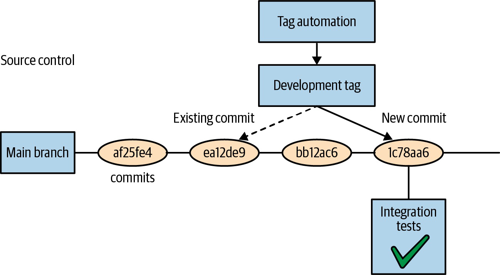

# Kubernetes Up And Running Multicluster, Source Organization And Lab Cluster

## Overview

Note này trả lời hai câu hỏi trưởng thành hơn: khi nào cần nhiều cluster, và làm sao tổ chức manifest/source control để deploy ứng dụng Kubernetes lâu dài. Phần tự build cluster được chuyển hóa thành mental model lab, không phải runbook production copy-paste.

## Multicluster Motivation

Multicluster xuất hiện vì một cluster thường không đủ cho mọi failure domain và boundary tổ chức.

Lý do dùng:

- redundancy/resiliency;
- regional latency;
- data residency;
- blast radius isolation;
- compliance;
- team/platform boundary;
- upgrade risk isolation.

Chi phí:

- routing phức tạp;
- config/secret drift;
- observability phân tán;
- data replication khó;
- release orchestration nhiều bước;
- incident response phức tạp hơn.

## Multicluster Patterns

Sách trình bày nhiều hướng:

- load-balancing approach từ phía trên;
- replicated silos;
- sharding theo region/data;
- microservice routing linh hoạt;
- data replication và consistency trade-off.

Điểm quan trọng: multicluster không tự động tạo HA cho stateful data. Nếu app ghi dữ liệu, cần chiến lược replication/conflict/failover/backup riêng.

## Organizing Applications In Source Control

Chapter 22 nhấn mạnh filesystem/source control là source of truth cho app Kubernetes. Cluster state không nên là nơi duy nhất ghi nhớ deployment.

Principles:

- filesystem as source of truth;
- code review cho thay đổi manifest;
- feature flags/gates để tách deploy khỏi release;
- source layout phải phục vụ dev/test/staging/prod và region rollout;
- dashboard cần cho biết version nào đang chạy ở region nào.

## Versioning And Promotion

Các model tổ chức:

- directories theo environment/cluster/region;
- branches/tags cho version;
- template/parameterization bằng Helm/Kustomize hoặc tool tương đương;
- promotion qua PR/review;
- cherry-pick fix giữa branch/version khi cần.

Anti-pattern:

- production khác Git lâu dài;
- image tag mutable khiến staging/prod không cùng artifact;
- quá nhiều patch riêng cho prod làm staging mất giá trị;
- release gấp bỏ qua thứ tự region đã định;
- không track active versions theo region.

## Mean Time To Smoke

Sách đưa khái niệm "mean time to smoke": thời gian trung bình sau rollout để lỗi nếu có bắt đầu lộ ra. Khi rollout nhiều region:

- bắt đầu bằng region low-traffic để giảm blast radius;
- sau đó test high-traffic để xác nhận scale;
- chờ đủ thời gian quan sát trước khi đi tiếp;
- không tăng tốc lịch rollout chỉ vì nghĩ thay đổi nhỏ;
- giới hạn số version active, ví dụ testing, rolling out, being replaced.

Đây là cách nhìn release như workflow xác suất, không phải một command apply toàn cầu.

## Appendix: Building Your Own Kubernetes Cluster

Appendix hướng dẫn dựng cluster vật lý nhỏ bằng single-board machines. Giá trị chính:

- hiểu control plane node, worker node, DHCP/networking;
- hiểu container runtime như `containerd`;
- hiểu kubeadm init/join;
- hiểu Pod network cần CNI;
- hiểu việc tự quản cluster đòi hỏi password, network, runtime, kubelet, CNI và node failure testing.

Không nên copy command trong appendix vào production hiện tại. Dùng official docs đúng version. Appendix phù hợp cho lab để cảm nhận Kubernetes tự healing khi node mất điện/mất mạng.

## Lab Safety Notes

Khi tự dựng lab:

- đổi default password ngay;
- dùng placeholder IP/SSID/password trong note;
- không reuse credential production;
- ghi rõ network CIDR;
- backup kubeconfig nếu cần;
- test node reboot/network disconnect để học behavior;
- không expose lab cluster ra internet nếu chưa harden.

## Canonical Links

- [CRD, Operators, Policy Và Multicluster](../../10-advanced/01-crd-operators-policy-and-multicluster.md)
- [Packaging Và GitOps](../../06-packaging-and-gitops/overview.md)
- [Environment Promotion, Release Và Rollback](../../06-packaging-and-gitops/05-environment-promotion-release-and-rollback.md)
- [Kubernetes Labs](../../08-labs/overview.md)
- [Control Plane, Node Và Reconciliation](../../00-architecture/01-control-plane-node-and-reconciliation.md)
- [Debug Flow Từ Symptom Đến Control Plane Decision](../../98-troubleshooting/01-symptom-to-control-plane-debug-flow.md)
