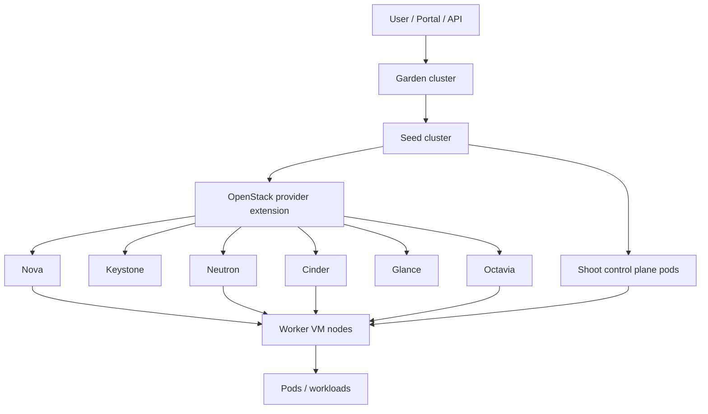

# Gardener OpenStack Provider Integration

## Overview

Khi Gardener chạy trên OpenStack, Gardener không tạo cluster bằng thao tác thủ công trên Nova/Neutron. User tạo `Shoot`, Gardener reconcile desired state đó, còn OpenStack provider extension gọi API OpenStack để tạo hạ tầng thật: VM worker, network, security group, volume, load balancer và endpoint liên quan.

Mental model cần nhớ:

```text
Garden quản lý yêu cầu
  -> Seed chạy control plane của Shoot
  -> OpenStack cung cấp hạ tầng data plane
  -> Shoot là Kubernetes cluster tenant
```

Control plane của Shoot thường chạy dưới dạng Pod trong Seed cluster, không chạy trên các VM worker. VM trên OpenStack chủ yếu là worker node để chạy workload.

## Architecture Map



Vai trò theo lớp:

| Lớp | Thành phần | Trách nhiệm |
|---|---|---|
| Garden | `Shoot`, `CloudProfile`, `SecretBinding` / `CredentialsBinding`, scheduler | Nhận yêu cầu cluster, validate option, chọn Seed |
| Seed | `gardenlet`, Shoot control plane namespace, provider extension, machine controller | Reconcile Shoot, chạy API server/etcd/scheduler/controller-manager của Shoot |
| OpenStack | Keystone, Nova, Neutron, Glance, Cinder, Octavia | Cấp auth, VM, network, image, volume, load balancer |
| Shoot | worker VM, kubelet, CNI, CSI, workload | Chạy workload tenant và báo trạng thái node/pod |

## Provider Extension Objects

OpenStack provider extension được đăng ký vào Gardener để core biết provider `openstack` phải được reconcile bởi controller nào. Khi debug, không chỉ đọc `Shoot`; cần tìm resource phụ trợ trong Seed vì lỗi thường nằm ở extension-specific object.

| Resource / object | Nơi thường thấy | Ý nghĩa vận hành |
|---|---|---|
| `ControllerRegistration` | Garden | Đăng ký extension controller cho provider hoặc capability cụ thể |
| `CloudProfile` | Garden | Khai báo region, zone, version, image, machine type và volume type cho OpenStack |
| `SecretBinding` / `CredentialsBinding` | Garden | Gắn credentials Keystone/OpenStack project cho Shoot |
| Infrastructure extension resource | Seed | Reconcile network, subnet, router, security group, floating IP |
| Worker extension resource | Seed | Tạo/xóa/thay worker VM qua Nova |
| ControlPlane extension resource | Seed | Cấu hình thành phần provider-specific cho Shoot control plane |

## OpenStack Service Mapping

| OpenStack service | Gardener dùng để làm gì | Lỗi thường thấy |
|---|---|---|
| Keystone | Auth cho provider extension bằng project/user/domain/application credential | Credential sai, domain/project mismatch, token/auth fail |
| Nova | Tạo, xóa, thay thế worker VM | Quota thiếu, flavor không tồn tại, AZ/host capacity thiếu |
| Neutron | Network, subnet, router, security group, port, floating IP | CIDR overlap, security group thiếu rule, router/provider network sai |
| Glance | Image boot worker node | Image không tồn tại, image không tương thích cloud-init/OS extension |
| Cinder | Volume cho worker hoặc PVC qua Cinder CSI | Volume type sai, attach fail, backend full/chậm |
| Octavia | Kubernetes API endpoint hoặc Service `LoadBalancer` | LB quota thiếu, amphora/provider driver lỗi, floating IP/VIP không reach được |
| Designate | DNS automation nếu landscape dùng DNS extension | Record không tạo được hoặc delegation sai |
| Barbican | Secret/certificate nếu tích hợp TLS/certificate flow | Secret/certificate permission hoặc plugin backend lỗi |
| Ceilometer/Gnocchi | Metering/monitoring nếu private cloud dùng telemetry | Thiếu tín hiệu capacity/cost hoặc khó điều tra usage |

## Shoot Creation Flow

```text
User tạo Shoot manifest
  -> Garden API lưu Shoot
  -> gardener-scheduler chọn Seed
  -> gardenlet trên Seed reconcile Shoot
  -> OpenStack extension tạo hoặc dùng hạ tầng network
  -> Shoot control plane được deploy vào namespace trên Seed
  -> machine-controller-manager tạo Machine/MachineDeployment
  -> Nova boot worker VM từ Glance image
  -> cloud-init/user-data cấu hình kubelet
  -> worker join Shoot API server
  -> Shoot healthy nếu node, add-ons, CNI/CSI và endpoint ổn
```

Trong `CloudProfile`, platform team thường giới hạn các lựa chọn hợp lệ: Kubernetes version, machine image, region/zone, flavor/machine type, volume type và constraint đặc thù OpenStack.

## Network Models

### Gardener Tự Tạo Network

```text
OpenStack project
  -> Shoot network
  -> subnet worker
  -> router
  -> security groups
  -> floating IP / load balancer nếu cần
```

Mô hình này giảm thao tác chuẩn bị thủ công, nhưng credentials của Gardener phải có quyền đủ rộng trong OpenStack project. Cần kiểm soát quota và cleanup khi Shoot deletion bị kẹt finalizer.

### Dùng Network Có Sẵn

```text
OpenStack provider/tenant network chuẩn bị trước
  -> Shoot dùng lại network/subnet/router/security group theo cấu hình
```

Mô hình này phù hợp private cloud có network design chặt, nhưng dễ lỗi nếu subnet, router, provider network, DNS, MTU hoặc security group không khớp với assumption của Gardener/CNI.

## Control Plane To Worker Connectivity

Vì Shoot control plane nằm trong Seed còn worker nằm trên OpenStack VM, đường kết nối giữa hai lớp này là critical.

```text
Shoot kube-apiserver trong Seed
  -> VPN / tunnel / connectivity component
  -> kubelet trên worker VM
```

Luồng này ảnh hưởng trực tiếp tới:

- `kubectl logs`, `exec`, `port-forward`;
- node heartbeat và node readiness;
- webhook hoặc admission path nếu cần gọi workload endpoint;
- health check của cluster và reconcile.

Nếu Seed lỗi nặng, nhiều Shoot có thể mất control plane cùng lúc. Workload đang chạy trên worker có thể vẫn chạy một phần, nhưng thao tác quản trị, rollout, scale và debug sẽ bị ảnh hưởng.

API endpoint của Shoot có thể là public endpoint, private endpoint, load balancer kèm DNS, hoặc endpoint đi qua VPN/internal network. Đây là quyết định kiến trúc vì nó ảnh hưởng tới security group, floating IP, Octavia, DNS và cách user lấy kubeconfig/truy cập API.

## Worker Node Join Flow

```text
MachineDeployment desired replicas
  -> Machine object
  -> OpenStack provider extension
  -> Nova create server
  -> VM boot từ Glance image
  -> cloud-init / user-data
  -> kubelet start
  -> kubelet đăng ký với Shoot API server
  -> Node Ready
```

Khi worker không join, đừng chỉ nhìn trong Shoot. Cần kiểm tra cả Garden/Seed operation, Machine status, Nova server, Neutron port/security group, cloud-init và kubelet log trên VM.

## Load Balancer And Storage

Service `LoadBalancer` thường đi qua cloud-controller-manager hoặc OpenStack cloud provider integration:

```text
Service type LoadBalancer
  -> cloud-controller-manager
  -> Octavia
  -> VIP / floating IP
  -> worker node / Pod backend
```

Nếu không có Octavia, platform phải chọn giải pháp khác như external HAProxy/Nginx, Ingress controller phía ngoài, hoặc MetalLB cho môi trường nội bộ. Đây là design decision của platform, không nên xử lý như lỗi Kubernetes thuần.

PVC thường đi qua Cinder CSI:

```text
PVC
  -> CSI controller
  -> Cinder create volume
  -> Nova attach volume vào worker VM
  -> CSI node mount vào Pod
```

Nếu backend Cinder là Ceph RBD, Kubernetes thường không cần truy cập Ceph trực tiếp; request vẫn đi qua Cinder CSI và quyền/quotas của OpenStack.

## Autoscale, Upgrade Và Repair

Scale out:

```text
Pod Pending
  -> cluster-autoscaler
  -> tăng MachineDeployment replicas
  -> Nova tạo worker VM mới
  -> node join
  -> Pod được schedule
```

Scale in:

```text
node ít tải
  -> cluster-autoscaler chọn node
  -> drain node
  -> machine-controller-manager xóa Machine
  -> Nova xóa VM
```

Upgrade Kubernetes thường theo hướng control plane trước, worker rolling sau:

```text
đổi spec.kubernetes.version
  -> Gardener upgrade control plane trong Seed
  -> upgrade add-ons/cloud-controller/CSI/CNI nếu cần
  -> tạo worker mới version mới
  -> drain/xóa worker cũ
```

Self-healing worker:

```text
Node NotReady
  -> machine-controller-manager phát hiện
  -> cordon/drain nếu có thể
  -> xóa VM lỗi qua Nova
  -> tạo VM thay thế
  -> node mới join Shoot
```

## Operations Checklist

Garden:

```bash
kubectl get shoots -A
kubectl describe shoot <shoot-name> -n <project-namespace>
kubectl get cloudprofiles
kubectl get secretbindings,credentialsbindings -A
```

Seed:

```bash
kubectl get seeds
kubectl get pods -A | grep gardenlet
kubectl get ns | grep shoot--
kubectl get pods -n shoot--<project>--<shoot>
```

Shoot:

```bash
kubectl get nodes -o wide
kubectl get pods -A
kubectl get pvc,pv -A
kubectl get svc -A
```

OpenStack:

```bash
openstack token issue
openstack server list --project <project>
openstack port list --project <project>
openstack network list
openstack router list
openstack volume list --project <project>
openstack loadbalancer list
```

## Troubleshooting Map

| Symptom | Đọc lớp nào trước | Hướng kiểm tra |
|---|---|---|
| Shoot kẹt create/reconcile | Garden, Seed | `Shoot.status.lastOperation`, events, gardenlet log, extension log |
| Worker VM không tạo | Seed, OpenStack | Machine status, Nova quota/flavor/AZ, Glance image |
| Worker tạo nhưng node không Ready | Shoot, OpenStack VM | cloud-init, kubelet, security group, tunnel tới API server |
| Không truy cập được Shoot API | Seed, OpenStack LB/DNS | kube-apiserver Pod, endpoint/LB, DNS, floating IP, security group |
| Service `LoadBalancer` Pending | Shoot, Octavia | cloud-controller-manager log, Octavia quota/provider, subnet/VIP/FIP |
| PVC Pending hoặc mount fail | Shoot, Cinder/Nova | CSI controller/node log, volume type, Cinder volume, Nova attach |
| Scale out không thêm node | Shoot, Seed, OpenStack | cluster-autoscaler, MachineDeployment, Nova quota/capacity |
| Nhiều Shoot cùng lỗi control plane | Seed | Seed resource pressure, gardenlet, extension controller, Seed API health |

## Design Guardrails

- Tách rõ management project chứa Garden/Seed và tenant project chứa worker VM nếu muốn giảm blast radius.
- Tính capacity Seed theo số Shoot control plane, không chỉ theo số worker VM.
- Chuẩn hóa CloudProfile theo OpenStack region/zone/flavor/image/volume type đang được vận hành thật.
- Kiểm soát CIDR để tránh overlap giữa Seed, Shoot pod/service CIDR và OpenStack networks.
- Có quota plan cho Nova, Cinder, Neutron, Octavia trước khi bật autoscale.
- Không coi Gardener repair là backup. Stateful workload vẫn cần backup/restore riêng.
- Với private cloud không có Octavia hoặc DNS automation, phải thiết kế rõ endpoint/LB/DNS thay thế trước khi cho user tạo Shoot production.

## Gardener Và Magnum

Trong OpenStack private cloud, Gardener và Magnum đều có thể liên quan tới Kubernetes lifecycle nhưng phục vụ mục tiêu khác nhau.

| Tiêu chí | Gardener | Magnum |
|---|---|---|
| Mục tiêu chính | Managed Kubernetes platform nhiều tenant/provider/region | Kubernetes service OpenStack-native, dễ bắt đầu hơn |
| Control plane | Thường chạy trong Seed cluster | Thường dựa trên cluster template/master node theo driver |
| Multi-cloud | Mạnh | Chủ yếu gắn với OpenStack |
| Upgrade/repair | Reconcile lifecycle mạnh, phù hợp platform lớn | Phụ thuộc driver/template và maturity triển khai |
| Độ phức tạp vận hành | Cao hơn, cần Garden/Seed/extension | Thấp hơn cho lab hoặc private cloud nhỏ |

Nếu mục tiêu là Kubernetes-as-a-Service quy mô platform, Gardener thường phù hợp hơn. Nếu chỉ cần vài cụm Kubernetes trong OpenStack lab hoặc môi trường nhỏ, Magnum dễ tiếp cận hơn.

## Related Pages

- [Gardener Architecture And Core Concepts](./01-architecture-and-core-concepts.md)
- [Gardener Shoot Lifecycle Và Day-2 Operations](./02-shoot-lifecycle-and-day2-operations.md)
- [Gardener Observability Và Troubleshooting Map](./07-observability-and-troubleshooting-map.md)
- [OpenStack Overview](../../../04-cloud-edge/02-cloud-ecosystem/openstack/overview.md)
