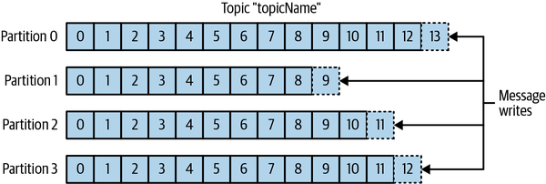
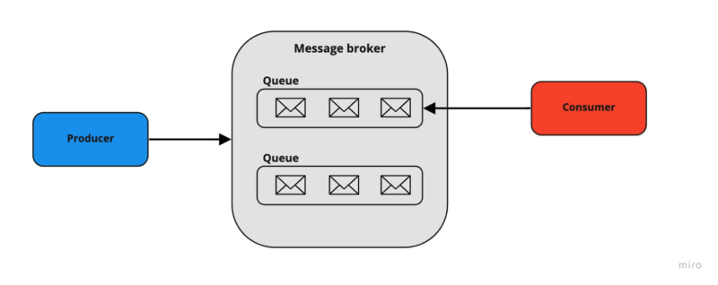
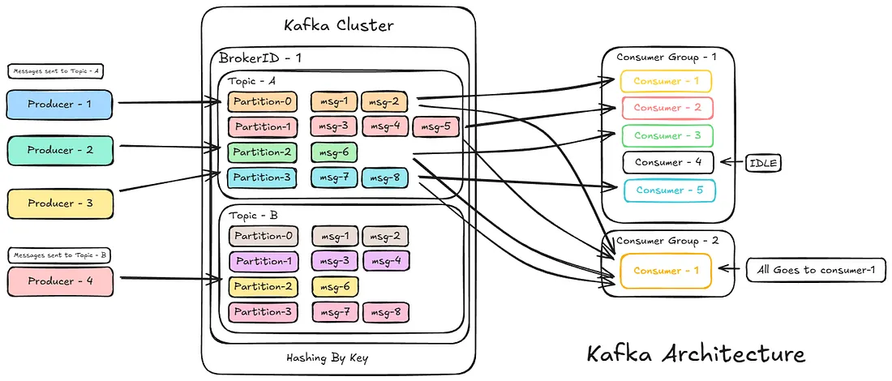
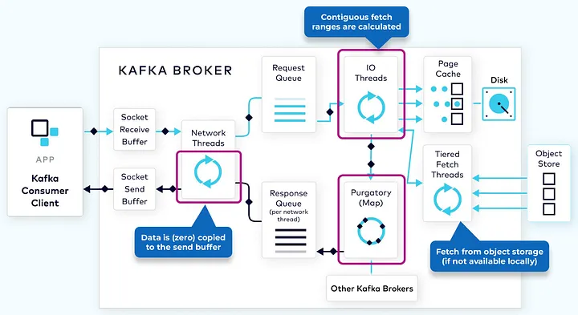
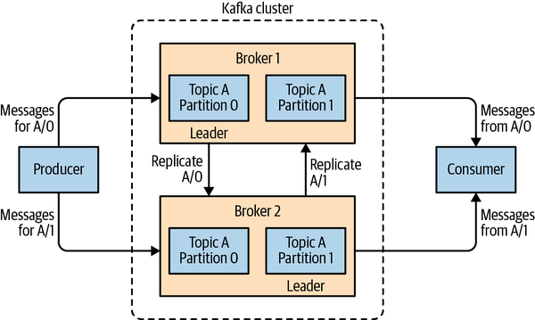
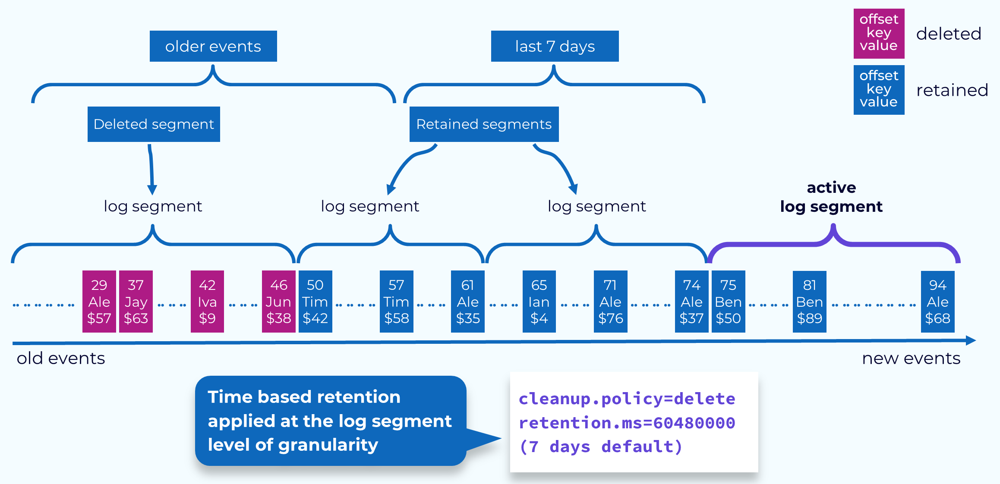
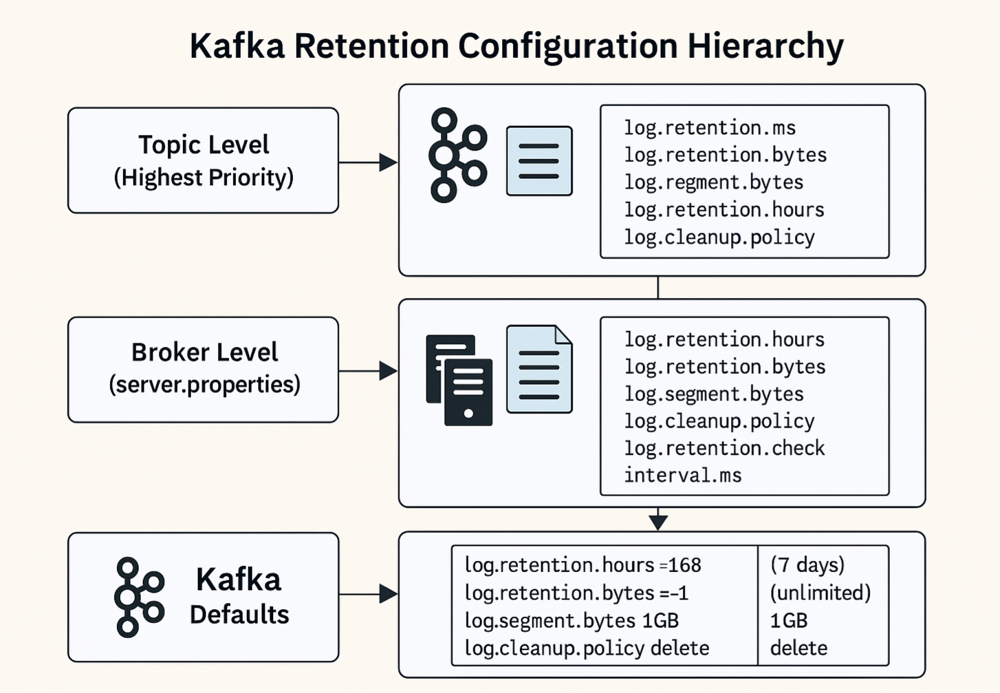
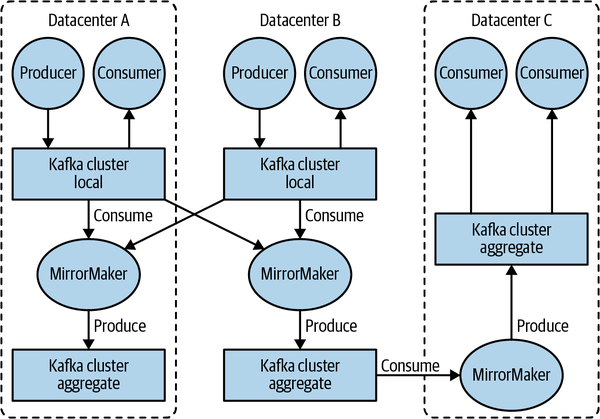
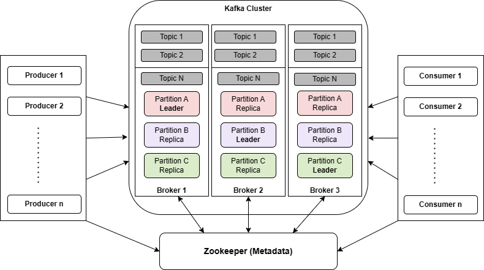
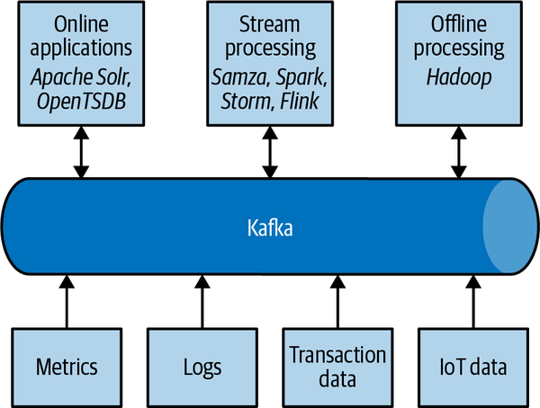

# Các thành phần trong Kafka
## Các khái niệm cơ bản
### Message
- Message là đơn vị dữ liệu cơ bản trong Kafka, đại diện cho một sự kiện hoặc một bản ghi thông tin. Mỗi message bao gồm một key (khóa), một value (giá trị) và một timestamp (dấu thời gian). Message được gửi từ producer đến topic và được lưu trữ trong các partition của topic. Một Message hiểu đơn giảm là một mảng  các bytes . Mỗi message có thể chứa bất kỳ loại dữ liệu nào, từ văn bản đơn giản đến dữ liệu phức tạp như JSON hoặc Avro. Message là trung tâm của hệ thống Kafka, và tất cả các hoạt động trong Kafka đều xoay quanh việc gửi, lưu trữ và xử lý message.

- Message được viết vào trong Kafka theo các batch (lô) để tối ưu hóa hiệu suất. Một lô chỉ đơn giản một tập hợp các message được gửi cùng một lúc từ producer đến Kafka. Việc gửi message theo lô giúp giảm overhead của việc gửi từng message riêng lẻ, cải thiện hiệu suất và giảm độ trễ trong quá trình truyền dữ liệu.

#### Schemas 
- Schema là một định nghĩa cấu trúc dữ liệu được sử dụng để mô tả cách dữ liệu được tổ chức trong message. Schema giúp đảm bảo rằng dữ liệu được gửi và nhận trong Kafka tuân thủ một định dạng nhất định, giúp tăng tính tương thích và dễ dàng xử lý dữ liệu. Schema thường được quản lý bởi một schema registry, nơi các producer và consumer có thể đăng ký và truy xuất schema để đảm bảo rằng dữ liệu được xử lý đúng cách.

## Các thành phần chính
Kafka bao gồm một số thành phần chính, mỗi thành phần đóng một vai trò quan trọng trong việc quản lý và xử lý dữ liệu trong hệ thống. Dưới đây là các thành phần chính của Kafka:

### Topic và Partition
- Message trong Kafka được tổ chức thành các topic và partition. Topic là một kênh logic trong Kafka, nơi các message được gửi đến và lưu trữ. Mỗi topic có thể được chia thành nhiều partition để tăng khả năng mở rộng và hiệu suất. Các producer gửi dữ liệu vào topic, và các consumer đọc dữ liệu từ topic.

- Topic có thể hiểu gần nghĩa nhất với một bảng trong cơ sở dữ liệu hoặc một thư mục trong hệ thống file. Mỗi topic có thể chứa nhiều partition, và mỗi partition là một chuỗi các message được lưu trữ theo thứ tự. Partition giúp phân phối dữ liệu và tải công việc giữa các broker trong cluster, giúp tăng hiệu suất và khả năng mở rộng của hệ thống.

- Một Topic có thẻ bao gồm nhiều Partition, mỗi Partition có thể được lưu trữ trên nhiều server khác nhau trong cluster Kafka. Điều này giúp tăng khả năng mở rộng và độ tin cậy của hệ thống, vì nếu một server gặp sự cố, các partition khác vẫn có thể tiếp tục hoạt động mà không bị gián đoạn. Thêm vào đó, partitions có thể được sao chép (replicated) để đảm bảo rằng dữ liệu không bị mất mát trong trường hợp có sự cố xảy ra. Ví dụ như các server kahcs nháu sẽ lưu trữ 1 bản copy của cùng partition trong trường hợp server chính gặp sự cố thì server phụ sẽ tiếp tục phục vụ dữ liệu mà không bị gián đoạn.

> Định nghĩa `stream` thường được sử dụng khi bàn về dữ liệu trong một hệ thống như Kafka. Một stream thường được hiểu là một topic đơn nhất của dữ liệu, không kể đến số lượng partition của topic đó. 

### Producer và Consumer
Các Kafka client là những người dùng của hệ thống, bao gồm 2 loại cơ bản : Producer và Consumer. Cũng có các loại client nâng cao hơn như Kafka Connect cho tích hợp dữ liệu hay Kafka Streams cho xử lý dữ liệu trực tiếp, nhưng Producer và Consumer là hai loại client cơ bản nhất. Các client nâng cao này sử dụng producer và consumer để tương tác với Kafka, nhưng cung cấp thêm các tính năng và khả năng xử lý dữ liệu phức tạp hơn.

- Producer là ứng dụng hoặc dịch vụ chịu trách nhiệm gửi dữ liệu (message) vào Kafka. 
    - Producer ( trong các hệ thống pub/sub khác có thể là *publishesr* hay *writers*) tạo messages mới. Một message sẽ được gửi đến một topic cụ thể trong Kafka, và producer có thể chọn partition nào để gửi message dựa trên key của message hoặc theo cách ngẫu nhiên. Nó đảm bảo rằng mọi message được gửi với key được chọn sẽ luôn được gửi đến cùng một partition, giúp đảm bảo thứ tự của message trong partition đó. 
    > Producer có thể được cấu hình để đảm bảo rằng dữ liệu được gửi một cách đáng tin cậy, ví dụ như bằng cách sử dụng cơ chế xác nhận (acknowledgment) để đảm bảo rằng message đã được nhận và lưu trữ thành công trên broker trước khi tiếp tục gửi message tiếp theo.
    - Producer có thể gửi dữ liệu đến một hoặc nhiều topic và có thể cấu hình để đảm bảo rằng dữ liệu được gửi một cách đáng tin cậy.

- Consumer là ứng dụng hoặc dịch vụ chịu trách nhiệm đọc dữ liệu từ Kafka. 
    - Consumer (trong các hệ thống pub/sub khác có thể là *reader* hay *subscribers*) có thể đăng ký để nhận dữ liệu từ một hoặc nhiều topic và có thể xử lý dữ liệu theo cách riêng của mình.  
    - Consumer sử dụng offset để theo dõi vị trí của mình trong quá trình đọc dữ liệu. Bằng cách lưu trữ offset tiếp theo cho mỗi partition (thường là trong Kafka), consumer có thể dừng lại và khởi động lại mà không bị mất vị trí, đảm bảo tiếp tục đọc từ đúng nơi đã xử lý trước đó ngay cả khi xảy ra sự cố.
        - Offset — một giá trị số nguyên tăng dần theo thời gian — là một phần metadata mà Kafka gán cho mỗi message khi nó được tạo ra. Đây là một chỉ số duy nhất xác định vị trí của message trong một partition; mỗi message trong cùng một partition sẽ có một offset riêng biệt, và message tiếp theo sẽ có offset lớn hơn (nhưng không nhất thiết tăng đều một cách tuyệt đối). 

    > Consumer có thể được cấu hình để đảm bảo rằng dữ liệu được xử lý một cách đáng tin cậy và không bị mất mát.

#### Consumer Group
Consumer Group là một tập hợp các consumer làm việc cùng nhau để đọc dữ liệu từ một hoặc nhiều topic. Mỗi consumer trong một consumer group sẽ đọc dữ liệu từ một phần của các partition của topic, giúp tăng tốc độ xử lý và đảm bảo rằng dữ liệu được xử lý một cách hiệu quả. Consumer group cũng giúp đảm bảo rằng nếu một consumer gặp sự cố, các consumer khác trong nhóm có thể tiếp tục xử lý dữ liệu mà không bị gián đoạn.

### Broker
- Broker là một server trong cluster Kafka, chịu trách nhiệm lưu trữ và quản lý các topic. Broker nhận messages từ producer, gán offets cho chúng và viết các messages vào lưu trữ đĩa cứng. Broker cũng phục vụ các consumer bằng cách cung cấp dữ liệu khi chúng yêu cầu và quản lý việc phân phối dữ liệu giữa các partition và các consumer. Tùy thuộc vào cấu hình phần cứng và hiệu năng , một broker đơn lẻ có thể dễ dàng xử lý hàng ngàn partition và hàng triệu messages mỗi giây. 

- Cluster Kafka bao gồm nhiều broker , một broker sẽ được chọn làm controller tự động từ trong số thành viên broker còn hoạt động của cluster. Controller chịu trách nhiệm quản lý trạng thái của cluster, bao gồm việc theo dõi các broker, phân phối partition và quản lý quá trình failover khi một broker gặp sự cố. Khi một broker mới tham gia vào cluster hoặc một broker hiện tại gặp sự cố, controller sẽ tự động điều chỉnh phân phối partition để đảm bảo rằng dữ liệu vẫn được phục vụ một cách liên tục và hiệu quả.
    - Cluster Kafka cũng tuân theo nguyên tắc quorum, có nghĩa là để một broker được chọn làm controller, nó phải nhận được sự đồng thuận từ ít nhất một nửa số broker còn lại trong cluster. Điều này giúp đảm bảo rằng controller được chọn là một broker đáng tin cậy và có thể quản lý cluster một cách hiệu quả.
    - Mỗi partition sở hữu bởi một broker cụ thể, được gọi là leader của partition đó. Các broker khác có thể đóng vai trò là followers, sao chép dữ liệu từ leader để đảm bảo tính sẵn sàng và độ tin cậy của dữ liệu. Khi một consumer yêu cầu dữ liệu từ một partition, nó sẽ kết nối trực tiếp với broker đang giữ vai trò leader của partition đó để đọc dữ liệu.

- Một tính năng quan trọng của Kafka là **retention** (lưu trữ), tức là **khả năng lưu trữ bền vững các message trong một khoảng thời gian nhất định**. Các Kafka broker được cấu hình với thiết lập retention mặc định cho các topic, có thể là giữ message trong **một khoảng thời gian** (ví dụ: 7 ngày) hoặc cho đến khi partition đạt đến **một kích thước nhất định** (ví dụ: 1 GB). Khi đạt đến các giới hạn này, các message cũ sẽ hết hạn và bị xóa. Theo cách này, cấu hình retention xác định lượng dữ liệu tối thiểu luôn có sẵn tại bất kỳ thời điểm nào.

- Mỗi topic cũng có thể được cấu hình retention riêng, để message chỉ được lưu giữ trong khoảng thời gian còn hữu ích. Ví dụ, một topic dùng để tracking có thể được giữ trong vài ngày, trong khi dữ liệu metric của ứng dụng có thể chỉ cần lưu trong vài giờ. Ngoài ra, topic còn có thể được cấu hình theo dạng log compacted, nghĩa là Kafka **chỉ giữ lại message cuối cùng tương ứng với mỗi key.** Điều này đặc biệt hữu ích với dữ liệu dạng changelog, nơi mà chỉ trạng thái cập nhật mới nhất là quan trọng.

#### Multiple Clusters
- Khi hệ thống Kafka phát triển lớn hơn, việc sử dụng nhiều cluster thường mang lại nhiều lợi ích :
    - Phân tách các loại dữ liệu khác nhau
    - Cô lập để đáp ứng các yêu cầu về bảo mật
    - Triển khai trên nhiều datacenter (phục vụ khôi phục thảm họa)
- Đặc biệt, khi làm việc với nhiều datacenter, thường cần phải sao chép (copy) message giữa chúng. Nhờ đó, các ứng dụng online có thể truy cập dữ liệu hoạt động của người dùng ở cả hai nơi. Ví dụ, nếu một người dùng thay đổi thông tin công khai trong hồ sơ của họ, thay đổi đó cần hiển thị независимо datacenter nào đang phục vụ kết quả tìm kiếm. Hoặc dữ liệu monitoring có thể được thu thập từ nhiều nơi về một vị trí trung tâm để phân tích và cảnh báo.
> Cơ chế replication bên trong Kafka chỉ hoạt động trong phạm vi một cluster duy nhất, không áp dụng giữa các cluster khác nhau.

- Dự án Kafka cung cấp một công cụ tên là MirrorMaker để sao chép dữ liệu sang các cluster khác. Về bản chất, MirrorMaker chỉ là sự kết hợp giữa một consumer và một producer của Kafka, được nối với nhau qua một hàng đợi. Message được đọc từ một cluster Kafka và ghi sang cluster khác. Hình 1-8 minh họa một kiến trúc sử dụng MirrorMaker: gom message từ hai cluster cục bộ vào một cluster tổng hợp, sau đó tiếp tục sao chép cluster này sang các datacenter khác.

### Zookeeper/Kraft
Zookeeper là một hệ thống quản lý cấu hình và đồng bộ hóa phân tán được sử dụng trong các phiên bản Kafka trước đây để quản lý cluster. Tuy nhiên, từ Kafka 2.8 trở đi, Kafka đã giới thiệu Kraft (Kafka Raft Metadata Mode) để thay thế Zookeeper, giúp đơn giản hóa kiến trúc và cải thiện hiệu suất của cluster. Kraft cho phép Kafka tự quản lý metadata mà không cần phụ thuộc vào Zookeeper, giúp giảm độ phức tạp và tăng tính ổn định của hệ thống.

### Replication
Replication là quá trình sao chép dữ liệu từ một partition chính (leader) sang các partition phụ (followers) để đảm bảo tính sẵn sàng và độ tin cậy của dữ liệu. Nếu partition leader gặp sự cố, một trong các followers sẽ được chọn làm leader mới để tiếp tục phục vụ dữ liệu mà không bị gián đoạn. Replication giúp bảo vệ dữ liệu khỏi mất mát và đảm bảo rằng hệ thống có thể chịu được lỗi phần cứng hoặc phần mềm.

## Tại sao nên sử dụng Kafka?
Kafka là một hệ thống publish/subscribe mạnh mẽ, phù hợp cho các hệ thống xử lý dữ liệu lớn nhờ các đặc điểm chính:
- **Xử lý linh hoạt nhiều producer và consumer:** Cho phép nhiều hệ thống cùng ghi và đọc dữ liệu song song mà không ảnh hưởng lẫn nhau
- **Lưu trữ bền vững (disk-based retention):** Dữ liệu được lưu trên disk theo cấu hình, giúp tránh mất dữ liệu và cho phép consumer đọc lại khi cần
- **Khả năng mở rộng cao (scalable):** Dễ dàng mở rộng từ vài node đến hàng trăm node mà không downtime
- **Hiệu năng cao:** Xử lý lượng dữ liệu lớn với độ trễ thấp
- **Hỗ trợ xây dựng pipeline dữ liệu:** Cung cấp các công cụ như Kafka Connect và Kafka Streams để tích hợp và xử lý dữ liệu.
> Kafka phù hợp khi bạn cần một nền tảng thu thập, truyền tải và xử lý dữ liệu lớn theo thời gian thực, ổn định và dễ mở rộng.

## Hệ sinh thái dữ liệu của Kafka
- Trong các hệ thống xử lý dữ liệu, thường có rất nhiều ứng dụng cùng tham gia. Ta có thể xem các ứng dụng tạo ra dữ liệu hoặc đưa dữ liệu vào hệ thống là đầu vào. Ngược lại, các kết quả như metric, báo cáo hay những sản phẩm dữ liệu khác được xem là đầu ra. Bên cạnh đó, còn có những luồng xử lý dạng vòng lặp: một số thành phần sẽ đọc dữ liệu từ hệ thống, kết hợp hoặc biến đổi nó bằng dữ liệu từ nguồn khác, rồi đưa dữ liệu đã xử lý trở lại hạ tầng dữ liệu để tiếp tục được sử dụng ở nơi khác. Tất cả điều này diễn ra với nhiều loại dữ liệu khác nhau, và mỗi loại lại có đặc điểm riêng về nội dung, kích thước và cách sử dụng.

- Trong bức tranh đó, Apache Kafka đóng vai trò như hệ tuần hoàn của toàn bộ hệ sinh thái dữ liệu. Kafka vận chuyển message giữa các thành phần khác nhau trong hạ tầng, đồng thời cung cấp một giao diện thống nhất cho mọi client. Khi Kafka được kết hợp với một hệ thống quản lý schema cho message, producer và consumer sẽ không còn phụ thuộc chặt chẽ vào nhau hay cần kết nối trực tiếp. Nhờ vậy, các thành phần có thể được thêm vào hoặc gỡ bỏ linh hoạt theo nhu cầu kinh doanh, và phía producer cũng không cần quan tâm dữ liệu của mình đang được ai sử dụng hay có bao nhiêu ứng dụng đang tiêu thụ nó.

### Usecases
1. Theo dõi hoạt động người dùng
- Trường hợp sử dụng ban đầu của Kafka, từ khi được thiết kế tại LinkedIn, là theo dõi hoạt động người dùng. Khi người dùng tương tác với các ứng dụng frontend của một website, hệ thống sẽ tạo ra các message ghi nhận hành động của họ. Đó có thể là những thông tin mang tính thụ động như lượt xem trang, click tracking, hoặc những hành động phức tạp hơn như cập nhật thông tin hồ sơ cá nhân.
- Các message này được publish vào một hoặc nhiều topic, sau đó được các ứng dụng backend consume để xử lý tiếp. Những ứng dụng này có thể dùng để tạo báo cáo, cung cấp dữ liệu cho hệ thống machine learning, cập nhật kết quả tìm kiếm, hoặc thực hiện các chức năng khác cần thiết để mang lại trải nghiệm người dùng phong phú hơn.

2. Messaging
- Kafka cũng được sử dụng như một hệ thống messaging, trong đó các ứng dụng cần gửi thông báo cho người dùng, chẳng hạn như email. Với Kafka, ứng dụng chỉ cần tạo message mà không phải bận tâm đến định dạng hiển thị hay cách thông báo sẽ được gửi đi như thế nào.
- Sau đó, một ứng dụng trung tâm có thể đọc toàn bộ các message cần gửi và xử lý chúng một cách nhất quán, bao gồm:
    - định dạng message theo cùng một giao diện và phong cách trình bày;
    - gom nhiều message thành một thông báo duy nhất;
    - áp dụng các thiết lập cá nhân của người dùng về cách họ muốn nhận thông báo.

> Cách làm này giúp tránh việc phải lặp lại cùng một logic ở nhiều ứng dụng khác nhau, đồng thời cho phép thực hiện những thao tác như gom nhóm thông tin, điều mà nếu xử lý phân tán sẽ khó làm hơn nhiều.

3. Metrics và logging
- Kafka cũng rất phù hợp cho việc thu thập metrics và log từ ứng dụng và hệ thống. Đây là một trường hợp mà khả năng cho nhiều ứng dụng cùng tạo ra cùng một kiểu message phát huy hiệu quả rất rõ.
- Các ứng dụng có thể gửi metric định kỳ vào một Kafka topic, và các metric đó sẽ được các hệ thống monitoring và alerting consume để theo dõi tình trạng hệ thống. Chúng cũng có thể được đưa vào các hệ thống xử lý offline như Hadoop để phục vụ phân tích dài hạn, chẳng hạn như dự đoán tăng trưởng.
- Tương tự, log cũng có thể được đẩy vào Kafka theo cách này rồi chuyển tới các hệ thống tìm kiếm log chuyên dụng như Elasticsearch hoặc các ứng dụng phân tích bảo mật. Một lợi ích lớn khác là khi hệ thống đích cần thay đổi, ví dụ chuyển sang nền tảng lưu trữ log mới, thì không cần sửa lại các ứng dụng frontend hay cơ chế gom dữ liệu ở phía trước.

4. Commit log
- Vì Kafka được xây dựng dựa trên khái niệm commit log, nên các thay đổi trong cơ sở dữ liệu cũng có thể được publish lên Kafka. Khi đó, các ứng dụng có thể theo dõi luồng dữ liệu này để nhận cập nhật theo thời gian thực ngay khi thay đổi xảy ra.
- Luồng `changelog` này còn có thể dùng để sao chép thay đổi của database sang một hệ thống từ xa, hoặc để tổng hợp dữ liệu thay đổi từ nhiều ứng dụng thành một góc nhìn thống nhất cho cơ sở dữ liệu. Khả năng lưu trữ bền vững của Kafka rất hữu ích trong trường hợp này vì nó tạo ra một vùng đệm cho changelog, giúp có thể phát lại dữ liệu nếu ứng dụng consumer gặp sự cố. Ngoài ra, topic dạng log-compacted cũng có thể được sử dụng để lưu trữ lâu hơn bằng cách chỉ giữ lại bản ghi thay đổi mới nhất cho mỗi key.

5. Stream processing
- Một lĩnh vực khác có rất nhiều ứng dụng là stream processing. Gần như mọi cách sử dụng Kafka đều có thể xem là một dạng stream processing, nhưng thuật ngữ này thường dùng để chỉ các ứng dụng có chức năng tương tự map/reduce trong Hadoop.

- Hadoop thường xử lý dữ liệu theo lô lớn trong khoảng thời gian dài, có thể là hàng giờ hoặc hàng ngày. Trong khi đó, stream processing làm việc với dữ liệu theo thời gian thực, ngay khi message vừa được tạo ra. Các framework xử lý luồng cho phép người dùng viết những ứng dụng nhỏ để thao tác trực tiếp trên message Kafka, chẳng hạn như:
    - đếm số lượng metric;
    - chia message thành các nhóm để các ứng dụng khác xử lý hiệu quả hơn;
    - biến đổi message dựa trên dữ liệu từ nhiều nguồn khác nhau.