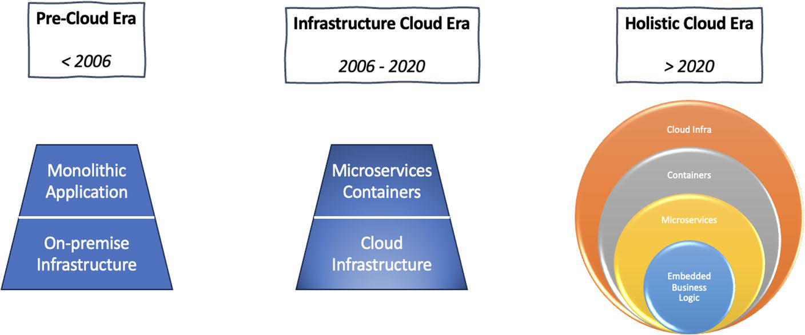
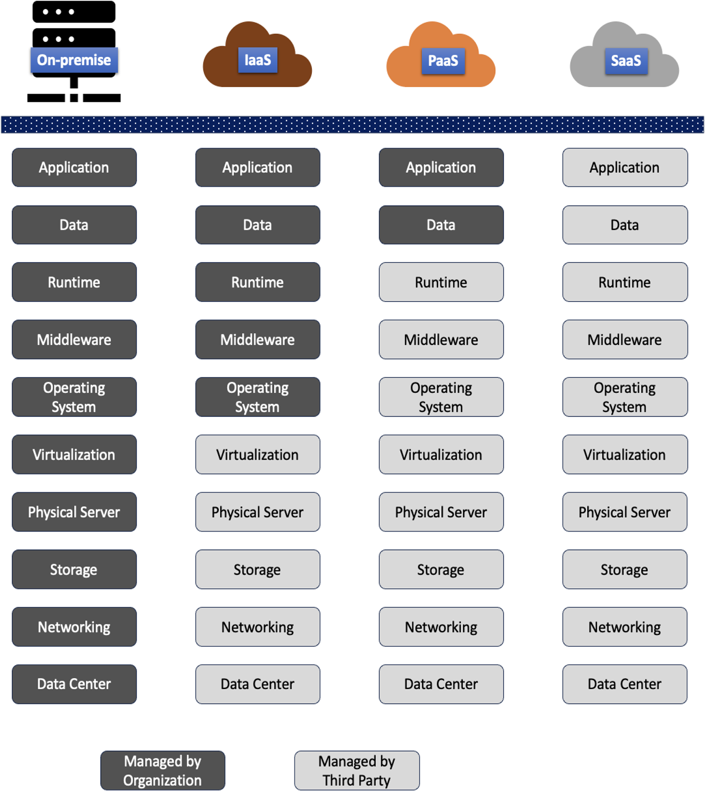
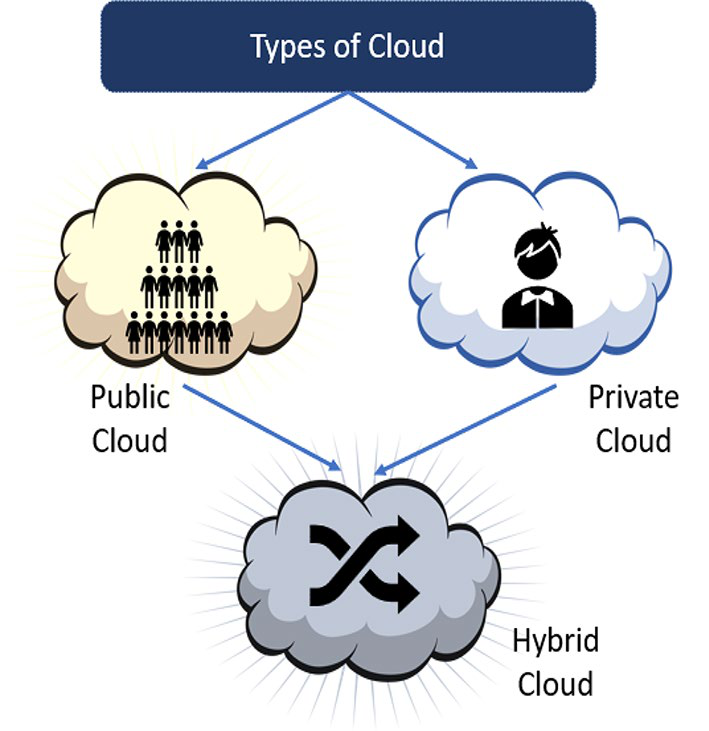
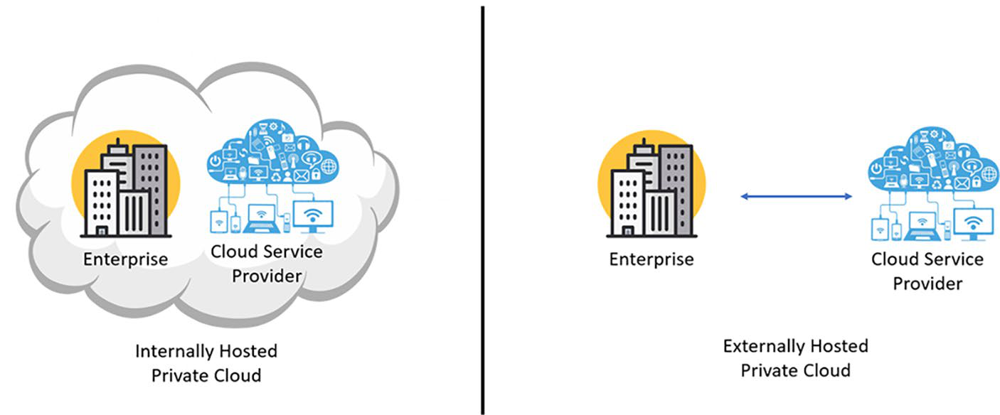
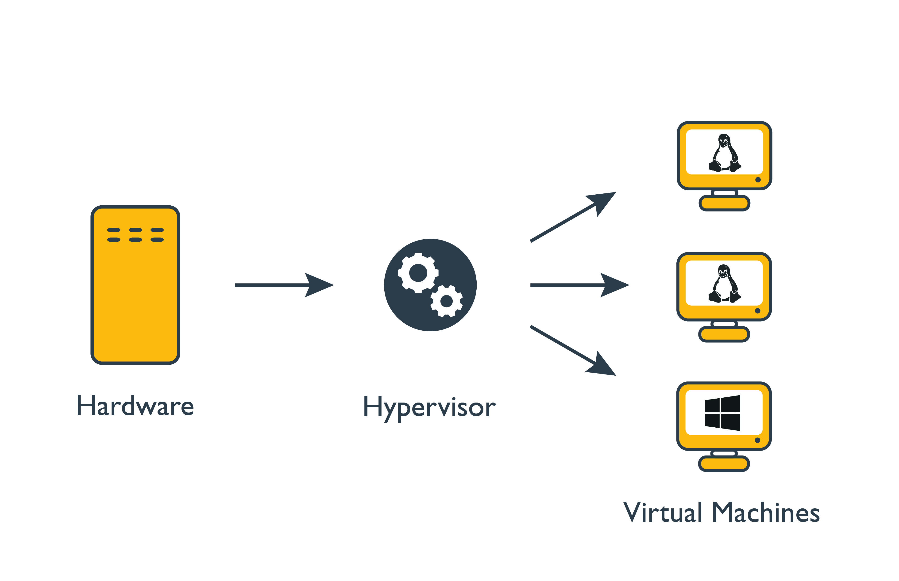

# Cloud Computing Core Mechanisms

## Overview

Cloud computing là mô hình cung cấp compute, storage, network, platform và application dưới dạng tài nguyên dùng chung, có thể cấp phát theo nhu cầu, đo lường được và vận hành qua network. Khi học cloud, nên tách rõ hai lớp:

- **Cloud capability**: self-service, elasticity, resource pooling, measured service, broad network access.
- **Cloud implementation**: virtualization, software-defined network, distributed storage, automation, IAM, monitoring, billing và API-driven control plane.

Note này chỉ giữ phần kiến thức chung có thể dùng cho nhiều platform. Những phần khóa chặt vào Huawei Cloud, FusionCompute, FusionAccess, GaussDB hoặc tên dịch vụ vendor-specific không được đưa vào đây.

## Cloud Evolution Mental Model

Cloud không chỉ là "thuê server ở nơi khác". Mental model tốt hơn là một chuỗi tiến hóa từ hạ tầng vật lý sang platform có API, automation, billing, policy và observability tích hợp.

Các mốc trong sơ đồ nên hiểu như một cách phân lớp tư duy, không phải ranh giới năm tuyệt đối:

- **Pre-cloud era**: tổ chức tự mua server, network, storage và vận hành datacenter. Application thường là monolith hoặc n-tier, capacity planning phải làm trước vì mua thêm phần cứng mất nhiều thời gian.
- **Infrastructure cloud era**: compute, storage và network được cấp phát qua API/console. Virtualization, hypervisor, software-defined network và distributed storage giúp nhiều tenant dùng chung physical capacity nhưng vẫn có logical isolation.
- **Holistic cloud era**: cloud trở thành operating model cho sản phẩm: managed service, serverless, data/AI platform, security baseline, FinOps, CI/CD và observability được thiết kế cùng application lifecycle.

Điểm chuyển đổi quan trọng là từ "quản lý máy" sang "quản lý resource abstraction". Người dùng yêu cầu VM, bucket, database, load balancer hoặc queue; provider/platform chịu trách nhiệm map object logic đó xuống host, storage, network fabric và control plane phía sau.

## On-Prem, Remote Hosting Và Cloud

Ba mô hình này dễ bị trộn lẫn nếu chỉ nhìn từ góc "server nằm ở đâu":

| Mô hình | Cách hiểu | Rủi ro vận hành chính |
| --- | --- | --- |
| On-prem datacenter | Tổ chức tự sở hữu hoặc trực tiếp vận hành phòng máy, server, network, storage, power/cooling và physical security | capacity planning chậm, chi phí đầu tư trước lớn, cần đội vận hành hạ tầng đầy đủ |
| Remote hosting / colocation | Server hoặc capacity được đặt/vận hành ở cơ sở của bên thứ ba, thường vẫn có ranh giới phần cứng tương đối rõ | phụ thuộc mạng WAN, hợp đồng vận hành, quy trình remote hands và lead time cấp phát |
| Cloud | Resource được cấp phát qua API/control plane từ pool dùng chung, đo usage và có automation lifecycle | IAM/API misconfiguration, cost drift, data residency, vendor lock-in, quota và dependency vào managed service |

Cloud khác remote hosting ở operating model: resource có lifecycle qua API, đo usage, tự động scale/cleanup được và thường không gắn cố định với một máy vật lý cụ thể. Khi migration từ on-prem lên cloud, không nên chỉ so sánh chi phí server. Cần tính cả network egress, observability, backup/DR, IAM, vận hành security, kỹ năng đội ngũ, quota, support và kế hoạch thoát khỏi service nếu provider không còn phù hợp.

## Application Architecture Evolution

Sự tiến hóa của application architecture thường đi cùng cloud adoption:

| Kiểu kiến trúc | Đặc điểm | Rủi ro khi lên cloud |
| --- | --- | --- |
| Monolith | Một codebase/deploy unit lớn, state và business logic thường dính chặt | Scale toàn bộ app dù bottleneck chỉ nằm ở một module; deploy/rollback có blast radius lớn |
| N-tier | Tách presentation, business logic và data layer | Dễ đặt lên VM/LB hơn, nhưng vẫn có thể phụ thuộc session, shared filesystem hoặc database đơn điểm |
| SOA | Service boundary rõ hơn, giao tiếp qua contract/service interface | Governance và versioning service contract phải chặt, nếu không dễ thành distributed monolith |
| Microservices | Service nhỏ theo business capability, deploy độc lập, scale riêng | Tăng độ phức tạp vận hành: network, tracing, CI/CD, schema migration, security policy và incident triage |

Cloud không tự biến monolith thành microservices. Production migration nên bắt đầu bằng việc tách state khỏi compute, chuẩn hóa config/secrets, đưa log/metric/trace ra ngoài instance, rồi mới quyết định phần nào cần refactor thành service độc lập.

## Service Models

| Model | Người dùng quản lý | Provider/platform quản lý | Ghi chú vận hành |
| --- | --- | --- | --- |
| IaaS | OS, middleware, runtime, application, data | physical host, hypervisor, storage, network fabric | linh hoạt nhất, nhưng người dùng chịu trách nhiệm vận hành OS và security nhiều hơn |
| PaaS | application và data | runtime, middleware, scaling, platform operation | giảm gánh nặng vận hành nhưng tăng phụ thuộc platform |
| SaaS | cấu hình nghiệp vụ và data đầu vào | gần như toàn bộ stack | nhanh dùng, ít kiểm soát kỹ thuật |
| DaaS / managed data service | schema, query, access policy, dữ liệu và lifecycle ứng dụng | database engine, patching, backup primitive, replication primitive tùy service | giảm tải vận hành database nhưng cần kiểm soát lock-in, backup restore test, data residency và export path |
| FaaS/serverless | function code, event contract, data | runtime, scaling, execution environment | tốt cho event-driven workload, cần chú ý cold start, timeout và observability |

Mức abstraction càng cao thì người dùng càng ít vận hành hạ tầng, nhưng cũng ít kiểm soát hơn:

- **IaaS** phù hợp khi cần lift-and-shift, kiểm soát OS/network/runtime nhiều, hoặc workload có yêu cầu đặc thù. Người dùng vẫn chịu trách nhiệm patch OS, hardening, agent, application, data, backup và nhiều phần observability.
- **PaaS** phù hợp khi muốn tập trung vào code, release và business logic. Provider/platform quản lý runtime, middleware, scaling và nhiều phần vận hành nền. Rủi ro chính là platform lock-in, giới hạn runtime, dữ liệu nằm ngoài boundary nội bộ và khó debug tầng dưới.
- **SaaS** phù hợp khi cần dùng ngay một business capability. Người dùng ít vận hành kỹ thuật hơn, nhưng vẫn chịu trách nhiệm access policy, identity hygiene, data lifecycle, retention, export/migration và cấu hình bảo mật ở tầng tenant.

Không nên chọn service model chỉ vì "managed hơn". Câu hỏi đúng là tổ chức cần kiểm soát tầng nào, có đủ năng lực vận hành tầng đó không, dữ liệu/rủi ro nằm ở đâu, và exit plan ra sao nếu service không còn phù hợp.

## Shared Responsibility Model

Shared responsibility model tách **security of the cloud** và **security in the cloud**:

- Provider/platform chịu trách nhiệm cho facility, hardware, physical security, phần managed foundation, và các control mà service contract giao cho provider.
- User/organization chịu trách nhiệm cho content, identity, access policy, configuration, application behavior, data classification, compliance process và phần stack còn lại theo service model.
- Ranh giới trách nhiệm thay đổi theo từng service. Một VM, managed database, object storage bucket và SaaS application không có cùng boundary.

Checklist production khi dùng shared responsibility:

1. Với mỗi service đang dùng, ghi rõ tầng nào thuộc provider, tầng nào thuộc team vận hành/application/security.
2. Mapping trách nhiệm vào control thật: IAM policy, network exposure, encryption, logging, backup, vulnerability management, data retention và incident response.
3. Đặt alert cho phần thuộc trách nhiệm của tổ chức: credential leak, public exposure, policy drift, backup failure, quota/cost anomaly, disabled logging.
4. Review lại khi bật service mới, đổi tier, chuyển từ IaaS sang PaaS/SaaS, hoặc khi provider thay đổi service behavior.

## Deployment Models

| Model | Ý nghĩa | Khi phù hợp |
| --- | --- | --- |
| Public cloud | hạ tầng do provider vận hành, multi-tenant | thử nghiệm nhanh, scale linh hoạt, workload biến động |
| Private cloud | hạ tầng dành riêng cho một tổ chức | compliance, data locality, workload ổn định, tối ưu chi phí dài hạn |
| Hybrid cloud | kết hợp public và private/on-prem | migration theo giai đoạn, DR, bursting, phân tách workload theo rủi ro |
| Community cloud | chia sẻ giữa các tổ chức có yêu cầu chung | ngành có compliance hoặc governance giống nhau |
| Edge cloud | đưa compute/storage/network gần nguồn dữ liệu hoặc người dùng | latency thấp, offline tolerance, data locality |

Khi chọn deployment model, cần tách rõ ownership, tenancy và operating responsibility:

- **Public cloud** tối ưu cho tốc độ, service breadth và elasticity. Rủi ro thường nằm ở IAM, public exposure, egress cost, data residency và phụ thuộc provider.
- **Internally hosted private cloud** cho tổ chức kiểm soát nhiều nhất về hardware, network, storage và policy, nhưng cần năng lực vận hành platform, capacity planning, upgrade, backup và incident response.
- **Hosted private cloud** có thể dùng dedicated physical capacity hoặc dedicated environment do bên thứ ba vận hành. Nó giảm gánh nặng vận hành một phần, nhưng không tự động có cost/elasticity giống public cloud.
- **Hybrid cloud** hữu ích khi cần giữ state, legacy system hoặc regulated data ở on-prem/private cloud, đồng thời dùng public cloud cho frontend, analytics, DR hoặc burst capacity.

Production hybrid cloud không chỉ là nối hai môi trường lại với nhau. Cần CMDB/inventory rõ, identity federation, network connectivity ổn định, routing/DNS nhất quán, observability xuyên môi trường, change control và runbook failover/failback.

## Infrastructure Mechanisms

### Logical Network Boundary

Logical network boundary là ranh giới cô lập tài nguyên cloud bằng subnet, VPC/project network, security group, firewall, route table, VRF hoặc overlay segment. Mục tiêu là tách tenant, workload, trust zone và failure domain.

Khi thiết kế boundary, cần hỏi:

- Workload nào được phép nói chuyện với nhau?
- Traffic đi north-south hay east-west?
- Policy enforce ở host, virtual switch, network appliance hay cloud control plane?
- Log/audit nằm ở đâu khi rule bị thay đổi?

### Virtual Server

Virtual server trừu tượng hóa CPU, memory, disk và NIC từ host vật lý. VM lifecycle thường gồm create, boot, stop, resize, snapshot, migrate và delete.

Các câu hỏi vận hành quan trọng:

- VM dùng ephemeral disk hay persistent volume?
- CPU/memory có overcommit không?
- Host failure có tự động evacuate hoặc restart VM không?
- Image, metadata, cloud-init và network config có nhất quán không?

### Cloud Storage Device

Cloud storage thường được chia thành:

- **Block storage**: gắn volume cho VM hoặc workload cần filesystem/database.
- **Object storage**: lưu object qua API, phù hợp backup, artifact, static content, data lake.
- **File storage**: chia sẻ filesystem qua network, phù hợp shared workspace hoặc legacy app.

Các thuộc tính cần so sánh là latency, throughput, IOPS, durability, availability, snapshot, replication, consistency và cost model.

### Usage Monitoring And Metering

Cloud platform cần đo usage để phục vụ billing, quota, capacity planning và anomaly detection. Metric phổ biến gồm CPU, memory, disk, IOPS, network throughput, API request, storage capacity và error rate.

Metering không thay thế observability. Metering trả lời "ai dùng bao nhiêu"; observability trả lời "hệ thống đang khỏe hay lỗi ở đâu".

### Resource Replication

Replication giúp tăng durability hoặc availability, nhưng có tradeoff về cost, latency và consistency.

- Synchronous replication: RPO thấp hơn, latency cao hơn, phụ thuộc network ổn định.
- Asynchronous replication: scale và latency tốt hơn, có thể mất dữ liệu gần thời điểm failover.
- Multi-zone replication: chống lỗi zone.
- Cross-region replication: phục vụ DR, nhưng cần kiểm soát data sovereignty và recovery runbook.

## Management Mechanisms

Cloud management plane thường gồm:

- **Remote management**: API, console, CLI, SDK, automation.
- **Resource management**: inventory, lifecycle, quota, placement, scheduling.
- **SLA/SLO management**: availability target, error budget, incident reporting.
- **Billing/chargeback**: usage metering, tagging, budget, cost allocation.
- **Policy management**: IAM, quota, network policy, image policy, compliance rule.

Control plane phải được bảo vệ như production workload: cần HA, backup config/state, audit log, least privilege và break-glass access.

## Security Mechanisms

Các cơ chế bảo mật chung trong cloud:

- **IAM**: authentication, authorization, role, policy, least privilege.
- **Encryption in transit**: TLS, certificate lifecycle, mTLS khi cần.
- **Encryption at rest**: disk/object/database encryption, key rotation, KMS/HSM nếu có.
- **Hashing and digital signature**: integrity check, artifact verification, signed image.
- **Security group/firewall**: micro-segmentation và stateful traffic control.
- **Hardened image/server**: baseline OS, patching, disabled unused services, logging.
- **Audit log**: ghi lại API action, privilege change, network/security change.

Điểm dễ sai là chỉ cấu hình security ở một lớp. Trong cloud, security thường là nhiều lớp chồng lên nhau: identity, API, network, host, workload, data và operation process.

## Architecture Patterns

| Pattern | Mục tiêu | Cẩn thận |
| --- | --- | --- |
| Load distribution | chia traffic hoặc workload | health check sai có thể đưa traffic vào node lỗi |
| Resource pooling | dùng chung capacity | noisy neighbor và quota cần rõ |
| Dynamic scalability | scale theo nhu cầu | metric trigger phải phản ánh bottleneck thật |
| Elastic capacity | cấp phát/thu hồi nhanh | cần automation và cleanup tránh orphan resource |
| Service load balancing | tăng availability và phân phối request | session/stateful app cần thiết kế riêng |
| Cloud bursting | đẩy workload sang môi trường khác khi quá tải | network, data sync, IAM và cost có thể phức tạp |
| Thin provisioning | cấp phát logic lớn hơn physical capacity hiện có | phải monitor capacity thật và alert sớm |
| Redundant storage | tăng durability/availability | replication không thay thế backup |

## Adoption And Provider Selection Guardrails

Các lý do phổ biến để dùng cloud là cấp phát nhanh, scale linh hoạt, giảm upfront cost, tận dụng managed service, tăng collaboration và có thêm lựa chọn backup/DR. Tuy nhiên, từng lợi ích đều cần guardrail production:

- **Cost**: pay-as-you-go không đồng nghĩa rẻ. Cần tagging, budget alert, quota, rightsizing, lifecycle policy và review data transfer.
- **Scalability**: scale out phải dựa trên metric gần bottleneck thật như latency, request rate, queue depth, error rate hoặc resource saturation; CPU một mình thường không đủ.
- **Security**: provider bảo vệ phần hạ tầng nền, còn user vẫn chịu trách nhiệm IAM, data classification, network exposure, secrets, patching theo shared responsibility model.
- **Backup/DR**: replication và multi-zone không thay thế backup. Cần định nghĩa RPO/RTO, test restore, quyền truy cập backup và runbook failover/failback.
- **Collaboration**: console/API giúp team làm nhanh hơn nhưng cũng tăng rủi ro drift. Production nên dùng IaC, change review, audit log và break-glass process.

Khi chọn cloud provider, tránh dựa vào market share hoặc số region ở một thời điểm. Quyết định bền hơn nên dựa trên:

- service fit với workload thật;
- region/AZ đáp ứng latency, data residency và compliance;
- network path, private connectivity và egress cost;
- IAM/governance model phù hợp tổ chức;
- khả năng quan sát, support, automation và exit plan;
- mức lock-in chấp nhận được cho managed service quan trọng.

## Related Pages

- [Cloud Fundamentals Overview](./overview.md)
- [Regions, zones, pricing](./Regions,%20zones,%20pricing.md)
- [IAM roles, policies, least privilege](./IAM%20roles,%20policies,%20least%20privilege.md)
- [Compute Platforms](../../03-compute-and-orchestration/01-compute-platforms/overview.md)
- [Core Storage](../../02-core-infrastructure/03-storage-and-distributed-systems/overview.md)
