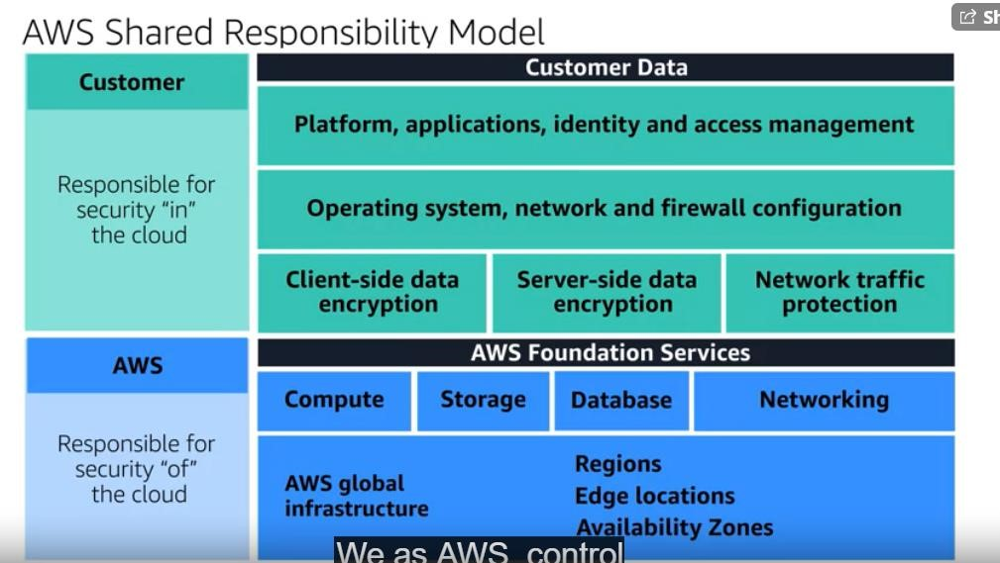
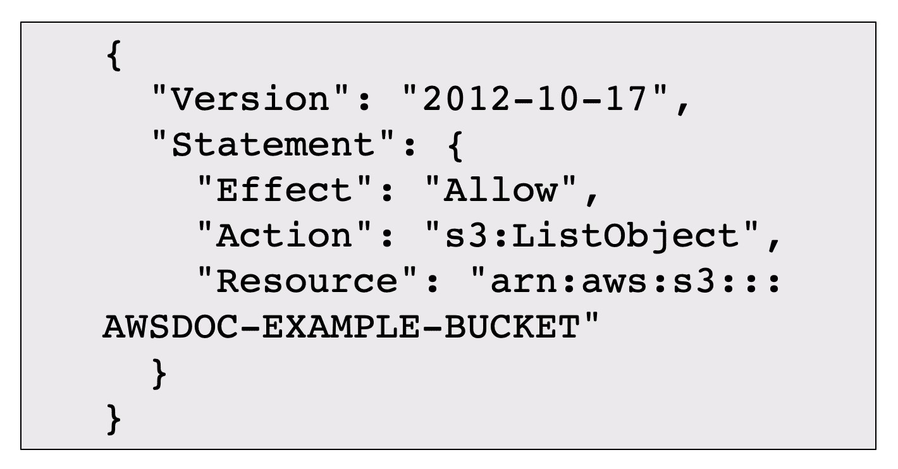
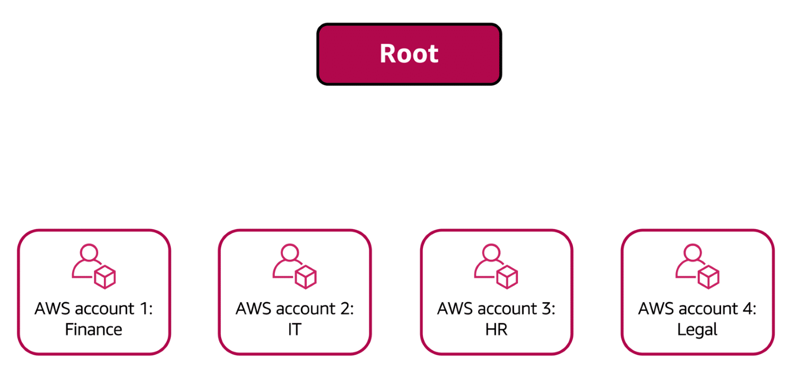
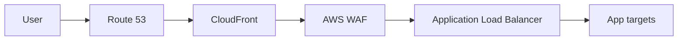
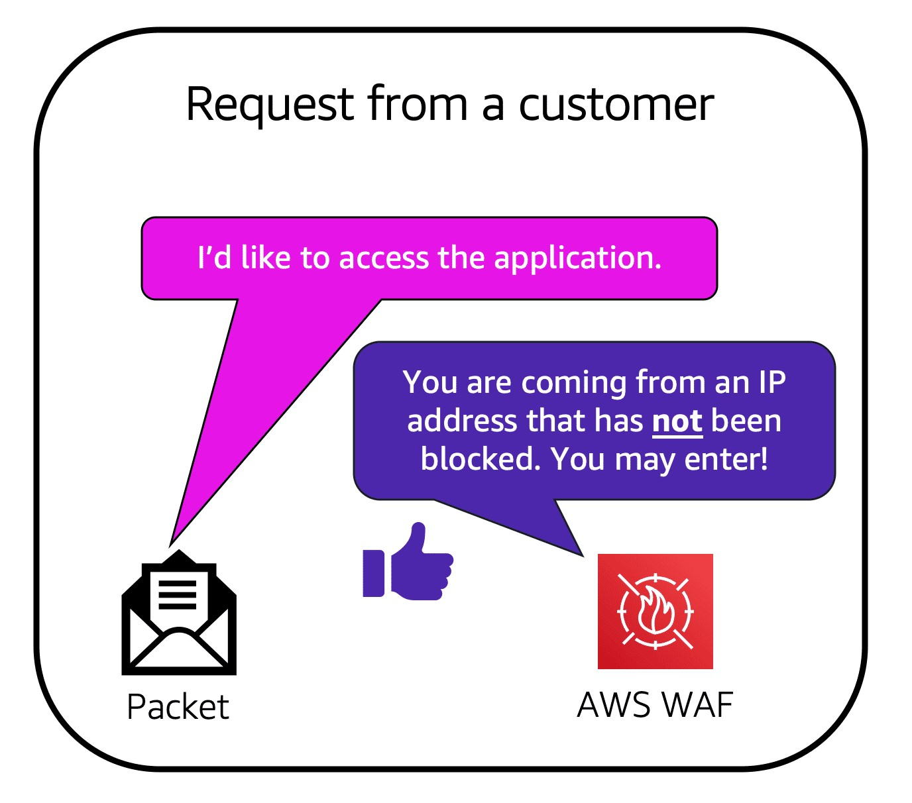
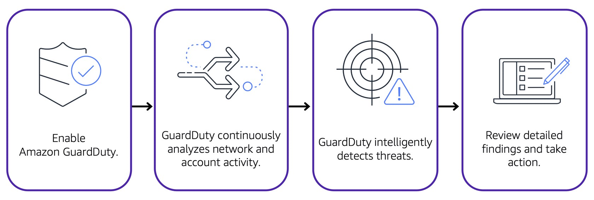

# AWS Shared Responsibility, Compliance And Threat Protection

Note này chuyển hóa `_inbox/Aws-6.docx`, tập trung vào shared responsibility, IAM, Organizations, compliance, DDoS protection và các dịch vụ security nền tảng.

## Shared Responsibility Model

AWS chịu trách nhiệm **security of the cloud**: hạ tầng vật lý, facility, hardware, hypervisor, managed service foundation và global infrastructure.

Khách hàng chịu trách nhiệm **security in the cloud**: identity, data, network exposure, workload configuration, encryption, patching tùy loại service và application logic.

Mức trách nhiệm của khách hàng thay đổi theo service model:

| Service type | Khách hàng quản nhiều hơn | AWS quản nhiều hơn |
|---|---|---|
| EC2/IaaS | OS patching, firewall, agent, app, data | physical host, virtualization layer |
| RDS/managed database | schema, data, IAM, network, parameter config | database engine patching/HA tùy option |
| S3/serverless | bucket policy, IAM, data classification, encryption, lifecycle | infrastructure/runtime platform |

Điểm dễ sai: “managed service” không có nghĩa là khỏi cấu hình bảo mật.



## IAM Access Model

Các thực thể chính:

| Thành phần | Vai trò |
|---|---|
| Root user | toàn quyền account, chỉ dùng cho tác vụ account-level hiếm |
| IAM user | identity dài hạn, nên hạn chế cho người dùng thật |
| IAM group | gom user và gán policy |
| IAM role | identity có thể assume tạm thời, phù hợp cho workload/cross-account |
| IAM policy | JSON định nghĩa allow/deny trên action/resource/condition |
| MFA | lớp xác thực bổ sung cho root/user/role assume flow tùy cấu hình |

Best practice:

- Bật MFA cho root user.
- Không dùng root cho tác vụ hằng ngày.
- Ưu tiên IAM Identity Center hoặc federation thay vì tạo nhiều IAM user dài hạn.
- Dùng IAM role cho EC2, Lambda, CI/CD và cross-account access.
- Policy nên least privilege, có condition khi phù hợp.
- Xoay access key và loại bỏ key không dùng.

Policy skeleton:

```json
{
  "Version": "2012-10-17",
  "Statement": [
    {
      "Effect": "Allow",
      "Action": ["s3:GetObject"],
      "Resource": ["arn:aws:s3:::example-bucket/*"]
    }
  ]
}
```



## AWS Organizations

AWS Organizations giúp quản lý nhiều account dưới một management account.

Khái niệm:

- Organization: toàn bộ tập account.
- Organizational Unit: nhóm account theo environment/team/business unit.
- Service Control Policy: guardrail ở cấp account/OU, không tự cấp quyền mà chỉ giới hạn quyền tối đa.
- Consolidated billing: gom billing nhiều account.

Pattern cơ bản:

```text
Organization
├── Security OU
├── Infrastructure OU
├── Workloads-Prod OU
└── Workloads-NonProd OU
```

Best practice:

- Tách account theo môi trường và blast radius.
- Dùng SCP để chặn hành vi nguy hiểm như disable CloudTrail hoặc tạo resource ngoài Region cho phép.
- Không chạy workload trong management account.
- Centralize logging/security account nếu có nhiều workload.



## Compliance And Audit

AWS Artifact cung cấp tài liệu compliance, reports và agreements. Nó không tự làm hệ thống compliant; nó là nguồn bằng chứng và tài liệu để hỗ trợ audit.

Checklist compliance:

- Xác định data classification.
- Bật CloudTrail ở account/organization level.
- Dùng AWS Config hoặc policy-as-code để kiểm tra drift.
- Bật encryption at rest/in transit cho service chứa dữ liệu nhạy cảm.
- Ghi rõ owner cho account, workload, data và exception.
- Lưu evidence theo change/audit process.

## DDoS Và Edge Protection

Các lớp bảo vệ:

| Dịch vụ | Vai trò |
|---|---|
| AWS Shield Standard | bảo vệ DDoS cơ bản, tự động cho nhiều service |
| AWS Shield Advanced | bảo vệ nâng cao, hỗ trợ response và cost protection theo điều kiện dịch vụ |
| AWS WAF | rule HTTP layer 7, chặn pattern request xấu |
| CloudFront | edge distribution, giảm tải origin và hấp thụ traffic gần edge |
| Route 53 | DNS có khả năng chịu tải cao |

Layering phổ biến cho web public:





## Security Services

| Service | Dùng để |
|---|---|
| KMS | quản lý encryption key và key policy |
| AWS WAF | bảo vệ HTTP/S application |
| Amazon Inspector | quét vulnerability cho workload được hỗ trợ |
| GuardDuty | threat detection từ logs/signals như CloudTrail, VPC Flow Logs, DNS logs tùy cấu hình |
| CloudTrail | audit API activity |
| AWS Config | kiểm tra configuration/compliance |
| Secrets Manager / SSM Parameter Store | quản lý secret/config thay vì hard-code |



## Operating Checklist

1. Root user có MFA và không dùng hằng ngày.
2. Mọi workload dùng IAM role thay vì static key.
3. CloudTrail bật toàn organization/account quan trọng.
4. S3 bucket public được kiểm soát bằng Block Public Access và review exception.
5. Security Group không mở rộng hơn nhu cầu.
6. KMS key policy được review, tránh khóa nhầm hoặc mở quá rộng.
7. SCP guardrail không phá workload production trước khi test ở OU nhỏ.
8. Incident path rõ: GuardDuty/CloudTrail/Config finding đi về đâu, ai xử lý.

## Source Coverage

`Aws-6.docx` co cac muc: shared responsibility, customer/AWS responsibility, IAM/root/user/policy/group/role/MFA, Organizations/OU, Artifact reports/agreements, Customer Compliance Center, DDoS, Shield Standard/Advanced, KMS, WAF, Inspector va GuardDuty. Tat ca cac muc nay da duoc gom vao note nay; cac vi du cu the trong source duoc dien dat lai va khong copy nguyen van.

Chi tiet bo sung:

- Root user nen duoc bao ve bang MFA va chi dung cho tac vu account/root-level.
- IAM user phu hop voi mot so use case legacy hoac human access cu the, nhung can tranh long-lived key neu co federation/role thay the.
- IAM group khong phai identity dang nhap; no la cach gom policy cho user.
- IAM role khong gan mat khau co dinh; role duoc assume de lay temporary credentials.
- IAM policy nen duoc doc theo 4 cau hoi: ai duoc lam gi, tren resource nao, trong dieu kien nao, va co explicit deny nao khong.
- AWS Artifact Reports la noi lay report compliance/audit; AWS Artifact Agreements la noi review/chap nhan agreement lien quan compliance.
- Shield Standard la lop DDoS co ban; Shield Advanced phu hop workload can support/visibility/protection nang cao hon.
- WAF tap trung HTTP layer 7, khong thay the Shield cho DDoS tong quat.
- Inspector tao vulnerability visibility; GuardDuty tao threat detection; ca hai deu can owner va runbook xu ly finding.

## Related Pages

- [IAM, Accounts, Organizations And Policy](./01-iam-accounts-organizations-policy.md)
- [Account, IAM, Security Groups And VPC Security](./02-account-iam-security-groups-and-vpc-security.md)
- [AWS Interview Service Map](../00-fundamentals/03-aws-interview-service-map.md)
- [CloudWatch, Alarms, Logs And Budgets](../08-observability-operations-cost/01-cloudwatch-alarms-logs-and-budgets.md)
