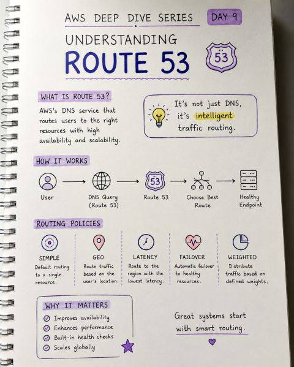

# Route 53, CloudFront And Global Traffic

## Overview

Route 53 là DNS service và traffic routing service. CloudFront là CDN/edge distribution service. Hai dịch vụ này thường đứng ở lớp trước workload để giảm latency, tăng availability và điều hướng user đến endpoint phù hợp.

## Route 53

Route 53 quản lý hosted zone, DNS record và routing policy. Các policy hay gặp:

| Policy | Khi dùng |
|---|---|
| Simple | Một record đơn giản |
| Weighted | Chia traffic theo tỷ lệ |
| Latency-based | Đưa user tới Region có latency thấp |
| Failover | Primary/secondary với health check |
| Geolocation/geoproximity | Điều hướng theo vị trí user hoặc bias địa lý |

Trong scenario SAA, nếu yêu cầu failover giữa nhiều Region, Route 53 health check + failover routing là pattern nền tảng.

## CloudFront

CloudFront cache nội dung tại edge location và có thể dùng nhiều origin:

- S3 bucket cho static content.
- ALB/NLB/custom origin cho dynamic content.
- API Gateway hoặc serverless API tùy kiến trúc.

Pattern thường gặp:

- Static website quy mô lớn: S3 + CloudFront.
- Static + dynamic cùng domain: CloudFront nhiều origin, S3 cho static, ALB/API Gateway cho dynamic.
- Global low latency: CloudFront trước origin regional.
- Bảo vệ HTTP(S): CloudFront + AWS WAF khi cần lọc request ở edge.

## Route 53 vs CloudFront

| Nhu cầu | Dùng |
|---|---|
| DNS name, hosted zone, routing theo health/latency/geo | Route 53 |
| Cache nội dung, TLS edge, giảm latency download | CloudFront |
| Failover multi-region ở DNS layer | Route 53 |
| Static/dynamic content distribution | CloudFront |

## Related Pages

- [VPC, Subnets, Routing And Endpoints](./01-vpc-subnets-routing-endpoints.md)
- [S3 Object Storage Patterns](../05-storage-data-databases/01-s3-object-storage-patterns.md)
