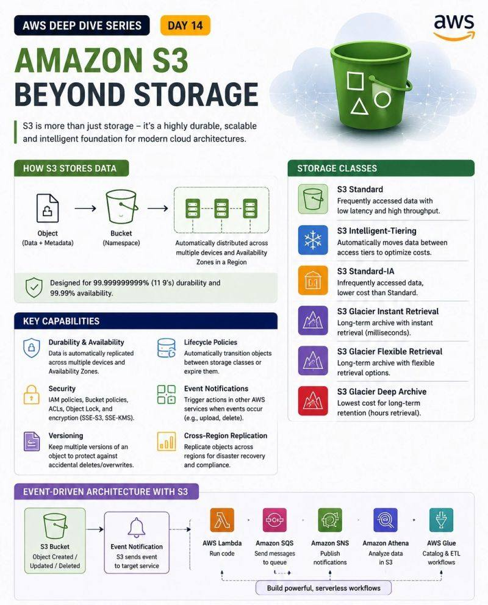

# S3 Object Storage Patterns

## Overview



Amazon S3 là object storage regional, thường dùng cho backup, static content, data lake, log storage, upload pipeline và integration với nhiều AWS service. S3 không phải block storage hoặc filesystem truyền thống; app truy cập object qua API/HTTP.

## Core Concepts

| Concept | Ý nghĩa |
|---|---|
| Bucket | Namespace chứa object, tên bucket cần unique theo phạm vi AWS |
| Object | Data + metadata |
| Key/prefix | Tên object; prefix thường được UI hiển thị như folder |
| Versioning | Giữ nhiều version của object |
| Lifecycle | Chuyển storage class hoặc expire object theo rule |
| Event notification | Gửi event object create/delete/update sang Lambda/SQS/SNS/EventBridge |

Object storage nên được hiểu như map:

```text
bucket + key + optional version-id -> object data + metadata
```

S3 key không phải đường dẫn filesystem thật. Dấu `/` trong key chỉ giúp tổ chức prefix và làm UI trông giống folder. Ứng dụng không nên phụ thuộc vào POSIX semantics như rename atomic theo directory, file lock, append-in-place hoặc partial write giống block/file storage.

Bucket name, Region và ownership là quyết định nền tảng:

- Bucket name phải phù hợp namespace và khó đổi sau khi đã tích hợp với app/DNS/policy.
- Bucket nằm trong một Region; dữ liệu không tự rời Region trừ khi bật replication hoặc copy sang Region khác.
- Mặc định bucket/object private; public access phải là quyết định có chủ đích, có review và có guardrail.

## Storage Class Thinking

Không chọn storage class chỉ vì "rẻ". Cần nhìn access pattern, retrieval time, retrieval cost và yêu cầu resilience.

| Pattern | Gợi ý |
|---|---|
| Truy cập thường xuyên | S3 Standard |
| Access pattern không đoán trước | Intelligent-Tiering |
| Ít truy cập, vẫn cần multi-AZ | Standard-IA |
| Dữ liệu có thể mất nếu AZ lỗi hoặc có bản copy khác | One Zone-IA |
| Archive dài hạn | Glacier class phù hợp với RTO truy xuất |

Lifecycle rule phù hợp để tự động transition hoặc expire object theo tuổi/prefix/tag. Với archive class, phải tính trước RTO/RPO, retrieval fee, minimum storage duration và quy trình restore. Đừng đưa object vào archive chỉ vì ít dùng nếu incident/runbook yêu cầu restore trong vài phút.

Versioning hữu ích cho backup và chống overwrite/delete nhầm, nhưng nó làm dung lượng tăng vì version cũ vẫn được giữ. Khi bật versioning, cleanup phải xử lý cả noncurrent versions và delete markers; lệnh xóa bucket kiểu "force" trong lab có thể không đủ hoặc có thể xóa ngoài ý muốn nếu dùng sai bucket.

Guardrail trước thao tác xóa/lifecycle production:

1. Xác nhận đúng account, Region, bucket và prefix.
2. Kiểm tra versioning, replication, Object Lock và lifecycle rule hiện có.
3. Chạy list/inventory read-only trước khi delete/expire hàng loạt.
4. Với dữ liệu quan trọng, xác nhận backup/replica và restore test.
5. Dùng staged rollout theo prefix/tag thay vì áp dụng rule toàn bucket ngay lập tức.

## Common Scenario Patterns

| Requirement | Pattern |
|---|---|
| Upload toàn cầu nhanh vào một bucket | S3 Transfer Acceleration + multipart upload |
| Query JSON/log trong S3 on-demand | Athena trực tiếp trên S3, Glue catalog nếu cần schema/catalog |
| Static website scale lớn | S3 + CloudFront |
| Object không được sửa/xóa theo compliance | Versioning + Object Lock/legal hold tùy yêu cầu |
| Chỉ account trong AWS Organization truy cập bucket | Bucket policy với `aws:PrincipalOrgID` |
| EC2 private subnet đọc S3 không qua internet | S3 gateway endpoint + route table + bucket policy nếu cần |
| Data lake visualization | S3/RDS -> QuickSight dataset/dashboard |

## Application Integration

S3 giúp tách state khỏi compute. Thay vì lưu file upload trên local disk của EC2/container, app ghi object vào S3 và lưu metadata cần truy vấn vào database nếu cần. Pattern này giúp instance replaceable hơn và scale ngang dễ hơn.

Workflow phổ biến:

```text
client/app
-> request upload/download permission
-> S3 PUT/GET object
-> metadata/index in database
-> event notification for async processing
```

Production guardrails:

- Không hard-code access key trong app; dùng IAM role, task role, Lambda role hoặc federation.
- Không dùng `public-read` như default upload pattern. Ưu tiên private object + presigned URL, CloudFront signed URL/cookie hoặc authenticated app endpoint.
- Validate object size, content type, extension, malware scan và quota trước/sau upload nếu dữ liệu đến từ user.
- Dùng bucket policy, Block Public Access, encryption, access logs/CloudTrail data events và retention phù hợp với phân loại dữ liệu.
- Với object lớn, dùng multipart upload và lifecycle cleanup cho incomplete multipart uploads.

## Backup And Restore With S3

S3 có thể là offsite backup target, nhưng backup chỉ có giá trị khi restore đã được kiểm thử. Một workflow tối thiểu:

1. Sync/copy dữ liệu lên bucket/prefix riêng cho backup.
2. Bật versioning nếu cần khôi phục overwrite/delete nhầm.
3. Bật lifecycle để chuyển bản cũ sang storage class rẻ hơn khi RTO cho phép.
4. Định kỳ restore mẫu sang vị trí khác và kiểm tra checksum/application-level validity.
5. Theo dõi dung lượng, số object, request cost và lifecycle/replication failure.

Không dùng bucket production làm nơi thử restore nếu có nguy cơ ghi đè key thật. Dùng prefix hoặc bucket restore riêng, quyền tối thiểu và tên rõ môi trường.

## Static Website And CDN

S3 có thể host static content như HTML/CSS/JS/image/video. Nó không chạy server-side code như PHP/JSP. Với website public thật, pattern thường bền hơn là:

```text
Route 53 / DNS
-> CloudFront + TLS/WAF/cache policy
-> private S3 origin
```

S3 static website endpoint hữu ích cho lab hoặc site đơn giản, nhưng production thường cần CloudFront để có TLS custom domain, edge cache, origin access control, WAF và header policy. Nếu dùng custom domain trực tiếp với S3 website endpoint, bucket name/DNS phải khớp đúng pattern và cần review public access rất kỹ.

## Consistency And Performance

Nội dung cũ về S3 eventual consistency cần được hiện đại hóa: S3 hiện cung cấp strong read-after-write consistency cho object PUT/overwrite/delete trong mọi Region. Dù vậy, ứng dụng vẫn cần xử lý retry/idempotency vì network timeout, throttling, client retry, event notification delay hoặc workflow downstream vẫn có thể làm hệ thống quan sát "chậm" hơn object store.

Performance hiện đại nên nghĩ theo prefix, parallelization và workload shape:

- Một prefix có thể scale đến mức request cao, nhưng tăng đột ngột vẫn có thể gặp `503 SlowDown` trong lúc S3 scale.
- Workload rất lớn nên phân tán object theo nhiều prefix có chủ đích và dùng parallel GET/PUT/multipart.
- Nếu dùng SSE-KMS, KMS quota/latency có thể trở thành bottleneck.
- CloudFront, Transfer Acceleration hoặc S3 Express One Zone là quyết định riêng theo latency, distance và cost model; không chọn theo thói quen.

Hash prefix vẫn có thể hữu ích khi cần phân tán workload hoặc tránh hot prefix theo pattern cũ, nhưng không nên áp dụng mù quáng vì nó làm khó partitioning theo business prefix, lifecycle, inventory và query.

## Anti-Patterns

- Mount S3 như local filesystem cho workload cần POSIX semantics.
- Lưu object nhỏ quá nhiều nhưng không nghĩ đến request/list pattern.
- Dùng một bucket per user khi quy mô user lớn; thường dùng prefix và policy thay vì bucket riêng.
- Mở public bucket để "test nhanh" rồi quên đóng.
- Dùng S3 làm database transactional hoặc queue chính cho workflow cần ordering/locking mạnh.
- Áp lifecycle/archive toàn bucket mà chưa có restore test và owner chấp nhận RTO.

## Related Pages

- [Route 53, CloudFront And Global Traffic](../02-networking-edge/02-route53-cloudfront-global-traffic.md)
- [IAM, Accounts, Organizations And Policy](../01-identity-security-governance/01-iam-accounts-organizations-policy.md)
- [SAA-C03 Scenario Patterns](../07-architecture-patterns/01-saa-c03-scenario-patterns.md)
