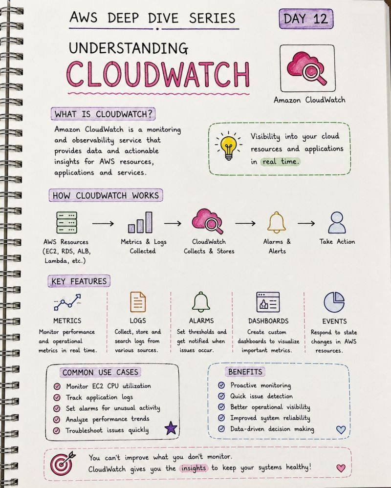

# CloudWatch, Config, CloudTrail And Cost

## Overview

Observability và governance trong AWS không nằm ở một service duy nhất. CloudWatch, CloudTrail, AWS Config và Cost tools giải quyết các câu hỏi khác nhau.

## Service Responsibilities

| Service | Trả lời câu hỏi |
|---|---|
| CloudWatch Metrics/Logs/Alarms | Workload đang chạy ra sao? Có vượt ngưỡng không? |
| CloudTrail | Ai gọi API gì, lúc nào, từ đâu? |
| AWS Config | Resource configuration có đổi không? Có compliant không? |
| Systems Manager | Có thể tự động sửa hoặc vận hành fleet không? |
| Cost Explorer | Chi phí tăng ở đâu, theo service/tag/account nào? |
| Cost Anomaly Detection | Có spending bất thường không? |

## Common Scenario Patterns

| Requirement | Pattern |
|---|---|
| Alert certificate ACM sắp hết hạn | EventBridge/CloudWatch event -> Lambda -> SNS |
| Detect S3 bucket config change trái phép | AWS Config rule |
| Audit infrastructure changes | CloudTrail + Config |
| Enforce EBS encryption compliance | Config detects -> Systems Manager automation remediates |
| EC2 cost tăng do instance type scale dọc | Cost Explorer filter/group by instance type |
| Snapshot cost tăng đều | Data Lifecycle Manager retention |
| Spending bất thường | Cost Anomaly Detection monitor |

## CloudWatch Notes

CloudWatch metrics mặc định không bao phủ mọi thứ. Ví dụ memory usage trên EC2 thường cần agent/custom metric. Khi thiết kế alarm, cần biết metric đến từ service nào, period/evaluation window ra sao và action là gì.

Một CloudWatch alarm không chỉ là "ngưỡng đỏ". Nó gồm:

- Metric/namespace/dimension cần theo dõi.
- Statistic, period và evaluation periods.
- Threshold/comparison operator.
- State: `OK`, `ALARM`, `INSUFFICIENT_DATA`.
- Action khi đổi state: notify, autoscaling action, EC2 action hoặc automation khác.

Khi alarm dùng để kích hoạt Auto Scaling, metric phải đại diện cho bottleneck thật của workload:

| Workload | Metric thường hợp lý | Cẩn trọng |
|---|---|---|
| Web/API stateless sau ALB | request rate per target, latency, HTTP 5xx, CPU nếu CPU-bound | CPU thấp không có nghĩa latency tốt; memory mặc định không có nếu chưa cài agent |
| Worker đọc SQS | queue depth, age of oldest message, backlog per worker | `ApproximateNumberOfMessagesVisible` là xấp xỉ; cần nhìn thêm age và error rate |
| Batch/compute | job duration, throughput, saturation custom metric | Scale out quá nhanh có thể làm downstream quá tải |

Scheduled scaling nên dùng cho peak có lịch rõ, ví dụ giờ làm việc hoặc chiến dịch marketing đã biết. Metric-based scaling nên dùng cho tải khó đoán. Với production, không chỉ đặt một high alarm để scale out; cần cả scale-in policy thận trọng, cooldown/warmup hợp lý, `max` capacity để chặn chi phí bất ngờ, và alert riêng nếu scaling chạm trần nhưng SLO vẫn xấu.

Với EC2, cần phân biệt:

| Metric / signal | Ý nghĩa |
|---|---|
| `StatusCheckFailed_System` | vấn đề ở host/AWS infrastructure bên dưới instance |
| `StatusCheckFailed_Instance` | vấn đề bên trong instance/OS/network config |
| App health check qua ALB/target group | app có trả lời đúng request không |

EC2 recovery action theo system status check chỉ phù hợp với một số failure mode hạ tầng và điều kiện instance nhất định. Nó không thay thế ASG multi-AZ, không sửa app crash logic, không bảo vệ instance store và không giải quyết AZ outage. Với workload production, alarm action nên đi kèm runbook: ai nhận alert, impact là gì, action tự động có thể gây gì, và validate recovery bằng signal nào.

## Cost Governance

Tagging strategy là nền tảng để phân bổ chi phí. Không có tag chuẩn, Cost Explorer và chargeback/showback sẽ khó dùng.

Tag tối thiểu nên cân nhắc:

- `Application`
- `Environment`
- `Owner`
- `CostCenter`
- `DataClassification`

Khi đánh giá một workload web cơ bản, hãy tách cost driver theo từng lớp thay vì chỉ nhìn tổng bill:

| Lớp | Cost driver thường gặp | Tín hiệu cần theo dõi |
|---|---|---|
| Load balancer / edge | thời gian chạy, request, data processed | traffic bất thường, HTTP 4xx/5xx, target unhealthy |
| Compute | instance hours, instance type, scaling count | CPU, memory custom metric, request latency, ASG capacity |
| Database | instance class, storage, backup/snapshot, I/O | connection, storage growth, replica lag, backup retention |
| Storage/static content | GB stored, request, data transfer | object growth, lifecycle transition, public exposure |

Trong lab, phải có cleanup checklist. Trong production, "xóa để hết phí" không phải rollback an toàn nếu resource chứa dữ liệu hoặc đang là dependency của service khác.

## Related Pages

- [IAM, Accounts, Organizations And Policy](../01-identity-security-governance/01-iam-accounts-organizations-policy.md)
- [SAA-C03 Scenario Patterns](../07-architecture-patterns/01-saa-c03-scenario-patterns.md)
