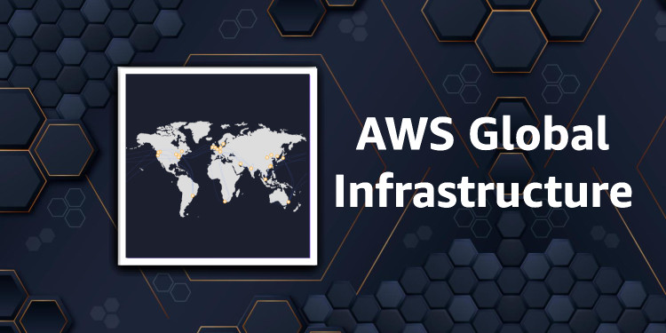
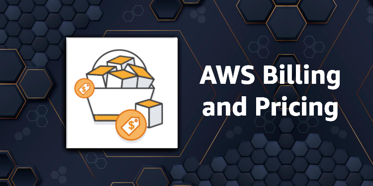
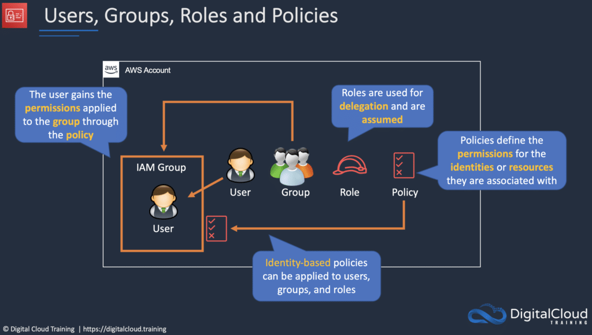
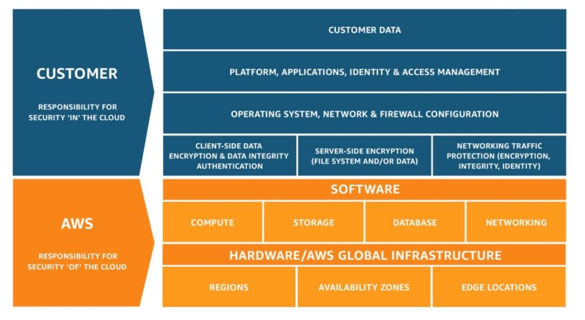
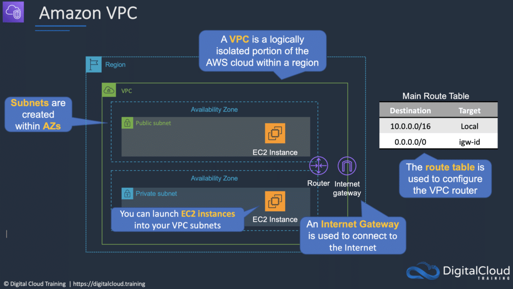
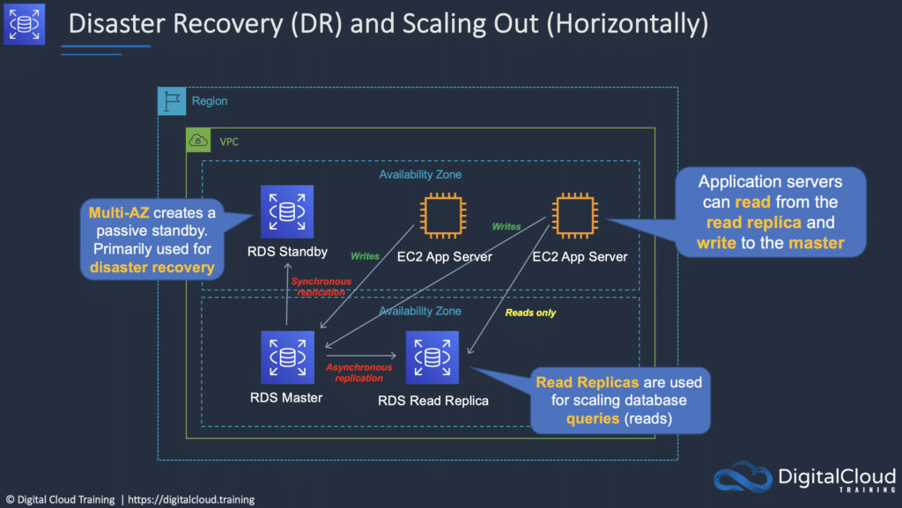
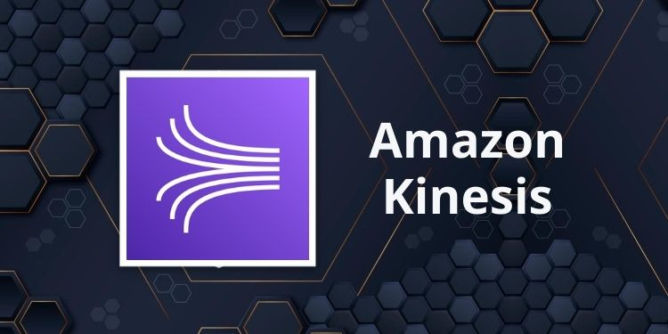
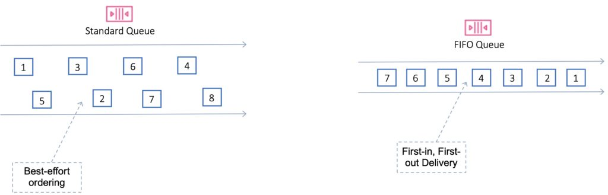

# Legacy AWS Service Catalog Digest

## Overview

Note này chuyển hóa cụm note AWS cũ trong `_inbox/Cloud/AWS`. Nguồn thô gồm nhiều file service overview, bản dịch lặp và hình minh họa về AWS fundamentals, IAM, security, compute, networking, storage, database, analytics, application integration, management/cost và architecture. Vì AWS folder hiện đã có canonical notes theo domain, nội dung ở đây được giữ như một digest/service catalog để tra cứu nhanh và tránh tạo hàng chục file trùng.

## Foundation And Global Infrastructure

AWS nên được hiểu theo scope:

| Scope | Ví dụ | Ý nghĩa thiết kế |
|---|---|---|
| Global | IAM, Route 53, CloudFront | không gắn với một AZ cụ thể |
| Regional | VPC, Lambda, DynamoDB, nhiều managed service | chọn Region theo latency, compliance, cost |
| Zonal | subnet, EC2 instance, EBS volume | cần multi-AZ nếu muốn HA |

Region là fault domain địa lý lớn. Availability Zone là fault domain trong một Region. Edge Location phục vụ DNS, CDN, acceleration hoặc edge processing tùy service.

## Billing, Pricing And Cost Control

Các note cũ nhấn mạnh:

- pay-as-you-go giúp tránh mua trước capacity quá lớn;
- Reserved Instance/Savings Plan phù hợp workload ổn định;
- Spot phù hợp workload stateless, batch hoặc chịu được interruption;
- cần budget, cost allocation tag, Cost Explorer và review tài nguyên idle;
- không hard-code giá hoặc quota trong note dài hạn vì AWS thay đổi thường xuyên.

## IAM, Account And Shared Responsibility

IAM gồm user, group, role và policy:

- user đại diện identity dài hạn, nên hạn chế access key dài hạn;
- group gom quyền cho user;
- role dùng temporary credential, phù hợp EC2/Lambda/cross-account;
- policy định nghĩa permission.

Shared Responsibility Model:

- AWS chịu trách nhiệm security **of** the cloud: physical data center, hardware, nền tảng managed service;
- customer chịu trách nhiệm security **in** the cloud: IAM, data, network exposure, guest OS/app config tùy service model;
- trách nhiệm thay đổi theo IaaS/PaaS/SaaS.

## Security Services

| Service | Vai trò |
|---|---|
| KMS | quản lý encryption key |
| CloudHSM | HSM dedicated cho yêu cầu kiểm soát cao |
| ACM | quản lý TLS certificate cho dịch vụ AWS được hỗ trợ |
| WAF | lọc HTTP layer 7 |
| Shield | DDoS protection |
| GuardDuty | threat detection từ log/tín hiệu AWS |
| Inspector | vulnerability/exposure assessment |
| Artifact | compliance report/document |
| Cognito | identity cho app, user pool/identity pool |
| IAM Identity Center/SSO | access tập trung cho account/app |
| Secrets Manager/Parameter Store | lưu secret/config có kiểm soát |

Điểm vận hành: detection service chỉ tạo finding. Cần workflow xử lý finding, owner, severity, ticket và verification.

## Compute And Deployment

| Service | Dùng khi |
|---|---|
| EC2 | VM/IaaS, cần kiểm soát OS/runtime |
| Auto Scaling Group | giữ desired capacity, thay instance lỗi, scale theo policy |
| Elastic Load Balancing | phân phối traffic tới target khỏe |
| Lambda | function serverless theo event |
| Elastic Beanstalk | PaaS deploy app, AWS quản lý nhiều phần platform |
| Lightsail | VPS đơn giản cho workload nhỏ |
| Batch | batch job |
| ECS/EKS | container orchestration managed |

EC2 cần hiểu AMI, instance type, key pair, security group, EBS/instance store, public IP/Elastic IP, lifecycle stop/start/terminate.

## Networking And Edge

| Service | Mental model |
|---|---|
| VPC | private network boundary |
| Subnet | network segment trong một AZ |
| Route Table | quyết định next hop |
| Internet Gateway | public subnet đi Internet |
| NAT Gateway/Instance | private subnet outbound Internet |
| Security Group | stateful firewall ở ENI/instance |
| Network ACL | stateless firewall ở subnet |
| VPC Peering | nối hai VPC, không transitive |
| Direct Connect | private dedicated connectivity tới AWS |
| Route 53 | DNS, routing policy, health check |
| CloudFront | CDN/edge cache |
| Global Accelerator | anycast acceleration đến endpoint |
| Outposts | mở rộng AWS infrastructure tới on-premises |

Checklist VPC: CIDR không overlap, subnet theo AZ, route đúng, security group/NACL đúng, DNS/resolver đúng, NAT/IGW đúng scope.

## Storage And Data

| Service | Loại storage | Dùng khi |
|---|---|---|
| S3 | object | static asset, backup, data lake, log archive |
| EBS | block | volume cho EC2/database một node |
| EFS | file/NFS | shared filesystem nhiều instance |
| FSx | managed file specialized | Windows/Lustre/ONTAP/OpenZFS tùy workload |
| Instance Store | ephemeral local disk | temporary/cache, mất khi instance stop/terminate tùy loại |
| Storage Gateway | hybrid storage on-prem to AWS |
| Snowball | data migration offline/edge |
| AWS Backup | centralized backup orchestration |

EBS volume gắn với AZ; snapshot có thể dùng để tạo volume mới. S3 cần nắm bucket/object/key, versioning, encryption, lifecycle, replication, policy và pre-signed URL.

## Database And Cache

| Service | Dùng khi |
|---|---|
| RDS/Aurora | relational workload, SQL, transaction |
| DynamoDB | key-value/document, latency thấp, access pattern rõ |
| ElastiCache | cache/session/rate limit với Redis/Memcached |
| Redshift | data warehouse, columnar analytics |

RDS Multi-AZ là HA/failover. Read Replica phục vụ read scaling hoặc một số pattern DR, không thay thế Multi-AZ theo cùng mục tiêu.

## Analytics, Search And Streaming

| Service | Vai trò |
|---|---|
| Athena | query data trên S3 bằng SQL |
| Glue | data catalog, ETL, crawler |
| EMR | Hadoop/Spark managed cluster |
| Kinesis Data Streams | stream ingestion có shard/consumer |
| Kinesis Firehose | delivery stream tới S3/Redshift/OpenSearch/destination |
| Kinesis Data Analytics | xử lý stream |
| OpenSearch | search/log analytics |
| Lake Formation | data lake governance |
| MSK | managed Kafka |
| QuickSight | BI/dashboard |

Athena phù hợp ad-hoc query trên S3; Glue phù hợp catalog/ETL; Kinesis phù hợp event stream; Redshift phù hợp warehouse query.

## Application Integration And Event-Driven

| Service | Mental model |
|---|---|
| SQS Standard | queue throughput cao, at-least-once, best-effort ordering |
| SQS FIFO | ordering và exactly-once processing ở phạm vi FIFO semantics |
| SNS | pub/sub fanout |
| Step Functions | workflow/state machine |
| SWF | workflow service legacy hơn Step Functions |
| Amazon MQ | managed ActiveMQ/RabbitMQ compatibility |

SQS cần nắm visibility timeout, long polling, DLQ, delay queue, redrive, Lambda integration và idempotency consumer.

## Management, Governance And Operations

| Service | Vai trò |
|---|---|
| CloudWatch | metrics, logs, alarms, dashboard |
| CloudTrail | API audit trail |
| Config | configuration history/compliance |
| Systems Manager | ops automation, patch, inventory, run command |
| Organizations | multi-account, consolidated billing, SCP |
| Control Tower | landing zone/governance baseline |
| CloudFormation | IaC template native AWS |
| Trusted Advisor | recommendation về cost/security/performance/fault tolerance/service limits |
| Health Dashboard | health event theo account/service |

CloudWatch trả lời "hệ thống đang thế nào"; CloudTrail trả lời "ai/API nào đã làm gì"; Config trả lời "resource config thay đổi ra sao và có compliant không".

## Migration, Media, ML And Amazon Q

Nhóm note cũ có thêm các service phụ:

- Migration/DataSync/Snow family: di chuyển dữ liệu hoặc workload vào AWS;
- Media Services/Elastic Transcoder: xử lý media pipeline;
- Rekognition, Textract, Transcribe, Translate, Polly, Comprehend, Lex, Forecast, SageMaker: managed AI/ML service theo tác vụ;
- Amazon Q note có nhắc tới setting cập nhật 2025, nhưng cần kiểm tra tài liệu hiện hành trước khi áp dụng vì service AI thay đổi nhanh.

## Placement Matrix

| Nhóm inbox cũ | Đã chuyển hóa vào |
|---|---|
| `global-infrastructure.md`, `AWS regions.md`, `Architecting for the Cloud.md` | Foundation, Networking/Edge, Architecture mental model |
| `aws-billing-and-pricing.md` | Billing, Pricing And Cost Control |
| IAM/STS/compare access | IAM, Account And Shared Responsibility |
| Security Identity & Compliance | Security Services |
| Compute | Compute And Deployment |
| Networking & Content Delivery | Networking And Edge |
| Storage | Storage And Data |
| Database | Database And Cache |
| Analytics | Analytics, Search And Streaming |
| Application Integration | Application Integration And Event-Driven |
| Management Tools | Management, Governance And Operations |
| Migration, Media, ML, Amazon Q | Migration, Media, ML And Amazon Q |

## Related Pages

- [AWS Fundamentals](../00-fundamentals/overview.md)
- [IAM, Accounts, Organizations And Policy](../01-identity-security-governance/01-iam-accounts-organizations-policy.md)
- [VPC, Subnets, Routing And Endpoints](../02-networking-edge/01-vpc-subnets-routing-endpoints.md)
- [EC2 Instance Lifecycle, Networking And Cost](../03-compute-ec2-autoscaling/01-ec2-instance-lifecycle-networking-and-cost.md)
- [Storage And Database Selection Patterns](../05-storage-data-databases/04-storage-and-database-selection-patterns.md)
- [Lambda, EventBridge And SQS](../06-serverless-event-driven/01-lambda-eventbridge-and-sqs.md)
