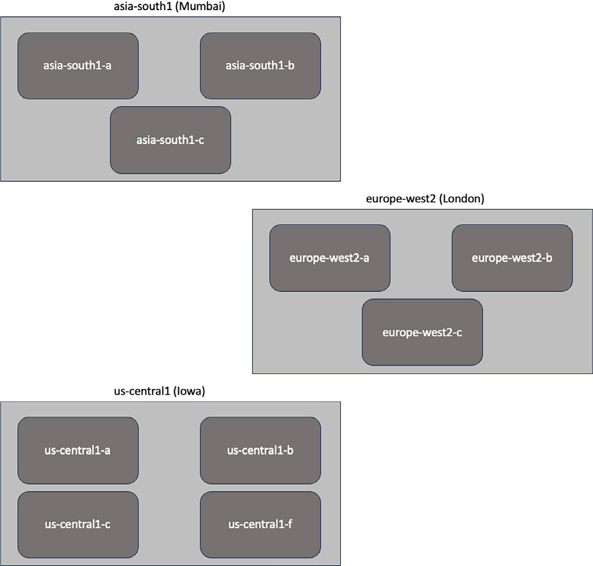

# GCP Regions, Zones, Network And Resilience

## Tổng Quan

Trong GCP, placement không chỉ là chọn nơi đặt resource. Region, zone, network edge và service scope ảnh hưởng trực tiếp tới latency, compliance, availability, disaster recovery và chi phí.

Không nên ghi nhớ số lượng region/zone tại một thời điểm. Các con số này thay đổi liên tục; khi thiết kế hoặc làm proposal production, hãy kiểm tra tài liệu GCP hiện hành và availability của từng service ở region mục tiêu.

## Region Và Zone



- **Region** là khu vực địa lý độc lập, ví dụ một thành phố/khu vực lớn nơi GCP đặt hạ tầng cloud.
- **Zone** là failure domain nhỏ hơn bên trong region. Một region thường có nhiều zone để giảm rủi ro khi một datacenter/power/cooling domain gặp lỗi.
- **Global service** có phạm vi toàn cầu hoặc control plane/global endpoint theo cách service định nghĩa.
- **Regional service** bị ràng buộc vào một region.
- **Zonal service** bị ràng buộc vào một zone cụ thể.

Tên zone thường mở rộng từ tên region, ví dụ dạng `region-a`, `region-b`, `region-c`. Không nên hard-code giả định số lượng zone; hãy đọc service/location matrix trước khi thiết kế.

## Placement Decision

Khi chọn region/zone, đánh giá ít nhất các yếu tố sau:

| Yếu tố | Câu hỏi thiết kế |
| --- | --- |
| Latency | User, hệ thống tích hợp và data source ở đâu? |
| Data residency | Dữ liệu có được phép rời quốc gia/khu vực không? |
| Service availability | Service cần dùng có sẵn ở region đó không? |
| HA | Workload cần chạy single-zone, multi-zone hay multi-region? |
| DR | Region phụ ở đâu, RTO/RPO là gì, failback ra sao? |
| Cost | Giá compute/storage/network/egress ở region đó có phù hợp không? |
| Operations | Team có observability, runbook và support path theo region không? |

Một service chạy được ở region gần user không có nghĩa toàn bộ dependency cũng sẵn sàng ở đó. Trước khi commit architecture, kiểm tra database, queue, object storage, KMS, logging, monitoring, backup target, private connectivity và policy requirements.

## GCP Network Edge

GCP tận dụng network backbone và edge location để giảm latency tới user và tăng hiệu quả phân phối nội dung. Về mental model:

```text
user/client
  -> ISP / local network
  -> Google edge / peering / cache path
  -> GCP backbone
  -> regional/zonal service backend
```

Network edge giúp đưa traffic vào provider network sớm hơn hoặc phục vụ cached content gần user hơn, nhưng không thay thế thiết kế application:

- dynamic data vẫn cần database/replication/consistency strategy;
- cache cần TTL, invalidation và fallback;
- public endpoint cần TLS, WAF/firewall policy và logging;
- backend vẫn phải chịu được cache miss hoặc edge path degradation.

## High Availability Trên GCP

HA là khả năng service tiếp tục phục vụ khi một thành phần lỗi. Với GCP, các pattern thường gặp:

- Multi-zone deployment cho workload cần chống lỗi zone.
- Load balancer phân phối traffic tới nhiều backend khỏe.
- Autoscaling dựa trên metric gần user impact như latency, request rate, queue depth hoặc error rate.
- Health check phải kiểm tra khả năng phục vụ thật, không chỉ process còn chạy.
- Geographic distribution khi cần giảm latency toàn cầu hoặc chống lỗi region.

HA không đồng nghĩa 100% availability. SLA của từng service khác nhau và có điều kiện áp dụng riêng; luôn đọc service SLA/current docs thay vì dùng con số cũ từ tài liệu học.

## Disaster Recovery

DR trả lời câu hỏi: khi sự cố lớn làm mất một site/region/service dependency, tổ chức khôi phục service như thế nào và mất bao lâu.

Một DR plan production cần có:

- service tier và recovery priority;
- RTO/RPO theo từng workload;
- backup/replication strategy;
- quyền truy cập khẩn cấp và break-glass process;
- communication plan nội bộ/khách hàng;
- runbook failover/failback;
- drill định kỳ và evidence restore test.

Region/zone chỉ là building block. Nếu application state, DNS failover, IAM, secrets, artifact distribution, observability hoặc rollback/failback chưa được thiết kế, việc chạy ở nhiều region vẫn có thể không đạt DR mục tiêu.

## Các Nhầm Lẫn Phổ Biến

- Chọn region chỉ vì giá rẻ nhưng bỏ qua latency, compliance hoặc service availability.
- Tưởng multi-zone là đủ cho disaster recovery cấp region.
- Tưởng replication là backup.
- Dùng SLA service để suy ra SLA application mà không tính dependency chain.
- Không test restore/failover nhưng vẫn ghi RTO/RPO rất thấp.
- Dùng region/zone count trong tài liệu cũ làm căn cứ thiết kế.

## Trang Liên Quan

- [Google Cloud Platform Overview](./overview.md)
- [Cloud Computing Core Mechanisms](../../01-cloud-fundamentals/01-cloud-computing-core-mechanisms.md)
- [Multi-Region Architecture](../../../01-architecture/04-reliability-and-dr/04-multi-region-architecture.md)
- [HA And Failover Patterns](../../../01-architecture/04-reliability-and-dr/01-ha-and-failover-patterns.md)
- [RTO/RPO Design](../../../01-architecture/04-reliability-and-dr/07-rto-rpo-design.md)
- [Caching, CDN And Read Replica](../../../01-architecture/04-reliability-and-dr/06-caching-cdn-read-replica.md)
