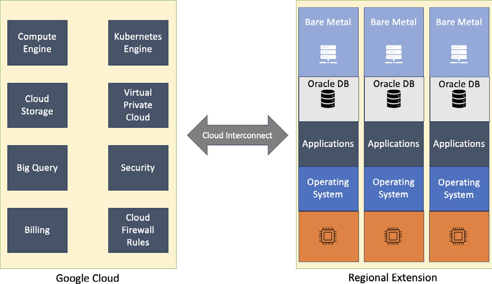

# GCP Compute Engine, VMware Engine And Bare Metal

## Tổng Quan

GCP có nhiều cách chạy workload dạng server/compute. Ba lựa chọn hay gặp trong infrastructure modernization:

- **Compute Engine**: VM/IaaS native của GCP.
- **Google Cloud VMware Engine**: chạy VMware SDDC trên dedicated infrastructure do Google vận hành, phù hợp migration VMware ít thay đổi.
- **Bare Metal Solution**: dedicated bare-metal environment gần GCP region cho workload đặc thù như database/licensing/hardware constraint.

Chọn compute không chỉ là chọn CPU/RAM. Cần xét operating model, migration risk, licensing, network path, data gravity, team skill, cost governance, HA/DR và exit plan.

## Compute Engine

Compute Engine phù hợp khi cần VM linh hoạt nhưng vẫn muốn dùng control plane, region/zone, disk, image, IAM, VPC, load balancer và automation của GCP.

Các quyết định chính:

| Quyết định | Ý nghĩa production |
| --- | --- |
| Machine family/type | Match CPU, memory, accelerator và cost với workload thật |
| Region/zone | Ảnh hưởng latency, availability, data residency và service availability |
| Image | Public image, custom image, hardened image, patch baseline |
| Persistent disk | Boot/data disk, performance tier, snapshot/backup policy |
| Network | VPC/subnet/firewall/public IP/private IP/NAT/load balancer |
| Service account | Quyền của VM gọi GCP API; cần least privilege |
| Provisioning model | Standard cho workload cần ổn định; spot/preemptible chỉ cho workload chịu được interruption |
| Observability | Ops agent/logging/metrics/uptime check/application health |

Compute Engine là IaaS, nên user vẫn chịu trách nhiệm lớn: OS hardening, patching, application runtime, firewall rule, IAM/service account, secret handling, backup/restore, log/metric/alert và cost cleanup.

## GCE Guardrails

- Không bật public IP hoặc allow `0.0.0.0/0` cho SSH/RDP nếu chưa có lý do và compensating control.
- Không dùng default service account với quyền rộng cho production workload.
- Không chọn machine type theo cảm tính; đo CPU, memory, disk IOPS/throughput, network và application latency.
- Không coi snapshot là backup hoàn chỉnh nếu chưa test restore và retention.
- Không để VM, disk, static IP hoặc image orphan sau test/migration.
- Với spot/preemptible VM, thiết kế job idempotent, checkpoint được và chịu được interruption.

## Google Cloud VMware Engine

VMware Engine phù hợp khi tổ chức có VMware estate lớn, dependency phức tạp hoặc cần migration ít thay đổi trước khi refactor sang cloud-native service.

Mental model:

```text
existing VMware estate
  -> VMware SDDC on Google Cloud dedicated infrastructure
  -> connectivity to GCP services
  -> phased migration/refactor when ready
```

Ưu điểm là giảm migration shock: team tiếp tục dùng nhiều operational pattern quen thuộc, workload giữ VM/VMware abstraction, và vẫn có đường kết nối tới service GCP khác. Tradeoff là vẫn mang theo nhiều complexity của VMware estate: licensing, capacity planning, network dependency, backup/DR, operational model và cost.

## Bare Metal Solution

Bare Metal Solution dùng khi workload cần dedicated physical server, hardware/licensing constraint hoặc không phù hợp với VM managed thông thường.



Boundary cần hiểu rõ:

- Google quản lý facility, physical server housing, power/cooling, một phần physical/network security và connectivity về GCP.
- Customer quản lý OS, application, database, data, IAM access, backup, patching, licensing và workload security.
- Network path thường đi qua regional extension/interconnect-style connectivity; latency và service reachability phải được đo bằng test thật, không chỉ dựa vào marketing claim.

Bare metal tăng control nhưng giảm mức abstraction. Nếu chọn bare metal để "dễ migration", vẫn phải chuẩn bị patching, monitoring, backup/restore, DR drill, capacity planning và license audit.

## Khi Chọn Cái Nào

| Nhu cầu | Lựa chọn thường hợp lý |
| --- | --- |
| VM cloud-native, tự quản OS/app | Compute Engine |
| Lift-and-shift nhanh từ VM truyền thống | Compute Engine hoặc VMware Engine tùy dependency |
| VMware estate lớn, muốn giữ SDDC model | VMware Engine |
| Workload đặc thù cần dedicated physical server/licensing | Bare Metal Solution |
| Batch/fault-tolerant, chịu được interruption | Spot/preemptible VM với checkpoint/idempotency |
| Cần giảm vận hành OS/runtime | Xem xét PaaS/container/serverless thay vì VM |

## Trang Liên Quan

- [Google Cloud Platform Overview](./overview.md)
- [GCP Regions, Zones, Network And Resilience](./01-regions-zones-network-and-resilience.md)
- [Virtual Machines And Hypervisors](../../../03-compute-and-orchestration/01-compute-platforms/01-virtual-machines-and-hypervisors.md)
- [Cloud Computing Core Mechanisms](../../01-cloud-fundamentals/01-cloud-computing-core-mechanisms.md)
