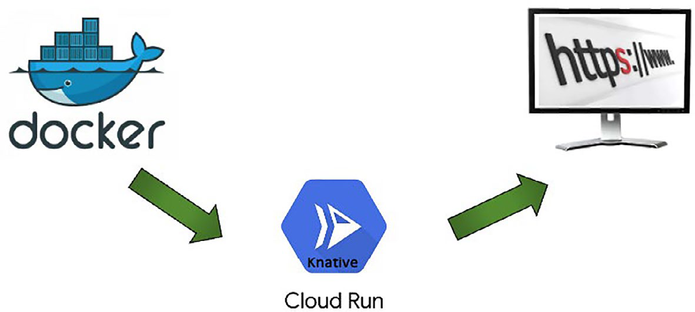

# App Engine, Cloud Run And Cloud Functions

## Tổng Quan

Serverless không có nghĩa là "không có server". Nó có nghĩa là application team không phải quản lý server, OS, patching, capacity và nhiều phần runtime operation trực tiếp. Provider vẫn chạy hạ tầng thật ở phía sau; boundary vận hành chỉ được đẩy lên cao hơn.

Trong GCP, ba lựa chọn serverless thường gặp là:

- **App Engine**: PaaS/serverless runtime cho web app hoặc backend app theo model application platform.
- **Cloud Run**: serverless container runtime cho HTTP service, API, background job hoặc event-driven container.
- **Cloud Functions**: FaaS cho logic nhỏ, ngắn, chạy theo HTTP trigger hoặc cloud event.

## Serverless Mental Model

Serverless phù hợp khi workload có event/request boundary rõ, stateless hoặc externalized state, và team muốn giảm phần vận hành hạ tầng để tập trung vào code.

Tradeoff chính:

- **Tăng velocity**: ít phải chuẩn bị VM, OS, runtime, patching và scaling thủ công.
- **Giảm control**: ít quyền debug tầng dưới, ít tùy chỉnh host/network/runtime hơn.
- **Cost theo usage**: tốt cho workload bursty hoặc idle nhiều, nhưng workload chạy liên tục có thể không rẻ hơn VM/container cluster.
- **Cold start và timeout**: function hoặc container scale-to-zero có thể có độ trễ khởi động và giới hạn thời gian xử lý.
- **Vendor lock-in**: trigger, IAM, event format, runtime và deployment workflow thường bám chặt vào provider.

## FaaS Vs Microservice

FaaS và microservice có thể cùng tồn tại nhưng không cùng nghĩa:

| Khía cạnh | FaaS | Microservice |
|---|---|---|
| Lifecycle | Ngắn, chạy khi có event/request | Thường long-running |
| Unit triển khai | Function hoặc handler nhỏ | Service/API độc lập |
| Trigger | HTTP, Pub/Sub, storage event, scheduler, Eventarc | API call, queue, stream, RPC |
| State | Nên stateless; state nằm ngoài function | Cũng nên externalize state, nhưng có service lifecycle dài hơn |
| Rủi ro chính | Cold start, retry duplicate, timeout, observability rời rạc | Distributed system complexity, versioning, data consistency |

Một microservice có thể gọi function để xử lý tác vụ phụ như thumbnail, webhook, ETL nhỏ hoặc notification. Ngược lại, không nên biến toàn bộ business domain phức tạp thành nhiều function rời rạc nếu chưa có event contract, tracing, idempotency và ownership rõ.

## App Engine

App Engine phù hợp khi cần đưa web application/backend lên managed runtime nhanh, giảm quản lý infrastructure và dùng platform features như versioning, traffic split, task/cron integration, security scanner hoặc service account integration.

Decision points:

- **Standard vs flexible/runtime choice**: chọn theo runtime constraint, cold start, dependency và mức kiểm soát cần thiết.
- **Region**: nhiều service có quyết định region khó đổi sau khi tạo; cần chọn theo latency, data residency và dependency path.
- **Versioning và traffic split**: dùng cho canary, A/B test hoặc rollback phiên bản application.
- **Identity/API access**: service account của app phải theo least privilege, không dùng default service account với quyền rộng nếu không có lý do.
- **Scheduled work**: cron/task queue có thể phù hợp cho job nhẹ, nhưng job dài hoặc cần container tùy biến có thể hợp với Cloud Run Job hơn.

## Cloud Run

Cloud Run là lựa chọn tốt khi app đã đóng gói thành container và cần một endpoint HTTP/event-driven được quản lý, autoscale và không muốn quản lý Kubernetes cluster.



Các quyết định production quan trọng:

- **Container contract**: container phải listen trên port do platform cung cấp, không phụ thuộc local state, và shutdown graceful.
- **Ingress**: không mở public internet nếu service chỉ dùng nội bộ; chọn internal/private path khi phù hợp.
- **Authentication**: public endpoint chỉ dùng khi thật sự là public API/site; service nội bộ nên yêu cầu IAM hoặc identity-aware access.
- **CPU allocation**: CPU chỉ trong request giúp tiết kiệm cho request-driven service; CPU always allocated phù hợp background processing hoặc workload cần xử lý ngoài request.
- **Min/max instances**: `min instances` giảm cold start nhưng tăng cost; `max instances` bảo vệ downstream dependency khỏi traffic spike.
- **Concurrency**: concurrency cao tăng hiệu suất tài nguyên nhưng có thể làm tăng latency nếu app không thread-safe hoặc bị bottleneck CPU/IO.
- **Revision/traffic split**: dùng revision để rollout, canary và rollback.
- **Observability**: cần log có correlation id, metric request count/latency/error, alert cho 5xx, saturation, cold start symptom và dependency failure.

Cloud Run thường hợp lý hơn GKE khi service stateless, HTTP/event-driven, không cần Kubernetes API, không cần custom controller, không cần host-level daemon và không cần kiểm soát node pool. GKE phù hợp hơn khi cần Kubernetes object model, workload phức tạp, service mesh, custom controller, node placement hoặc platform multi-tenant phức tạp.

## Cloud Functions

Cloud Functions phù hợp cho logic nhỏ, độc lập, được kích hoạt bởi HTTP request hoặc cloud event như Pub/Sub message, Cloud Storage object event, Firestore event hoặc Eventarc event.

Use case điển hình:

- webhook handler;
- ETL nhỏ theo event;
- xử lý object upload/delete;
- notification;
- scheduled job nhẹ;
- glue logic giữa các managed services.

Guardrails:

- Function phải **idempotent** vì event có thể retry hoặc duplicate.
- Thiết kế timeout, retry, DLQ/poison-message handling và backoff rõ ràng.
- Không đưa secret vào source code hoặc environment plain text không kiểm soát; dùng Secret Manager hoặc cơ chế secret phù hợp.
- Với trigger qua Pub/Sub/Eventarc/Cloud Storage, kiểm tra service account và role tối thiểu cần thiết.
- Cẩn thận data residency khi event source region và function region khác nhau.
- Không bật unauthenticated invocation nếu function không phải public endpoint.
- Log đủ event id, correlation id, source, retry count và error context; tránh log payload nhạy cảm.

## Pre-Check Và Validation

Các lệnh dưới đây chỉ quan sát trạng thái, dùng trước/sau thay đổi:

```bash
gcloud run services list --region <region>
gcloud run services describe <service> --region <region>
gcloud functions list --regions <region>
gcloud functions describe <function> --region <region>
gcloud app versions list --service <service>
```

Trước khi deploy production:

- kiểm tra source image/function artifact đã scan vulnerability và không chứa secret;
- xác định region, ingress, authentication, service account, env var, secret reference và quota;
- kiểm tra dependency downstream có chịu được autoscaling không;
- định nghĩa rollback: revision trước đó, version trước đó hoặc disable trigger;
- đặt budget/alert nếu workload có khả năng burst mạnh.

Sau deploy:

```bash
gcloud run services describe <service> --region <region> --format yaml
gcloud functions describe <function> --region <region> --format yaml
gcloud logging read 'resource.type=("cloud_run_revision" OR "cloud_function")' --limit 50
```

## Rủi Ro Vận Hành

- **Delete service/function/version** có thể làm mất endpoint production. Luôn kiểm tra traffic split, caller, DNS/custom domain và rollback target trước khi xóa.
- **Disable trigger** có thể làm ngừng pipeline event. Cần xác định backlog, replay behavior và downstream impact.
- **Retry không kiểm soát** có thể nhân lỗi lên downstream hoặc tạo duplicate side effect. Idempotency key và DLQ quan trọng hơn việc "retry thật nhiều".
- **Autoscaling quá nhanh** có thể làm quá tải database/API phía sau. Dùng max instances, connection pool, queue hoặc rate limit.
- **Observability thiếu context** làm serverless rất khó debug vì instance ephemeral và log phân tán.

## Khi Chọn GCP Serverless

| Nhu cầu | Lựa chọn thường hợp lý |
|---|---|
| Web app/backend muốn PaaS runtime và version traffic split | App Engine |
| Container HTTP/API stateless, không muốn quản lý Kubernetes | Cloud Run Service |
| Container job/background task theo batch | Cloud Run Job |
| Logic nhỏ theo event/HTTP, lifecycle ngắn | Cloud Functions |
| Event routing chuẩn hóa giữa nhiều GCP services | Eventarc với Cloud Run/Cloud Functions |
| Cần Kubernetes API, custom controller, node pool hoặc workload platform phức tạp | GKE |

## Trang Liên Quan

- [Google Cloud Platform Overview](./overview.md)
- [GKE, Anthos And Container Platforms](./03-gke-anthos-and-container-platforms.md)
- [Cloud Computing Core Mechanisms](../../01-cloud-fundamentals/01-cloud-computing-core-mechanisms.md)
- [Container Vs VM Concepts](../../../03-compute-and-orchestration/02-container-runtime/Container%20vs%20VM%20concepts.md)
- [Kubernetes](../../../03-compute-and-orchestration/03-container-orchestration/01-kubernetes/overview.md)
