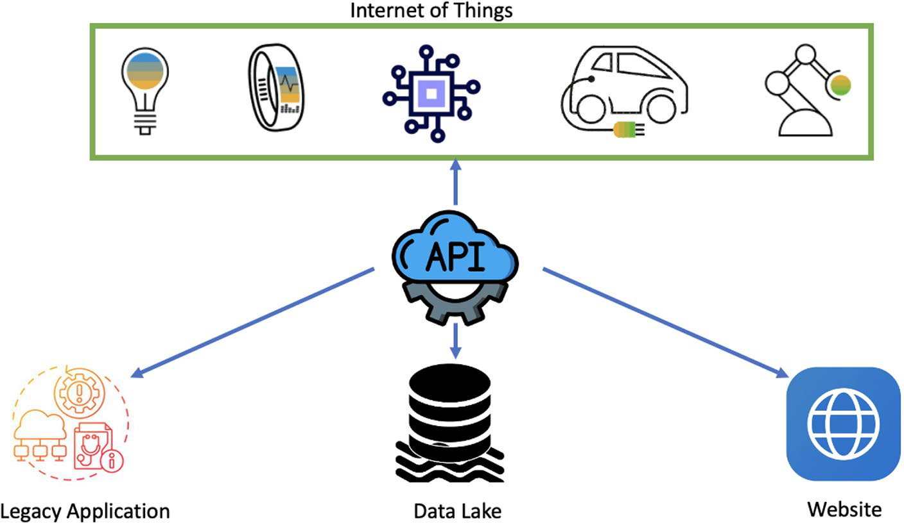

# API Management And Apigee

## Tổng Quan

API management là lớp quản trị contract, security, traffic, analytics và developer experience cho API. Trong modernization, API thường là boundary giữa legacy application, microservices, website/mobile app, data platform, IoT và partner integration.

Apigee là GCP product cho API management. Cách hiểu đúng: Apigee không thay business service; nó đứng ở lớp gateway/management để kiểm soát cách API được expose, bảo vệ, đo lường và tiêu thụ.



## API Trong Modernization

API giúp tách client khỏi implementation phía sau:

```text
client / partner / mobile / web
  -> API gateway / API management
  -> modern service, legacy service, data platform, SaaS integration
```

Giá trị chính:

- legacy system có thể được bọc bằng API contract thay vì expose database hoặc protocol nội bộ;
- service mới có thể thay dần capability cũ bằng strangler pattern;
- authentication, authorization, quota, rate limit và audit được tập trung hơn;
- API usage analytics giúp biết capability nào được dùng thật;
- developer portal giúp internal/external developer khám phá và onboard API có kiểm soát.

## Apigee Service Boundary

| Capability | Ý nghĩa production |
|---|---|
| API gateway | Entry point cho request, routing, protocol mediation, policy enforcement |
| Security policy | Authn/authz, token validation, mTLS/TLS, threat protection, data masking tùy thiết kế |
| Traffic management | Quota, rate limit, spike arrest, caching, load balancing, backend protection |
| Analytics/monitoring | Usage, latency, error, consumer behavior, abuse/misuse signal |
| Developer portal | Self-service discovery, documentation, key/app onboarding, API product packaging |
| Multi-environment | Hỗ trợ hybrid/multi-cloud/on-prem API estate tùy deployment model |

## Design Guardrails

- API contract phải được version hóa. Không phá backward compatibility mà không có deprecation window.
- Không cho client truy cập trực tiếp database legacy nếu có thể bọc bằng service/API contract.
- Mọi API public hoặc partner-facing cần auth, rate limit, audit log, input validation và error model rõ.
- API gateway không sửa được backend yếu. Nếu backend không idempotent, timeout dài hoặc không chịu được retry, gateway chỉ che được một phần rủi ro.
- Cache ở gateway cần hiểu data freshness, privacy và invalidation. Không cache response có dữ liệu nhạy cảm nếu key/cache policy không chắc chắn.
- Quota và throttling nên bảo vệ backend và tenant fairness, không chỉ để "tính phí".
- API key không phải authentication mạnh cho user/workload quan trọng; cần OAuth/OIDC/JWT/mTLS hoặc identity model phù hợp.

## Observability Và Troubleshooting

Khi API lỗi, tách lỗi theo flow:

```text
client
  -> DNS / TLS / WAF / LB
  -> API gateway / Apigee policy
  -> backend service
  -> database / dependency
```

Triage nhanh:

- request có tới gateway không;
- TLS/certificate/custom domain có lỗi không;
- policy nào reject request: auth, quota, schema validation, threat protection;
- backend latency/error có tăng không;
- retry có tạo duplicate side effect không;
- consumer/app nào tạo spike;
- correlation id có đi xuyên gateway và backend không.

## Khi Dùng Apigee

Apigee phù hợp khi organization có nhiều API, nhiều consumer, nhiều team hoặc cần governance mạnh:

- partner/public API;
- API product hóa cho developer ecosystem;
- legacy modernization cần API facade;
- multi-cloud/hybrid API estate;
- traffic governance, quota và analytics tập trung;
- security policy cần nhất quán giữa nhiều backend.

Không nên thêm Apigee chỉ để proxy một API nội bộ đơn giản nếu team chưa cần API product, developer portal, quota/analytics hoặc governance tập trung. Một gateway/load balancer nhẹ hơn có thể đủ.

## Trang Liên Quan

- [Google Cloud Platform Overview](./overview.md)
- [Application Modernization And Cloud-Native Principles](../../../01-architecture/01-principles/07-application-modernization-and-cloud-native.md)
- [Cloud Computing Core Mechanisms](../../01-cloud-fundamentals/01-cloud-computing-core-mechanisms.md)
- [GKE, Anthos And Container Platforms](./03-gke-anthos-and-container-platforms.md)
