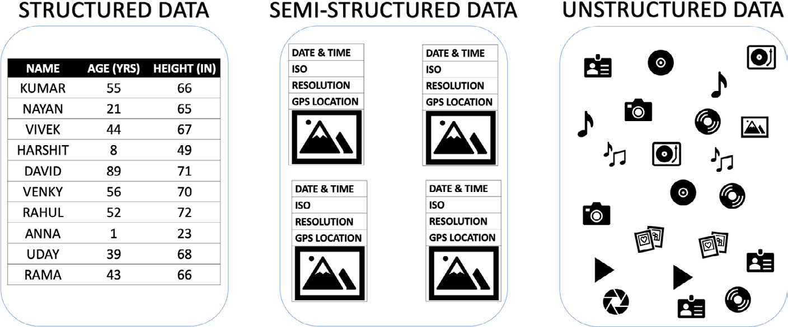
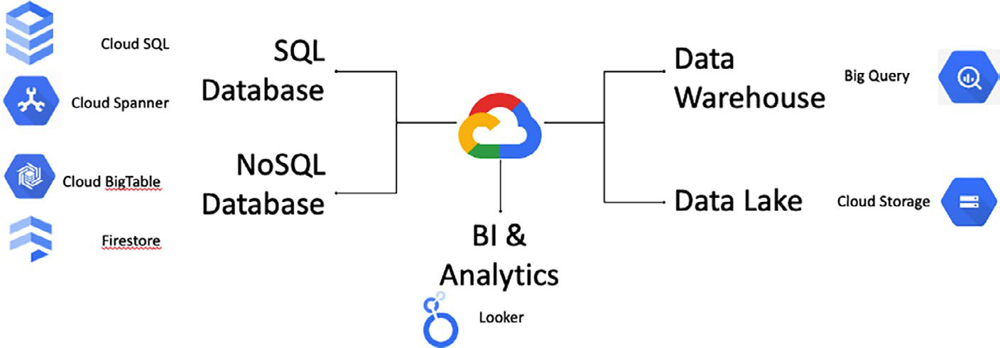

# GCP Data, Analytics And Storage Services

## Overview

GCP data stack nên được đọc theo workflow dữ liệu, không chỉ theo tên service:

1. operational database phục vụ application transaction;
2. object storage hoặc data lake giữ raw data, file, backup và dữ liệu đa định dạng;
3. warehouse/analytics xử lý reporting, BI, ML và truy vấn ad-hoc;
4. governance kiểm soát IAM, retention, residency, lineage, backup và audit.

Điểm quan trọng trong production là không để một service làm mọi việc. Database OLTP không nên gánh dashboard nặng; data lake không tự động thành warehouse có governance; managed database không thay thế cho backup/restore test và data protection process của team.

## Data-Driven Transformation Mental Model

Data-driven transformation không phải là gom thật nhiều dữ liệu rồi chờ có insight. Dữ liệu chỉ có giá trị khi có context, câu hỏi kinh doanh/kỹ thuật rõ ràng, pipeline đáng tin cậy và cơ chế quyết định dựa trên evidence.

Các nguồn dữ liệu thường gặp:

- **Internal data**: transaction, log, metric, inventory, billing, ticket, CRM, telemetry.
- **Customer data**: feedback, hành vi sử dụng, support interaction, consent preference.
- **Industry/external data**: benchmark, market signal, public dataset, partner feed.
- **Compliance data**: audit trail, retention record, legal hold, policy evidence.

Cloud giúp scale storage/compute cho analytics nhanh hơn hạ tầng truyền thống, nhưng shared responsibility vẫn còn nguyên: team vẫn phải thiết kế quyền truy cập, backup, retention, encryption, data residency, data quality và incident response.

## Data Types



| Loại dữ liệu | Cách hiểu | Service thường liên quan |
|---|---|---|
| Structured | Có schema rõ, table/row/column, constraint và query có cấu trúc | Cloud SQL, Spanner, BigQuery |
| Semi-structured | Có metadata hoặc cấu trúc lỏng như JSON/XML/event payload | Firestore, BigQuery, Cloud Storage |
| Unstructured | Ảnh, video, audio, email, document, log raw, object file | Cloud Storage, BigQuery external table/search/AI pipeline |

Không nên chọn service chỉ vì định dạng dữ liệu. Cần hỏi thêm workload là OLTP, analytics, stream processing, mobile sync, time-series, archive hay ML feature pipeline.

## GCP Data Service Map



| Need | GCP service | Mental model |
|---|---|---|
| Managed relational database | Cloud SQL | MySQL/PostgreSQL/SQL Server-style managed RDBMS cho workload quen thuộc |
| Global/distributed relational transaction | Cloud Spanner | relational database phân tán, consistency mạnh, horizontal scale |
| Wide-column NoSQL | Cloud Bigtable | column-family store cho throughput lớn, time-series/IoT/event workload |
| Document/mobile/serverless app data | Firestore | document database có realtime sync/offline pattern |
| Data warehouse | BigQuery | serverless warehouse cho SQL analytics và reporting |
| Object storage/data lake | Cloud Storage | object storage cho raw data, backup, static asset và lake zone |
| BI/modeling/dashboard | Looker | semantic layer, dashboard, embedded analytics và data governance ở tầng BI |

## Operational DB, Warehouse And Lake

| Layer | Tối ưu cho | Không nên dùng để |
|---|---|---|
| Operational database | Transaction ngắn, consistency, read/write application path | Dashboard scan nặng, ad-hoc analytics không kiểm soát |
| Data warehouse | OLAP, aggregate, historical reporting, BI, SQL analytics | Transaction path trực tiếp của application |
| Data lake | Raw data, đa định dạng, schema-on-read, archive, ML input | Query semantic ổn định nếu không có catalog/governance |

Pattern phổ biến là ETL/ELT từ operational database/event stream/object storage vào warehouse. Khi cần phân tích gần real-time, đưa event qua Pub/Sub/Dataflow hoặc pipeline tương đương trước khi vào BigQuery, thay vì query trực tiếp vào database sản xuất.

## Cloud SQL

Cloud SQL phù hợp khi workload cần relational database managed và team muốn giữ model quen thuộc như MySQL, PostgreSQL hoặc SQL Server. GCP xử lý nhiều phần vận hành hạ tầng như instance lifecycle, patching, backup option, monitoring integration và HA option, nhưng team vẫn chịu trách nhiệm cho schema, query, user privilege, network exposure, backup policy và restore validation.

Production guardrails:

- Chọn region và HA mode trước khi production; một số quyết định placement khó đổi sau khi có dữ liệu.
- Bật private connectivity khi có thể; public IP cần allowlist, TLS và audit rõ ràng.
- Bật automated backup/PITR nếu workload cần restore theo thời điểm, rồi kiểm tra restore định kỳ.
- Đặt maintenance window phù hợp với workload và kế hoạch rollback application.
- Bật deletion protection cho database quan trọng.
- Theo dõi slow query, connection count, storage growth, replication lag/read replica lag và backup status.
- Không coi read replica là backup; bad write hoặc migration lỗi có thể replicate sang replica.

Pre-check đọc-only:

```bash
gcloud sql instances list
gcloud sql instances describe <instance>
gcloud sql backups list --instance=<instance>
```

## Cloud Spanner

Cloud Spanner phù hợp hơn Cloud SQL khi bài toán vừa cần relational semantics vừa cần scale phân tán và consistency mạnh trên phạm vi lớn. Đây không phải lựa chọn mặc định cho mọi relational workload vì data model, schema design, key design, query pattern và chi phí vận hành cần được thiết kế ngay từ đầu.

Nên cân nhắc Spanner khi:

- workload transaction toàn cầu hoặc multi-region là yêu cầu lõi;
- write/read scale vượt xa mô hình RDBMS managed thông thường;
- consistency mạnh quan trọng hơn việc dùng đầy đủ hành vi quen thuộc của một engine RDBMS cụ thể;
- team có khả năng thiết kế key/range/query để tránh hotspot.

Không nên chọn Spanner chỉ vì "scale tốt". Nếu workload là web app thông thường, Cloud SQL thường đơn giản hơn.

## Bigtable And Firestore

NoSQL không thay thế SQL theo nghĩa tuyệt đối. Nó phù hợp khi access pattern rõ và data model cần tradeoff khác relational database.

| Service | Dùng khi | Guardrail |
|---|---|---|
| Cloud Bigtable | time-series, IoT, telemetry, AdTech/FinTech event, wide-column workload throughput cao | Thiết kế row key để tránh hotspot; query theo access pattern, không mong đợi join linh hoạt |
| Firestore | web/mobile/serverless app cần document model, realtime sync, offline support | Security Rules/IAM phải được review; kiểm soát index, document shape, conflict/offline behavior |

Với Firestore, mobile/client access trực tiếp là điểm mạnh nhưng cũng là vùng rủi ro. Phải xác định rõ authentication, authorization rule, tenant boundary và dữ liệu nào không được trả về client.

## BigQuery

BigQuery là data warehouse serverless cho analytics bằng SQL. Nó phù hợp cho reporting, ad-hoc analysis, aggregate lớn, BI và một số workflow ML/analytics trên dữ liệu đã được đưa vào warehouse hoặc truy vấn qua external table phù hợp.

Production guardrails:

- Tách dataset theo domain, environment và sensitivity.
- Kiểm soát IAM ở project/dataset/table/view level; tránh cấp quyền rộng chỉ vì thuận tiện cho dashboard.
- Đặt partition/clustering cho bảng lớn nếu query thường lọc theo time/tenant/key.
- Theo dõi query cost, slot/edition/capacity model nếu tổ chức dùng reservation.
- Không query trực tiếp dữ liệu nhạy cảm nếu có thể dùng authorized view, masking hoặc dataset riêng.
- Thiết kế data quality check trước khi dashboard trở thành nguồn quyết định vận hành.

Pre-check đọc-only:

```bash
bq ls --project_id <project-id>
bq show <project-id>:<dataset>
bq query --dry_run --use_legacy_sql=false '<SQL_QUERY>'
```

## Cloud Storage As Data Lake

Cloud Storage là object storage, không phải Google Drive. Trong data architecture, nó thường đóng vai trò landing zone, raw zone, curated zone, backup target, static asset store hoặc data lake backend.

Các quyết định quan trọng:

- **Storage class**: chọn theo tần suất truy cập, retrieval cost, minimum storage duration và lifecycle policy. Không hard-code giả định giá; kiểm tra pricing hiện tại trước khi triển khai.
- **Location**: regional, dual-region hoặc multi-region phải cân bằng latency, availability, cost và data residency.
- **Versioning**: hữu ích cho rollback object hoặc chống ghi đè nhầm, nhưng có thể tăng chi phí nếu không có lifecycle cleanup.
- **Lifecycle management**: tự động chuyển class hoặc xóa object cũ, nhưng phải review retention/compliance trước khi bật delete rule.
- **IAM and bucket policy**: tránh public access ngoài ý muốn; dùng least privilege, service account riêng và audit log.
- **Encryption**: xác định dùng provider-managed key, customer-managed key hay yêu cầu compliance riêng.

Pre-check đọc-only:

```bash
gcloud storage buckets list
gcloud storage buckets describe gs://<bucket-name>
gcloud storage objects list gs://<bucket-name> --limit=20
```

## Looker

Looker nằm ở tầng BI và semantic model. Giá trị chính không chỉ là dashboard, mà là khả năng chuẩn hóa metric definition, data model, access pattern và embedded analytics để nhiều team dùng cùng một ngôn ngữ dữ liệu.

Guardrails:

- Metric quan trọng phải có owner và definition rõ, tránh nhiều dashboard tính cùng một chỉ số theo nhiều cách.
- Quyền xem dashboard không được vượt quá quyền xem dữ liệu gốc.
- Dashboard vận hành cần freshness/SLA của pipeline, không chỉ chart đẹp.
- Với embedded analytics, phải kiểm tra tenant isolation và row-level access.

## Production Checklist

- Xác định data classification: public, internal, confidential, regulated.
- Xác định RPO/RTO, retention, residency và legal hold trước khi chọn service.
- Tách production, staging và sandbox bằng project/dataset/bucket/database boundary rõ ràng.
- Review IAM/service account theo least privilege; không dùng user cá nhân cho pipeline production.
- Bật audit log/monitoring/alert cho lỗi pipeline, backup failure, storage growth, query cost spike và access bất thường.
- Kiểm tra restore hoặc replay path; backup chưa test không nên được coi là recovery plan.
- Với thao tác nguy hiểm như xóa bucket/table/database, drop dataset, restore đè dữ liệu hoặc thay lifecycle delete rule, phải có ticket, backup/rollback plan, dry-run hoặc read-only validation trước.

## Related Pages

- [Google Cloud Platform Overview](./overview.md)
- [SQL vs NoSQL And Selection Patterns](../../../02-core-infrastructure/04-database-systems/01-database-fundamentals/02-sql-vs-nosql-and-selection-patterns.md)
- [Database Systems](../../../02-core-infrastructure/04-database-systems/overview.md)
- [Storage And Distributed Systems](../../../02-core-infrastructure/03-storage-and-distributed-systems/Overview.md)
