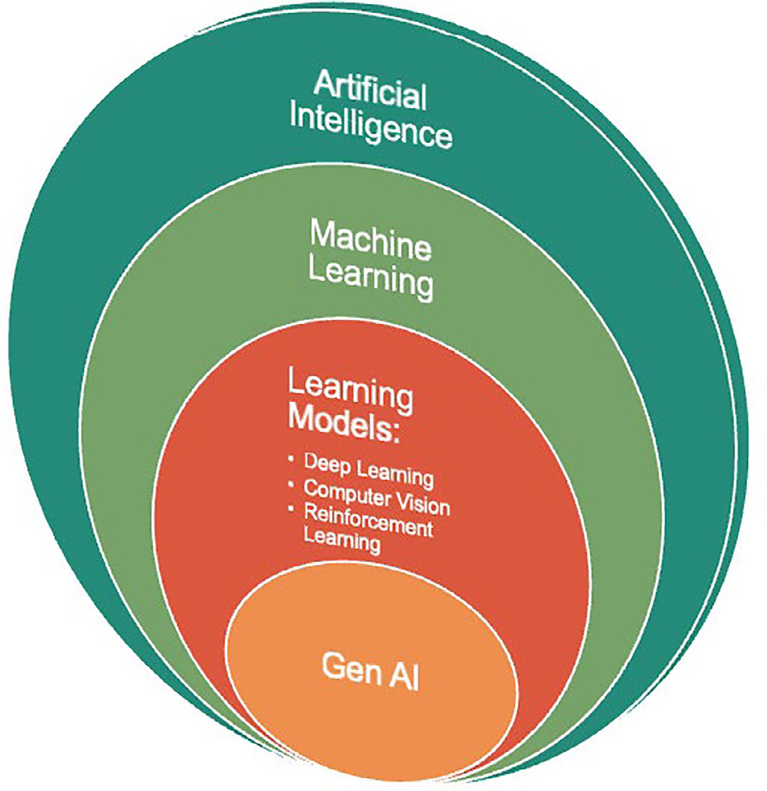
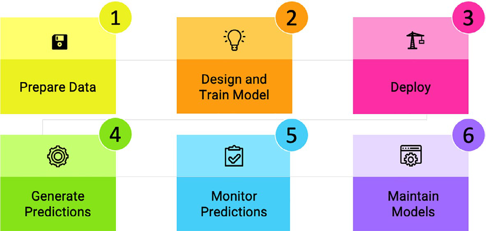
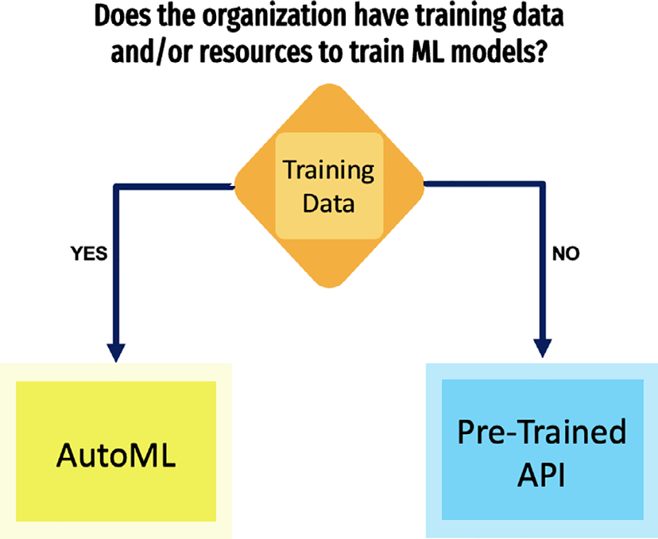
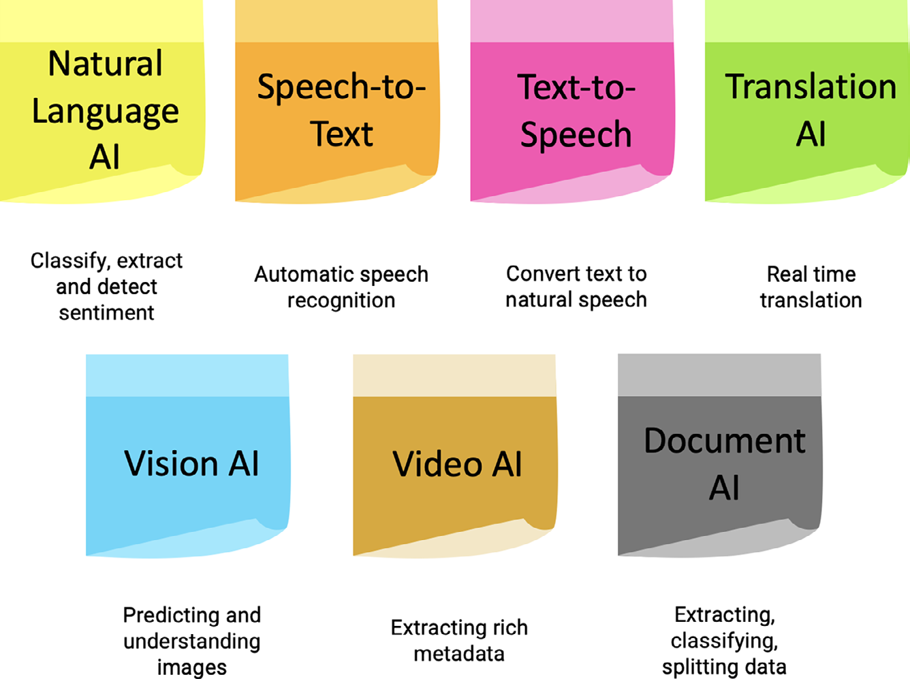

# GCP AI, ML And Vertex AI Services

## Overview

AI/ML trên GCP nên được nhìn như một workflow vận hành model, không chỉ là một nhóm API:

1. chuẩn bị dữ liệu và kiểm soát chất lượng;
2. chọn pretrained API, AutoML hoặc custom model;
3. train/test model trong môi trường kiểm soát;
4. deploy endpoint hoặc batch job;
5. monitor prediction quality, latency, cost, drift và data quality;
6. retrain, rollback hoặc retire model khi behavior không còn phù hợp.

GCP cung cấp nhiều managed service để giảm phần tự vận hành hạ tầng ML, nhưng team vẫn chịu trách nhiệm cho data governance, model objective, privacy, bias, evaluation, approval workflow, access control và incident response.

## AI, ML And GenAI Relationship



Mental model ngắn:

- **Artificial Intelligence (AI)**: mục tiêu rộng hơn, làm cho hệ thống có khả năng nhận biết, suy luận, phân loại, tạo nội dung hoặc hỗ trợ quyết định.
- **Machine Learning (ML)**: cách xây AI bằng training trên dữ liệu để model học pattern thay vì chỉ chạy rule thủ công.
- **Deep learning / computer vision / reinforcement learning**: nhóm kỹ thuật hoặc learning model cụ thể cho bài toán phức tạp hơn.
- **Generative AI**: nhóm model tạo nội dung mới như text, image, audio, video hoặc code dựa trên prompt/context.

Trong production, tên gọi ít quan trọng hơn câu hỏi: model nhận input gì, tạo output gì, output đó có được phép tự động hành động không, và ai chịu trách nhiệm khi output sai.

## Data Quality Is The Foundation

Model tốt phụ thuộc vào dữ liệu tốt. Dữ liệu thiếu, lệch, trùng, lỗi nhãn hoặc không đại diện cho tình huống production sẽ tạo model có vẻ tốt trong test nhưng sai trong thực tế.

Guardrails:

- Xác định nguồn dữ liệu, owner, retention, consent, classification và data residency.
- Tách training data, validation data và production inference data.
- Kiểm tra label quality, duplicate, missing value, outlier và class imbalance.
- Ghi lại dataset version để model có thể được reproduce hoặc rollback.
- Không đưa secret, credential, thông tin cá nhân không cần thiết hoặc dữ liệu regulated vào training nếu chưa có policy rõ.
- Với GenAI/RAG, kiểm soát prompt, context source, data leakage, hallucination và quyền truy cập tài liệu.

## ML Lifecycle



| Stage | Mục tiêu | Production concern |
|---|---|---|
| Prepare data | Làm sạch, chuẩn hóa, label và version dữ liệu | privacy, bias, lineage, reproducibility |
| Design/train model | Chọn approach, train, tune và evaluate | overfitting, cost, metric sai mục tiêu |
| Deploy | Đưa model ra endpoint/batch pipeline | rollout strategy, access control, quota, latency |
| Generate predictions | Nhận input thật và trả output | validation, confidence threshold, fallback |
| Monitor predictions | Theo dõi quality, drift, latency, error, cost | alerting, audit evidence, rollback signal |
| Maintain models | Retrain, promote, deprecate hoặc rollback | approval workflow, versioning, compatibility |

Không nên xem deploy model là điểm kết thúc. Với ML, production data thay đổi theo thời gian; drift và data quality regression là failure mode bình thường cần được monitor như latency/error trong service truyền thống.

## Vertex AI Service Boundary

Vertex AI là managed platform của GCP cho nhiều bước trong ML lifecycle: dataset, training, pipeline, model registry, endpoint deployment, prediction, monitoring và governance tích hợp với IAM/logging.

Nên dùng Vertex AI khi:

- cần một platform thống nhất cho model lifecycle thay vì các script rời rạc;
- team muốn dùng managed training/deployment thay vì tự vận hành ML cluster;
- cần tích hợp model endpoint với application/API;
- cần pipeline, model versioning, monitoring và approval workflow rõ hơn;
- cần dùng AutoML, custom training hoặc generative/foundation model capability trong cùng provider boundary.

Không nên coi Vertex AI là cách bỏ qua MLOps discipline. Nếu không có dataset governance, evaluation metric, rollback plan và owner rõ, managed platform chỉ làm model ra production nhanh hơn, không làm model an toàn hơn.

## AutoML, Custom Model Or Pretrained API



| Option | Dùng khi | Tradeoff |
|---|---|---|
| Pretrained API | Bài toán phổ biến như OCR, speech, translation, text classification, image/video analysis | nhanh, ít training; ít kiểm soát behavior nội bộ của model |
| AutoML | Có dữ liệu domain riêng nhưng muốn giảm công sức model engineering | cần dữ liệu tốt; vẫn phải evaluate, monitor và quản lý cost |
| Custom model | Cần architecture/tuning đặc thù, framework riêng hoặc yêu cầu kiểm soát sâu | linh hoạt nhất; vận hành phức tạp nhất |

Decision rule thực tế: nếu pretrained API đã đáp ứng chất lượng, latency, privacy và cost, không nên train model riêng chỉ vì muốn "custom". Nếu domain data là khác biệt cạnh tranh hoặc API chung không đủ chính xác, AutoML/custom model mới đáng cân nhắc.

## AutoML Workload Types

AutoML giúp giảm barrier cho một số bài toán phổ biến:

- **Tabular**: dự đoán hoặc phân loại trên dữ liệu dạng bảng.
- **Image**: image classification, object detection.
- **Video**: video classification, object tracking hoặc annotation.
- **Text**: document classification, entity extraction, sentiment.
- **Translation**: custom translation theo domain/ngôn ngữ khi model chung không đủ.

Không dùng AutoML như hộp đen không kiểm soát. Cần định nghĩa metric đúng với business risk, kiểm tra false positive/false negative, test dữ liệu edge case và xác định confidence threshold trước khi dùng output cho workflow tự động.

## Pretrained AI APIs



Pretrained APIs phù hợp khi team cần capability sẵn có qua API:

| API family | Use case |
|---|---|
| Natural Language | phân loại text, entity extraction, sentiment, content analysis |
| Speech-to-Text | chuyển audio/speech thành text |
| Text-to-Speech | tạo audio từ text |
| Translation | dịch text/document/application content |
| Vision | OCR, image labeling, object detection, image understanding |
| Video | object/scene annotation, metadata extraction, content moderation |
| Document AI | OCR, extraction, classification và xử lý document workflow |

Trước khi dùng pretrained API trong production, kiểm tra data residency, logging/retention, IAM, quota, latency, cost, fallback khi API lỗi và cách xử lý dữ liệu nhạy cảm.

## MLOps Production Guardrails

- **Ownership**: mỗi model cần owner, business objective, input contract, output contract và consumer rõ.
- **Evaluation**: test bằng dataset đại diện production, không chỉ demo case đẹp.
- **Security**: service account riêng, least privilege, secret không nằm trong notebook/pipeline.
- **Privacy**: phân loại dữ liệu trước khi train/inference; hạn chế PII, regulated data và customer-sensitive content.
- **Release**: dùng model versioning, canary/shadow evaluation hoặc staged rollout khi output ảnh hưởng workflow quan trọng.
- **Rollback**: giữ model version trước đó, endpoint config và pipeline artifact đủ để quay lại.
- **Observability**: monitor latency, error, request volume, cost, prediction distribution, drift và business metric.
- **Human-in-the-loop**: với quyết định rủi ro cao, model nên hỗ trợ con người thay vì tự động hành động không review.
- **Prompt/GenAI safety**: kiểm soát prompt injection, data exfiltration, hallucination, toxic output và policy bypass.

## Read-Only Validation Commands

Các lệnh dưới đây chỉ kiểm tra trạng thái tài nguyên. Không chạy thao tác deploy/delete/update nếu chưa có change plan, approval, rollback và validation criteria.

```bash
gcloud services list --enabled --filter="aiplatform.googleapis.com"
gcloud ai models list --region=<region>
gcloud ai endpoints list --region=<region>
gcloud ai custom-jobs list --region=<region>
```

## Risky Operations

Các thao tác sau có rủi ro production cao:

- xóa model version, endpoint hoặc dataset;
- deploy model mới vào endpoint production không canary;
- thay service account/IAM của pipeline hoặc endpoint;
- bật lifecycle cleanup cho artifact/dataset chưa có backup;
- dùng dữ liệu production nhạy cảm để train mà chưa sanitize hoặc chưa có approval;
- thay prompt/system instruction của GenAI workflow mà không regression test.

Ưu tiên read-only inventory, dry-run/evaluation trong môi trường tách biệt, model versioning, staged rollout và rollback plan.

## Related Pages

- [Google Cloud Platform Overview](./overview.md)
- [GCP Data, Analytics And Storage Services](./06-data-analytics-and-storage-services.md)
- [Cloud Ecosystem Overview](../overview.md)
