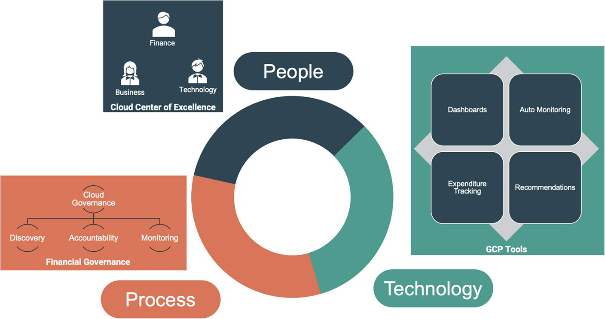
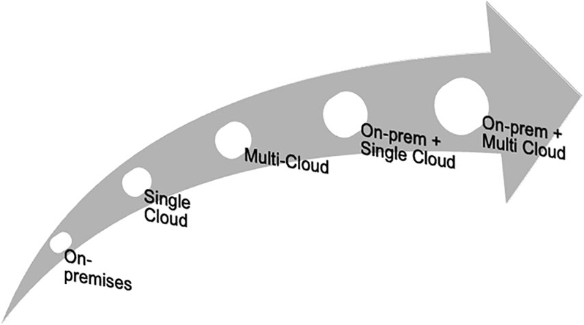
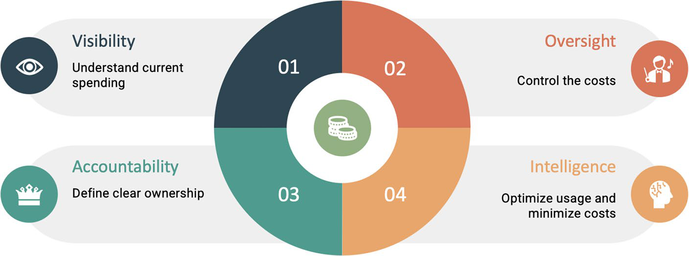

# GCP Financial Governance And FinOps

## Overview

Cloud financial governance khác on-premises ở điểm chi phí thay đổi theo usage gần như liên tục. Trên on-premises, nhiều khoản là capital expenditure đã được phê duyệt trước; trên cloud, team có thể tạo resource nhanh và biến chi phí thành operational expenditure theo giờ, theo request, theo GB, theo I/O hoặc theo data transfer.

FinOps không phải là chặn engineering dùng cloud. Mục tiêu đúng là tạo visibility, accountability và feedback loop để team ra quyết định kỹ thuật có thông tin chi phí, đồng thời vẫn giữ tốc độ delivery.

## People, Process And Technology



| Trụ cột | Vai trò |
|---|---|
| People | Finance, business owner và technology team cùng chịu trách nhiệm; CCoE/FinOps group định nghĩa guardrail và tradeoff |
| Process | Forecast, budget, tagging, review cadence, exception workflow, chargeback/showback |
| Technology | Billing report, budget alert, dashboard, billing export, Recommender, policy automation |

Cloud Center of Excellence hoặc FinOps group nên có đại diện từ business, finance và technology. Nếu chỉ finance kiểm soát, engineering thiếu context. Nếu chỉ engineering tự quản, chi phí dễ thành hậu quả phát hiện muộn trên invoice.

## Why Cloud Cost Governance Is Hard

- Resource có thể được tạo nhanh hơn chu kỳ phê duyệt tài chính truyền thống.
- Chi phí gắn với runtime behavior, không chỉ purchase order ban đầu.
- Multi-cloud và hybrid làm TCO khó tính hơn vì mỗi nền tảng có billing model, discount model và ownership khác nhau.
- Shared resource như network, logging, data warehouse, NAT, storage hoặc support plan khó phân bổ nếu không có label/project/account boundary.
- Budget alert cho biết chi tiêu vượt ngưỡng; nó không tự động đảm bảo workload an toàn hoặc tự rollback.

## TCO Complexity



Total Cost of Ownership cần nhìn cả direct cost và indirect cost:

- infrastructure/service usage;
- license/subscription/support;
- network egress và inter-region traffic;
- storage, snapshot, backup, retention;
- observability/logging cost;
- engineer/platform operation cost;
- migration, training, process change;
- opportunity cost của capital nếu tiếp tục đầu tư on-premises.

Không nên so sánh cloud với on-premises chỉ bằng giá VM/server. Với hybrid hoặc multi-cloud, chi phí vận hành, data movement, duplicate tooling và governance overhead thường là phần dễ bị bỏ sót.

## Financial Governance Principles



| Principle | Ý nghĩa trong GCP |
|---|---|
| Visibility | Biết đang dùng resource gì, ở project nào, service nào, owner nào, cost trend ra sao |
| Oversight | Có budget, alert threshold, approval path và review cadence |
| Accountability | Mỗi project/workload có budget owner và technical owner |
| Intelligence | Dùng billing analytics và Recommender để tìm tối ưu có evidence |

## GCP Cost Management Building Blocks

| Building block | Dùng để |
|---|---|
| Project boundary | Tách workload, team, environment hoặc cost owner |
| Labels | Phân bổ cost theo application, environment, owner, cost center, data classification |
| Billing reports | Quan sát spend theo service/project/SKU/time |
| Budgets and alerts | Cảnh báo khi chi phí tiến gần hoặc vượt threshold |
| Billing export to BigQuery | Phân tích cost chi tiết, dashboard tùy biến, anomaly detection nội bộ |
| Pricing Calculator | Ước lượng trước khi triển khai hoặc migration |
| Recommender | Nhận recommendation về idle/underutilized resource, rightsizing và policy optimization |

Budget và alert là signal, không phải control tuyệt đối. Nếu cần chặn tạo resource hoặc giới hạn blast radius, phải kết hợp IAM, org policy, quota, project boundary và approval workflow.

## Labeling Strategy

Label tối thiểu nên nhất quán trên resource hỗ trợ label:

| Label | Ví dụ |
|---|---|
| `application` | `billing-api` |
| `environment` | `prod`, `staging`, `dev` |
| `owner` | `team-platform` |
| `cost_center` | `cc-1234` |
| `data_classification` | `internal`, `confidential` |

Guardrails:

- Không đưa email cá nhân, tên khách hàng thật, ticket chứa thông tin nhạy cảm hoặc secret vào label.
- Chuẩn hóa lowercase/kebab-case nếu có thể.
- Kiểm tra coverage label định kỳ; resource không label nên có owner xử lý.
- Với shared service, dùng project/billing export để phân bổ theo usage metric nếu label không đủ.

## FinOps Operating Cadence

Một cadence thực tế:

1. Hàng ngày: platform/application owner xem anomaly, spend spike và resource mới bất thường.
2. Hàng tuần hoặc theo sprint: review budget burn rate, idle resource, scaling trend và Recommender.
3. Hàng tháng: chargeback/showback, forecast, committed-use/discount review nếu tổ chức dùng.
4. Trước release lớn: estimate cost impact, quota, data transfer và rollback cost.
5. Sau incident/traffic spike: phân tích cost impact cùng với RCA kỹ thuật.

FinOps tốt không chỉ hỏi "cắt chi phí ở đâu", mà hỏi "chi phí này có tạo value tương ứng không".

## Optimization Guardrails

Tối ưu chi phí có thể gây outage nếu làm máy móc. Trước khi hành động:

- Kiểm tra resource là production, shared service hay dependency ẩn.
- Xem metric sử dụng theo đủ chu kỳ business, không chỉ vài giờ thấp tải.
- Kiểm tra backup, snapshot, retention và rollback.
- Review SLO/SLA, capacity buffer và peak/seasonal pattern.
- Với database/storage/logging, xác nhận dữ liệu có thể xóa/chuyển class theo policy.
- Tách recommendation thành read-only review, change proposal, rollout và validation.

Thao tác rủi ro cao gồm xóa resource để giảm bill, giảm size database/VM không test, giảm replica, giảm retention log/backup, xóa snapshot, đổi storage class/lifecycle delete rule, hoặc tắt service monitoring để giảm chi phí.

## Read-Only Checks

Các lệnh dưới đây chỉ phục vụ inventory cơ bản. Không dùng output để xóa/tối ưu ngay nếu chưa có owner và change plan.

```bash
gcloud projects describe <project-id>
gcloud billing projects describe <project-id>
gcloud compute instances list --project=<project-id>
gcloud storage buckets list --project=<project-id>
```

Với phân tích cost chi tiết, ưu tiên Billing reports hoặc billing export to BigQuery để tránh suy luận từ inventory đơn lẻ.

## Related Pages

- [Google Cloud Platform Overview](./overview.md)
- [GCP Data, Analytics And Storage Services](./06-data-analytics-and-storage-services.md)
- [Cloud Ecosystem Overview](../overview.md)
