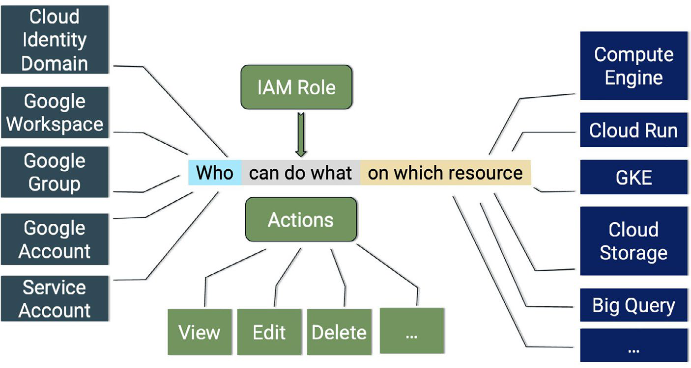
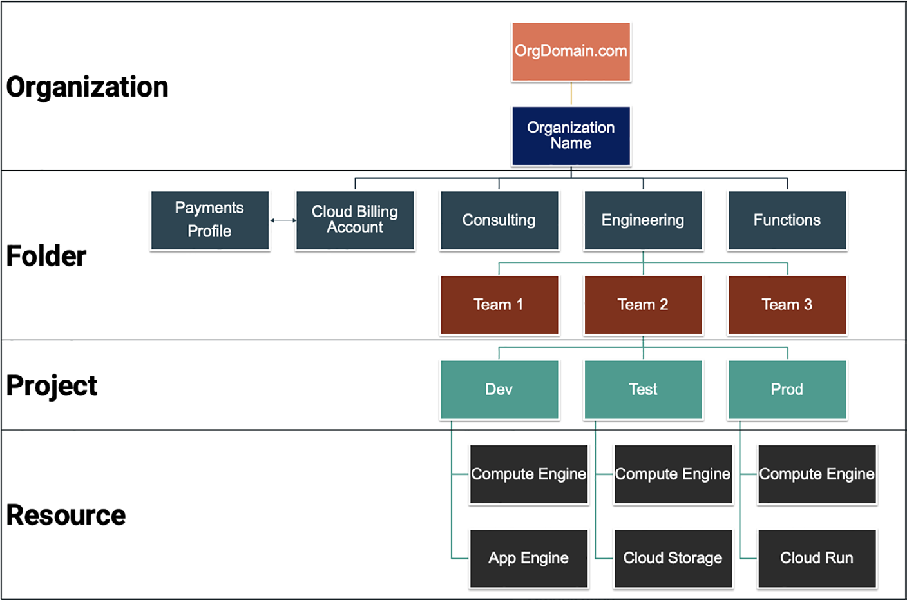

# GCP Identity, Security And Resource Hierarchy

## Overview

GCP security nên được đọc qua ba lớp:

1. **Shared responsibility**: Google vận hành cloud foundation và service boundary; customer vẫn chịu trách nhiệm cho data, IAM, configuration, application behavior, logging, retention và compliance process nội bộ.
2. **IAM policy model**: ai được làm hành động gì trên resource nào.
3. **Resource hierarchy**: organization, folder, project và resource quyết định nơi policy được gắn và cách inheritance hoạt động.

Không nên hiểu "managed cloud an toàn" là "không cần security engineering". Cloud provider cung cấp control; organization phải cấu hình, audit và vận hành control đó đúng cách.

## Security, Privacy, Compliance And Availability

| Khái niệm | Cách hiểu trong cloud |
|---|---|
| Security | control bảo vệ data, application và infrastructure khỏi truy cập/sửa/xóa/phá hoại trái phép |
| Privacy | quyền kiểm soát dữ liệu cá nhân/tổ chức: thu thập gì, dùng cho mục đích gì, chia sẻ với ai, giữ bao lâu |
| Compliance | bằng chứng rằng hệ thống tuân theo luật, tiêu chuẩn, policy hoặc cam kết hợp đồng |
| Availability | khả năng service/data sẵn sàng khi người dùng cần, theo thiết kế HA/SLO/SLA và recovery plan |

Security và privacy không giống nhau. Một bucket có thể mã hóa tốt nhưng vẫn vi phạm privacy nếu dữ liệu bị thu thập quá mức hoặc cấp quyền xem cho sai nhóm.

## GCP Data And Security Boundary

Ở mức mental model:

- Customer là data owner/controller cho dữ liệu của mình.
- GCP vận hành provider platform, physical security, managed service infrastructure và các control bảo mật nền.
- Customer cấu hình IAM, network exposure, encryption option, log/audit, retention, backup, data sharing và compliance evidence.

Các cam kết/certification của provider nên được dùng như bằng chứng đầu vào cho risk assessment, không thay thế audit nội bộ. Khi cần bằng chứng compliance chính thức, phải kiểm tra tài liệu/certification hiện hành của Google Cloud thay vì dựa vào note tĩnh.

## IAM Policy Model



IAM trả lời câu hỏi:

```text
principal
-> role / permission
-> resource
```

| Thành phần | Ý nghĩa |
|---|---|
| Principal | user, group, service account, Google Workspace/Cloud Identity identity hoặc workload identity |
| Permission | quyền thao tác cụ thể như `compute.instances.get` hoặc `storage.objects.create` |
| Role | nhóm permission được gán cho principal |
| Resource | organization, folder, project hoặc service resource cụ thể |
| IAM policy | binding giữa principal, role và resource |

Role có ba nhóm chính:

- **Basic roles**: owner/editor/viewer; dễ dùng nhưng thường quá rộng cho production.
- **Predefined roles**: role do Google quản lý theo từng service/job function; thường là lựa chọn mặc định tốt hơn basic role.
- **Custom roles**: role tự định nghĩa khi predefined role vẫn quá rộng; cần owner, review định kỳ và lifecycle rõ.

Least privilege không chỉ là chọn role nhỏ nhất một lần. Nó là quy trình liên tục: cấp quyền theo nhu cầu, dùng group/service account đúng chỗ, audit quyền thực tế, loại bỏ quyền không dùng và kiểm soát break-glass access.

## Service Accounts

Service account là identity cho workload, automation, VM, CI/CD hoặc service-to-service call. Đây thường là điểm rủi ro lớn vì quyền của service account có thể bị lạm dụng bởi workload hoặc key bị lộ.

Guardrails:

- Dùng service account riêng cho từng workload/pipeline quan trọng.
- Tránh cấp `Owner`/`Editor` cho default service account.
- Hạn chế long-lived service account key; ưu tiên workload identity/federation hoặc short-lived credential khi có thể.
- Audit quyền `iam.serviceAccounts.actAs`, key creation và key usage.
- Xoay hoặc xóa key không dùng; không commit key vào repo, image, notebook hoặc secret không kiểm soát.

## Resource Hierarchy



GCP resource hierarchy thường được đọc như sau:

```text
Cloud Identity / Google Workspace domain
-> Organization
-> Folder
-> Project
-> Resource
```

| Level | Dùng để |
|---|---|
| Organization | top-level boundary cho domain/company; nơi gắn policy toàn cục |
| Folder | gom business unit, department, platform, environment hoặc portfolio |
| Project | boundary chính cho resource, API enablement, quota, IAM, billing attribution |
| Resource | VM, bucket, dataset, database, endpoint, service account, v.v. |

Policy ở level cao có thể được kế thừa xuống level thấp. Điều này giúp nhất quán, nhưng cũng làm blast radius lớn nếu gán quyền quá rộng ở organization/folder.

Production patterns:

- Tách project theo environment (`dev`, `staging`, `prod`) để giảm blast radius.
- Tách project cho shared platform service nếu cần boundary rõ về IAM, billing và audit.
- Dùng folder cho business unit hoặc platform domain, không dùng folder như naming decoration.
- Gắn policy rộng ở organization/folder chỉ khi có governance rõ và được review.
- Với workload regulated, tách project/folder theo data classification hoặc compliance boundary.

## Common Threats And Control Mapping

| Threat | Control direction |
|---|---|
| Phishing / credential theft | MFA, phishing-resistant authentication, group-based access, alert on suspicious login |
| Malware / ransomware | endpoint protection, backup/restore test, least privilege, network segmentation |
| Misconfiguration | policy-as-code, security review, audit log, config scanning, change control |
| Unsecured third-party integration | vendor risk review, scoped service account, API gateway, logging, contract controls |
| Public data exposure | public access prevention, IAM audit, bucket policy review, DLP/classification |
| Over-privileged service account | least privilege, key restrictions, workload identity, IAM recommender/review |

Threat prevention không chỉ là product purchase. Cần kết hợp identity, network, logging, data protection, secure SDLC, backup và incident response.

## Read-Only Validation Commands

Các lệnh dưới đây chỉ kiểm tra inventory/policy. Không chạy `set-iam-policy`, `add-iam-policy-binding`, `remove-iam-policy-binding`, xóa service account/key hoặc thay org policy nếu chưa có change plan và rollback.

```bash
gcloud organizations list
gcloud resource-manager folders list --organization=<organization-id>
gcloud projects list
gcloud projects get-iam-policy <project-id>
gcloud iam roles describe roles/compute.viewer
gcloud iam service-accounts list --project=<project-id>
```

## Risky IAM Operations

Các thao tác sau có rủi ro production cao:

- cấp `roles/owner`, `roles/editor` hoặc quyền wildcard ở organization/folder;
- thay IAM policy bằng file đầy đủ mà không merge với policy hiện có;
- xóa service account đang được workload production dùng;
- xóa hoặc disable service account key mà chưa xác định consumer;
- thay custom role, làm mất permission mà workload cần;
- thay organization policy, VPC Service Controls hoặc public access policy;
- cấp `serviceAccountUser` / `iam.serviceAccounts.actAs` quá rộng.

Rollback cần có bản policy trước thay đổi, owner xác nhận, thời gian triển khai, validation read-only sau thay đổi và đường break-glass được kiểm soát.

## Related Pages

- [Google Cloud Platform Overview](./overview.md)
- [Privacy, Compliance, Cryptography And Data Protection](../../../05-Infrastructure-Automation/02-security-and-hardening/00-fundamentals/02-privacy-compliance-cryptography-and-data-protection.md)
- [Threat Actors, Malware And Attack Patterns](../../../05-Infrastructure-Automation/02-security-and-hardening/00-fundamentals/03-threat-actors-malware-and-attack-patterns.md)
- [Identity, Authentication And Authorization](../../../05-Infrastructure-Automation/02-security-and-hardening/01-access-control/01-identity-authentication-authorization.md)
