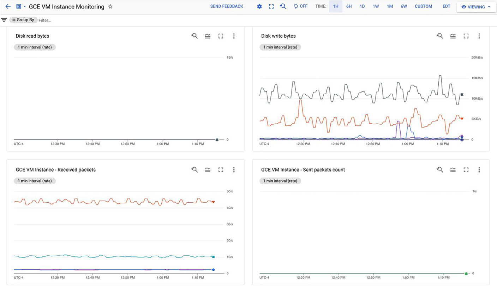

# GCP Operations, Monitoring And Observability

## Overview

Operations giữ service ổn định sau khi đã deploy. Với cloud, operations không chỉ là restart resource khi lỗi; nó gồm monitoring, logging, tracing, profiling, incident management, change management, SLO/error budget và automation feedback loop.

GCP cung cấp nhiều managed observability services, nhưng service tool không tự tạo operability. Team vẫn cần xác định SLI/SLO, alert có hành động, dashboard phục vụ debug, log retention phù hợp, trace sampling, on-call ownership và runbook.

## GCP Observability Service Map

| Need | GCP service | Mental model |
|---|---|---|
| Metrics, dashboard, alerting, SLO monitoring | Cloud Monitoring | đo health, saturation, latency, availability và trigger alert |
| Centralized logs, query, retention, routing | Cloud Logging | lưu, tìm kiếm, phân tích và route log |
| Error grouping and lifecycle | Error Reporting | gom lỗi ứng dụng theo nhóm, tần suất và trạng thái xử lý |
| Distributed tracing | Cloud Trace | nhìn request path và latency breakdown qua nhiều component |
| Continuous profiling | Cloud Profiler | tìm CPU/memory/function hotspot trong code production |

## Cloud Monitoring



Cloud Monitoring dùng cho metrics, dashboard, alert policy, notification channel và SLO monitoring. Dashboard giúp điều tra; alert phải có hành động rõ.

Production guardrails:

- Alert theo user-facing symptom hoặc SLO burn rate trước, không chỉ CPU cao.
- Với metric hạ tầng, xác định nó là symptom, saturation signal hay root-cause hint.
- Notification channel cần owner/on-call rõ, không gửi tất cả alert vào một kênh chung không ai chịu trách nhiệm.
- Dashboard cần phục vụ workflow debug: service health, dependency, recent deploy, error, latency, traffic, saturation.
- SLO alert nên có runbook: triage, mitigation, rollback, escalation và evidence cần giữ.

## Cloud Logging

Cloud Logging gom log từ GCP service và application. Nó phù hợp cho troubleshooting, audit evidence, compliance và correlation với metrics/traces.

Guardrails:

- Dùng structured logging khi có thể: severity, service, environment, trace ID, request ID, tenant hoặc safe correlation ID.
- Không log secret, token, password, private key, full PII hoặc payload nhạy cảm không cần thiết.
- Thiết kế retention theo compliance và chi phí; không giữ log vô hạn chỉ vì dễ.
- Dùng log sink để route log sang Cloud Storage, BigQuery, Pub/Sub hoặc hệ thống bên ngoài khi cần phân tích/lưu trữ riêng.
- Kiểm soát high-cardinality field nếu log được index hoặc biến thành metric.

## Error Reporting

Error Reporting gom các error tương tự để giảm nhiễu và hỗ trợ lifecycle từ phát hiện đến resolve/mute.

Nó hữu ích khi:

- cần biết lỗi mới xuất hiện sau deploy;
- cần gom stack trace tương tự;
- cần ưu tiên lỗi theo tần suất/impact;
- cần theo dõi lỗi đã known hoặc đã resolve.

Không nên mute lỗi chỉ để dashboard sạch. Known error vẫn cần owner, điều kiện chấp nhận rủi ro và ngày review.

## Cloud Trace

Trace trả lời câu hỏi request đi qua những service nào và mất thời gian ở đâu. Đây là signal chính cho microservices, API gateway, service-to-service call, cache/database latency và dependency bottleneck.

Guardrails:

- Propagate trace context qua service boundary.
- Giữ trace ID trong log để correlation.
- Kiểm soát sampling để cân bằng chi phí và khả năng bắt lỗi hiếm.
- Không dùng trace thay thế metrics hoặc logs; trace giải thích path/timing, metrics đo trend và alert, logs giữ context sự kiện.

## Cloud Profiler

Profiler giúp tìm hotspot trong CPU, memory allocation hoặc function execution. Nó phù hợp khi latency/cost đến từ code path cụ thể nhưng metrics/logs chưa đủ chỉ ra đoạn code.

Guardrails:

- Bật profiling có kiểm soát theo runtime/service được hỗ trợ.
- Kiểm tra overhead và dữ liệu nhạy cảm trước khi dùng production.
- Dùng profiler để tạo hypothesis rồi validate bằng benchmark/load test, không tối ưu mù quáng theo một snapshot.

## SLA, SLO, SLI And Error Budget

- **SLA**: cam kết giữa provider và customer; thường có điều khoản tài chính/pháp lý.
- **SLO**: mục tiêu reliability nội bộ hoặc trong hợp đồng, ví dụ availability/latency/error rate.
- **SLI**: số đo thực tế của service so với SLO.
- **Error budget**: phần lỗi được phép trước khi SLO bị vi phạm.

Không đưa con số SLA cụ thể vào runbook tĩnh nếu chưa kiểm tra tài liệu hiện hành. Với GCP managed service, phải đọc SLA/current terms chính thức cho service và region/mode triển khai đang dùng.

## Read-Only Checks

```bash
gcloud monitoring policies list --project=<project-id>
gcloud logging sinks list --project=<project-id>
gcloud logging buckets list --project=<project-id>
gcloud services list --enabled --project=<project-id>
```

Các lệnh này chỉ inventory. Không thay alert policy, log sink, retention hoặc notification channel trong production nếu chưa có owner, rollback và validation.

## Risky Operations

- Xóa hoặc disable alert policy mà không có tracking.
- Giảm log retention hoặc xóa log bucket khi còn nhu cầu audit/RCA.
- Thay log sink destination làm mất evidence.
- Tăng trace/profile sampling quá cao gây cost spike.
- Giảm sampling quá thấp làm mất khả năng debug lỗi hiếm.
- Mute known error mà không có owner hoặc expiry.
- Dựa vào dashboard mà không có alert/runbook.

## Related Pages

- [Google Cloud Platform Overview](./overview.md)
- [SRE Concepts](../../../01-architecture/05-sre-and-operations-principles/01-sre-concepts.md)
- [Observability And Monitoring](../../../05-Infrastructure-Automation/01-observability-and-monitoring/overview.md)
- [DevOps Lifecycle, Environments And Interview Flow](../../../05-Infrastructure-Automation/03-cicd-devops-integration/00-devops-lifecycle-environments-and-interview-flow.md)
