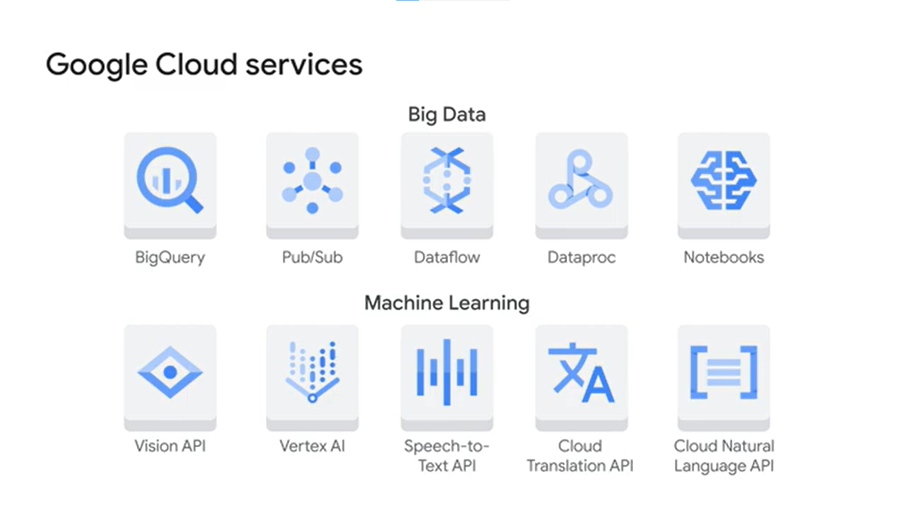

# Google Cloud Platform Overview

## Overview

Note này là service map cơ bản để đặt GCP vào cùng hệ quy chiếu với AWS/OpenStack: compute, container, serverless, storage, database, data/ML và operations boundary.

## Operating Boundary

GCP vẫn cần được đọc qua shared responsibility model: Google vận hành phần cloud foundation và managed service boundary theo từng service, còn organization vẫn chịu trách nhiệm cho identity, access policy, tenant configuration, content/data, application behavior, logging/monitoring mà mình phải bật, backup/retention và compliance process nội bộ.

Không nên suy luận rằng dùng PaaS/SaaS trên GCP thì mọi trách nhiệm security/operation đã chuyển hết cho Google. Với mỗi service, cần xác định cụ thể phần nào thuộc GCP, phần nào thuộc team platform/application/security, rồi mapping thành IAM, network exposure, audit log, encryption, backup và incident response control.

## Infrastructure And Resilience

- [GCP Regions, Zones, Network And Resilience](./01-regions-zones-network-and-resilience.md)

## Identity, Security And Governance

- [GCP Identity, Security And Resource Hierarchy](./09-identity-security-and-resource-hierarchy.md)

GCP security bắt đầu từ shared responsibility, IAM, resource hierarchy, project boundary và auditability. Các thay đổi IAM ở organization/folder/project có blast radius lớn, nên cần read-only review, owner rõ và rollback policy trước khi áp dụng.

## Compute, Containers And Hosting

- [GCP Compute Engine, VMware Engine And Bare Metal](./02-compute-engine-vmware-and-bare-metal.md)
- [GKE, Anthos And Container Platforms](./03-gke-anthos-and-container-platforms.md)
- [App Engine, Cloud Run And Cloud Functions](./04-app-engine-cloud-run-and-cloud-functions.md)
- [API Management And Apigee](./05-api-management-and-apigee.md)

| Service | Mental model |
|---|---|
| Compute Engine | VM/IaaS, linh hoạt nhất nhưng tự quản lý nhiều nhất |
| Google Kubernetes Engine | managed Kubernetes cho workload container |
| Anthos | hybrid/multi-cloud Kubernetes và application modernization governance |
| App Engine | PaaS cho app, giảm phần quản lý hạ tầng |
| Cloud Run | serverless container cho workload stateless |
| Cloud Functions | function-as-a-service theo event |
| Apigee | API management, gateway, governance và developer portal |

Khi chọn compute, câu hỏi chính là muốn kiểm soát bao nhiêu và muốn giảm vận hành ở tầng nào. Compute Engine cho quyền kiểm soát cao, GKE giữ Kubernetes API nhưng giảm cluster operations, Cloud Run/Functions giảm vận hành hơn nữa nhưng ép app theo mô hình stateless/event-driven hơn.

## Storage And Database

- [GCP Data, Analytics And Storage Services](./06-data-analytics-and-storage-services.md)

| Service | Dùng khi |
|---|---|
| Cloud Storage | object/file unstructured, static asset, backup, data lake |
| Cloud SQL | relational database managed |
| Spanner | relational/distributed transaction workload cần scale lớn và HA cao |
| Cloud Bigtable | wide-column workload throughput cao, time-series/IoT/event data |
| Firestore | document database cho web/mobile/serverless application |
| BigQuery | serverless data warehouse cho analytics và BI |
| Looker | semantic BI layer, dashboard và embedded analytics |

Cloud Storage tương đương mental model object storage. Cloud SQL phù hợp khi cần MySQL/PostgreSQL/SQL Server managed. Spanner là lựa chọn đặc thù hơn, dùng khi cần scale phân tán và consistency mạnh hơn mức database managed phổ thông.

## Big Data And Machine Learning

- [GCP AI, ML And Vertex AI Services](./07-ai-ml-and-vertex-ai-services.md)

Nhóm data/ML của GCP thường nhấn vào managed/serverless để giảm vận hành cluster:

- ingest và xử lý dữ liệu quy mô lớn;
- analytics;
- machine learning workflow;
- giảm burden về scalability, availability, security và compliance ở tầng hạ tầng.

## Operations, Governance And Cost

- [GCP Financial Governance And FinOps](./08-financial-governance-and-finops.md)
- [GCP Operations, Monitoring And Observability](./10-operations-monitoring-and-observability.md)

GCP cost governance cần được vận hành như feedback loop liên tục: visibility, budget/alert, owner, label, usage review, recommendation và optimization có rollback. Không nên chờ invoice cuối kỳ mới phát hiện overspend.

GCP operations cần nối Cloud Monitoring, Cloud Logging, Error Reporting, Cloud Trace và Cloud Profiler với SLO, alert, runbook, incident management và postmortem; dashboard không thay thế cho ownership và action.

## Related Pages

- [Cloud Ecosystem Overview](../overview.md)
- [Cloud Fundamentals](../../01-cloud-fundamentals/overview.md)
- [Cloud Computing Core Mechanisms](../../01-cloud-fundamentals/01-cloud-computing-core-mechanisms.md)
