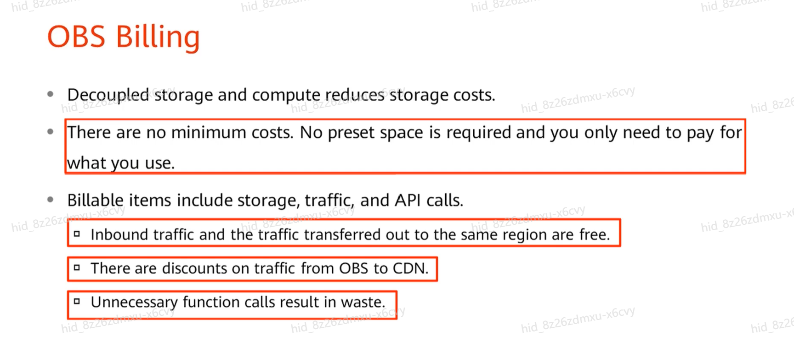
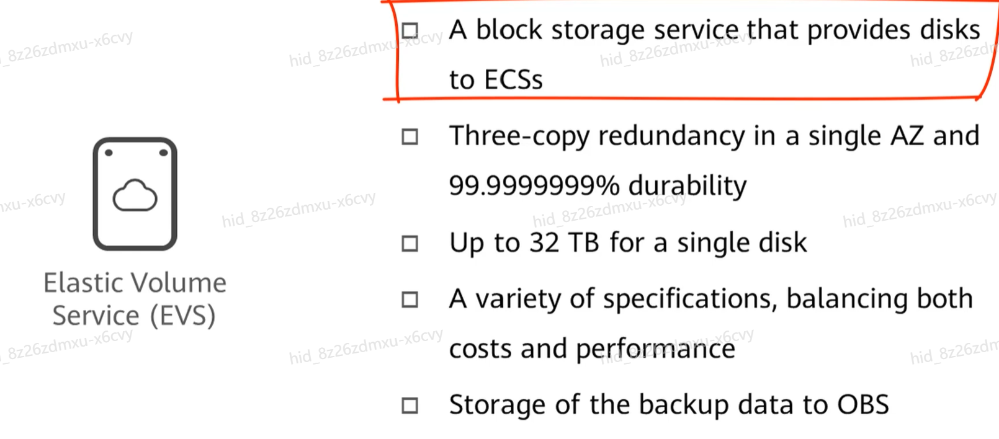
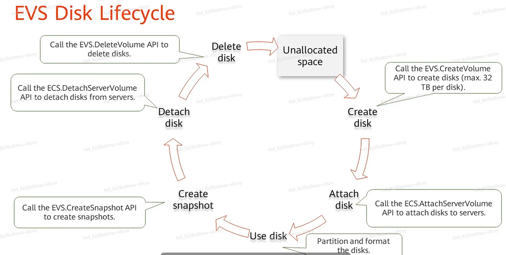
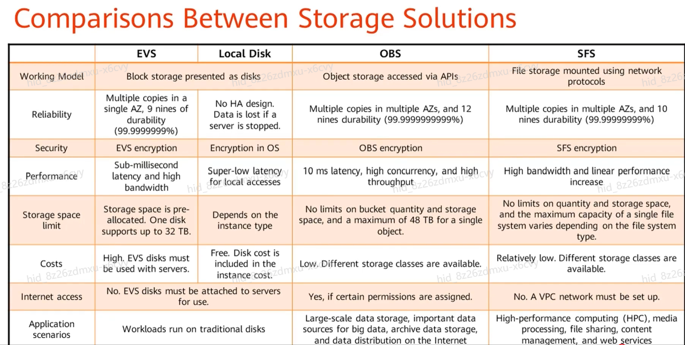

# Overview 

Objectives :
- How common Huawei Cloud storage services work and their usecases.
- Understand the features of cloud storage  and think about 
+ Management complexity and cost control.
+ Choices between cloud computing and in-house technologies 

Storage Services :
- Object Storage Service - OBS 
- Elastic Volmn Service - EVS
- Scalable File Service - SFS
- Dedicated Distributed Storage Service - DSS 

## OBS 
### Hightlight 
- Fully managed object storage service
- Support for access over the Internet
- Unlimited storage capacity (single objects up to 48 TB)
- Data reliability of 99.9999999999% (12 nines)
- Event triggering capabilities
- Cost-effective storage solutions
- Supports multiple access methods:
- OBS Browser+
- OBS command line tools
- APIs and SDKs
- OBS Console

### Terms 
- Bucket: Primary management unit in OBS where objects are stored
- Object: Consists of data and metadata (describing data attributes)
- Object Name: Unique identifier for each object
- Storage Capacity: No limits on total amount of data stored

**Object URL**
Each object in OBS has a unique URL that can be used to access the object over the Internet. The URL format is:
https://bucketname.obs.region-id.myhuaweicloud.com/objectname
### OBS permission Settings
- Fine-grained access control through:

+ Bucket policies

+ Access Control Lists (ACLs)

+ IAM policies

- Support for public and private bucket configurations

- Temporary access through signed URLs
### OBS Versioning 
Versioning capability to preserve, retrieve, and restore every version of an object

Protection against accidental overwrites and deletions

Can be enabled at the bucket level
### Archive Data 
Multiple storage classes available:

Standard: For frequently accessed data

Infrequent Access: For less frequently accessed data

Archive: For rarely accessed data with retrieval time of several minutes

Cold Archive: For rarely accessed data with retrieval time of several hours
### Object Lifecycle Management (OBS)
Automated policy-based management of object transitions between storage classes

Automated deletion of objects after specified periods

Cost optimization through automatic movement to cheaper storage classes
### Typical Usecases 

- Data storage and backup 
- Data distributoion source
- Static website hosting 
- Core storage for datalakes

### Billing 

No minimum cost or upfront fees

Pay-only-for-what-you-use model

Pricing based on:

Storage capacity used

Number of requests

Data transfer outbound

Optional services (e.g., cross-region replication)

## EVS - Elastic Volume Service
### Hightlight

Block storage service for Elastic Cloud Servers (ECS)

High performance, low latency storage

Multiple disk types:

Common I/O

High I/O

Ultra-high I/O

Scalable capacity with flexible expansion

Data encryption capabilities

### EVS high reliability design - Three-copy Redundancy 
Data automatically replicated across three physical disks

Synchronous writing ensures data consistency

Automatic data recovery in case of disk failure

99.9999999% (9 nines) data durability
### EVS high reliability design - backup 
Manual or automatic backup capabilities

Incremental backups to save storage space

Cross-region backup support for disaster recovery

Point-in-time recovery capability
### EVS high reliability design - snapshots
Create point-in-time copies of EVS disks

Full and incremental snapshot support

Use snapshots to create new disks or roll back data

Snapshot chains maintain data change history
### EVS Disk lifecycle 

Create: Provision new disk

Attach: Connect to ECS instance

Use: Read/write operations

Detach: Disconnect from instance

Delete: Remove disk and data
### Usecases and applicable features
- System disks : High IOPS and low latency 
- Databases : Persistent storage
- Applications running durable services : High data reliability 
- Sensitive enterprise application : EVS encryption

### Billing

- Two payment modes:

+ Yearly/Monthly: Prepaid with discounts for long-term use

+ Pay-Per-Use: Postpaid based on actual usage

- Pricing based on:

+ Allocated disk size

+ Disk type (performance level)

+ Snapshot storage (if applicable)

- Unit prices vary by region

## ECS Local disk 
### Highlights
Physically attached storage to the host server

Super low access latency

Super high IOPS performance

Available only for specific instance types (e.g., i3, d6)

No extra fees after instances are purchased

Data is lost if ECS instances are stopped or crashed

> Important Notes
Does not support three-copy redundancy

Data reliability is lower than EVS

Suitable for temporary data, cache, or scratch space

Not recommended for persistent or critical data

## Compare EVS disks and local disks and OBS 
- Both EVS disks and local disks are block storage decives => can be use directly by ECS 
- OBS store as objects 

## SFS 
### Hightlight
Fully managed shared file storage service

Standard NFS protocol support (v3 and v4.1)

Partial CIFS protocol support

Three-copy redundancy with 99.9999999% (9 nines) durability

Elastic scaling of file system capacity

Linear performance scaling with capacity

Multiple performance tiers available
### SFS Network Management
Integration with Virtual Private Cloud (VPC)

Security group controls for access management

Mount targets for file system access

Cross-VPC access support through peering connections

Encryption in transit and at rest

## DSS Dedicated Distributed Storage Service
- Dedicated storage hardware for higher security

- Physical isolation for compliance requirements

- Customizable performance parameters

- Suitable for regulated industries:

+ Finance

+ Government

+ Healthcare
## Comparison between storage Solutions 

The image provides a comprehensive comparison of Huawei Cloud storage services across these dimensions:

Performance characteristics (IOPS, latency, throughput)

Use case suitability

Access protocols

Scalability limits

Data durability and availability

Cost structure

## Management Complexity and Cost Control Considerations
OBS: Lowest management overhead, pay-per-use model, ideal for variable workloads

EVS: Moderate management, predictable costs with yearly/monthly option, suitable for steady workloads

SFS: Higher management than OBS but less than self-managed NAS, good for shared file needs

Local Disks: No management but data volatility risk, included in instance cost

## Cloud Computing vs. In-House Technologies
Scalability: Cloud storage offers instant elasticity vs. planned capacity expansion

Cost: OpEx model vs. CapEx investment in hardware

Management: Fully managed services vs. in-house administration

Reliability: Enterprise-grade durability vs. variable on-premises reliability

Security: Cloud security features vs. physical control of on-premises systems

Compliance: Cloud certifications vs. self-managed compliance programs
