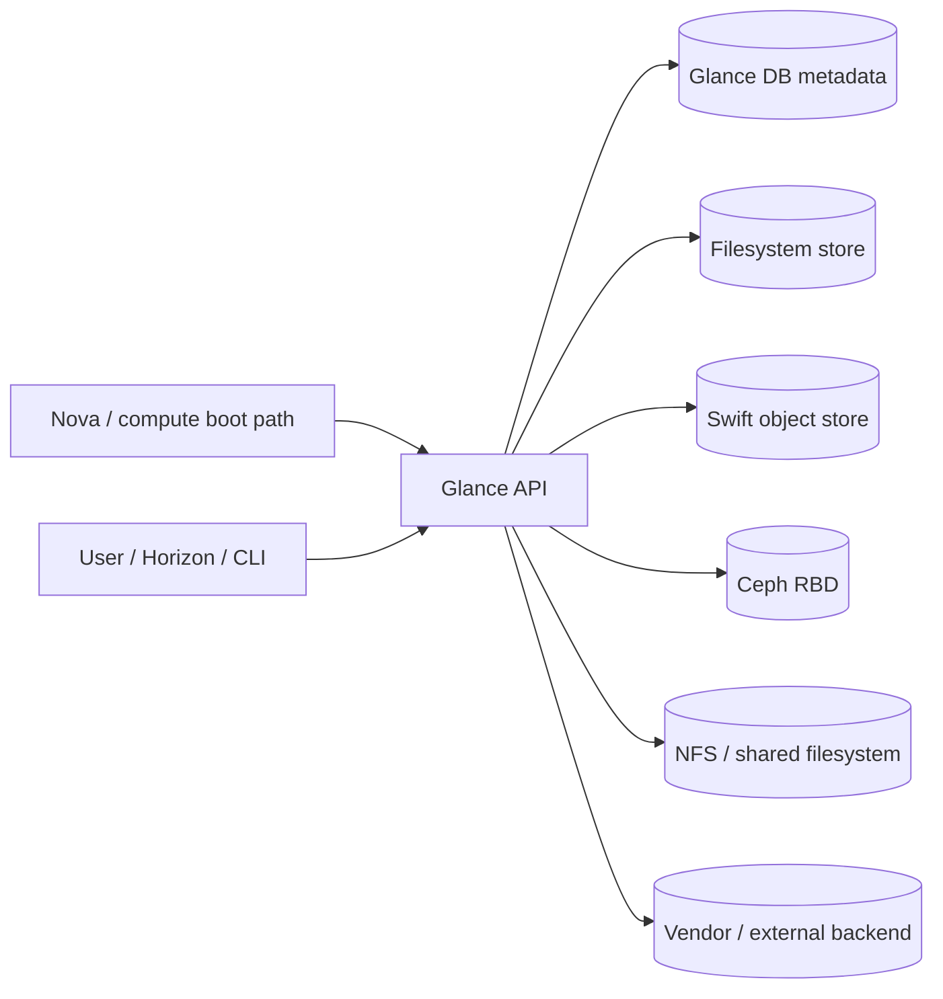

# Kiến trúc OpenStack

OpenStack được định nghĩa rõ nhất qua use cases thực tế của người dùng và contributor. Mỗi tổ chức tiếp cận OpenStack với mục tiêu khác nhau: nhà cung cấp hosting như Rackspace dùng nó để xây dựng nền tảng multitenant shared services; doanh nghiệp khác lại dùng để provisioning compute & data cho ứng dụng business intelligence phân tán. Dù use case của bạn là gì, vẫn có một số đặc điểm cốt lõi không thay đổi.

1. OpenStack – An API
- Một trong những mục tiêu ban đầu của OpenStack là cung cấp API tương thích với Amazon Web Services. Ngày nay, nhiều tổ chức lớn sử dụng OpenStack làm lớp IaaS nền tảng để xây dựng PaaS hoặc Hybrid Cloud.
- Mọi tính năng của OpenStack đều được expose qua REST API. Bạn có thể tương tác qua command-line (nova legacy hoặc openstack CLI) và giao diện web Horizon, nhưng phần lớn hoạt động giữa các component và người dùng đều diễn ra qua API. Điều này mang lại 3 lợi ích cực lớn:
    - Toàn bộ hệ thống có thể tự động hóa hoàn toàn
    - Việc tích hợp với các hệ thống khác trở nên rõ ràng và chuẩn hóa
    - Mọi use case đều có thể định nghĩa rõ ràng và tự động kiểm thử

2. OpenStack – Open Source Project
- OpenStack là dự án mã nguồn mở với cộng đồng contributor cực lớn từ nhiều tổ chức. Ban đầu được tạo bởi NASA và Rackspace. Hiện nay Rackspace vẫn đóng góp mạnh, nhưng contributor chính đến từ Red Hat, IBM, HP, Mirantis, CloudBase… Các đóng góp bao gồm driver cho hardware cụ thể (Cinder, Neutron), bug fix và tính năng mới.
- Dự án được quản trị bởi OpenStack Foundation (miễn phí tham gia, hiện có hàng nghìn thành viên).
    - Vấn đề kỹ thuật do Technical Committee 13 người (được bầu bởi thành viên cá nhân) quyết định.
    - Vấn đề chiến lược và tài chính do Board of Directors (có cả thành viên từ sponsor doanh nghiệp và thành viên bầu) chịu trách nhiệm.

- OpenStack được viết bằng Python và thường triển khai trên Linux. Mã nguồn công khai hoàn toàn, ai cũng có thể contribute sau khi qua quy trình review và testing nghiêm ngặt.
3. OpenStack – Private Cloud Platform
- OpenStack cung cấp bộ module cần thiết để xây dựng private cloud tự động hóa. Ban đầu tập trung mạnh vào IaaS (kiểu AWS), nhưng các project mới đang dần bổ sung khả năng gần với PaaS.
- Điểm cốt lõi quan trọng nhất của OpenStack khi làm private cloud là tenant model (hay project model). 
    - Toàn bộ authentication & authorization được xử lý bởi Keystone (Identity Service). 
    - Mọi tài nguyên (virtual hoặc physical) đều tồn tại bên trong một không gian riêng biệt gọi là tenant/project. 
    - Phiên bản Keystone mới còn bổ sung khái niệm domain ở mức cao hơn.
> Khả năng phân chia an toàn và bảo mật compute, network, storage giữa các tenant chính là thứ khiến OpenStack khác biệt hoàn toàn so với virtualization truyền thống trong data center, và biến nó thành một private cloud platform thực thụ.

- OpenStack được xây dựng từ một tập hợp các dịch vụ cốt lõi (core services) giúp tạo nên một nền tảng cloud hoàn chỉnh. Bốn thành phần nền tảng quan trọng nhất mà chúng ta cần nắm vững ngay từ đầu là Compute (Nova), Object Storage (Swift), Block Storage (Cinder) và Network (Neutron).

1. Compute – Nova
- **OpenStack Compute (Nova)** là một trong những thành phần đầu tiên và quan trọng nhất của OpenStack. Nova cho phép **provisioning virtual machine**, **application container**, hoặc thậm chí **physical server** tùy theo cấu hình. Toàn bộ quá trình provisioning đều dựa trên image (do Glance quản lý), và cần có networking để instance có thể hoạt động.
- Trong OpenStack, chúng ta **không gọi là virtual machine mà gọi là instance**. Việc dùng từ “instance” mang lại 3 lợi ích quan trọng:
    - Instance là kết quả của việc **khởi tạo một Glance image** theo một flavor (mẫu tài nguyên: số CPU, RAM, disk).
    - Instance có **chu kỳ sống ngắn** (thường tính bằng ngày hoặc tuần), khác hoàn toàn với VM truyền thống có chu kỳ sống nhiều năm. Khi instance bị xóa, ephemeral storage cũng bị xóa theo.
    - Nova đã phát triển để hỗ trợ nhiều loại compute cùng lúc: virtual machine, bare-metal (physical), và container – tất cả đều dùng chung khái niệm “instance”.

> Lưu ý quan trọng: Nova Networking (mạng cũ do Nova quản lý) đã bị deprecated từ bản Newton và không còn được hỗ trợ. Tất cả chức năng networking hiện nay được chuyển hoàn toàn sang Neutron.

2. Object Storage – Swift
- Ephemeral storage (lưu trữ tạm thời) cho instance được cung cấp bởi Nova. Loại storage này sẽ bị xóa ngay khi instance bị terminate.
- Để có persistent storage, OpenStack cung cấp Object Storage thông qua dịch vụ Swift. Swift tương thích hoàn toàn với Amazon S3 API, nên các ứng dụng đã viết cho AWS S3 có thể chạy trên OpenStack mà không cần sửa code.
- Ngoài Swift, bạn có thể thay thế bằng các giải pháp object storage khác (Ceph, Gluster, Scality, Cloudian…) miễn là chúng hỗ trợ Keystone token để xác thực và tuân thủ tenant model của OpenStack.

3. Block Storage – Cinder
- Cinder cung cấp block storage bền vững (persistent block storage) cho các workload trong OpenStack.
- Đặc điểm nổi bật:
    - Volume của Cinder độc lập hoàn toàn với vòng đời của instance.
    - Bạn có thể attach/detach volume vào một hoặc nhiều instance để làm ổ đĩa cho filesystem.
    - Reference implementation của Cinder dùng LVM + iSCSI trên local storage của host (chỉ phù hợp test/lab, không có high availability).
    - Production environment thường dùng Ceph, NetApp hoặc các giải pháp block storage chuyên dụng khác có driver cho Cinder.

4. Network – Neutron
- Neutron là dịch vụ mạng của OpenStack, thay thế hoàn toàn cho Nova Networking. Neutron cung cấp API để tạo và quản lý:
    - Networks
    - Subnets
    - Ports
    - Routers
    - (và các dịch vụ nâng cao như firewall, load balancer…)

> Các deployment production lớn sẽ dùng SDN solution (OpenContrail, VMware NSX, hoặc các giải pháp khác) có driver tương thích Neutron.

- OpenStack phải được xem là một investment mang lại giá trị kinh doanh, chứ không phải là công cụ cắt giảm chi phí vận hành ngay lập tức.
    - Nếu tổ chức chỉ tập trung vào “tiết kiệm chi phí qua automation” thì nên tự động hóa môi trường ảo hóa hiện tại trước, thay vì xây dựng cloud mới.
    - Kiến trúc sư (Architect) đóng vai trò then chốt: phải định nghĩa rõ ràng và cụ thể use cases + requirements ngay từ đầu để sau này đo lường được thành công của nền tảng.
    - Dưới đây là 4 use case phổ biến và điển hình nhất của OpenStack:
    1. Public Hosting
    Đây là use case gốc của OpenStack (Rackspace là một trong những người sáng lập). Rackspace đã chuyển toàn bộ Public Cloud sang OpenStack từ năm 2015 và đạt chứng nhận OpenStack Powered.
    Các nhà cung cấp public cloud thường tập trung mạnh vào Compute và Object Storage (Swift). Một số nhà cung cấp (như DreamHost) tách riêng thành DreamCompute và DreamObjects.
    Kiến trúc sư sẽ ưu tiên 3 vấn đề:
    - Tenancy (đa tenant an toàn)
    - Chargeback (hóa đơn theo flavor)
    - Scale (mở rộng lớn)

    2. High-Performance Computing (HPC)
    Use case đầu tiên ngoài NASA & Rackspace là của Cybera (Canada) năm 2011 với chương trình DAIR – cung cấp miễn phí compute & storage cho nhà nghiên cứu.
    Tương tự public hosting về multitenancy, nhưng HPC chú trọng cực mạnh vào hiệu năng. Kiến trúc sư sẽ chọn hardware chuyên biệt (không dùng commodity), kích hoạt hardware pass-through, tối ưu NUMA, CPU pinning và benchmark kỹ lưỡng (Cybera từng so sánh DAIR với EC2).
    Mục tiêu là hỗ trợ workload yêu cầu throughput và volume cực cao.
    3. Rapid Application Development (Enterprise CI/CD)
    Đây là use case phát triển mạnh trong 2–3 năm gần đây tại các doanh nghiệp.
    Môi trường thường nhỏ gọn (chỉ 20–50 compute nodes), nhưng rất chú trọng software-defined networking (Neutron).
    - Mục tiêu chính là hỗ trợ quy trình Continuous Integration / Continuous Delivery (CI/CD): mỗi khi developer commit code qua unit test, hệ thống tự động deploy toàn bộ ứng dụng, chạy integration test, rồi tear down ngay sau đó.
    - Kiến trúc sư tập trung vào việc tích hợp OpenStack với hạ tầng hiện có: identity management, service catalog, IPAM, asset tracking.
    4. Network Function Virtualization (NFV)
    - Đây là một trong những lĩnh vực phát triển mạnh nhất của OpenStack, đặc biệt trong ngành viễn thông.
    NFV dùng OpenStack để thay thế thiết bị mạng chuyên dụng (purpose-built hardware) bằng virtual appliances chạy trên commodity server.
    Các workload điển hình: routing, firewall, load balancer, packet core, high-volume switching – đều là stateless và yêu cầu compute cực mạnh.
    - Kiến trúc sư NFV ưu tiên:
        - Hardware passthrough (kết nối instance trực tiếp với NIC vật lý)
        - CPU & memory topology (NUMA, CPU pinning)
        - Orchestration mạnh mẽ qua Heat hoặc TOSCA
        - Ít quan tâm tenancy hay tích hợp hệ thống bên ngoài hơn so với các use case khác.

## Các lưu ý trước khi thiết kế OpenStack cloud
- Có 2 nhóm chính về OpenStack distribution có thể chọn lựa:
    - Community distributions: Được đóng gói bởi Ubuntu, CentOS (RDO), openSUSE. Dễ cài, miễn phí, phù hợp tổ chức đã quen dùng Linux distro tương ứng.
    - Commercially supported distributions: Red Hat OpenStack Platform, SUSE, Mirantis… Có hỗ trợ trả phí, certification, testing chặt chẽ hơn và thường thêm công cụ quản trị, dashboard.
    > Dùng community nếu team đủ mạnh để có thể handle được hạ tầng còn chọn commercially nếu cần support chính thức hay các tính năng bổ sung .
- Chỉ nên sử dụng stable distribution và với các service cần thiết 
- Hypervisor selection : KVM vẫn là lựa chọn mặc định và phổ biến nhất (86% theo khảo sát 2017). Xen giảm mạnh (chỉ 11%). VMware ESX phù hợp nếu đội ngũ đã quen vSphere (dễ triển khai, driver ít lựa chọn hơn).
- Sizing hardware phù hợp với workload : Quy trình sizing rất quan trọng vì hardware mua một lần, không thể thay đổi được như code.
    - Xác định flavors chuẩn (ví dụ: 1vCPU-2GB, 2vCPU-4GB, 4vCPU-8GB).
    - Quyết định overcommit ratio: Memory = 1:1 (không overcommit), CPU lên đến 10:1.
    - Tính ephemeral disk + network bandwidth theo workload dự kiến.

- **Network Design :** OpenStack mang lại trải nghiệm SDN đầu tiên cho nhiều tổ chức, nên thiết kế mạng phải cẩn thận.
    Network thường được phân tách thành 4 loại mạng tách biệt :
    - **External network:** Truy cập API (public hoặc intranet).
    - **Management network:** Control plane ↔ compute (message bus, DB).
    - **Tenant / Underlay network:** Traffic giữa các instance.
    - **Storage network:** Traffic block/object storage.

- **Storage design :** Có 2 loại storage là Persistent block storage (Cinder) với ephemeral storage (Swift).
    Ephemeral storage là root disk tạm thời từ Glance image. Mặc định nằm trên local disk của compute node → mất khi instance terminate hoặc node down.
    Block storage (Cinder) là volume độc lập với instance, attach/detach linh hoạt, live migration/snapshot được. ( Thường sử dụng Ceph, NetApp, EMC, ...)
    Object Storage (Swift) : Dùng cho Glance images, backup, hoặc ứng dụng cần S3-compatible. Nhiều enterprise deployment hiện nay không triển khai Swift ngay từ đầu vì workload truyền thống ít cần.

##  High Availability Patterns in OpenStack

High Availability (HA) trong OpenStack không nên được hiểu đơn giản là “dự phòng service”, mà là một cách thiết kế hệ thống để đảm bảo control plane vẫn hoạt động liên tục ngay cả khi xảy ra failure ở nhiều tầng khác nhau. Điều quan trọng nhất không phải là công cụ HA cụ thể (Pacemaker, HAProxy, v.v.) mà là cách phân loại service theo bản chất stateful hay stateless, từ đó quyết định pattern triển khai phù hợp.

### Active-Active Services
Phần lớn các service API trong OpenStack được thiết kế theo hướng stateless, nghĩa là chúng không giữ trạng thái lâu dài của request mà phụ thuộc vào database hoặc message queue để lưu trữ state. Điều này cho phép các service như nova-api, neutron-server hay keystone có thể chạy nhiều instance song song mà không cần đồng bộ trạng thái nội bộ.

Trong mô hình này, HA đạt được bằng cách scale ngang (horizontal scaling), kết hợp với load balancer phía trước để phân phối request. Khi một instance bị lỗi, các instance còn lại vẫn tiếp tục phục vụ mà không ảnh hưởng đến toàn hệ thống. Đây là pattern chủ đạo trong control plane hiện đại vì nó đơn giản hóa việc scale và giảm phụ thuộc vào cơ chế failover phức tạp.

Một điểm quan trọng là stateless không có nghĩa là “không có state”, mà là state được externalize ra ngoài (database, message queue, cache). Điều này khiến database và message queue trở thành critical components cần HA mạnh hơn.

- API services nên được thiết kế stateless ngay từ đầu
- Scale bằng cách tăng số instance thay vì tăng cấu hình
- Load balancer là thành phần bắt buộc để đảm bảo phân phối và failover

### Active-Passive / Stateful Services
Trái ngược với API layer, các thành phần như database và message queue là nơi lưu giữ trạng thái thực sự của hệ thống, do đó không thể scale đơn giản theo kiểu active-active mà không có cơ chế đồng bộ.

Database (thường là Galera cluster trong OpenStack) sử dụng cơ chế replication đồng bộ giữa các node để đảm bảo dữ liệu nhất quán. Tuy nhiên, điều này đi kèm với trade-off về độ trễ và yêu cầu quorum. Nếu cluster mất quorum, toàn bộ control plane có thể bị ảnh hưởng vì các service API không thể ghi/đọc dữ liệu.

Message queue (RabbitMQ) đóng vai trò trung gian cho RPC và communication giữa các service. Nó cũng cần được triển khai theo cluster để tránh single point of failure, nhưng bản chất của messaging khiến việc đảm bảo ordering, durability và availability trở nên phức tạp hơn database.

Điểm cần nắm là:

- Stateful services là “single source of truth”
- HA ở đây không chỉ là redundancy mà còn là consistency
- Failure ở tầng này có impact lớn hơn nhiều so với API layer

### Failure Domains
Một hệ thống HA tốt không chỉ dựa vào việc nhân bản service mà còn phải xác định và cô lập failure domain. Failure domain là phạm vi mà một lỗi có thể lan rộng, ví dụ như một node, một rack, một availability zone hoặc toàn bộ region.

OpenStack cung cấp nhiều lớp abstraction để hỗ trợ việc này. Availability Zone giúp phân tách workload theo nhóm compute, trong khi cell (Nova Cells v2) giúp chia nhỏ control plane để giới hạn blast radius khi có sự cố. Region đi xa hơn, cho phép tách biệt hoàn toàn các deployment để phục vụ multi-site hoặc DR.

Việc thiết kế failure domain đúng cách giúp đảm bảo rằng một sự cố không lan rộng vượt quá phạm vi dự kiến. Đây là yếu tố quan trọng trong production, đặc biệt khi hệ thống scale lớn.

- Availability Zone → cô lập compute failure
- Cell → cô lập control plane failure (Nova)
- Region → cô lập toàn bộ deployment

### HA Design Principles
Thiết kế HA trong OpenStack nên bắt đầu từ việc loại bỏ các single point of failure, sau đó chuyển dần sang tối ưu khả năng phục hồi và mở rộng. Một nguyên tắc quan trọng là ưu tiên stateless service để dễ scale và dễ thay thế khi có lỗi.

Bên cạnh đó, cần phân tách rõ ràng giữa control plane và data plane để tránh việc lỗi ở một phía ảnh hưởng trực tiếp đến phía còn lại. Control plane có thể down một phần nhưng VM vẫn chạy, đây là một mục tiêu thiết kế quan trọng.

Cuối cùng, HA không chỉ là vấn đề kỹ thuật mà còn liên quan đến vận hành. Monitoring, alerting và khả năng quan sát hệ thống đóng vai trò quyết định trong việc phát hiện và xử lý sự cố trước khi nó trở thành outage.

- Eliminate single point of failure
- Prefer stateless over stateful when possible
- Isolate failure domains rõ ràng
- Design for partial failure, không phải chỉ full failure
- Observability là một phần của HA, không phải phần bổ sung

## Các dịch vụ OpenStack cung cấp
-  OpenStack không chỉ là IaaS mà đã mở rộng thành XaaS (PaaS, SaaS, CaaS, DBaaS…). XaaS (viết tắt của Anything as a Service hoặc Everything as a Service) là một thuật ngữ bao quát, mô tả việc cung cấp mọi loại dịch vụ CNTT thông qua điện toán đám mây.
- Thay vì chỉ dừng lại ở việc cho thuê hạ tầng thô (IaaS), mô hình XaaS biến mọi tài nguyên phần cứng hoặc phần mềm thành một gói dịch vụ có thể đăng ký và sử dụng ngay lập tức. điều này có nghĩa là hệ thống này không chỉ giúp bạn tạo ra máy chủ ảo (IaaS), mà còn cung cấp các công cụ chuyên sâu hơn như:
    - CaaS (Container as a Service): Quản lý các "container" (như Docker, Kubernetes) để chạy ứng dụng gọn nhẹ hơn.
    - DBaaS (Database as a Service): Cung cấp hệ quản trị cơ sở dữ liệu (SQL, NoSQL) mà người dùng không cần tự cài đặt hệ điều hành hay cấu hình server.
    - PaaS (Platform as a Service): Cung cấp sẵn môi trường lập trình để nhà phát triển chỉ việc đẩy mã nguồn lên là chạy.
    - LBaaS (Load Balancing as a Service): Dịch vụ cân bằng tải tự động cho hệ thống.

- OpenStack không nên được nhìn như một tập hợp các service rời rạc, mà là một hệ thống distributed trong đó mỗi service đảm nhận một trách nhiệm rõ ràng và giao tiếp với nhau thông qua API và message queue. Điều quan trọng không phải là nhớ từng service làm gì, mà là hiểu cách chúng phối hợp để thực hiện một workflow hoàn chỉnh, ví dụ như việc tạo một VM.

- Ở mức tổng thể, control plane của OpenStack có thể được chia thành các nhóm chức năng chính: identity (Keystone), compute (Nova + Placement), networking (Neutron), storage (Cinder, Swift, Glance), và observability (Ceilometer, Aodh). Các service này không hoạt động độc lập mà liên kết chặt chẽ thông qua API calls và RPC messaging.

| Service | Code name | Chức năng chính | Ghi chú quan trọng |
| :--- | :--- | :--- | :--- |
| **Compute** | **Nova** | Quản lý vòng đời VM | Phức tạp nhất, nhiều component (api, scheduler, compute, conductor) |
| **Network** | **Neutron** | NaaS (self-service networks, routers, LB…) | Thay thế nova-network từ Grizzly |
| **Identity** | **Keystone** | Authentication & Authorization (token) | API v3 (v2 đã deprecated) |
| **Block Storage** | **Cinder** | Quản lý volume, snapshot | Hỗ trợ nhiều backend (Ceph, AWS S3…) |
| **Object Storage** | **Swift** | Object storage (flat hierarchy) | No SPOF, eventual consistency |
| **Image** | **Glance** | Quản lý image & snapshot | Hỗ trợ 11+ formats (RAW, QCOW2, Docker…) |
| **Dashboard** | **Horizon** | Web GUI (Django) | Không thay thế CLI cho advanced ops |
| **File Share** | **Manila** | Shared filesystem | CephFS, LVM, HDFS… |
| **Scheduling** | **Placement** | Resource inventory & pre-filtering | Từ Newton, giúp Nova scheduler chính xác hơn |
| **Telemetry** | **Ceilometer** | Thu thập metrics | Chỉ metric collection (Aodh xử lý alarm) |
| **Alarming** | **Aodh** | Trigger alarm & notification | Tách ra từ Ceilometer |

---

### Identity – Keystone as the Entry Point
- Keystone đóng vai trò là “cổng vào” của toàn bộ hệ thống. Mọi request gửi đến bất kỳ service nào trong OpenStack đều phải được xác thực thông qua Keystone trước khi được xử lý.

- Thay vì giữ session, Keystone phát hành token đại diện cho identity của user hoặc service. Token này sau đó được dùng để authenticate với các service khác. Điều này cho phép các service còn lại không cần tự implement authentication logic, mà chỉ cần validate token.

- Một điểm quan trọng là Keystone không nằm trong data path của request sau khi token đã được cấp. Điều này giúp giảm tải cho Keystone, nhưng đồng thời khiến việc validate token (thường qua cache hoặc middleware) trở thành một phần quan trọng trong performance của hệ thống.

    - Keystone = authentication + authorization
    - Token-based authentication (Fernet trong các bản mới)
    - Service-to-service communication cũng dùng Keystone

[Chi tiết về Keystone](./services/keystone.md)

---

### Compute – Nova as the Orchestrator

- Nova không chỉ đơn thuần là service tạo VM, mà thực chất là một orchestration engine cho compute. Nó không trực tiếp quản lý tài nguyên vật lý mà điều phối các thành phần khác để thực hiện lifecycle của instance.

- Khi một request tạo VM được gửi đến nova-api, request này sẽ được đưa vào message queue. Từ đây, nova-scheduler sẽ chọn compute node phù hợp, sau đó nova-compute trên node đó sẽ thực thi việc tạo VM thông qua hypervisor.

- Nova-conductor đóng vai trò trung gian để compute node không truy cập trực tiếp database, giúp tăng security và giảm coupling.

- Điểm cần hiểu sâu là Nova hoạt động theo mô hình event-driven, với message queue là xương sống cho communication giữa các component.

    - nova-api → nhận request
    - nova-scheduler → chọn host
    - nova-compute → thực thi VM
    - nova-conductor → proxy DB access

[Chi tiết về Nova](./services/nova.md)

---

### Placement – Resource Awareness Layer

- Placement được tách ra khỏi Nova để giải quyết một vấn đề quan trọng: quản lý và tracking tài nguyên một cách chính xác và độc lập.
- Thay vì để scheduler tự “ước lượng” tài nguyên, Placement cung cấp một inventory chính xác về resource providers (CPU, RAM, disk). Scheduler sẽ query Placement trước để lọc ra các node phù hợp, sau đó mới áp dụng thêm logic weighting.
- Điều này giúp scheduling trở nên deterministic và scalable hơn, đặc biệt trong các hệ thống lớn.
    - Placement = source of truth về resource
    - Prefiltering trước khi scheduling
    - Resource providers + traits + allocation

---

### Image – Glance as Template Source

- Glance không chỉ là nơi lưu image, mà là điểm khởi đầu của lifecycle VM. Mỗi instance đều được tạo ra từ một image hoặc snapshot, do đó performance và backend của Glance ảnh hưởng trực tiếp đến tốc độ provisioning.
- Một điểm quan trọng là Glance không tự lưu trữ dữ liệu mà sử dụng backend storage. Điều này tạo ra sự linh hoạt nhưng cũng đòi hỏi phải hiểu rõ trade-off giữa các backend như Swift, Ceph RBD, hoặc Cinder.
- Trong các deployment lớn, việc chọn backend phù hợp có thể ảnh hưởng lớn đến hiệu năng và khả năng scale của toàn hệ thống.
    - Glance = image + snapshot management
    - Backend abstraction (Swift, Ceph, S3…)
    - Ảnh hưởng trực tiếp đến VM provisioning time

Điểm cần nhớ: Glance API và Glance DB quản lý metadata/control plane, còn image bytes nằm ở backend store. Khi boot VM chậm hoặc fail, phải kiểm cả metadata image lẫn đường data plane từ compute tới backend.

- [Chi tiết về Glance](./services/glance.md)

---

### Storage – Cinder, Swift, Manila

- Storage trong OpenStack không phải là một hệ thống duy nhất mà là tập hợp các service với các abstraction khác nhau.

- Cinder cung cấp block storage với lifecycle độc lập với VM, cho phép attach/detach volume linh hoạt. Swift cung cấp object storage với tính chất eventual consistency và scale cực lớn, phù hợp cho backup và archive. Manila bổ sung khả năng shared filesystem nhưng ít phổ biến hơn trong thực tế.

- Điểm quan trọng là mỗi loại storage phục vụ một use case khác nhau, và việc chọn sai abstraction sẽ dẫn đến design không tối ưu.

    - Cinder → block storage (gắn vào VM)
    - Swift → object storage (backup, archive)
    - Manila → shared filesystem

- [Chi tiết về Cinder](./services/cinder.md)
- [Chi tiết về Swift](./services/swift.md)
- [Chi tiết về Manila](./services/manila.md)

---

### Networking – Neutron as a Complex System

- Neutron là một trong những service phức tạp nhất trong OpenStack vì nó phải trừu tượng hóa toàn bộ networking layer.

- Khác với nova-network trước đây, Neutron hoạt động như một service độc lập, cung cấp khả năng tạo network, subnet, router, và các tính năng nâng cao như firewall, VPN, load balancer.

- Một điểm quan trọng là Neutron không trực tiếp xử lý packet mà thông qua các agent và plugin/driver để tương tác với backend (Linux bridge, OVS, hoặc SDN như NSX). Điều này khiến troubleshooting networking trở nên phức tạp hơn nhiều so với các service khác.

    - Neutron = Networking as a Service
    - Plugin/driver architecture
    - Hỗ trợ SDN integration

[Chi tiết về Neutron](./services/neutron.md)

---

### Observability – Ceilometer & Aodh

Telemetry trong OpenStack được tách thành nhiều thành phần. Ceilometer chịu trách nhiệm thu thập metric, trong khi Aodh xử lý alerting dựa trên các rule được định nghĩa.

Một điểm đáng chú ý là metric thường không được lưu trực tiếp trong Ceilometer mà được đẩy sang các hệ thống khác như Gnocchi. Điều này phản ánh một pattern phổ biến trong distributed system: tách collection, storage và alerting thành các layer riêng biệt.

- [Ceilometer và Aodh](./services/ceilometer-aodh.md)
---

### Dashboard – Horizon

Horizon cung cấp giao diện GUI cho OpenStack, nhưng không phải là thành phần cốt lõi của control plane. Nó chỉ là một client gọi API đến các service backend.

Trong các môi trường lớn, Horizon thường không được sử dụng cho automation mà chỉ phục vụ mục đích quản trị cơ bản hoặc debugging. CLI và API mới là cách chính để tương tác với hệ thống ở quy mô lớn.

- [Chi tiết về Horizon](./services/horizon.md)
---
