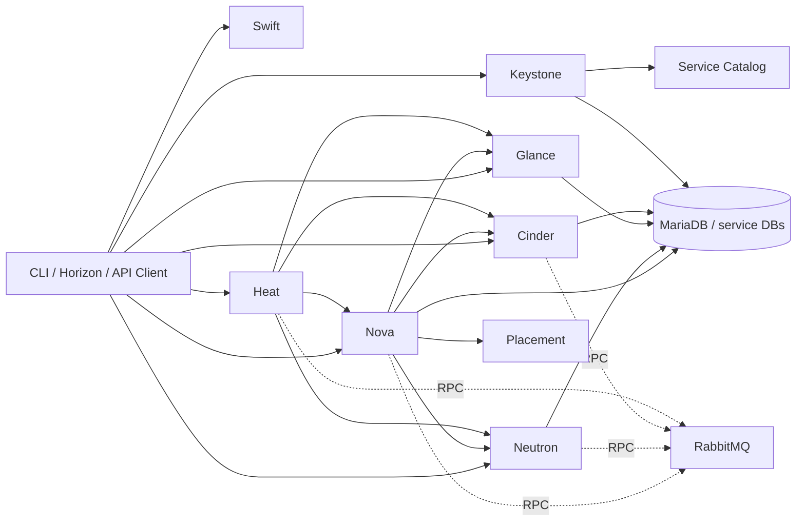

# Các khái niệm cốt lỗi

## Identity & Authentication in OpenStack

### Authentication vs authorization in OpenStack
### Tokens (UUID vs Fernet)
### Token lifecycle & expiration
### Service Catalog
### Endpoint types (public / internal / admin)
### Keystone domains, projects, users, roles
### Role-based access control (RBAC)
### Trusts & delegation
### Service-to-service authentication

---

## OpenStack API Model

### OpenStack service endpoints
### API versioning in OpenStack
### Microversion usage in OpenStack
### Request/response lifecycle in OpenStack
### API extension mechanism
### Idempotency in OpenStack APIs

---

## OpenStack Control Plane Model

### Control plane responsibilities
### Data plane responsibilities
### How OpenStack separates control and data paths
### Failure impact across services

---

## OpenStack Service Model

### Core services and their responsibilities
### Stateless service design in OpenStack
### Service decoupling in OpenStack
### Failure domains across services
### OpenStack service dependency graph

OpenStack là một tập hợp service độc lập, không phải một daemon duy nhất. Mỗi service thường có API process, worker/scheduler/agent riêng, database riêng và giao tiếp bất đồng bộ qua message queue.

Service dependency ở mức vận hành:

Mental model khi debug: client lỗi chưa chắc service backend lỗi. Cần tách các lớp `token/catalog`, `API endpoint`, `RPC/message queue`, `database state`, `agent/worker`, và backend thật như hypervisor, OVS/OVN, LVM/Ceph/Swift.

## Supporting Services And Common Ports

Các supporting services thường gặp:

| Service | Vai trò |
|---|---|
| RabbitMQ | AMQP broker cho RPC/notification giữa API, scheduler, conductor, agent và worker. |
| MariaDB/MySQL | Database control-plane cho Keystone, Nova, Neutron, Glance, Cinder, Heat và service khác. |
| Apache/httpd hoặc Nginx | Web/API hosting cho Horizon, Keystone WSGI hoặc API service tuỳ deployment. |
| Memcached | Cache token/session hoặc cache middleware tuỳ cấu hình. |
| Libvirt/QEMU/KVM | Lớp hypervisor mà `nova-compute` điều khiển để chạy VM. |
| Open vSwitch/OVN | Datapath và logical networking backend cho Neutron. |
| iSCSI target/Ceph/NFS/vendor storage | Backend block storage cho Cinder. |

Port thường gặp trong lab hoặc deployment mặc định. Production có thể đặt sau VIP, TLS reverse proxy hoặc port khác, nên luôn kiểm tra Keystone service catalog và config thực tế:

| Service | Port hay gặp | Ghi chú |
|---|---:|---|
| Keystone identity API | `5000` | Một số tài liệu cũ còn nhắc admin port `35357`. |
| Glance API | `9292` | Image API. |
| Nova API | `8774` | Compute API. |
| Placement API | `8778` | Resource provider inventory/allocation. |
| Neutron API | `9696` | Network API. |
| Cinder API | `8776` | Block Storage API. |
| iSCSI target | `3260` | Cinder LVM/iSCSI lab hoặc backend iSCSI. |
| Swift proxy | `8080` | Object Storage API trong nhiều lab. |
| Swift object/account/container/rsync | `6000`, `6001`, `6002`, `873` | Internal storage-node path tuỳ topology. |
| Heat API | `8004` | Orchestration API. |
| RabbitMQ AMQP | `5672` | Service RPC/notification. |
| RabbitMQ clustering/CLI | `25672` | Node clustering và CLI communication. |
| RabbitMQ management UI | `15672` | Chỉ bật khi cần, bảo vệ bằng network/security policy. |
| MariaDB/MySQL | `3306` | Control-plane database. |
| noVNC proxy | `6080` | Browser console path. |
| SPICE HTML5 proxy | `6082` | Browser console path nếu dùng SPICE. |
| VNC console range | `5900-5999` | Console backend trên compute/hypervisor tuỳ cấu hình. |

---

## Message Queue & RPC in OpenStack

### Asynchronous communication model
### RPC vs notification
### RabbitMQ role in OpenStack
### Queue, exchange, routing key
### Producer / consumer model
### Fanout vs direct messaging
### Message durability
### Acknowledgement & retry
### Ordering guarantees (or lack thereof)

---

## Database Per Service in OpenStack

### Why each OpenStack service has its own DB
### Data ownership boundaries
### Schema isolation
### State vs cache data
### Read vs write patterns
### Transactions & consistency
### Migration & schema evolution (concept)

---

## Scheduling & Placement in OpenStack

### Resource abstraction (CPU, RAM, disk)
### Scheduling problem in OpenStack
### Filtering & weighing
### Resource providers
### Allocation & inventory
### Overcommit concept
### Affinity / anti-affinity
### NUMA awareness (concept level)
### Placement API role

---

## OpenStack Multi-Tenancy Model

### Project-based isolation
### Resource quotas in OpenStack
### Security isolation boundaries
### Network isolation in OpenStack
### Storage isolation in OpenStack
### Identity isolation

---

## OpenStack Networking Concepts

### Neutron abstraction model
### Network, subnet, port abstraction in OpenStack
### MAC vs IP addressing in OpenStack
### DHCP concept in OpenStack
### Routing & NAT in OpenStack
### Security groups in OpenStack
### Overlay network concept in OpenStack
### East-West vs North-South traffic in OpenStack
### Virtual networking model in OpenStack

---

## OpenStack Storage Concepts

### Cinder block storage model
### Volume abstraction in OpenStack
### Snapshot concept in OpenStack
### Clone vs copy in OpenStack
### Backend abstraction in OpenStack
### Thin vs thick provisioning in OpenStack
### Consistency groups (concept)
### Data durability & replication (concept)

---

## OpenStack Image Concepts

### Glance image model
### Image vs volume in OpenStack
### Image formats in OpenStack
### Copy-on-write in OpenStack context
### Image caching in OpenStack
### Metadata & properties in OpenStack

---

## OpenStack Compute Concepts

### Nova compute model
### Hypervisor role in OpenStack
### VM lifecycle in OpenStack
### Flavor abstraction in OpenStack
### Ephemeral vs persistent disk in OpenStack
### Live migration in OpenStack
### Cold migration in OpenStack
### Resize concept in OpenStack

---

## OpenStack State & Lifecycle Model

### Resource lifecycle in OpenStack
### Desired state vs actual state
### State transitions
### Reconciliation concept
### Orphaned resources

---

## OpenStack Observability & Telemetry

### Metrics vs logs vs traces
### Monitoring vs alerting
### Health checks
### Audit logs
### Event tracking
### Usage metering in OpenStack

---

## OpenStack Security Concepts

### Identity security in OpenStack
### API security in OpenStack
### Encryption in transit vs at rest
### Secret management in OpenStack
### Least privilege principle
### Attack surface in OpenStack

---

## OpenStack Fault Tolerance & High Availability

### Redundancy in OpenStack
### Active-active vs active-passive
### Failure detection
### Failover concept
### Split-brain (concept)
### Graceful degradation

---

## OpenStack Upgrade & Compatibility

### API backward compatibility
### Rolling upgrade concept
### Database migration strategy
### Deprecation lifecycle
### Version skew

---

## OpenStack Inter-Service Communication

### API call vs RPC call
### Sync vs async communication
### Dependency graph between OpenStack services
### Service discovery concept
### Timeout & circuit breaker concept

---

## OpenStack Resource Abstraction

### Abstracting physical resources
### Pooling resources
### Logical vs physical mapping
### Elasticity concept
### Capacity planning concept

---

## OpenStack Orchestration & Automation Concepts

### Declarative vs imperative model
### Desired state management
### Stack concept
### Dependency resolution
### Idempotent automation

---

## OpenStack Naming, Identification & Metadata

### UUID usage
### Naming conventions
### Resource identification
### Metadata vs tags
### Labeling strategies

---

## OpenStack Limits, Quotas & Governance

### Resource limits
### Quota enforcement
### Soft vs hard limits
### Policy enforcement
### Governance model

---

## OpenStack Performance & Scalability Concepts

### Bottlenecks (CPU / network / IO)
### Horizontal vs vertical scaling
### Caching strategies
### Load distribution
### Latency vs throughput tradeoff
