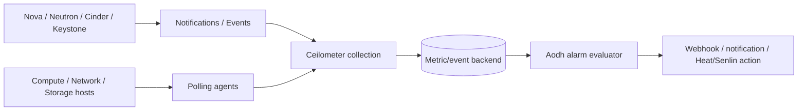

# Ceilometer Và Aodh

## Overview

Ceilometer và Aodh thuộc nhóm telemetry/fault management trong OpenStack.

- **Ceilometer** thu thập metric/event từ các service.
- **Aodh** tạo alarm dựa trên metric hoặc event và kích hoạt action.

Trong vận hành production, telemetry không chỉ để vẽ dashboard. Nó giúp phát hiện capacity issue, service degradation, quota bất thường và automation trigger như autoscaling hoặc notification.

## Vai Trò Trong Fault Management

```text
OpenStack services
        |
        v
Ceilometer collection
        |
        v
Metric/Event backend
        |
        v
Aodh alarm evaluation
        |
        v
Notification / webhook / orchestration action
```



Fault management cần tách rõ:

- **Symptom signal:** VM unreachable, API latency cao, volume attach fail.
- **Root-cause signal:** compute node down, RabbitMQ lỗi, DB mất quorum, Neutron agent dead.
- **Action:** alert người vận hành, trigger workflow, hoặc phối hợp với service như Heat/Senlin/Masakari tùy thiết kế.

## Commands

```bash
openstack metric resource list
openstack metric measures show <metric-id>
openstack alarm list
openstack alarm show <alarm-id>
openstack alarm create --name <alarm-name> --type threshold
```

Lệnh cụ thể có thể khác theo backend telemetry đang dùng, ví dụ Gnocchi, Prometheus bridge hoặc deployment-specific integration.

## Object Model Và Alarm State

Telemetry cần tách ba lớp:

| Lớp | Ví dụ | Câu hỏi cần trả lời |
|---|---|---|
| Resource | Instance, volume, port, image, host service | Metric thuộc object nào? Object còn tồn tại không? |
| Metric/event | CPU, memory, disk, API event, service notification | Dữ liệu đến có đều không? Đơn vị và interval là gì? |
| Alarm | Threshold, event alarm, composite alarm | Điều kiện nào chuyển state và action nào được gọi? |

Alarm state thường gặp:

| State | Ý nghĩa vận hành |
|---|---|
| `ok` | Điều kiện alarm chưa bị vi phạm. |
| `alarm` | Điều kiện đã bị vi phạm trong evaluation window. |
| `insufficient data` | Thiếu datapoint hoặc backend metric không trả dữ liệu đủ để đánh giá. |

`insufficient data` không nên bị bỏ qua. Nó có thể là dấu hiệu agent chết, notification pipeline đứt, metric backend lỗi, hoặc resource không còn phát sinh dữ liệu.

## Operations Notes

- Không coi Ceilometer là nơi lưu trữ time-series dài hạn nếu deployment đã tách backend sang Gnocchi hoặc hệ thống monitoring khác.
- Alarm cần có ngưỡng, window và severity rõ ràng để tránh noisy alert.
- Với root cause analysis, cần correlate metric/event giữa Nova, Neutron, Cinder, Keystone, RabbitMQ, DB và host-level monitoring.
- Fault management tốt cần runbook, không chỉ alarm.

## Troubleshooting

| Triệu chứng | Hướng kiểm tra |
|---|---|
| Không thấy metric mới | Collector/polling agent, notification bus, metric backend, service credential. |
| Alarm không đổi state | Evaluation interval, threshold/window, metric name/resource id, thiếu datapoint. |
| Alarm bắn quá nhiều | Window quá ngắn, thiếu hysteresis, action không gom nhóm, severity chưa rõ. |
| Metric có nhưng RCA sai | Chưa correlate với Nova/Neutron/Cinder/RabbitMQ/DB/host signal. |
| Event mất | Service notification config, message queue, Ceilometer pipeline, log collector. |

Debug nên bắt đầu từ pipeline:

```text
source service emits notification/metric
  -> message bus or polling agent
  -> Ceilometer pipeline
  -> metric/event backend
  -> Aodh evaluator
  -> alarm action
```

## Related Pages

- [OpenStack Architecture](../01-architectures.md)
- [Heat](./heat.md)
- [General Logs Debug](../../04-troubleshooting/general-logs-debug.md)
