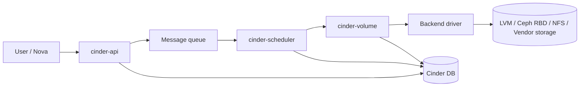
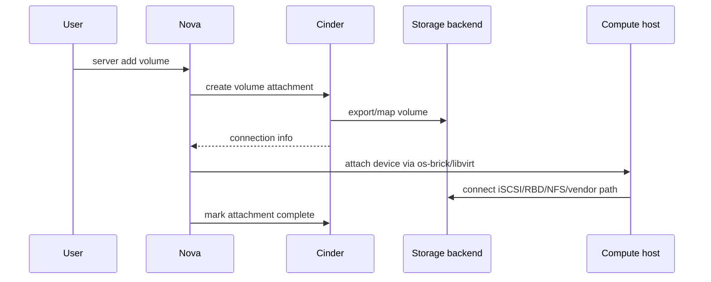

# Cinder

## Overview

Cinder là Block Storage service của OpenStack. Nó cung cấp persistent volume cho instance, tương tự vai trò của EBS trong AWS. Khác với ephemeral disk của Nova, Cinder volume tồn tại độc lập với lifecycle của instance và có thể attach/detach, snapshot, backup hoặc dùng để boot instance.

Mental model:

```text
User / Nova
  -> cinder-api
  -> message queue
  -> cinder-scheduler
  -> cinder-volume
  -> storage backend driver
  -> volume thật trên LVM/Ceph/NFS/vendor storage
```



## Components

| Component | Vai trò |
|---|---|
| `cinder-api` | Nhận Block Storage API request và validate Keystone/policy. |
| `cinder-scheduler` | Chọn backend/storage host phù hợp để tạo volume. |
| `cinder-volume` | Làm việc với backend driver để create/delete/attach/detach volume. |
| `cinder-backup` | Backup volume sang backup backend như Swift, NFS hoặc backend khác. |
| Cinder database | Lưu metadata, state, attachment, type, quota. |
| Message queue | RPC giữa API, scheduler, volume và backup service. |

Trong production, `cinder-volume` thường chạy trên storage node hoặc node có đường storage phù hợp. Với multi-backend, mỗi backend cần stanza config và thường có volume type tương ứng.

## Backend Model

Backend phổ biến:

- LVM/iSCSI cho lab hoặc môi trường nhỏ.
- Ceph/RBD cho cloud production cần scale và HA.
- NFS cho use case đơn giản hoặc backend cụ thể.
- Storage vendor driver như NetApp, Dell/EMC, HPE, IBM.

Ví dụ cấu hình logic:

```ini
[DEFAULT]
enabled_backends = lvmA, lvmB

[lvmA]
volume_group = cinder-volumes-a
volume_driver = cinder.volume.drivers.lvm.LVMVolumeDriver
volume_backend_name = lvmA

[lvmB]
volume_group = cinder-volumes-b
volume_driver = cinder.volume.drivers.lvm.LVMVolumeDriver
volume_backend_name = lvmB
```

Volume type map request của user tới backend:

```bash
openstack volume type create lvm-a
openstack volume type set --property volume_backend_name=lvmA lvm-a
```

Trong multi-backend, `enabled_backends` chỉ nói Cinder có những backend nào. User chọn backend gián tiếp qua volume type và extra spec. Nếu `volume_backend_name` trong type không khớp stanza backend hoặc scheduler không thấy capacity, volume có thể kẹt `creating` hoặc fail dù service vẫn `up`.

| Layer | Ví dụ | Điều cần khớp |
|---|---|---|
| `[DEFAULT] enabled_backends` | `lvmA,lvmB,nfsA` | Tên stanza backend trong `cinder.conf`. |
| Backend stanza | `[lvmA] volume_backend_name=LVM_A` | Driver, pool/VG/share, target IP, credential backend. |
| Volume type | `fast-lvm` | Extra spec như `volume_backend_name=LVM_A`. |
| Scheduler | capacity/filter | Backend report đúng capacity và service alive. |

## Volume Lifecycle

```bash
openstack volume service list
openstack volume create --size 10 data-vol
openstack volume list
openstack volume show data-vol
openstack server add volume <server> data-vol
openstack server remove volume <server> data-vol
openstack volume delete data-vol
```

Tạo volume từ image:

```bash
openstack volume create --size 10 --image <image> boot-vol
```

Với LVM backend trong lab, có thể đối chiếu volume thật:

```bash
lvs
vgs
```

State thường gặp:

| State | Ý nghĩa vận hành |
|---|---|
| `creating` | API đã nhận request, scheduler/volume service đang tạo backend volume. |
| `available` | Volume đã sẵn sàng và chưa attach. |
| `attaching` | Đang tạo attachment và chuẩn bị export/map device. |
| `in-use` | Volume đang attach vào server. |
| `detaching` | Đang gỡ attachment và cleanup path trên compute/backend. |
| `error` | Create/delete/attach path lỗi; cần xem log `cinder-volume` và backend. |
| `error_deleting` | Delete fail, thường do backend, attachment stale hoặc dependency snapshot/backup. |
| `backing-up` | `cinder-backup` đang đọc volume và ghi sang backup backend. |

Luồng attach volume:



Attach fail có thể nằm ở Nova, Cinder, compute host, network storage hoặc backend driver; không nên chỉ nhìn trạng thái volume.

## Snapshot Và Backup

Snapshot là bản chụp volume ở backend, thường nhanh nhưng phụ thuộc backend và cùng failure domain với storage chính. Backup là bản sao sang backup backend, phù hợp hơn cho recovery.

```bash
openstack volume snapshot create --volume data-vol data-vol-snap
openstack volume snapshot list
openstack volume create --snapshot data-vol-snap --size 10 restored-vol
openstack volume snapshot delete data-vol-snap

openstack volume backup create data-vol
openstack volume backup list
openstack volume backup restore <backup-id>
```

Không nhầm snapshot với backup. Snapshot tiện cho rollback gần, backup cần cho sự cố mất backend/storage pool.

So sánh vận hành:

| Tiêu chí | Snapshot | Backup |
|---|---|---|
| Nơi lưu | Backend storage của Cinder volume. | Backup backend như Swift/NFS/object store hoặc driver khác. |
| Failure domain | Thường cùng failure domain với volume gốc. | Có thể tách failure domain nếu backup backend độc lập. |
| Tốc độ | Thường nhanh hơn nếu backend hỗ trợ snapshot native. | Phụ thuộc tốc độ đọc volume và ghi backup backend. |
| Incremental | Phụ thuộc backend/snapshot chain. | Cinder có thể hỗ trợ backup incremental, nhưng phải kiểm driver/config của deployment. |
| Consistency | Tốt nhất snapshot khi filesystem/app đã quiesce hoặc volume detached. | Tương tự: backup crash-consistent nếu không quiesce workload. |

State đáng chú ý:

| Object | State | Ý nghĩa |
|---|---|---|
| Volume backup | `creating` | `cinder-backup` đang đọc volume và ghi sang backup backend. |
| Volume backup | `available` | Backup sẵn sàng restore. |
| Snapshot | `creating` | Backend đang tạo snapshot. |
| Snapshot | `available` | Có thể tạo volume mới từ snapshot. |
| Snapshot/backup | `error` | Xem `cinder-volume.log`, `cinder-backup.log` và backend log. |

Nếu backup lưu vào Swift, kiểm container backup, object count và quota Swift/Cinder thay vì chỉ nhìn trạng thái Cinder.

## Quota

Cinder quota thường gồm số volume, snapshot, backup và tổng dung lượng GB theo project hoặc theo backend/type.

```bash
openstack quota show <project>
openstack quota list --volume --detail
cinder quota-show <project-id>
cinder quota-usage <project-id>
cinder quota-update --snapshots 20 <project-id>
cinder quota-delete <project-id>
```

Nếu tạo volume fail nhưng service vẫn `up`, kiểm tra quota trước khi debug backend.

## LVM/iSCSI Lab Checks

Với lab LVM backend, Cinder volume thật thường là logical volume trong VG như `cinder-volumes`, sau đó được export qua iSCSI target. Trước khi tạo VG hoặc thay partition, luôn xác định đúng disk và backup dữ liệu cần giữ.

Một số tool lab có thể tạo VG Cinder bằng loopback file dưới `/var/lib/cinder` thay vì disk thật. Cách này tiện cho học tập nhưng không đại diện cho production: performance, durability và failure domain đều yếu hơn backend thật như Ceph RBD, SAN/NAS hoặc disk/VG chuyên dụng.

Read-only checks:

```bash
lsblk
pvs
vgs
lvs
systemctl status target
```

Checklist khi backend LVM không hoạt động:

- `volume_group` trong backend stanza có khớp VG thật không.
- `target_helper`/iSCSI target service có chạy không.
- `target_ip_address` có reachable từ compute host không.
- Compute host có route/firewall tới storage network không.
- `cinder-volume` log có báo thiếu VG, thiếu driver, permission hoặc target lỗi không.

## Verification

```bash
systemctl status openstack-cinder-api
systemctl status openstack-cinder-scheduler
systemctl status openstack-cinder-volume
systemctl status openstack-cinder-backup
openstack volume service list
openstack endpoint list | grep cinder
tail -f /var/log/cinder/api.log
tail -f /var/log/cinder/scheduler.log
tail -f /var/log/cinder/volume.log
tail -f /var/log/cinder/backup.log
```

Với iSCSI/LVM lab:

```bash
systemctl status target
lvs
```

## Troubleshooting

| Triệu chứng | Hướng kiểm tra |
|---|---|
| Volume stuck `creating` | Scheduler/backend capacity, `cinder-volume` log, volume type/backend mapping. |
| Attach fail | Volume state, Nova-Cinder attachment, compute-to-storage network, iSCSI/RBD/NFS path. |
| Detach fail | Nova service token/policy, stale attachment, compute host device cleanup. |
| Backup fail | `cinder-backup`, backup driver config, Swift/NFS endpoint, quota. |
| Snapshot fail | Backend snapshot support, volume state, available capacity. |
| Backend up nhưng không được chọn | Volume type extra spec, `enabled_backends`, scheduler filter, backend name mismatch. |
| Volume xoá không được | Snapshot/backup/attachment còn tồn tại, backend delete fail, state lệch DB/backend. |
| Boot from volume fail | Glance image, Cinder create-from-image, volume bootable flag, Nova attach path. |

Chỉ dùng reset state khi đã xác nhận state trong database lệch với thực tế backend:

```bash
cinder reset-state --state available <volume-id>
nova-manage volume_attachment refresh
```

Không sửa database trực tiếp nếu còn CLI/service command an toàn hơn.

## Related Pages

- [Nova](./nova.md)
- [Swift](./swift.md)
- [OpenStack General Logs And Maintenance Debug](../../04-troubleshooting/general-logs-debug.md)
