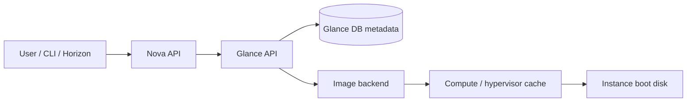
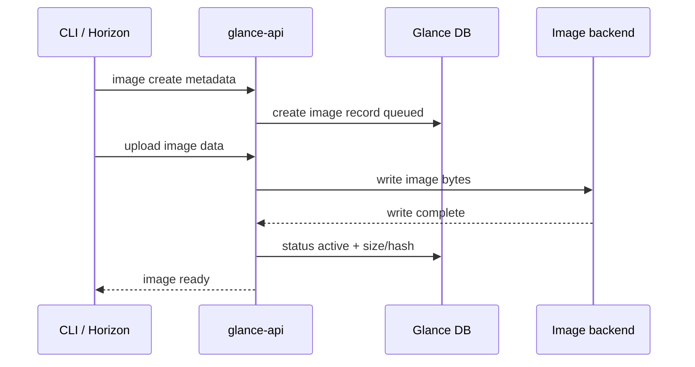

# Glance

## Overview

Glance là Image service của OpenStack. Nó quản lý catalog image, metadata, visibility và đường dẫn tới image data để Nova có thể boot instance. Glance không nhất thiết tự lưu image trên local disk; nó dùng storage backend như filesystem, Swift, Ceph/RBD, NFS hoặc backend vendor.

Luồng đơn giản khi boot VM từ image:

```text
Nova cần boot instance
  -> hỏi Glance metadata/image location
  -> Glance validate token và trả image metadata/location
  -> hypervisor hoặc compute path tải image từ backend
```



## Components

| Component | Vai trò |
|---|---|
| `glance-api` | Nhận Image API request: list, show, upload, download, update metadata. |
| Glance database | Lưu metadata image, owner, visibility, checksum/hash, status. |
| Storage backend | Lưu image bits thật: filesystem, Swift, Ceph/RBD, NFS hoặc backend khác. |
| Keystone integration | Xác thực token và policy cho thao tác image. |

`glance-registry` là component cũ đã bị deprecated; khi học/vận hành nên tập trung vào `glance-api` và backend.

## Control Plane Và Data Plane

Glance có hai lớp cần tách rõ:

| Lớp | Nằm ở đâu | Dùng để |
|---|---|---|
| Metadata/control plane | Glance DB | Tên image, ID, owner, visibility, format, checksum/hash, status, property. |
| Image data/data plane | Backend store: filesystem, Swift, Ceph/RBD, NFS, vendor store | File/block/object chứa bytes thật của image. |

Một image có thể tồn tại metadata nhưng data chưa sẵn sàng. Vì vậy khi thấy image trong `openstack image list`, vẫn cần nhìn `status`, `size`, `checksum/hash`, visibility và backend log nếu boot fail.

Luồng upload:



Nếu upload chết giữa chừng, metadata có thể ở `queued`, `saving` hoặc `killed` trong khi backend có file/object dở dang.

## Image Format Và Metadata

Glance thường gặp các disk format:

| Format | Khi gặp |
|---|---|
| `qcow2` | Phổ biến với QEMU/KVM, hỗ trợ copy-on-write và sparse image. |
| `raw` | Đơn giản, dễ dùng với backend như Ceph/RBD nhưng tốn dung lượng nếu không sparse. |
| `vmdk` | Image từ VMware ecosystem. |
| `vhd` | Hyper-V/Xen/VirtualBox và một số cloud workflow. |
| `iso` | Boot/install media. |
| `aki`, `ari`, `ami` | Dạng Amazon kernel/ramdisk/machine image, thường gặp ở môi trường cũ. |

Trước khi upload image, nên kiểm tra bằng:

```bash
qemu-img info <image-file>
```

Các field cần hiểu:

- `file format`: định dạng disk thực tế.
- `virtual size`: dung lượng disk mà VM thấy.
- `disk size`: dung lượng file image hiện tại trên storage.
- `cluster_size`: block size đối với `qcow2`.

Metadata/property hay dùng:

| Property | Ý nghĩa |
|---|---|
| `os_distro` / `os_name` | Gợi ý hệ điều hành cho automation, UI hoặc image selection. |
| `hw_*` | Một số hint phần cứng/driver/firmware cho Nova/libvirt tùy policy và driver. |
| `min_disk` | Dung lượng disk tối thiểu để boot từ image. |
| `min_ram` | RAM tối thiểu để boot từ image. |
| `protected` | Ngăn xoá image nhầm qua API thông thường. |
| `visibility` | Quyết định project nào nhìn thấy image. |

Không nên coi metadata là bảo đảm tuyệt đối. Metadata sai có thể làm scheduler/boot path chọn cấu hình không phù hợp, nhưng dữ liệu image thật vẫn cần được kiểm tra bằng `qemu-img info`, checksum/hash và boot test.

## Image Lifecycle

Command thường dùng:

```bash
openstack image create \
  --file <image-file> \
  --disk-format qcow2 \
  --container-format bare \
  --public \
  <image-name>

openstack image list
openstack image show <image>
openstack image save <image> --file <local-file>
openstack image set --property os_name=linux <image>
openstack image delete <image>
```

Visibility cần phân biệt:

- `public`: mọi project có thể dùng.
- `private`: chỉ owner/project thấy.
- `shared`: chia sẻ cho project cụ thể.
- `community`: cộng đồng có thể discover tùy policy/version.

Trạng thái image hay gặp:

| Status | Ý nghĩa vận hành |
|---|---|
| `queued` | Metadata đã tạo nhưng image data chưa upload xong hoặc chưa bắt đầu upload. |
| `saving` | Glance đang nhận và ghi image data vào backend. |
| `active` | Image sẵn sàng để boot hoặc download. |
| `killed` | Upload/processing thất bại; cần xem Glance API log và backend. |
| `deleted` | Image đã bị xoá logic hoặc đang trong lifecycle xoá tuỳ backend/deployment. |

Chia sẻ image cho project:

```bash
openstack image add project <image> <project>
openstack image remove project <image> <project>
```

## Backend Và Quota

Với filesystem backend, image thường nằm dưới thư mục như:

```text
/var/lib/glance/images/
```

Trong `glance-api.conf`, các vùng cần chú ý:

```ini
[database]
connection = mysql+pymysql://glance:<PASSWORD>@<DB_HOST>/glance

[keystone_authtoken]
auth_url = http://<KEYSTONE_HOST>:5000
username = glance
password = <PASSWORD>
project_name = services

[glance_store]
default_backend = file
```

Với filesystem backend cục bộ, file image thường được lưu với tên là image UUID trong thư mục store. Nếu dùng nhiều mount point filesystem, Glance có thể cấu hình nhiều đường dẫn kèm trọng số/priority để chọn nơi lưu:

```ini
[glance_store]
filesystem_store_datadirs = /var/lib/glance/images/mount-a/:10
filesystem_store_datadirs = /var/lib/glance/images/mount-b/:20
```

Có thể giới hạn kích thước image hoặc storage quota theo user bằng cấu hình trong `glance-api.conf`:

```ini
[DEFAULT]
image_size_cap = 1073741824
user_storage_quota = 500MB
```

Sau thay đổi config cần restart/reconfigure service theo deployment tool đang dùng. Với production, kiểm tra trước dung lượng backend, impact với image upload đang chạy và cách rollback cấu hình.

## Verification

```bash
systemctl status openstack-glance-api
openstack service show glance
openstack endpoint list | grep glance
openstack image list
tail -f /var/log/glance/api.log
```

Dùng `--debug` để thấy request thật, endpoint, HTTP status và `X-Openstack-Request-Id`:

```bash
openstack image list --debug
```

## Troubleshooting

| Triệu chứng | Kiểm tra control plane | Kiểm tra data plane/backend |
|---|---|---|
| Upload image fail | `openstack image show`, quota, `image_size_cap`, Glance API log | Backend permission, free space, Swift/Ceph/NFS health. |
| Image stuck `queued`/`saving` | Image status, task/upload log, DB record | File/object có được ghi dở không, backend timeout. |
| Image `active` nhưng boot fail | `disk_format`, `container_format`, `min_disk`, visibility | Image corrupt, qemu/libvirt đọc format lỗi, compute không reach backend. |
| User không thấy image | Visibility, project membership, image sharing, policy | Không phải backend issue nếu admin vẫn thấy image. |
| Glance API 401/403 | Keystone token, service user credential, policy | Không kiểm tra backend trước khi auth/policy sạch. |
| Download rất chậm | API path, request id, concurrent clients | Backend latency, network path controller/compute/backend. |

Checklist debug nhanh:

```bash
openstack image show <image>
openstack image list --long
openstack endpoint list | grep glance
openstack image save <image> --file /tmp/test-image.img
qemu-img info /tmp/test-image.img
```

## Related Pages

- [Nova](./nova.md)
- [Swift](./swift.md)
- [OpenStack API And Automation Workflow](../../02-operations/api-and-automation-workflow.md)
