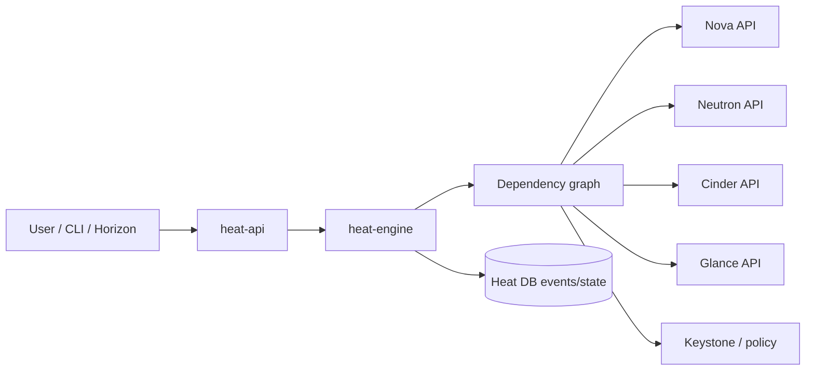

# Heat

## Overview

Heat là orchestration service của OpenStack. Nó triển khai hạ tầng bằng Heat Orchestration Template (HOT), tương tự tư duy Infrastructure as Code trong phạm vi OpenStack. Người dùng mô tả stack mong muốn, Heat phân tích dependency rồi gọi API của Nova, Neutron, Cinder, Keystone, Glance hoặc service khác để tạo resource thật.

Heat phù hợp khi cần triển khai nhiều resource liên quan: network, subnet, router, security group, instance, volume, floating IP và association giữa chúng.



## Components

| Component | Vai trò |
|---|---|
| `heat-api` | OpenStack-native REST API nhận request stack. |
| `heat-api-cfn` | API tương thích kiểu CloudFormation cũ. |
| `heat-engine` | Resolve template, dependency graph, gọi API service đích và lưu event/state. |
| Heat database | Lưu stack, resource, event và state control plane. |

Heat không thay thế Nova/Neutron/Cinder. Nó chỉ điều phối API call. Resource thật vẫn thuộc service đích.

Heat từng hỗ trợ hai format template chính:

| Format | Ghi chú |
|---|---|
| HOT | Heat Orchestration Template, YAML-native cho OpenStack. Đây là format nên ưu tiên. |
| CFT | CloudFormation-compatible JSON format, hữu ích khi cần tương thích template kiểu AWS cũ nhưng không nên xem là ngang hàng với CloudFormation hiện đại. |

## HOT Template Mental Model

Một HOT template thường có bốn phần chính:

```yaml
heat_template_version: 2018-08-31

description: Example stack

parameters:
  image:
    type: string
  flavor:
    type: string

resources:
  server:
    type: OS::Nova::Server
    properties:
      image: { get_param: image }
      flavor: { get_param: flavor }

outputs:
  server_id:
    value: { get_resource: server }
```

Ý nghĩa:

- `heat_template_version`: version schema của HOT.
- `parameters`: input biến đổi theo môi trường.
- `resources`: resource OpenStack cần tạo.
- `outputs`: giá trị trả ra sau khi stack tạo xong.

Một template có thể dùng `get_param` để lấy input, `get_attr` để lấy thuộc tính runtime của resource và `get_resource` để tham chiếu ID/resource dependency. `outputs` nên chứa thông tin cần dùng sau deploy như server name, floating IP, private IP hoặc endpoint, thay vì bắt operator đi dò thủ công từng service.

`heat_template_version` xác định schema/feature set của HOT template. Không nên copy mù giá trị version từ template cũ; hãy kiểm deployment đang hỗ trợ version nào và dùng version đủ mới cho resource/function cần dùng.

## Common Resource Types

| Resource type | Dùng để |
|---|---|
| `OS::Nova::Server` | Tạo instance. |
| `OS::Neutron::Net` | Tạo network. |
| `OS::Neutron::Subnet` | Tạo subnet. |
| `OS::Neutron::Router` | Tạo router. |
| `OS::Neutron::RouterInterface` | Gắn subnet vào router. |
| `OS::Neutron::FloatingIP` | Tạo floating IP. |
| `OS::Cinder::Volume` | Tạo volume. |
| `OS::Cinder::VolumeAttachment` | Attach volume vào server. |

Dependency có thể implicit qua `get_resource` hoặc explicit bằng `depends_on`.

## Stack Lifecycle Và State

Heat quản lý desired state của stack và resource dependency, nhưng resource thật vẫn do service đích sở hữu.

| Stack/resource state | Ý nghĩa |
|---|---|
| `CREATE_IN_PROGRESS` | Heat đang gọi API service đích theo dependency graph. |
| `CREATE_COMPLETE` | Stack/resource đã tạo xong theo Heat; vẫn nên verify resource ở Nova/Neutron/Cinder. |
| `CREATE_FAILED` | Một resource fail; đọc event đầu tiên fail để biết service đích. |
| `UPDATE_IN_PROGRESS` | Heat đang thay đổi resource theo template mới. |
| `UPDATE_COMPLETE` | Update xong; cần kiểm tra drift và resource stateful. |
| `UPDATE_FAILED` | Update lỗi, có thể cần rollback hoặc update lại sau khi sửa root cause. |
| `DELETE_IN_PROGRESS` | Heat đang xoá resource theo dependency ngược. |
| `DELETE_FAILED` | Resource dependency, policy hoặc backend làm delete fail. |

Luồng tạo stack:

```text
template + parameters
  -> validate syntax/resource types
  -> build dependency graph
  -> create resources theo thứ tự
  -> record event per resource
  -> expose outputs
```

Khi debug, event timeline quan trọng hơn trạng thái cuối cùng vì trạng thái cuối chỉ nói “fail”, còn event cho biết resource nào fail trước.

## Operations

```bash
openstack stack list
openstack stack show <stack>
openstack stack resource list <stack>
openstack stack event list <stack>
openstack stack create -t template.yaml <stack>
openstack stack update -t template.yaml <stack>
openstack stack delete <stack>
openstack stack output show <stack> --all
openstack stack template show <stack>
openstack stack suspend <stack>
openstack stack resume <stack>
```

Khi phát triển template:

```bash
openstack orchestration template validate -t template.yaml
```

Update stack không luôn là thay đổi in-place. Một số resource có thể bị replace nếu thuộc tính thay đổi yêu cầu recreate. Với production, đọc trước change impact của resource type và chuẩn bị rollback/backup cho volume/database/service stateful.

Resource name do Heat tạo thường có dạng kết hợp stack name, logical resource name và suffix tự sinh. Khi trace sang Nova/Neutron/Cinder, luôn đối chiếu bằng physical resource ID trong:

```bash
openstack stack resource list <stack>
openstack stack resource show <stack> <resource>
```

Trong `openstack stack show`, các trường như `stack_owner`, `stack_user_project_id`, `parent`, `parameters` và `outputs` giúp hiểu stack thuộc user/project nào, nested stack hay không và Heat đã truyền input/output ra sao. Khi lỗi permission hoặc delete/update fail, các trường này thường hữu ích hơn chỉ nhìn `stack_status`.

## Troubleshooting

Khi stack fail, không dừng ở `stack show`. Cần đi theo event đầu tiên fail:

```bash
openstack stack show <stack>
openstack stack event list <stack>
openstack stack resource list <stack>
openstack stack resource show <stack> <resource>
```

Mapping lỗi:

| Resource fail | Debug tiếp ở |
|---|---|
| `OS::Nova::Server` | Nova scheduler/compute, Glance image, Neutron port, quota. |
| `OS::Neutron::*` | Neutron network/subnet/router/security group, agent/OVN. |
| `OS::Cinder::Volume` | Cinder scheduler/backend/quota. |
| `OS::Cinder::VolumeAttachment` | Nova-Cinder attach path và compute-to-storage connectivity. |
| Permission/policy fail | Keystone role, project, Heat stack owner/stack user role. |
| Delete fail | Resource dependency còn tồn tại, service đích không xoá được resource, policy hoặc quota cleanup. |

## Best Practices

- Tách parameter theo môi trường, không hard-code credential/IP thật.
- Dùng output để trả thông tin cần dùng sau deploy.
- Giữ template nhỏ, rõ dependency.
- Validate template trước khi create/update.
- Khi update stack production, cần backup/rollback plan cho resource stateful.

## Related Pages

- [OpenStack Architecture](../01-architectures.md)
- [Nova](./nova.md)
- [Neutron](./neutron.md)
- [Cinder](./cinder.md)
