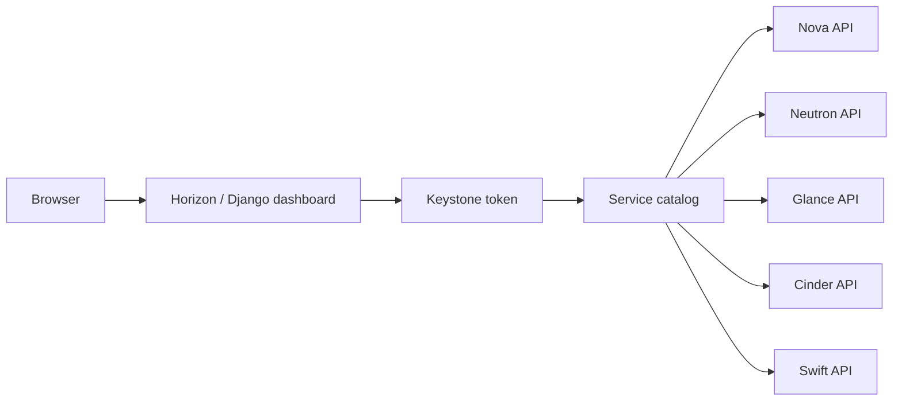

# Horizon

## Overview

Horizon là dashboard web của OpenStack. Nó cung cấp UI để user và admin thao tác với project, instance, image, network, volume, object storage và một số service khác. Horizon không phải source of truth; nó là client web gọi OpenStack APIs thông qua Keystone token và service catalog.

Mental model:

```text
Browser
  -> Horizon web app
  -> Keystone login/token
  -> service catalog
  -> Nova/Neutron/Glance/Cinder/Swift/Heat APIs
```



Nếu Horizon lỗi nhưng CLI vẫn hoạt động, vấn đề có thể nằm ở dashboard/session/proxy. Nếu cả Horizon và CLI cùng lỗi, debug Keystone/service API trước.

## Architecture

Horizon thường chạy dưới Apache/httpd hoặc web server tương đương. Cấu hình chính thường nằm tại:

```text
/etc/openstack-dashboard/local_settings
```

Các điểm cấu hình hay gặp:

```python
OPENSTACK_KEYSTONE_URL = "http://<KEYSTONE_HOST>:5000/v3"
OPENSTACK_KEYSTONE_MULTIDOMAIN_SUPPORT = True
```

Horizon phát hiện service dựa trên Keystone catalog. Nếu endpoint của Cinder/Swift/Heat không có hoặc không reachable, panel tương ứng có thể thiếu hoặc lỗi.

Về mặt năng lực, Horizon chỉ là một client web trên OpenStack API. Nó thường bao phủ phần lớn workflow phổ biến của user/admin, nhưng không expose toàn bộ option của từng service. Vì vậy khi cần quản trị service catalog, endpoint, policy, debug request chi tiết hoặc automation lặp lại, CLI/API vẫn là nguồn thao tác chính.

Các tuỳ chọn vận hành hay gặp trong `local_settings`:

```python
OPENSTACK_KEYSTONE_URL = "http://<KEYSTONE_HOST>:5000/v3"
OPENSTACK_KEYSTONE_MULTIDOMAIN_SUPPORT = True
SESSION_TIMEOUT = 1800
ALLOWED_HOSTS = ["dashboard.example.com", "10.0.0.10"]
```

`SESSION_TIMEOUT` kiểm soát thời gian session web; `ALLOWED_HOSTS` cần khớp hostname/IP mà user truy cập qua browser hoặc reverse proxy. Nếu dashboard đặt sau proxy/TLS, kiểm tra thêm header forwarding, cookie/session và cấu hình HTTPS ở web server.

## Request Flow Và Boundary

Horizon không tự tạo VM, volume hay network. Nó nhận thao tác từ browser, giữ session web, rồi gọi API của service tương ứng bằng Keystone token.

| Lớp | Trạng thái nằm ở đâu | Khi lỗi thường thấy |
|---|---|---|
| Browser | Cookie, CSRF token, form state, JavaScript | Login loop, CSRF failed, button không submit, request bị browser/proxy chặn. |
| Horizon app | Django session, policy check phía UI, service client call | UI báo lỗi nhưng CLI vẫn chạy được, panel thiếu, form không đủ option. |
| Keystone | Token, domain/project scope, service catalog | `401`, `403`, không thấy domain/project, endpoint sai. |
| Service API | Nova/Neutron/Glance/Cinder/Swift/Heat API state | Action fail giống CLI, request có `X-Openstack-Request-Id`. |
| Backend service | Scheduler/agent/worker/storage/network/hypervisor | API nhận request nhưng resource stuck hoặc fail ở backend. |

Luồng debug nên tách rõ “UI state” và “cloud state”:

```text
Browser action
  -> Horizon view/form validation
  -> Keystone token/session
  -> service client chooses endpoint from catalog
  -> service API returns request id/status
  -> backend service changes resource state
```

Nếu UI hiển thị resource sai, trước tiên so sánh với CLI cùng project/region:

```bash
openstack server list
openstack image list
openstack volume list
openstack network list
```

Nếu CLI thấy đúng mà Horizon sai, vấn đề nghiêng về session, policy UI, cache, region selection hoặc dashboard configuration. Nếu CLI cũng sai, debug service API/backend thay vì Horizon.

## Operations

Các việc Horizon làm tốt:

- Tạo và quản lý instance cơ bản.
- Tạo image, network, router, security group, floating IP.
- Quản lý volume/snapshot cơ bản.
- Xem project quota và resource overview.
- Admin xem service information, compute services, block storage services, network agents.
- Download OpenStack RC file để dùng CLI.

Các việc nên ưu tiên CLI/API:

- Service catalog và endpoint management.
- Debug request chi tiết.
- Automation hoặc thao tác lặp lại.
- Các option nâng cao không expose trên UI.

## RC File Và CLI Handoff

Horizon có thể cung cấp OpenStack RC file. Sau khi tải, user cần source file và nhập password/token phù hợp:

```bash
source openrc.sh
openstack token issue
openstack service list
```

Các biến quan trọng:

```bash
OS_AUTH_URL
OS_PROJECT_NAME
OS_USERNAME
OS_PASSWORD
OS_USER_DOMAIN_NAME
OS_PROJECT_DOMAIN_NAME
OS_IDENTITY_API_VERSION
```

Nếu CLI báo 401/403 sau khi dùng RC file, kiểm tra domain, project, username, password và token expiry.

## Verification

```bash
systemctl status httpd
tail -f /var/log/horizon/horizon.log
openstack service list
openstack endpoint list
openstack token issue
```

Trong browser, dùng devtools để xem request nào lỗi và HTTP status là gì.

## Troubleshooting

| Triệu chứng | Hướng kiểm tra |
|---|---|
| Login fail | Keystone URL, domain support, credential, session/cookie, clock skew. |
| Panel thiếu service | Keystone catalog/endpoint, policy, service disabled. |
| UI action fail nhưng CLI OK | Horizon log, browser devtools, CSRF/session/proxy. |
| CLI và UI cùng fail | Keystone token, endpoint, service API/log. |
| Multi-domain user không login được | `OPENSTACK_KEYSTONE_MULTIDOMAIN_SUPPORT`. |
| Redirect hoặc 400 host header | `ALLOWED_HOSTS`, reverse proxy host header, HTTPS forwarding. |
| Session hết hạn quá nhanh | `SESSION_TIMEOUT`, Memcached/session backend, clock skew. |
| Admin panel thấy service down | Đối chiếu CLI service list của Nova/Cinder/Neutron và log service đích. |

## Related Pages

- [Keystone](./keystone.md)
- [OpenStack API And Automation Workflow](../../02-operations/api-and-automation-workflow.md)
- [OpenStack Client Debug](../../04-troubleshooting/openstack-client-debug.md)
