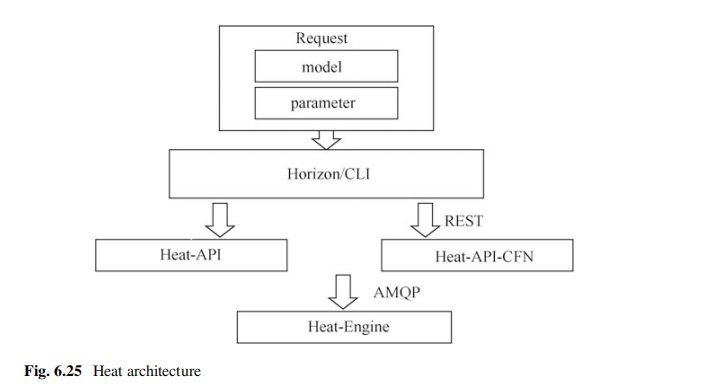
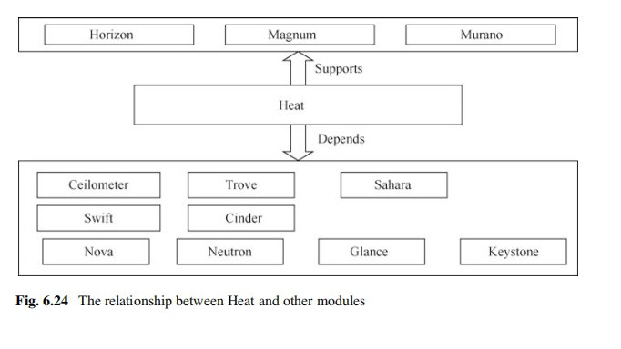
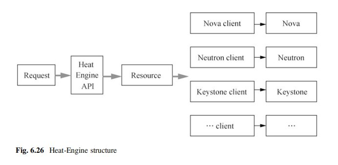

# Heat

## Overview

Heat là orchestration service của OpenStack. Nó triển khai hạ tầng bằng template, tương tự tư duy Infrastructure as Code trong phạm vi OpenStack: người dùng mô tả stack mong muốn, Heat phân tích dependency rồi gọi API của các service như Nova, Neutron, Cinder, Keystone hoặc Glance để tạo resource.

Heat phù hợp khi cần triển khai nhiều resource liên quan với nhau, ví dụ một ứng dụng gồm network, subnet, router, security group, instance, volume và floating IP.



## Heat Quan Hệ Với Các Service Khác



Heat không thay thế các service bên dưới. Nó là lớp orchestration phía trên:

- Horizon hoặc CLI nhận input từ người dùng.
- Heat API nhận request tạo/update/delete stack.
- Heat Engine resolve template và resource dependency.
- Heat gọi client/API của Nova, Neutron, Cinder, Keystone, Glance hoặc service khác để tạo resource thật.

## Heat Engine Mental Model



Luồng đơn giản hóa:

```text
Template + parameters
        |
        v
Heat API
        |
        v
Heat Engine
        |
        +--> Nova client -> server/instance
        +--> Neutron client -> network/port/router
        +--> Cinder client -> volume
        +--> Keystone client -> identity-related resource
```

Điểm quan trọng: Heat lưu trạng thái stack ở control plane, nhưng resource thật vẫn thuộc service tương ứng. Vì vậy khi stack lỗi, cần debug cả Heat event lẫn log/service đích.

## Operations

```bash
openstack stack list
openstack stack show <stack>
openstack stack resource list <stack>
openstack stack event list <stack>
openstack stack create -t template.yaml <stack>
openstack stack update -t template.yaml <stack>
openstack stack delete <stack>
```

Khi stack fail:

1. Xem `openstack stack show <stack>` để biết trạng thái tổng.
2. Xem `openstack stack event list <stack>` để biết resource nào fail trước.
3. Debug service đích: Nova nếu instance fail, Neutron nếu port/router fail, Cinder nếu volume fail.
4. Kiểm tra quota, role/policy và dependency trong template.

## Related Pages

- [OpenStack Architecture](../01-architectures.md)
- [Nova](./nova.md)
- [Neutron](./neutron.md)
- [Cinder](./cinder.md)
