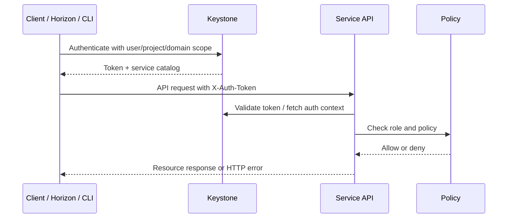
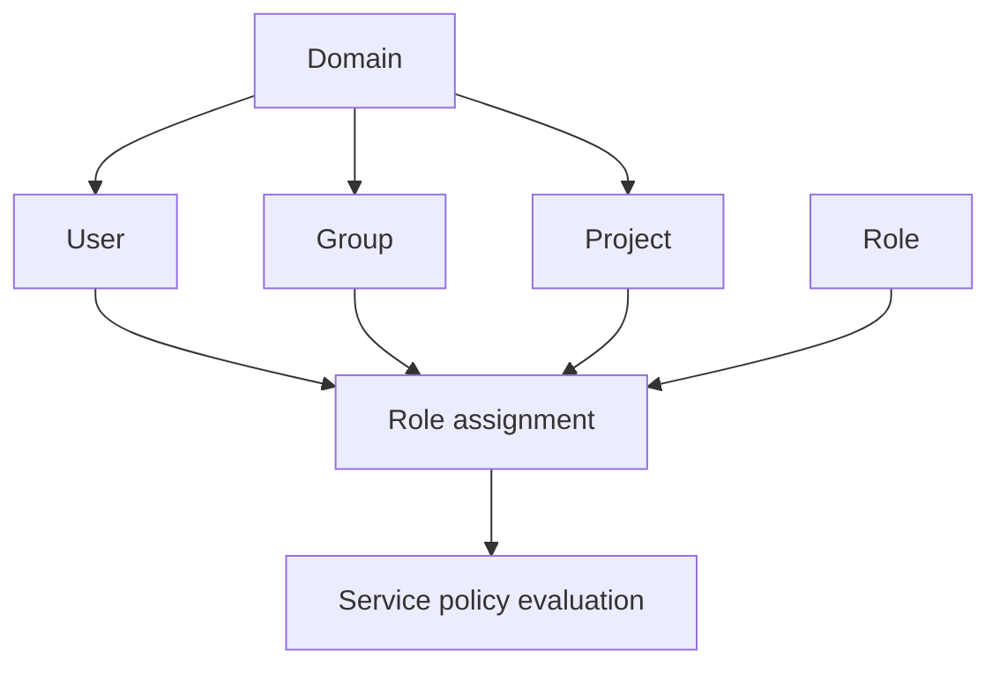

# Keystone

## Overview

Keystone là Identity service của OpenStack. Nó chịu trách nhiệm authentication, authorization, service catalog và endpoint discovery cho toàn bộ cloud. Hầu hết request tới Nova, Neutron, Glance, Cinder, Swift hoặc Heat đều bắt đầu bằng việc client lấy token từ Keystone, sau đó dùng token đó gọi API service đích.

Mental model quan trọng:

```text
User / CLI / Horizon
  -> Keystone xác thực credential
  -> Keystone trả token + service catalog
  -> Client gọi service API bằng token
  -> Service validate token/policy trước khi xử lý
```



## Core Concepts

| Concept | Ý nghĩa vận hành |
|---|---|
| `domain` | Boundary để tách nhiều cây identity trong cùng một Keystone. Hữu ích khi nhiều tổ chức/tenant lớn dùng chung cloud. |
| `project` | Không gian tài nguyên của tenant. Instance, network, volume, image visibility và quota thường gắn với project. |
| `user` | Principal đăng nhập hoặc dùng API. |
| `group` | Tập user để gán role dễ hơn. |
| `role` | Quyền logic được policy của service diễn giải. |
| `assignment` | Quan hệ user/group + role + project/domain. |
| `token` | Bằng chứng xác thực tạm thời để gọi API. Token hết hạn thường gây `401 Unauthorized`. |
| `service catalog` | Danh sách service và endpoint mà client dùng để tìm URL API. |
| `endpoint` | URL public/internal/admin của một service theo region/interface. |

`admin` role cần được xử lý cẩn thận. Trong nhiều deployment, gán `admin` trong một project có thể tạo quyền quản trị rất rộng tùy policy đang dùng, nên không xem nó như quyền project bình thường.

## Token, Scope Và Policy

Keystone trả token theo scope. Scope quyết định token dùng để thao tác trong boundary nào:

| Scope | Dùng khi | Rủi ro nếu hiểu sai |
|---|---|---|
| Unscoped token | Chứng minh credential hợp lệ, trước khi chọn project/domain | Không đủ quyền gọi hầu hết service API. |
| Project-scoped token | Thao tác resource trong một project: server, volume, network, image private | Source nhầm project làm “mất resource” hoặc thao tác nhầm tenant. |
| Domain-scoped token | Quản trị identity ở cấp domain | Có thể ảnh hưởng nhiều project/user trong domain. |
| System-scoped token | Một số policy hiện đại cho thao tác toàn cloud | Cần policy rõ ràng, tránh dùng thay thế tuỳ tiện cho admin project cũ. |

Authorization không chỉ là “có role hay không”. Service đích đọc policy của chính nó và diễn giải role/scope:

```text
token roles + token scope + service policy
  -> allow / deny action
```

Vì vậy cùng một user có thể gọi được `openstack server list` nhưng không gọi được `openstack endpoint create`, hoặc có quyền trong project A nhưng không thấy resource project B.

## Service Catalog Và Endpoint

Mỗi service trong OpenStack thường có:

- `service`: tên và type, ví dụ `nova/compute`, `glance/image`, `neutron/network`.
- `endpoint`: URL theo interface `public`, `internal`, `admin`.
- `region`: vùng logic, thường là `RegionOne` trong lab.

Command kiểm tra:

```bash
openstack service list
openstack service show <service>
openstack endpoint list
openstack endpoint show <endpoint-id>
```

Khi đăng ký service mới, Keystone cần biết ít nhất `name` và `type`; sau đó mỗi service thường có ba endpoint theo interface:

```bash
openstack service create \
  --name glance \
  --description "OpenStack Image service" \
  image

openstack endpoint create \
  --region RegionOne \
  image public http://10.0.0.10:9292

openstack endpoint create \
  --region RegionOne \
  image internal http://10.0.0.10:9292

openstack endpoint create \
  --region RegionOne \
  image admin http://10.0.0.10:9292
```

Trong release hiện đại, các endpoint thường được tạo riêng từng interface. Một số tài liệu cũ có cú pháp tạo nhiều endpoint trong một lệnh; khi debug lab hoặc tài liệu lịch sử, cần đối chiếu với version client/deployment đang dùng.

Khi CLI báo không tìm thấy service, sai URL, hoặc service trả lỗi lạ, hãy kiểm tra catalog trước khi debug service backend. Endpoint sai có thể làm request đi nhầm API version, nhầm interface hoặc nhầm host.

Endpoint/port thường gặp trong lab:

| Service | Type | Port hay gặp | Ghi chú |
|---|---|---:|---|
| Keystone | `identity` | `5000` | Identity API; một số tài liệu cũ còn nhắc admin port `35357`. |
| Glance | `image` | `9292` | Image API. |
| Nova | `compute` | `8774` | Compute API. |
| Placement | `placement` | `8778` | Resource provider, inventory, allocation. |
| Neutron | `network` | `9696` | Networking API. |
| Cinder | `volumev3` | `8776` | Block Storage API. |
| Swift | `object-store` | `8080` | Swift proxy API trong nhiều lab. |
| Heat | `orchestration` | `8004` | Orchestration API. |

Production có thể đặt các service sau VIP, reverse proxy hoặc TLS endpoint khác port mặc định; luôn tin service catalog hiện tại hơn bảng nhớ.

## Identity Operations

Các thao tác nền tảng:

```bash
openstack domain create --description "Example domain" example-domain
openstack project create --domain example-domain --description "Example project" example-project
openstack user create --domain example-domain --password-prompt example-user
openstack role list
openstack role add --project example-project --user example-user member
openstack role assignment list --names
openstack project list --domain example-domain
openstack user list --domain example-domain
openstack token issue
```

Nếu trùng tên project ở nhiều domain, luôn chỉ rõ `--domain`. Nếu không, command có thể fail hoặc thao tác nhầm object.

Object model nên nhớ:



Các thao tác xoá/sửa identity object cần kiểm tra assignment trước, vì xoá user/project/domain có thể làm automation, service account hoặc RC file đang dùng bị lỗi:

```bash
openstack role assignment list --names --user <user>
openstack role assignment list --names --project <project>
openstack application credential list --user <user>
```

## Horizon Và Multi-Domain

Nếu dùng nhiều domain, Horizon cần hỗ trợ multi-domain login. Nếu user ngoài domain mặc định không đăng nhập được dashboard nhưng CLI vẫn hoạt động, kiểm tra cấu hình Horizon:

```text
OPENSTACK_KEYSTONE_MULTIDOMAIN_SUPPORT = True
```

Horizon có thể quản lý user/project/role cơ bản, nhưng không thay thế hoàn toàn CLI/API. Một số thao tác service catalog hoặc endpoint nên làm bằng `openstack` CLI.

## Service Health

Trong nhiều deployment non-containerized, Keystone chạy qua Apache/mod_wsgi và phụ thuộc vào config WSGI. Tùy token backend, Memcached có thể tham gia cache token/session.

```bash
systemctl status httpd
systemctl status memcached
ps aux | grep keystone
ls /etc/httpd/conf.d/*keystone*
```

Một dấu hiệu vận hành quan trọng: trên các deployment dùng Keystone qua Apache WSGI, có thể không có service systemd tên `openstack-keystone` riêng. Lúc đó trạng thái thực tế nằm ở `httpd`, process WSGI chạy user `keystone`, endpoint `:5000`, log Apache và log Keystone. Với Fernet token, token không cần lưu persistent như một số cơ chế cũ, nhưng Memcached vẫn có thể xuất hiện vì dashboard/session/cache hoặc service khác.

Log thường gặp:

```bash
tail -f /var/log/httpd/keystone_wsgi_error.log
tail -f /var/log/httpd/keystone_wsgi_access.log
tail -f /var/log/keystone/keystone.log
```

## Troubleshooting

| Triệu chứng | Kiểm tra trước |
|---|---|
| `401 Unauthorized` | Token hết hạn, credential sai, clock lệch, RC file source sai. |
| `403 Forbidden` | User có token hợp lệ nhưng role/policy không cho phép action. |
| Service không xuất hiện trong CLI | `openstack service list`, `openstack endpoint list`, endpoint type/region. |
| Horizon login fail ở domain khác | Multi-domain support trong Horizon và domain field khi login. |
| Service API khác báo invalid token | Keystone endpoint, service user credential trong config service đích, time sync. |
| Token issue được nhưng service API báo 403 | Scope đúng chưa, role assignment đúng project/domain chưa, policy service đích có cho phép action không. |
| User không thấy project | Domain filter, role assignment, project disabled hoặc RC file source nhầm domain. |
| Endpoint list đúng nhưng client gọi nhầm URL | Region/interface/API version trong RC file hoặc client config. |

Debug nên đi theo thứ tự: RC file -> token -> catalog -> endpoint -> policy -> service log.

## Related Pages

- [OpenStack Core Concepts](../02-core-concepts.md)
- [OpenStack API And Automation Workflow](../../02-operations/api-and-automation-workflow.md)
- [OpenStack Client Debug](../../04-troubleshooting/openstack-client-debug.md)
