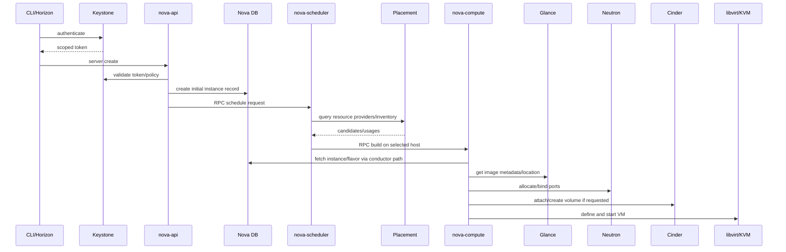

# Nova

## Overview

Nova là Compute service của OpenStack. Nó điều phối lifecycle của instance bằng cách phối hợp với Keystone, Glance, Neutron, Placement, Cinder, database, message queue và hypervisor như KVM/libvirt.

Nova không phải hypervisor. Nova là control plane điều khiển compute host; hypervisor/QEMU/KVM mới là lớp chạy VM thật.

## Components

| Component | Vai trò |
|---|---|
| `nova-api` | Nhận request compute API từ CLI/Horizon/API client. |
| `nova-scheduler` | Chọn compute host phù hợp, thường dựa vào Placement/resource inventory/filter. |
| `nova-compute` | Worker trên compute node, gọi libvirt/KVM để tạo/start/stop/delete instance. |
| `nova-conductor` | Trung gian giữa compute service và database, tránh để compute node truy cập DB trực tiếp. |
| `nova-novncproxy` | Proxy cho console VNC qua browser. |
| Nova database/API database | Lưu state control plane, cell mapping và metadata compute. |
| Message queue | RPC giữa API, scheduler, conductor và compute. |

Production thường tách control node và compute node. Control services như API/scheduler/conductor chạy ở control plane; `nova-compute` chạy trên compute host.

## Instance Launch Flow

Luồng tạo instance đơn giản:

```text
CLI / Horizon / API
  -> nova-api validate token qua Keystone
  -> Nova ghi request/state vào DB
  -> nova-scheduler chọn host qua Placement
  -> nova-compute trên host nhận RPC
  -> lấy image metadata/data từ Glance
  -> tạo port/network qua Neutron
  -> attach Cinder volume nếu boot/attach volume
  -> libvirt/QEMU/KVM spawn VM
```

Luồng chi tiết hơn khi cần trace lỗi:



Khi boot instance fail, đừng chỉ nhìn `nova-compute`. Root cause có thể nằm ở Keystone credential, Glance image, Neutron port, Cinder attachment, quota, Placement inventory, RabbitMQ, database hoặc libvirt.

Scheduler chọn host bằng cách phối hợp filter/weight, Placement inventory, availability zone/aggregate, group policy, flavor extra specs và trạng thái compute service. `No valid host` thường là tín hiệu scheduler không tìm được candidate hợp lệ, không nhất thiết là hypervisor đã hỏng.

## Server State Và Fault Fields

Khi đọc `openstack server show <server>`, cần phân biệt status user-facing với các trường mở rộng:

| Field/state | Ý nghĩa |
|---|---|
| `status=BUILD` | Request đang đi qua scheduler/compute/network/storage path. Nếu kéo dài, xem scheduler, compute, Neutron, Glance, Cinder và RabbitMQ. |
| `status=ACTIVE` | Nova xem VM đã chạy thành công. Vẫn cần kiểm tra guest OS/network nếu không truy cập được. |
| `status=ERROR` | Nova đã ghi lỗi. Đọc trường `fault` và log theo request ID để biết service fail đầu tiên. |
| `status=SHUTOFF` | VM đang tắt từ góc nhìn Nova/hypervisor. |
| `OS-EXT-STS:vm_state` | State logic của Nova, ví dụ `active`, `stopped`, `error`. |
| `OS-EXT-STS:task_state` | Operation đang chạy, ví dụ spawning, rebooting, deleting; `None` nghĩa là không có task đang pending. |
| `OS-EXT-STS:power_state` | Trạng thái power từ hypervisor như `Running`, `Shutdown`. |
| `fault` | Thông tin lỗi gần nhất khi instance vào `ERROR`; đây là điểm đọc đầu tiên trước khi đoán nguyên nhân. |

## Flavor, Key Pair Và Instance

Flavor định nghĩa tài nguyên VM:

```bash
openstack flavor create --public --ram 512 --disk 5 --vcpus 1 m1.small
openstack flavor list
openstack flavor show m1.small
```

Key pair dùng để inject public key vào instance:

```bash
openstack keypair create --public-key ~/.ssh/id_rsa.pub example-key
openstack keypair list
chmod 600 ~/.ssh/id_rsa
```

Boot instance:

```bash
openstack server create \
  --image <image> \
  --flavor <flavor> \
  --network <network> \
  --security-group <security-group> \
  --key-name <keypair> \
  <server-name>

openstack server list
openstack server show <server>
openstack server stop <server>
openstack server start <server>
openstack server delete <server>
```

Snapshot instance:

```bash
openstack server image create --name <snapshot-name> <server>
openstack image list
```

## Quota Và Capacity

Nova quota thường gồm instances, cores, RAM, key pairs, server groups và một số resource compute liên quan.

```bash
openstack quota show <project>
openstack quota list --compute --detail
```

Hypervisor/capacity:

```bash
openstack hypervisor list
openstack hypervisor show <hypervisor>
openstack server list --all-projects
```

Nếu gặp `No valid host`, kiểm tra theo thứ tự: quota project, Placement inventory, compute service state, aggregate/AZ, flavor extra specs, image/volume requirement và network/storage dependency.

## Config Và Console Path

Các nhóm cấu hình trong `nova.conf` nên biết khi debug:

| Section | Điều cần kiểm |
|---|---|
| `[DEFAULT]` | `transport_url`, `my_ip`, API enabled, log/debug setting. |
| `[api]` và `[keystone_authtoken]` | Keystone auth strategy, auth URL, memcached/token cache, service user credential. |
| `[database]` và `[api_database]` | Kết nối DB cho Nova state và API DB/cell mapping. |
| `[glance]` | Image API endpoint mà compute dùng để lấy image metadata/data. |
| `[placement]` | Credential/region để scheduler và compute báo cáo/query resource inventory. |
| `[vnc]` | `enabled`, `vncserver_listen`, `vncserver_proxyclient_address`, noVNC proxy URL/path. |

Console browser đi qua proxy, không phải kết nối trực tiếp từ user vào hypervisor:

```text
Browser
  -> nova-novncproxy / spicehtml5proxy
  -> compute host console endpoint
  -> libvirt/QEMU console
```

Nếu `openstack console url show <server>` trả URL nhưng browser không vào được, kiểm endpoint/proxy/firewall/DNS trước khi kết luận VM lỗi.

## Verification

```bash
systemctl status openstack-nova-api
systemctl status openstack-nova-scheduler
systemctl status openstack-nova-conductor
systemctl status openstack-nova-compute
systemctl status openstack-nova-novncproxy

openstack compute service list
openstack hypervisor list
openstack service show nova
openstack endpoint list | grep nova
```

Log thường gặp:

```bash
tail -f /var/log/nova/nova-api.log
tail -f /var/log/nova/nova-scheduler.log
tail -f /var/log/nova/nova-conductor.log
tail -f /var/log/nova/nova-compute.log
tail -f /var/log/nova/nova-novncproxy.log
```

Dùng `lsof` để xem process nào đang ghi log:

```bash
lsof /var/log/nova/*
```

## Troubleshooting

| Triệu chứng | Hướng kiểm tra |
|---|---|
| `No valid host` | Quota, Placement inventory, compute service down, flavor extra specs, aggregate/AZ. |
| Instance stuck `BUILD` | Scheduler/conductor/compute log, RabbitMQ, DB, image/network/volume dependency. |
| Instance `ERROR` khi spawn | `nova-compute.log`, libvirt/KVM/QEMU, Glance image, Neutron port, Cinder volume. |
| Không truy cập console | `nova-novncproxy`, console URL, endpoint, firewall/proxy. |
| Server list fail 401/403 | Keystone token, role/policy, sourced RC file. |
| VM có IP nhưng không kết nối được | Neutron security group, router, floating IP, provider network. |

Debug theo request ID nếu có. Với CLI:

```bash
openstack server create ... --debug
```

Ghi lại `X-Openstack-Request-Id`, sau đó tìm trong log API/service liên quan.

## Related Pages

- [Glance](./glance.md)
- [Neutron](./neutron.md)
- [Cinder](./cinder.md)
- [OpenStack General Logs And Maintenance Debug](../../04-troubleshooting/general-logs-debug.md)
