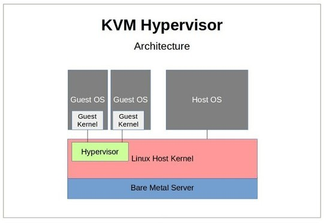
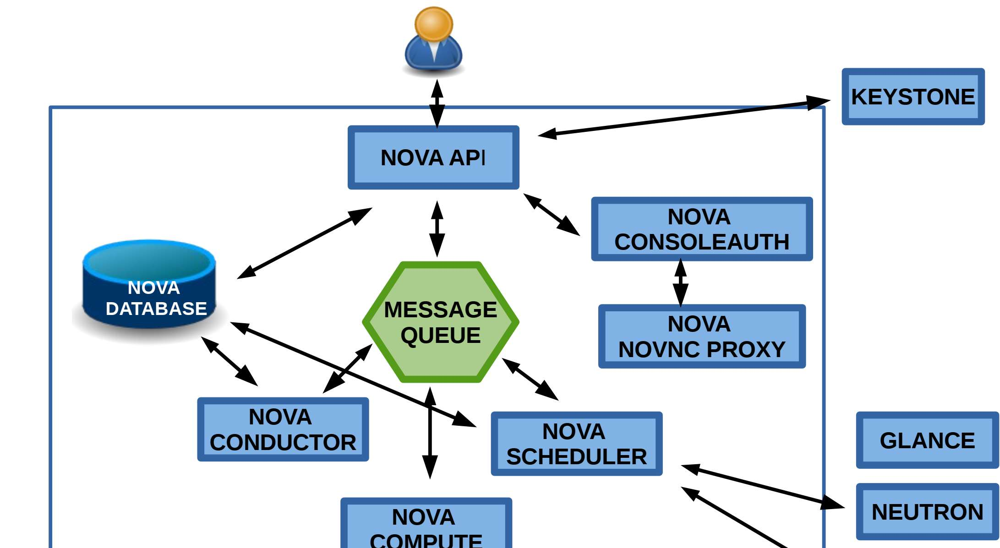
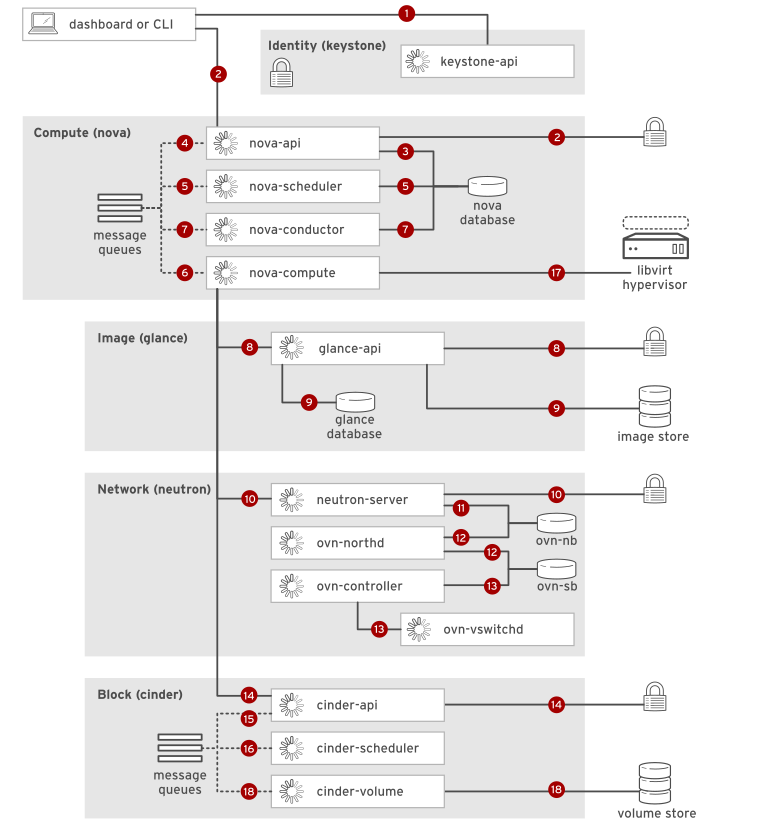

# Nova 

## Overview

Nova là compute service của OpenStack. Nó không trực tiếp "chạy cloud" một mình, mà điều phối lifecycle của instance bằng cách phối hợp với Keystone, Glance, Neutron, Placement, database, message queue và hypervisor như KVM/libvirt.



Trong mô hình KVM, Linux host kernel đóng vai trò hypervisor layer. Guest OS chạy trên VM, còn libvirt/QEMU/KVM là lớp mà `nova-compute` tương tác để tạo, start, stop, resize, migrate hoặc destroy instance.





Các thành phần Nova thường gặp:

| Component | Vai trò |
|---|---|
| `nova-api` | Nhận request từ user/client và validate qua Keystone |
| `nova-scheduler` | Chọn compute host phù hợp, thường phối hợp với Placement |
| `nova-compute` | Agent trên compute node, gọi libvirt/KVM để thao tác instance |
| `nova-conductor` | Trung gian giữa compute node và database, giảm rủi ro compute node truy cập DB trực tiếp |
| `nova-consoleauth` / console proxy | Hỗ trợ truy cập console/VNC tùy phiên bản và mô hình triển khai |
| Message queue | Xương sống RPC giữa các component |
| Nova database | Lưu trạng thái control plane của Nova |

## Request Flow Tạo Instance

Luồng đơn giản hóa:

```text
User / CLI / Horizon
        |
        v
nova-api -> Keystone token validation
        |
        v
message queue
        |
        v
nova-scheduler -> Placement/resource filtering
        |
        v
nova-compute -> libvirt/KVM
        |
        +--> Glance image
        +--> Neutron port/network
        +--> Cinder volume nếu boot/attach volume
```

Khi debug Nova, đừng chỉ nhìn `nova-compute`. Một lỗi boot instance có thể bắt nguồn từ image Glance, port Neutron, quota Placement, policy Keystone, DB/message queue hoặc libvirt trên compute node.

Diagram instance launch ở trên nhấn mạnh một điểm quan trọng: request tạo instance đi qua nhiều service lock-step với nhau. Keystone xác thực, Nova điều phối, Glance cấp image, Neutron cấp network/port, Cinder cấp volume nếu có block storage, còn libvirt/KVM mới là lớp thực thi cuối trên compute host.


## Nova Troubleshooting
- Nova là lớp điều phối compute của OpenStack, nên khi có lỗi, vấn đề không chỉ nằm ở `nova-compute` mà có thể xuất phát từ `nova-api`, `nova-scheduler`, `nova-conductor`, hoặc từ các service phụ thuộc như Keystone, Neutron, Glance, libvirt và hạ tầng network bên dưới. Vì các thành phần này liên kết chặt với nhau, cách debug đúng không phải là đoán mò ở một log duy nhất, mà là lần theo chuỗi sự kiện bằng cách đối chiếu thời điểm, severity, module name và error message trong log. OpenStack docs khuyên bắt đầu bằng việc `tail -f` đúng log file của component đang được gọi, rồi chạy lại action để bắt lỗi theo thời gian thực; nếu dấu hiệu cho thấy lỗi nằm ở service khác thì chuyển sang tail log của service đó và lặp lại cho đến khi tìm được root cause.

- Một log Nova thường có bốn lớp thông tin rất quan trọng: **timestamp**, **severity level**, **module name**, và **error message**. 
    - `timestamp` cho biết sự kiện nào xảy ra trước/sau.
    - `severity` cho biết mức độ nghiêm trọng.
    - `module name` cho biết lỗi phát ra từ phần nào của Nova.
    - `error message` thường chỉ ra chính xác trạng thái sai hoặc dependency bị lỗi. 
    > ưu tiên xử lý CRITICAL và ERROR trước; WARNING thường là dấu hiệu sớm, còn DEBUG hữu ích khi cần đào sâu chi tiết.

1. Nhóm lỗi API: 400, 404, 500, 401, 403, token validation

- Với `nova-api`, lỗi thường bắt đầu ở tầng request/identity hơn là compute. `400 Bad Request` thường có nghĩa request gửi lên sai format hoặc thiếu dữ liệu bắt buộc; `404 Not Found` thường là do resource ID không còn tồn tại hoặc endpoint sai; `500 Internal Server Error` thường chỉ ra vấn đề nội bộ của Nova API, DB, dependency, hoặc bug. Ở tầng xác thực, `401 Unauthorized` thường là token không hợp lệ hoặc hết hạn, `403 Forbidden` là do role hoặc policy không đủ quyền, còn token validation error thường chỉ ra Keystone hoặc token pipeline đang có vấn đề.

- Trong thực tế, khi gặp lỗi kiểu này, bước đầu tiên là kiểm tra token và endpoint trước khi đổ lỗi cho Nova. OpenStack docs khuyến nghị kiểm tra credentials đang được source đúng chưa, token còn hợp lệ không, và service endpoint có bị sai hay không; trong troubleshooting của Compute, thiếu credentials có thể dẫn đến 403 forbidden, và OpenStack khuyên đảm bảo môi trường được source đúng file novarc hoặc equivalent.

2. Nhóm lỗi compute: No Valid Host Found và Instance Failed to Spawn

- Hai lỗi compute quan trọng nhất trong Nova là `No Valid Host Found` và `Instance Failed to Spawn`. `No Valid Host Found` xuất hiện khi Nova Scheduler không tìm được host phù hợp để chạy instance, thường vì compute host thiếu CPU, RAM hoặc disk, hoặc vì storage/network không đáp ứng được yêu cầu của instance. `Instance Failed to Spawn` nghĩa là VM không được tạo thành công; nguyên nhân có thể đến từ libvirt/KVM/QEMU không đúng cấu hình, tài nguyên compute không đủ, image lỗi định dạng/corrupt, hoặc quota/policy chặn việc tạo thêm instance.

- Khi gặp `No Valid Host Found`, nên kiểm tra ba lớp theo thứ tự: tài nguyên compute, storage availability, và network provisioning. OpenStack Compute docs cũng lưu ý rằng lỗi compute thường liên quan tới network được cấu hình sai hoặc credentials không được source đúng; ngoài ra, một số môi trường flat networking mặc định còn không cho ping/SSH từ compute node vào instance, nên nếu test trực tiếp từ host mà tưởng dịch vụ hỏng thì có thể chỉ là thiết kế mạng của cluster.

3. Nhóm lỗi network: Unable to allocate network và interface connection failures

- Lỗi network trong Nova thường biểu hiện thành `Unable to allocate network` hoặc interface connection failures. Unable to allocate network có thể do hết IP trong subnet, hết VLAN/VXLAN ID, DHCP agent không hoạt động, hoặc trùng dải IP / trùng VLAN/VXLAN giữa các network. Interface connection failures thường đến từ security group cấu hình sai, Open vSwitch/OVS lỗi trên compute node, hoặc lỗi vật lý trên đường mạng/hardware. Đây là nhóm lỗi rất dễ bị nhầm với lỗi Nova, trong khi thực tế root cause thường nằm ở Neutron hoặc fabric network bên dưới.

- Khi debug network, OpenMetal khuyên kiểm tra lại security group rules, xác nhận rule đó đã apply đúng vào port/instance chưa, rồi kiểm tra network inventory, subnet range, và DHCP agent. Bản chất của lỗi này là Nova không thể hoàn tất việc gắn NIC và cấp network cho instance, nên nếu chỉ nhìn `nova-compute` log thì có thể thấy triệu chứng nhưng chưa thấy nguyên nhân gốc.

4. Nhóm lỗi login/identity: Keystone, role, token

- Một nhóm lỗi khác xuất hiện trong Nova logs nhưng gốc lại ở Keystone hoặc policy là lỗi đăng nhập/authorization. `401 Unauthorized` thường báo token không hợp lệ hoặc hết hạn; `403 Forbidden` là user không có quyền tương ứng; còn token validation error là dấu hiệu Keystone hoặc token itself đang có vấn đề. OpenMetal khuyên kiểm tra token thường xuyên và xác nhận role đang gán đúng cho user/project, vì đây là nguồn lỗi rất hay gặp trong vận hành multi-tenant.

- Trong troubleshooting thực tế, mình sẽ đi theo chuỗi: kiểm tra `openstack token issue`, kiểm tra `openstack endpoint list`, rồi xác nhận thời gian giữa client và server đang đồng bộ. Nếu thời gian lệch quá nhiều, token có thể bị xem là không hợp lệ dù credentials đúng. OpenStack docs cũng nhấn mạnh khi troubleshooting Compute thì credentials và environment sourcing là bước rất cơ bản nhưng thường bị bỏ qua.

5. Lỗi injection, image, libvirt và dịch vụ phụ thuộc

- Không phải mọi lỗi Nova đều là lỗi Nova. OpenStack Compute docs nêu rõ một số vấn đề phổ biến như instance boot chậm hoặc không boot được do file injection; một số trường hợp cần tắt injection trong libvirt và chuyển sang config drive để tránh boot failure. Ngoài ra, khi compute node không chạy được instance nào, root cause có thể nằm ở libvirt, KVM, QEMU, hoặc thậm chí một dịch vụ nền như DBus. Ops guide của OpenStack còn đưa ví dụ rất điển hình: log Nova có thể gây nhiễu, nhưng khi chạy daemon trực tiếp trên CLI thì mới lòi ra libvirt chết vì không kết nối được DBus.

- Đây là lý do khi Nova log không đủ rõ, nên chuyển sang chạy daemon trên CLI hoặc tạo Guru Meditation Report. Compute docs mô tả rằng có thể gửi signal SIGUSR2 để tạo Guru Meditation Report, hoặc dùng file-based trigger cho các WSGI service; report này chứa stack traces, thread IDs, configuration và trạng thái hiện tại của service, rất hữu ích khi log bình thường chưa nói đủ.

6. Quy trình trace Nova đúng cách
- Cách trace hiệu quả nhất là bắt đầu từ component đang được gọi và chạy lại thao tác trong lúc tail log. Nếu lỗi xuất hiện khi gọi `openstack server list`, hãy tail `nova-api.log`; nếu lỗi khi boot instance, hãy tail `nova-compute.log` và đồng thời xem `nova-scheduler` nếu cần; nếu lỗi liên quan identity, chuyển sang Keystone. OpenStack docs khuyến nghị “wash, rinse, repeat” theo đúng kiểu đổi log target cho đến khi xác định đúng component gốc.
```bash
tail -f /var/log/nova/nova-api.log
tail -f /var/log/nova/nova-compute.log
tail -f /var/log/nova/nova-scheduler.log
```
Khi service có vẻ chết im lặng, nên xem trạng thái service và chạy lại theo CLI để ép lộ lỗi thật:
```bash
systemctl status nova-compute
sudo -u nova -H nova-compute
```
Compute docs và operations guide đều nhấn mạnh rằng chạy daemon trực tiếp trên CLI đôi khi là cách nhanh nhất để thấy lỗi thật, nhất là khi log file chỉ đưa ra triệu chứng chung chung.
