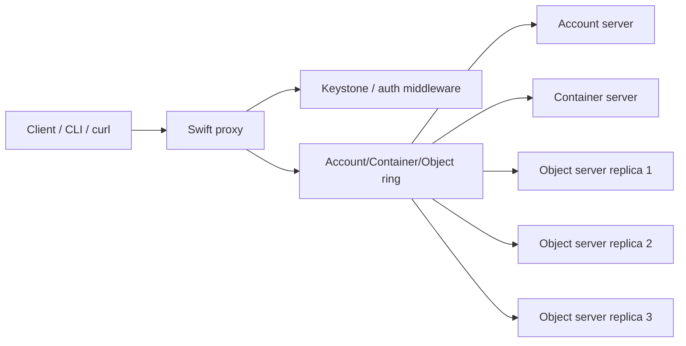

# Swift

## Overview

Swift là Object Storage service của OpenStack. Nó lưu dữ liệu dưới dạng object qua HTTP API, phù hợp cho backup, archive, static content, image/object artifact và dữ liệu phi cấu trúc. Swift khác Cinder: Cinder cung cấp block device gắn vào VM, còn Swift cung cấp namespace object để upload/download qua API.

Logical model:

```text
account / container / object
```

Trong OpenStack, Swift account thường tương ứng với project/tenant. Container giống bucket/thư mục logic, còn object là dữ liệu kèm metadata.

## Components

| Component | Vai trò |
|---|---|
| Swift proxy | Nhận request API/HTTP, validate auth, route tới backend. |
| Account server | Quản lý metadata account. |
| Container server | Quản lý metadata container. |
| Object server | Lưu object data thật trên storage node. |
| Ring | Mapping account/container/object tới partition và storage node. |
| Replicator/auditor/updater | Duy trì replication, kiểm tra object và xử lý async update. |

Swift thường replicate object nhiều bản để tăng durability và availability. Khi vận hành cần hiểu disk health, ring balance, replication lag và proxy path.

Trong mô hình Swift cổ điển, replica count thường gặp là `3`, nhưng đây là chính sách triển khai chứ không phải giá trị nên hard-code trong mọi cloud. Ring và storage policy quyết định object được map tới partition/node nào và replica được phân bố ra sao.

| Khái niệm | Ý nghĩa vận hành |
|---|---|
| Ring | Bản đồ từ account/container/object partition tới storage node. Ring lệch hoặc rebalance chưa xong có thể gây list/download bất thường. |
| Replica count | Số bản sao dữ liệu theo policy; thường dùng để tăng durability và availability. |
| Storage policy | Cho phép container dùng backend/replication/erasure-coding policy khác nhau tuỳ deployment. |
| Replication lag | Khoảng trễ để các replica đồng bộ; object có thể tạm thời chưa xuất hiện đều trên mọi node. |

Request path đơn giản:



Swift lưu object theo path logic:

```text
/account/container/object
```

Trong OpenStack, `account` thường map với project/tenant chứ không phải Linux user.

## Basic Operations

Swift CLI:

```bash
swift stat
swift upload <container> <file-or-dir>
swift list
swift list <container>
swift stat <container> <object>
swift download <container>
swift download <container> <object>
```

Các trường/header đáng đọc khi inspect:

| Trường/header | Ý nghĩa |
|---|---|
| `Account`, `Container`, `Object` | Scope logic của dữ liệu. |
| `Content Length` / bytes | Dung lượng đang lưu. |
| `Content Type` | MIME type hoặc type do client đặt. |
| `ETag` | Hash/identifier để kiểm tra object content theo request. |
| `X-Timestamp` | Thời điểm Swift ghi metadata/object. |
| `X-Trans-Id` hoặc `X-Openstack-Request-Id` | Request ID để trace proxy/object log. |
| `X-Storage-Policy` | Storage policy/container policy nếu deployment bật nhiều policy. |

OpenStack CLI tương đương:

```bash
openstack container create <container>
openstack container list
openstack object create <container> <file>
openstack object list <container>
openstack object save <container> <object> --file <local-file>
openstack object delete <container> <object>
```

## ACL Và Container Permission

Swift có thể gán ACL ở container để cho phép read/write theo project/user.

```bash
swift post <container> -r "<project>:<user>"
swift post <container> -w "<project>:<user>"
swift stat <container>
```

Để write thành công, user thường cần quyền phù hợp cả ở read/write ACL theo chính sách đang áp dụng. Không dùng ACL rộng nếu object chứa dữ liệu nhạy cảm.

## cURL Workflow

Swift là HTTP API nên có thể thao tác bằng `curl`. Lấy storage URL và token:

```bash
$(swift auth)
echo "$OS_STORAGE_URL"
echo "$OS_AUTH_TOKEN"
```

Tạo container, list container, upload và đọc object:

```bash
curl -X PUT -H "X-Auth-Token: $OS_AUTH_TOKEN" "$OS_STORAGE_URL/example-container"
curl -X GET -H "X-Auth-Token: $OS_AUTH_TOKEN" "$OS_STORAGE_URL"
curl -X PUT -H "X-Auth-Token: $OS_AUTH_TOKEN" "$OS_STORAGE_URL/example-container/example.txt" -T ./example.txt
curl -X GET -H "X-Auth-Token: $OS_AUTH_TOKEN" "$OS_STORAGE_URL/example-container/example.txt"
```

## Expiring Objects

Swift có thể tự xóa object theo thời gian bằng header:

- `X-Delete-At`: thời điểm xóa theo Unix epoch.
- `X-Delete-After`: số giây sau request.

Ví dụ:

```bash
curl -X POST \
  -H "X-Auth-Token: $OS_AUTH_TOKEN" \
  -H "X-Delete-After: 3600" \
  "$OS_STORAGE_URL/example-container/example.txt"
```

## Monitoring

`swift-recon` dùng để lấy health/disk/load từ Swift cluster khi recon middleware được bật.

```bash
swift-recon -l
swift-recon -d
```

Để `swift-recon` có dữ liệu, recon middleware phải nằm trong pipeline của account/container/object server và cache path phải ghi được:

```ini
[pipeline:main]
pipeline = recon object-server

[filter:recon]
use = egg:swift#recon
recon_cache_path = /var/cache/swift
```

Triển khai thực tế có thể cần cấu hình tương tự cho `account-server.conf` và `container-server.conf`, sau đó reload service. Một số metric async/recon cần cron/helper định kỳ như `swift-recon-cron` tuỳ distro.

Các điểm cần kiểm tra:

- Proxy/API response và request ID.
- Disk usage trên object node.
- Replication backlog.
- Ring consistency.
- Log account/container/object/proxy service.

## Troubleshooting

| Triệu chứng | Hướng kiểm tra |
|---|---|
| Không auth được | Keystone token, endpoint object-store, project/user. |
| Upload fail | Container ACL, proxy log, disk full, object server health. |
| Object list thiếu | Container metadata update, replication delay, ring issue. |
| Download chậm | Proxy bottleneck, disk I/O, network path, overloaded object node. |
| Recon không có dữ liệu | Recon middleware, `/var/cache/swift` permission, cron `swift-recon-cron`. |

## Related Pages

- [Cinder](./cinder.md)
- [Glance](./glance.md)
- [OpenStack General Logs And Maintenance Debug](../../04-troubleshooting/general-logs-debug.md)
