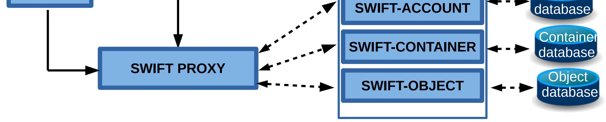

# Swift

## Overview

Swift là object storage service của OpenStack. Nó lưu dữ liệu dạng object trong container/account, phù hợp cho backup, media, archive, artifact hoặc dữ liệu phi cấu trúc cần scale lớn.

Swift không giống block storage. Cinder cung cấp volume gắn vào VM; Swift cung cấp object API để ứng dụng upload/download object qua HTTP API.



## Core Components

| Component | Vai trò |
|---|---|
| Swift Proxy | Endpoint nhận request từ client, validate auth và route request tới backend |
| Account Server | Quản lý metadata cấp account |
| Container Server | Quản lý metadata cấp container |
| Object Server | Lưu object data thật trên storage node |
| Ring | Mapping logic giúp Swift biết object/account/container nằm trên node/partition nào |

## Mental Model

```text
Client
  |
  v
Swift Proxy
  |
  +--> Account service
  +--> Container service
  +--> Object service
```

Swift được thiết kế để tránh single point of failure bằng replication và phân tán dữ liệu. Khi vận hành cần hiểu rõ ring, replication, disk health, capacity balance và consistency model.

## Operations

```bash
openstack container list
openstack container create <container>
openstack object list <container>
openstack object save <container> <object>
openstack object create <container> <file>
openstack object delete <container> <object>
```

Khi troubleshooting Swift:

- Kiểm tra auth/Keystone token trước.
- Kiểm tra proxy log nếu request fail ngay từ API endpoint.
- Kiểm tra account/container/object server log nếu request đã vào backend.
- Kiểm tra ring và disk nếu object mất cân bằng hoặc replication chậm.

## Related Pages

- [OpenStack Architecture](../01-architectures.md)
- [Cinder](./cinder.md)
- [Glance](./glance.md)
