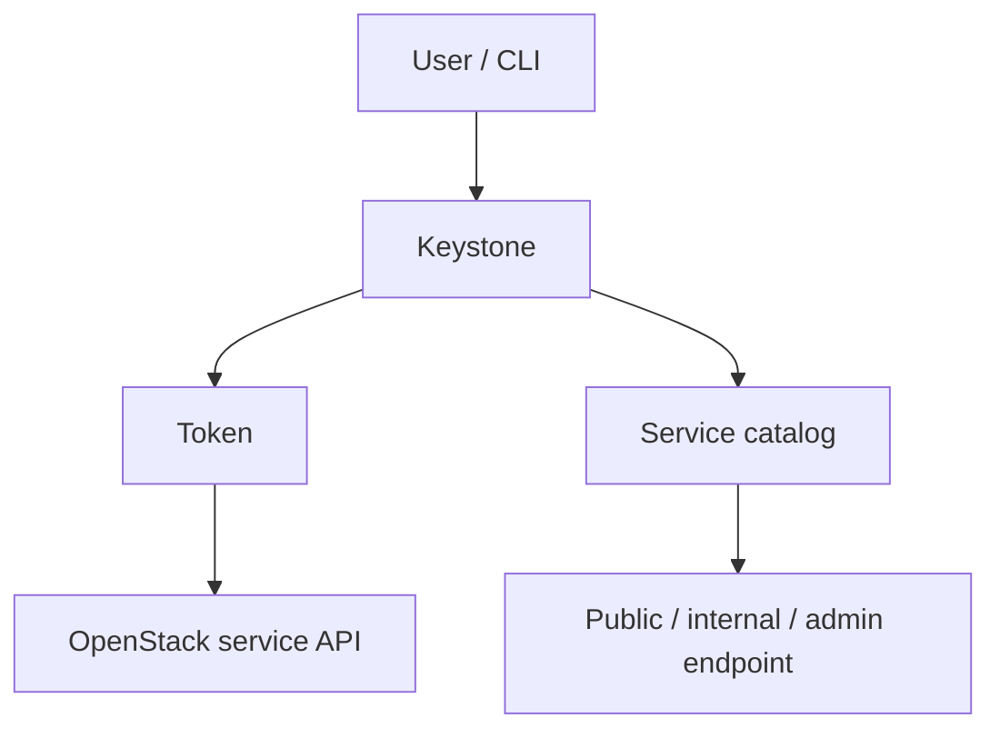
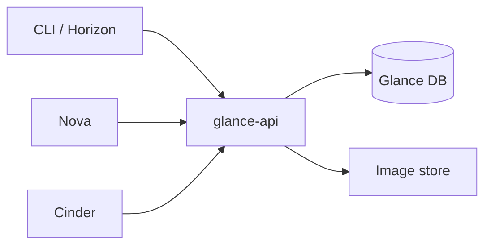

# Lab, CLI, Horizon, Keystone And Glance

Note này gom các năng lực nền trước khi đi vào network/compute/storage: dựng lab OpenStack, dùng CLI/Horizon, hiểu RC file, service catalog, identity model và image lifecycle.

## Mental Model

OpenStack là một tập hợp service có API riêng. Mỗi service thường có:

- API endpoint để client gọi vào.
- Database để lưu state control plane.
- Message queue để trao đổi RPC giữa các component.
- Worker hoặc agent để làm việc thật với backend.
- Keystone integration để xác thực và phân quyền.

Vì vậy, khi một command thất bại, đừng chỉ nhìn command đó. Hãy hỏi: command gọi API nào, dùng token nào, endpoint nào, service backend nào, và log nằm ở đâu.

## Lab Và Môi Trường Học

Các công cụ trong tài liệu gốc chủ yếu phục vụ lab, không phải blueprint production:

| Tool | Dùng khi | Ghi nhớ |
|---|---|---|
| DevStack | học nhanh, dev/test upstream | dễ dựng, không đại diện production |
| PackStack / RDO | lab RPM-based, all-in-one hoặc thêm compute node | hay gặp trong môi trường học COA cũ |
| MicroStack | lab Ubuntu/Snap, init nhanh | phù hợp thử nhanh hơn là production |
| Kolla-Ansible | gần production hơn, dùng container | vault đã có note riêng về [Kolla-Ansible all-in-one lab](../../02-operations/01-deployment/kolla-ansible-all-in-one-lab.md) |

Checklist lab tối thiểu:

- CPU bật virtualization extension.
- Host có RAM/disk đủ cho controller, compute, image và volume test.
- Đồng bộ thời gian bằng NTP/chrony, vì token và service heartbeat rất nhạy với lệch giờ.
- Có một external/provider network hoặc bridge để test floating IP.
- Dùng password/secret riêng, không giữ default credential trong note hoặc repo.

Ví dụ thao tác lab đã sanitize:

```bash
source <admin-openrc>
openstack hypervisor list
openstack service list
openstack endpoint list
```

## CLI, Service Client Và RC File

`openstack` CLI là lối vào chính cho đa số tác vụ admin hiện đại. Một số service vẫn có CLI legacy như `glance`, `nova`, `cinder`, `swift`, nhưng khi học vận hành nên ưu tiên `openstack` CLI nếu subcommand đã hỗ trợ.

Trong lab, có thể kiểm tra client package/khả năng command trước khi debug sâu:

```bash
openstack --version
openstack help
openstack help image create
openstack help endpoint create
```

RC file là tập biến môi trường để CLI biết:

- gọi Keystone ở đâu;
- dùng project/domain nào;
- user/password hoặc token nào;
- identity API version nào.

Mẫu RC file nên được lưu ngoài repo nếu chứa secret thật:

```bash
export OS_AUTH_URL="http://<controller-ip>:5000/v3"
export OS_PROJECT_NAME="<project-name>"
export OS_USERNAME="<username>"
export OS_PASSWORD="<PASSWORD>"
export OS_USER_DOMAIN_NAME="Default"
export OS_PROJECT_DOMAIN_NAME="Default"
export OS_IDENTITY_API_VERSION=3
export OS_REGION_NAME="RegionOne"
```

Kiểm tra nhanh sau khi source RC file:

```bash
source <openrc-file>
openstack token issue
openstack catalog list
openstack endpoint list
```

Nên có một RC file riêng cho từng cặp user/project hoặc user/domain/project. Khi nhảy giữa nhiều project/domain, lỗi do source nhầm RC file rất dễ bị hiểu nhầm thành lỗi Nova, Neutron hoặc Glance.

Nếu `openstack token issue` lỗi, khoanh vùng Keystone/credential/time sync trước khi debug Nova/Neutron/Glance.

## Horizon

Horizon là dashboard web dựa trên Django. Nó không thay thế CLI khi troubleshooting sâu, nhưng rất hữu ích để nhìn nhanh project, instance, network topology, image, volume và quota.

Điểm cần nhớ khi vận hành:

- Horizon thường chạy sau Apache hoặc NGINX.
- Session timeout, allowed host, cache backend và theme nằm trong cấu hình dashboard.
- Horizon chỉ là API client web; không phải mọi thao tác admin đều có trên UI.
- Dashboard lỗi chưa chắc service backend lỗi; có thể là Horizon config, web server, cache hoặc policy.
- Trong lab, Horizon giúp đối chiếu trạng thái UI với CLI: nếu CLI thấy object nhưng UI không thấy, hãy kiểm tra project scope, role, region và policy.

## Keystone

Keystone là identity service: xác thực user, cấp token, quản lý service catalog, domain, project, user và role.



Các khái niệm Keystone cần chắc:

| Khái niệm | Ý nghĩa |
|---|---|
| Domain | namespace cao hơn project/user, hữu ích cho multi-tenant lớn |
| Project | boundary tài nguyên và quota, gần với tenant |
| User | identity đăng nhập hoặc service account |
| Role | quyền được gán cho user trong project/domain |
| Token | bằng chứng xác thực tạm thời dùng khi gọi API |
| Service catalog | danh bạ endpoint của các service như Nova, Neutron, Glance, Cinder |
| Endpoint | URL public/internal/admin của từng service trong từng region |

Command nền:

```bash
openstack service list
openstack endpoint list
openstack domain list
openstack project list
openstack user list
openstack role list
openstack role assignment list --names
```

Tạo identity object mẫu:

```bash
openstack domain create --description "Example domain" example-domain
openstack project create --domain example-domain project-a
openstack user create --domain example-domain --password-prompt user-a
openstack role add --project project-a --user user-a member
```

Khi debug identity:

- `401 Unauthorized`: token sai, hết hạn, credential sai hoặc lệch thời gian.
- `403 Forbidden`: user có token hợp lệ nhưng role/policy không đủ quyền.
- Endpoint sai: CLI có thể xác thực được nhưng gọi service API nhầm URL/region/interface.
- Service catalog thiếu service: service chưa đăng ký vào Keystone hoặc endpoint bị disable.

## Glance

Glance là image service. Nó quản lý metadata và file image để Nova boot instance hoặc Cinder tạo volume từ image.



Những điểm cần nắm:

- Image metadata nằm trong database; file image nằm ở backend như filesystem, Swift, Ceph RBD hoặc backend khác.
- Disk format hay gặp: `qcow2`, `raw`, `vmdk`, `iso`.
- Container format thường là `bare` với image VM thông thường.
- Trước khi upload, nên kiểm tra format bằng `qemu-img info`.
- Image visibility ảnh hưởng ai thấy được image: private, shared, community hoặc public tùy deployment/policy.

Upload image mẫu:

```bash
qemu-img info <image-file>
openstack image create "image-a" \
  --file <image-file> \
  --disk-format qcow2 \
  --container-format bare \
  --private
openstack image list
openstack image show image-a
```

Quản lý image:

```bash
openstack image set --property os_distro=ubuntu image-a
openstack image save image-a --file image-a.qcow2
openstack image delete image-a
```

Debug Glance theo thứ tự:

1. Kiểm tra endpoint và token: `openstack endpoint list`, `openstack token issue`.
2. Kiểm tra image metadata: `openstack image show <image>`.
3. Kiểm tra backend store còn dung lượng và permission.
4. Đọc log API: `/var/log/glance/api.log`.
5. Nếu Nova boot lỗi từ image, đối chiếu thêm `nova-compute.log` và image format.

## Port Thường Gặp Trong Lab

Các port dưới đây giúp định hướng khi debug lab. Production có thể khác tùy reverse proxy, TLS, endpoint interface và release.

| Service | Port hay gặp |
|---|---|
| Keystone public API | `5000` |
| Glance API | `9292` |
| Nova API | `8774` |
| Placement API | `8778` |
| Neutron API | `9696` |
| Cinder API | `8776` |
| Swift proxy | `8080` |
| Horizon | `80` hoặc `443` |
| RabbitMQ AMQP | `5672` |
| RabbitMQ management | `15672` |
| MariaDB | `3306` |
