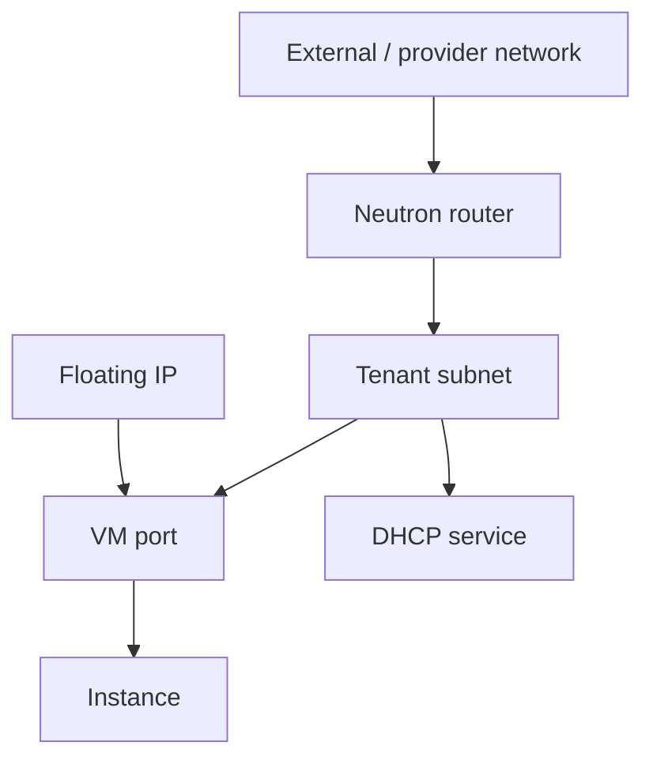
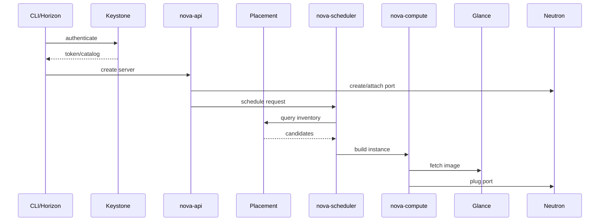
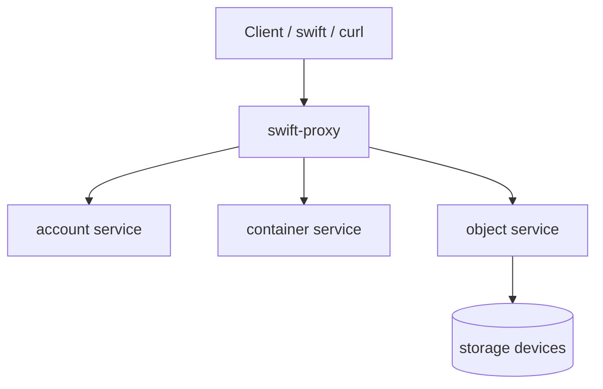
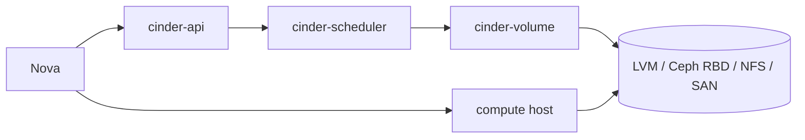

# Networking, Compute, Object And Block Storage

Note này gom bốn mảng năng lực vận hành nhiều thao tác nhất trong OpenStack admin: Neutron, Nova, Swift và Cinder. Nếu Keystone/Glance là nền để request chạy được, thì bốn nhóm này là nơi phần lớn lỗi day-2 xuất hiện.

## Neutron

Neutron cung cấp network abstraction cho project: network, subnet, router, port, security group, floating IP và provider/external network.



Các object cần phân biệt:

| Object | Vai trò |
|---|---|
| Network | broadcast/segment logic của tenant hoặc provider |
| Subnet | CIDR, gateway, DHCP và allocation pool |
| Router | nối tenant subnet với external network hoặc subnet khác |
| Port | attachment point của VM/router/DHCP vào network |
| Floating IP | địa chỉ external NAT tới fixed IP của port |
| Security group | firewall stateful ở mức port/instance |
| Network agent | agent xử lý DHCP, L3, metadata, OVS/OVN tùy backend |

### OVS Và OVN

Trong lab cũ, Neutron hay dùng Open vSwitch agent với các bridge như `br-int`, `br-tun`, `br-ex`. Với mô hình mới hơn, OVN thay nhiều agent bằng northbound/southbound database và `ovn-controller`.

Ghi nhớ thực dụng:

- OVS là switching datapath và bridge abstraction.
- OVN là control plane SDN trên OVS, giảm số agent truyền thống như L3/DHCP tùy mô hình.
- Overlay network có thể dùng VXLAN/Geneve/GRE tùy driver.
- Khi MTU sai, VM có thể ping gói nhỏ được nhưng ứng dụng timeout với gói lớn.

Kiểm tra Neutron:

```bash
openstack network agent list
openstack network list
openstack subnet list
openstack router list
openstack port list
openstack extension list --network
```

Kiểm tra OVS trên node phù hợp:

```bash
ovs-vsctl show
ip netns list
ip link show
```

### Tạo Network Cơ Bản

Luồng tạo mạng tenant điển hình:

```bash
openstack network create project-net
openstack subnet create project-subnet \
  --network project-net \
  --subnet-range 10.0.10.0/24 \
  --gateway 10.0.10.1 \
  --dns-nameserver 8.8.8.8
openstack router create project-router
openstack router add subnet project-router project-subnet
openstack router set --external-gateway external-net project-router
```

Floating IP:

```bash
openstack floating ip create external-net
openstack server add floating ip <server> <floating-ip>
```

Security group:

```bash
openstack security group create web-sg
openstack security group rule create --protocol tcp --dst-port 22 --remote-ip 10.0.0.0/24 web-sg
openstack security group rule create --protocol tcp --dst-port 443 --remote-ip 0.0.0.0/0 web-sg
openstack server add security group <server> web-sg
```

Debug Neutron theo lớp:

1. Project có network/subnet/router đúng không.
2. Port VM có fixed IP, status và security group đúng không.
3. Router đã nối subnet và external gateway chưa.
4. Floating IP đã map đúng port chưa.
5. Agent alive không: DHCP/L3/OVS/OVN.
6. Network namespace/OVS bridge có object tương ứng không.
7. MTU, security group, provider network và physical uplink có khớp không.

## Nova

Nova điều phối lifecycle instance. Nova không tự làm tất cả, mà gọi Keystone, Glance, Neutron, Cinder, Placement, message queue, database và hypervisor.



Component cần biết:

| Component | Vai trò |
|---|---|
| `nova-api` | nhận request và validate |
| `nova-scheduler` | chọn compute host |
| `nova-compute` | chạy trên compute node, gọi libvirt/KVM/QEMU |
| `nova-conductor` | trung gian DB/RPC, giảm quyền DB trực tiếp từ compute |
| `placement-api` | inventory và allocation tài nguyên |
| console proxy | VNC/SPICE/noVNC console tùy cấu hình |

### Flavor, Key Pair Và Instance

Flavor định nghĩa CPU/RAM/disk nhìn từ phía user:

```bash
openstack flavor list
openstack flavor create --public --ram 1024 --disk 10 --vcpus 1 m1.example
```

Key pair lưu public key trong OpenStack, private key phải do người dùng giữ an toàn:

```bash
openstack keypair create --public-key ~/.ssh/id_rsa.pub key-a
openstack keypair list
```

Tạo instance:

```bash
openstack server create \
  --image image-a \
  --flavor m1.example \
  --network project-net \
  --key-name key-a \
  --security-group web-sg \
  server-a
```

Lifecycle:

```bash
openstack server list
openstack server show server-a
openstack server stop server-a
openstack server start server-a
openstack server reboot server-a
openstack server delete server-a
```

Snapshot:

```bash
openstack server image create --name server-a-snapshot server-a
openstack image list
```

Nova debug nhanh:

- `ERROR` khi boot: đọc `openstack server show`, sau đó xem `fault`.
- `No valid host`: kiểm tra quota, Placement inventory, compute service, flavor requirement, aggregate/availability zone.
- VM không có mạng: kiểm tra Neutron port, DHCP, security group, router/floating IP.
- Console lỗi: kiểm tra console proxy, VNC config, hostname/IP của compute/controller.
- Image boot lỗi: kiểm tra Glance image format, libvirt/QEMU log và `nova-compute.log`.

Command kiểm tra:

```bash
openstack compute service list
openstack hypervisor list
openstack hypervisor show <hypervisor>
openstack server list --all-projects
openstack quota show <project>
```

## Swift

Swift là object storage. Nó không cung cấp block device cho VM như Cinder; nó lưu object trong container thuộc account/project.



Khái niệm:

| Object | Ý nghĩa |
|---|---|
| Account | namespace cấp cao gắn với tenant/project |
| Container | nhóm object, gần giống bucket |
| Object | file/blob được lưu cùng metadata |
| ACL | quyền đọc/ghi ở container |
| Expiring object | object tự xóa theo thời điểm định trước |
| Recon | cơ chế kiểm tra tình trạng Swift cluster |

Thao tác cơ bản:

```bash
swift stat
swift post container-a
swift upload container-a ./file-a.txt
swift list container-a
swift download container-a file-a.txt
swift delete container-a file-a.txt
```

Swift cũng có thể gọi qua HTTP API nếu có token và storage URL:

```bash
curl -X GET -H "X-Auth-Token: <TOKEN>" "$OS_STORAGE_URL/container-a"
```

Quyền container:

```bash
swift post container-a -r '<project>:<user>'
swift stat container-a
```

Theo dõi Swift:

```bash
swift-recon -d
swift-recon -l
```

Khi debug Swift, phân biệt lỗi authentication/endpoint với lỗi storage ring/disk. Nếu CLI không vào được Swift, kiểm tra token và endpoint. Nếu vào được nhưng object lỗi, kiểm tra proxy log, account/container/object service và disk health.

## Cinder

Cinder cung cấp block storage volume để attach vào instance hoặc dùng làm boot volume. Đây là stateful data path nên cần thận trọng hơn compute/network thuần.



Component:

| Component | Vai trò |
|---|---|
| `cinder-api` | nhận request volume |
| `cinder-scheduler` | chọn backend/pool phù hợp |
| `cinder-volume` | thao tác với backend storage |
| `cinder-backup` | backup volume sang backend backup như Swift hoặc object store |
| Backend driver | LVM/iSCSI, Ceph RBD, NFS, SAN, vendor driver |

### Volume Lifecycle

```bash
openstack volume create --size 10 volume-a
openstack volume list
openstack server add volume server-a volume-a
openstack server remove volume server-a volume-a
openstack volume delete volume-a
```

Tạo volume từ image:

```bash
openstack volume create --size 10 --image image-a boot-volume-a
```

Snapshot và backup:

```bash
openstack volume snapshot create --volume volume-a volume-a-snap
openstack volume backup create volume-a
openstack volume backup restore <backup-id> volume-a
```

Quota Cinder:

```bash
openstack quota show <project>
openstack quota set --volumes 20 --gigabytes 1000 <project>
```

Khi dùng LVM/iSCSI trong lab:

- volume group phải tồn tại và đúng tên trong `cinder.conf`;
- compute node phải đi được tới iSCSI target;
- firewall/routing/storage network phải thông;
- không nhầm lẫn state DB với trạng thái thật của backend.

Debug Cinder:

1. `openstack volume show <volume>` để xem status, attachment và lỗi.
2. `openstack volume service list` hoặc command tương đương để xem service health.
3. Đọc `/var/log/cinder/api.log`, `/var/log/cinder/scheduler.log`, `/var/log/cinder/volume.log`.
4. Nếu attach lỗi, đọc thêm `nova-compute.log` trên compute node.
5. Kiểm tra backend driver, volume type, pool, free space và network path compute-to-storage.

Lưu ý nguy hiểm: reset state chỉ sửa record control plane, không sửa root cause backend. Chỉ dùng sau khi đã xác minh volume không còn operation thật đang chạy.

```bash
# Thao tác có rủi ro: chỉ dùng khi đã kiểm tra log/backend và có kế hoạch rollback.
cinder reset-state --state available <volume-id>
```
