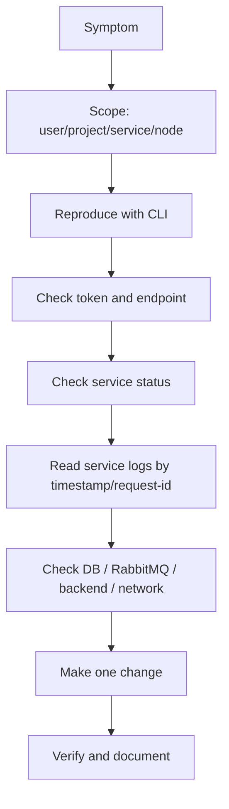

# Troubleshooting, Heat And Admin Checklist

Note này gom phần tư duy troubleshooting OpenStack, các điểm kiểm tra RabbitMQ/DB/log/service/network, cộng thêm Heat orchestration như một năng lực bổ sung cho admin.

## Nguyên Tắc Troubleshooting OpenStack

OpenStack troubleshooting phải đi theo chuỗi bằng chứng, vì một lỗi ở UI/CLI thường chỉ là triệu chứng của service khác.

Nguyên tắc:

- Backup config trước khi sửa.
- Chỉ thay đổi một thứ tại một thời điểm.
- Có cách revert rõ ràng.
- Ghi lại command đã chạy, thời điểm, request ID và log liên quan.
- Luôn kiểm tra token, endpoint, project scope và time sync trước khi đào sâu service backend.
- Ưu tiên read-only command trước; command sửa state phải có lý do.

Luồng debug tổng quát:



## Bộ Command Linux Nền

OpenStack admin vẫn là Linux admin. Các command sau thường giúp khoanh vùng nhanh:

```bash
hostnamectl
timedatectl
ip addr
ip route
ss -lntup
df -h
du -sh /var/log/* 2>/dev/null
free -h
top
systemctl status <service>
journalctl -u <service> --since "30 minutes ago"
tail -f /var/log/<service>/<log-file>.log
```

Nếu service dùng container hoặc deployment tool khác, thay `systemctl` bằng công cụ tương ứng như `docker`, `podman`, `kolla-ansible`, `kubectl` hoặc tool vendor.

## Kiểm Tra Version Và Endpoint

Trước khi xử lý lỗi, cần biết đang đứng ở cloud nào, region nào, endpoint nào:

```bash
openstack --version
openstack token issue
openstack catalog list
openstack endpoint list
openstack service list
```

Các dấu hiệu hay gặp:

- Endpoint public/internal/admin trỏ sai IP hoặc port.
- Client source nhầm RC file/project.
- Region trong client không khớp catalog.
- Token lỗi do lệch thời gian giữa client/controller.

## Log Và Request ID

Log OpenStack thường nằm dưới `/var/log/<service>/`. Một số deployment đưa log vào journald hoặc container log.

Log cần xem:

| Mảng | Log thường gặp |
|---|---|
| Keystone | `/var/log/keystone/`, Apache/WSGI log |
| Glance | `/var/log/glance/api.log` |
| Nova | `/var/log/nova/nova-api.log`, `nova-scheduler.log`, `nova-conductor.log`, `nova-compute.log` |
| Neutron | `/var/log/neutron/server.log`, agent logs |
| Cinder | `/var/log/cinder/api.log`, `scheduler.log`, `volume.log`, `backup.log` |
| Swift | proxy/account/container/object logs |
| Heat | `/var/log/heat/heat-api.log`, `heat-engine.log` |

Request ID là chìa khóa để nối log giữa nhiều service. Khi CLI hỗ trợ debug, dùng:

```bash
openstack --debug server show <server>
```

Sau đó tìm request ID trong log tương ứng.

## Database Và Message Queue

Hầu hết service OpenStack lưu control-plane state trong DB và trao đổi RPC qua message queue. Nếu DB hoặc RabbitMQ có vấn đề, lỗi có thể xuất hiện như Nova/Neutron/Cinder lỗi ngẫu nhiên.

Kiểm tra DB ở mức an toàn:

```bash
systemctl status mariadb
mysql -e "SHOW DATABASES;"
```

Backup database trước khi thay đổi lớn:

```bash
mysqldump --all-databases > /safe-backup/openstack-all-databases.sql
```

Kiểm tra RabbitMQ:

```bash
systemctl status rabbitmq-server
rabbitmqctl status
rabbitmqctl list_queues
rabbitmqctl list_users
```

Lưu ý bảo mật: không ghi default password, real password hoặc connection string thật vào note. Trong thực tế, hãy kiểm tra credential trong config bằng quyền phù hợp và không paste secret vào ticket/log công khai.

## Host, Hypervisor Và Instance Status

Kiểm tra compute layer:

```bash
openstack host list
openstack compute service list
openstack hypervisor list
openstack hypervisor show <hypervisor>
openstack server list --all-projects
openstack server show <server>
```

Nếu instance `ERROR`:

- Xem field `fault`.
- Đối chiếu thời điểm lỗi với `nova-api`, `nova-scheduler`, `nova-compute`.
- Nếu scheduler không chọn được host, kiểm tra quota, Placement inventory, aggregate/AZ và flavor.
- Nếu spawn lỗi, kiểm tra image, libvirt/QEMU/KVM, disk path, permission và network port.

## Network Status

Neutron lỗi thường lộ ra như VM không lấy IP, floating IP không vào được, router không NAT, hoặc security group tưởng đúng nhưng traffic vẫn bị chặn.

Checklist:

```bash
openstack network agent list
openstack network list
openstack subnet list
openstack router list
openstack port list
openstack floating ip list
openstack security group list
openstack security group rule list <security-group>
```

Nếu cần đi sâu node:

```bash
pgrep -laf neutron
ip netns list
ovs-vsctl show
```

Luồng khoanh vùng:

1. VM có port và fixed IP không.
2. DHCP agent hoặc OVN DHCP flow có hoạt động không.
3. Router đã có interface vào subnet và external gateway chưa.
4. Floating IP map đúng port chưa.
5. Security group cho phép đúng chiều traffic chưa.
6. Provider/external network có uplink ra ngoài không.
7. MTU overlay và physical network có khớp không.

## Digest OpenStack Environment

Khi nhận một môi trường lạ, đừng bắt đầu bằng sửa lỗi. Hãy lập inventory:

```bash
openstack service list
openstack endpoint list
openstack compute service list
openstack network agent list
openstack volume service list
openstack hypervisor list
openstack quota show <project>
```

Từ đó vẽ lại:

- controller node chạy API/service nào;
- compute node nào enabled/disabled;
- network backend là OVS hay OVN;
- storage backend là LVM, Ceph RBD, NFS hay vendor driver;
- endpoint dùng HTTP hay HTTPS;
- Horizon chỉ là UI hay có reverse proxy/caching phía trước.

## Heat

Heat là orchestration service của OpenStack. Nó triển khai một stack từ template, tương tự cách Infrastructure as Code mô tả resource rồi để control plane tạo chúng.

Component:

| Component | Vai trò |
|---|---|
| `heat-api` | nhận request Heat native API |
| `heat-api-cfn` | API tương thích CloudFormation |
| `heat-engine` | xử lý template, tạo resource, theo dõi event |
| HOT | Heat Orchestration Template, thường viết bằng YAML |

HOT có bốn phần thường gặp:

- `heat_template_version`: version template.
- `description`: mô tả tùy chọn.
- `parameters`: input lúc launch stack.
- `resources`: tài nguyên cần tạo, phần bắt buộc.
- `outputs`: giá trị trả về sau khi stack tạo xong.

Ví dụ template tối giản đã sanitize:

```yaml
heat_template_version: 2018-08-31

description: Example one-server stack.

parameters:
  image:
    type: string
  flavor:
    type: string
    default: m1.small
  network:
    type: string

resources:
  server:
    type: OS::Nova::Server
    properties:
      image: { get_param: image }
      flavor: { get_param: flavor }
      networks:
        - network: { get_param: network }

outputs:
  server_name:
    value: { get_attr: [server, name] }
```

Command Heat:

```bash
openstack stack create -t stack.yml \
  --parameter image=image-a \
  --parameter network=project-net \
  stack-a
openstack stack list
openstack stack show stack-a
openstack stack event list stack-a
openstack stack resource list stack-a
openstack stack output show stack-a --all
openstack stack template show stack-a
openstack stack update -t stack.yml stack-a
openstack stack delete stack-a
```

Debug Heat:

- `stack event list` cho biết resource nào fail trước.
- Lỗi ở Heat có thể thực ra là Nova/Neutron/Cinder/Glance lỗi khi tạo resource.
- Đọc `heat-engine.log` cùng với log service của resource bị fail.
- Luôn kiểm tra rollback/disable rollback tùy tình huống lab hay production.

## Admin Readiness Checklist

Nếu nắm chắc các mục dưới đây, bạn có nền khá ổn để vận hành OpenStack hoặc ôn hướng COA-style:

- Có thể source RC file và tự kiểm tra token/catalog/endpoint.
- Hiểu domain, project, user, role, token và service catalog.
- Upload, show, set property, save và delete image bằng CLI.
- Tạo tenant network, subnet, router, floating IP và security group.
- Debug VM không ping/SSH được bằng port, router, floating IP, security group và agent state.
- Tạo flavor, key pair, boot instance, stop/start/reboot/delete instance.
- Đọc `server show` khi instance vào `ERROR`.
- Hiểu Nova launch flow qua Keystone, Neutron, Glance, Placement và compute.
- Tạo Swift container/object, set ACL cơ bản và kiểm tra Swift recon.
- Tạo Cinder volume, attach/detach, snapshot, backup/restore và hiểu rủi ro reset state.
- Biết tìm log theo service và request ID.
- Kiểm tra RabbitMQ, MariaDB và service health trước khi kết luận lỗi application/service.
- Dùng Heat để tạo, show, event list, update và delete stack cơ bản.
