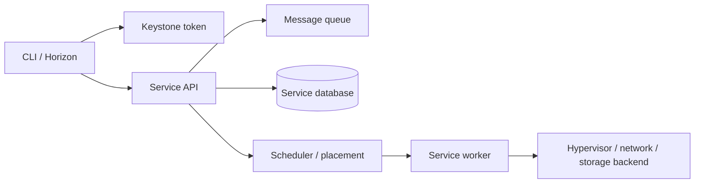

# Certified OpenStack Administrator Knowledge Path

Đây là lộ trình học OpenStack admin thực dụng được thiết kế lại từ `_inbox/Certified OpenStack Administrator Study Guide 2nd.md`. File COA được dùng như backbone để củng cố toàn bộ OpenStack knowledge base: service notes, operations, troubleshooting và certification practice.

Mục tiêu không phải tóm tắt sách theo chương, mà là gom lại các năng lực cần có khi quản trị một cloud OpenStack: hiểu service model, dựng lab, dùng CLI/Horizon, quản lý identity, image, network, compute, object storage, block storage, troubleshooting và orchestration.

## Bản đồ kiến thức

| Mảng năng lực | Cần nắm chắc | Note |
|---|---|---|
| Lab, CLI, Horizon, Keystone, Glance | dựng môi trường học, source RC file, dùng `openstack` CLI, hiểu service catalog, domain/project/user/role, token, image lifecycle | [Lab, CLI, Horizon, Keystone And Glance](./01-lab-cli-horizon-keystone-glance.md) |
| Neutron, Nova, Swift, Cinder | tenant network, router, floating IP, security group, quota, flavor, key pair, instance lifecycle, Swift object/container, Cinder volume/snapshot/backup | [Networking, Compute, Object And Block Storage](./02-neutron-nova-swift-cinder.md) |
| Troubleshooting, Heat, checklist | trace service health, log, DB, RabbitMQ, network agents, host/instance status, Heat stack workflow, readiness checklist | [Troubleshooting, Heat And Admin Checklist](./03-troubleshooting-heat-and-admin-checklist.md) |
| Canonical service reference | tra cứu lâu dài theo service thay vì theo chương sách | [Keystone](../../01-core-fundamentals/services/keystone.md), [Glance](../../01-core-fundamentals/services/glance.md), [Neutron](../../01-core-fundamentals/services/neutron.md), [Nova](../../01-core-fundamentals/services/nova.md), [Cinder](../../01-core-fundamentals/services/cinder.md), [Swift](../../01-core-fundamentals/services/swift.md), [Heat](../../01-core-fundamentals/services/heat.md) |

## COA Competency Map

| Phần năng lực | Vault route |
|---|---|
| Getting started | overview, cloud component model, exam strategy |
| Virtual test environment | labs and deployment notes |
| OpenStack APIs | [API and automation workflow](../../02-operations/api-and-automation-workflow.md), [Horizon](../../01-core-fundamentals/services/horizon.md) |
| Identity management | [Keystone](../../01-core-fundamentals/services/keystone.md) |
| Image management | [Glance](../../01-core-fundamentals/services/glance.md) |
| OpenStack networking | [Neutron](../../01-core-fundamentals/services/neutron.md) |
| OpenStack compute | [Nova](../../01-core-fundamentals/services/nova.md) |
| Object storage | [Swift](../../01-core-fundamentals/services/swift.md) |
| Block storage | [Cinder](../../01-core-fundamentals/services/cinder.md) |
| Troubleshooting | [General logs and maintenance debug](../../04-troubleshooting/general-logs-debug.md), [OpenStack client debug](../../04-troubleshooting/openstack-client-debug.md) |
| Heat orchestration | [Heat](../../01-core-fundamentals/services/heat.md) |
| Readiness checklist | practice notes in this certification folder |

## Cách học hiệu quả

OpenStack không nên học như một danh sách service rời rạc. Hãy học theo luồng request:

Khi tạo một VM, ít nhất có các mảnh sau cùng tham gia:

- `Keystone` xác thực token, project, role và endpoint.
- `Glance` cung cấp image hoặc metadata của image.
- `Neutron` cấp network, subnet, port, security group và floating IP nếu cần.
- `Nova` nhận request, kiểm tra quota, gọi scheduler, chọn compute node và điều phối hypervisor.
- `Placement` giúp Nova hiểu inventory CPU/RAM/disk/traits.
- `Cinder` tham gia nếu boot từ volume hoặc attach volume.
- `RabbitMQ` và database là xương sống control plane giữa các service.

## Liên kết với note OpenStack hiện có

- [OpenStack overview](../../overview.md)
- [Core architecture](../../01-core-fundamentals/01-architectures.md)
- [OpenStack core concepts](../../01-core-fundamentals/02-core-concepts.md)
- [Common OpenStack commands](../../02-operations/common-commands.md)
- [OpenStack API and automation workflow](../../02-operations/api-and-automation-workflow.md)
- [OpenStack client debug](../../04-troubleshooting/openstack-client-debug.md)
- [Keystone](../../01-core-fundamentals/services/keystone.md)
- [Glance](../../01-core-fundamentals/services/glance.md)
- [Neutron](../../01-core-fundamentals/services/neutron.md)
- [Nova](../../01-core-fundamentals/services/nova.md)
- [Swift](../../01-core-fundamentals/services/swift.md)
- [Cinder](../../01-core-fundamentals/services/cinder.md)
- [Heat](../../01-core-fundamentals/services/heat.md)

## Ghi chú về nguồn

- Source intake: `_inbox/Certified OpenStack Administrator Study Guide 2nd.md`
- Nội dung chính của file đã được đọc theo các vùng năng lực COA: cloud model/lab, API/Horizon/RC file, Keystone, Glance, Neutron, Nova, Swift, Cinder, troubleshooting, Heat/HOT và readiness checklist.
- Nội dung đã được diễn đạt lại bằng tiếng Việt và sanitize command/IP/credential.
- Không nhúng nguyên trang ảnh từ sách vào note để tránh biến vault thành bản sao tài liệu gốc; các sơ đồ trong bộ note dùng Mermaid và mô hình hóa lại ý chính.
- Vault không tạo source digest/audit/coverage record riêng; kiến thức từ nguồn được hấp thụ vào các note canonical phía trên.
