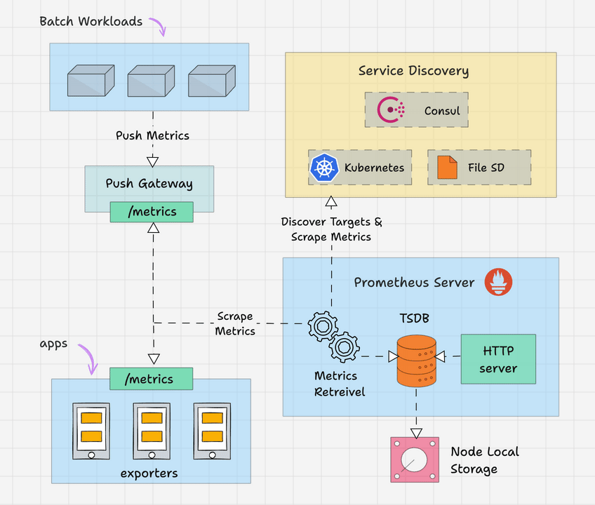
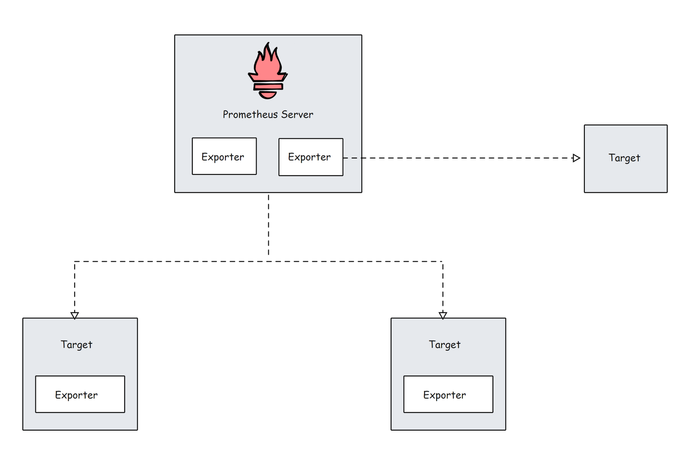
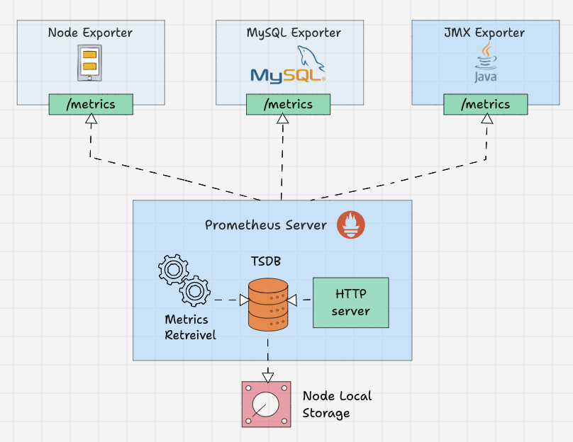
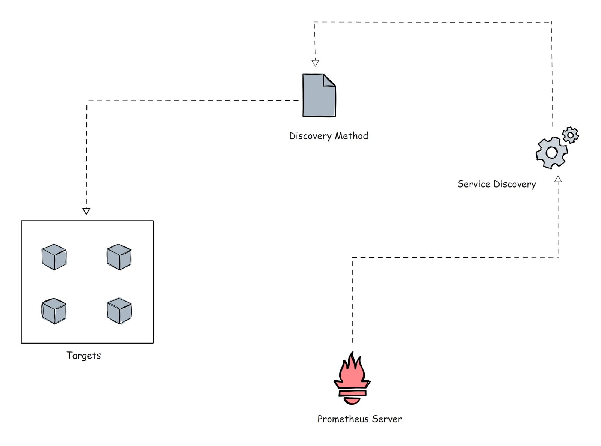
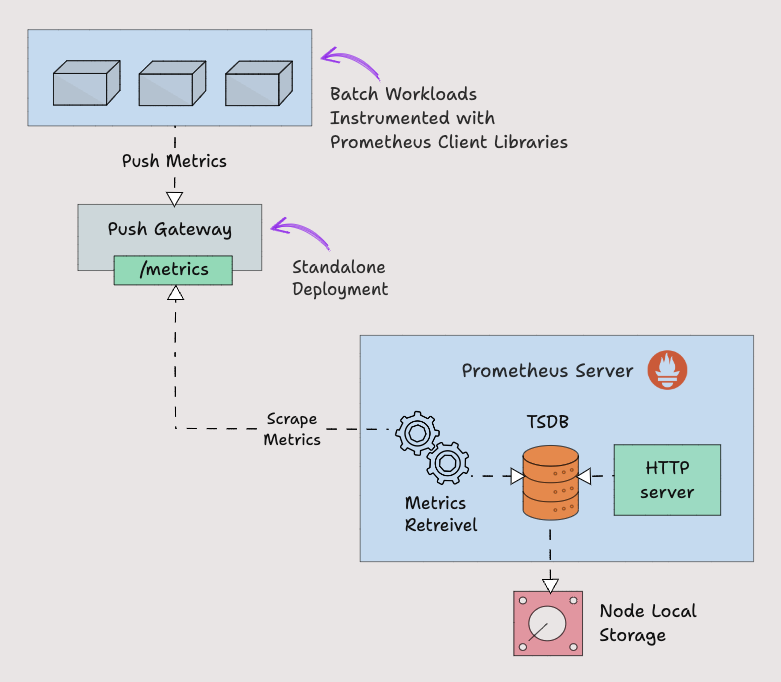
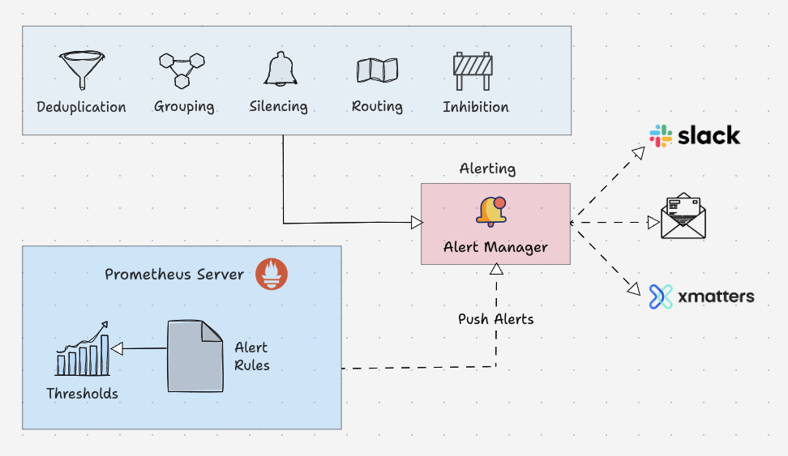

#   —  Kiến trúc Prometheus

- Prometheus là một hệ thống giám sát và cảnh báo mã nguồn mở phổ biến, được viết bằng ngôn ngữ Golang, có khả năng thu thập và xử lý các chỉ số đo lường từ nhiều mục tiêu khác nhau. Bạn cũng có thể truy vấn, xem, phân tích các chỉ số và nhận cảnh báo dựa trên các ngưỡng đã đặt.

## Các thành phần trong kiến trúc Prometheus 


Prometheus chủ yếu bao gồm các thành phần sau:

- Prometheus Server
- Service Discovery
Time-Series Database (TSDB)
- Targets
Exporters
- Push Gateway
- Alert Manager
- Client Libraries
- PromQL

### 1. Prometheus Server
- Prometheus server là bộ não của hệ thống giám sát dựa trên chỉ số đo lường. Công việc chính của server là thu thập các chỉ số từ nhiều mục tiêu khác nhau bằng mô hình pull (kéo).
- Mục tiêu (target) không gì khác ngoài server, pod, endpoint, v.v., mà chúng ta sẽ xem xét chi tiết ở phần tiếp theo.
- Thuật ngữ chung cho việc thu thập chỉ số từ các mục tiêu bằng Prometheus được gọi là scraping (cạo).



- Prometheus định kỳ scraping các chỉ số, dựa trên scrape interval (khoảng thời gian - scraping) mà chúng ta đề cập trong tệp cấu hình Prometheus.
- Dưới đây là một ví dụ cấu hình.

```yaml
global:
  scrape_interval: 15s 
  evaluation_interval: 15s 
  scrape_timeout: 10s 

rule_files:
  - "rules/*.rules"

scrape_configs:
  - job_name: 'prometheus'
    static_configs:
      - targets: ['localhost:9090'] 
  - job_name: 'node-exporter'
    static_configs:
      - targets: ['node-exporter:9100'] 

alerting:
  alertmanagers:
    - static_configs:
        - targets: ['alertmanager:9093']
```

### 2. Time-Series Database (TSDB) - Cơ Sở Dữ Liệu Thời Gian
- Dữ liệu chỉ số mà Prometheus nhận được thay đổi theo thời gian (như CPU, bộ nhớ, I/O mạng, v.v.). Nó được gọi là dữ liệu thời gian (time-series data). Vì vậy, Prometheus sử dụng Cơ Sở Dữ Liệu Thời Gian (TSDB) để lưu trữ tất cả dữ liệu của mình.
- Mặc định, Prometheus lưu trữ tất cả dữ liệu của mình trong một định dạng hiệu quả (chunks) trên đĩa cục bộ. Theo thời gian, nó nén tất cả dữ liệu cũ để tiết kiệm không gian. Nó cũng có chính sách lưu trữ để loại bỏ dữ liệu cũ.
- TSDB có cơ chế tích hợp để quản lý dữ liệu được giữ lâu dài. Bạn có thể chọn bất kỳ chính sách lưu trữ dữ liệu nào sau đây.

    1. Lưu trữ dựa trên thời gian: Dữ liệu sẽ được giữ trong số ngày được chỉ định. Lưu trữ mặc định là 15 ngày.
    2. Lưu trữ dựa trên kích thước: Bạn có thể chỉ định lượng dữ liệu tối đa mà TSDB có thể chứa. Khi đạt giới hạn này, Prometheus sẽ giải phóng không gian để chứa dữ liệu mới.

- Prometheus cũng cung cấp tùy chọn lưu trữ từ xa. Điều này chủ yếu cần thiết cho khả năng mở rộng lưu trữ, lưu trữ dài hạn, sao lưu và phục hồi thảm họa, v.v.

### 3. Các Mục Tiêu Của Prometheus
- Mục tiêu là nguồn mà Prometheus scraping các chỉ số. Một mục tiêu có thể là server, dịch vụ, Kubernetes pods, endpoint ứng dụng, v.v.



- Mặc định, Prometheus tìm kiếm chỉ số dưới đường dẫn `/metrics` của mục tiêu. Đường dẫn mặc định có thể được thay đổi trong cấu hình mục tiêu. Điều này có nghĩa là, nếu bạn không chỉ định đường dẫn chỉ số tùy chỉnh, Prometheus sẽ tìm kiếm chỉ số dưới `/metrics`.
- Cấu hình mục tiêu nằm dưới phần scrape_configs trong tệp cấu hình Prometheus. Dưới đây là một ví dụ cấu hình.

```yaml
scrape_configs:
  
  - job_name: 'node-exporter'
    static_configs:
      - targets: ['node-exporter1:9100', 'node-exporter2:9100']
 
  - job_name: 'my_custom_job'
    static_configs:
      - targets: ['my_service_address:port']
    metrics_path: '/custom_metrics'

  - job_name: 'blackbox-exporter'
    static_configs:
      - targets: ['blackbox-exporter1:9115', 'blackbox-exporter2:9115']
    metrics_path: /probe

  - job_name: 'snmp-exporter'
    static_configs:
      - targets: ['snmp-exporter1:9116', 'snmp-exporter2:9116']
    metrics_path: /snmp
```

- Từ các endpoint mục tiêu, Prometheus mong đợi dữ liệu ở định dạng văn bản nhất định. Mỗi chỉ số phải nằm trên một dòng mới.
- Thông thường, các chỉ số này được expose trên các nút mục tiêu bằng cách sử dụng Prometheus exporters chạy trên các mục tiêu.

### 4. Các Exporter Của Prometheus
- Exporter giống như các agent chạy trên các mục tiêu. Nó chuyển đổi chỉ số từ hệ thống cụ thể sang định dạng mà Prometheus hiểu.
- Nó có thể là chỉ số hệ thống như CPU, bộ nhớ, v.v., hoặc chỉ số JMX của Java, chỉ số MySQL, v.v.



- Mặc định, các chỉ số đã chuyển đổi này được expose bởi exporter trên đường dẫn /metrics (endpoint HTTPS) của mục tiêu.
    - Ví dụ, nếu bạn muốn giám sát CPU và bộ nhớ của một server, bạn cần cài đặt node exporter trên server đó và node exporter expose các chỉ số CPU và bộ nhớ ở định dạng chỉ số Prometheus trên /metrics.
- Khi Prometheus kéo các chỉ số, nó sẽ kết hợp tên chỉ số, nhãn, giá trị và dấu thời gian để tạo cấu trúc cho dữ liệu đó.
- Có rất nhiều Exporter cộng đồng có sẵn, nhưng chỉ một số được phê duyệt chính thức bởi Prometheus. Trong trường hợp bạn cần tùy chỉnh nhiều hơn, bạn cần tạo exporter của riêng mình.
- Prometheus phân loại Exporter thành các phần khác nhau như Databases, Hardware, Issue trackers and continuous integration, Messaging systems, Storage, Software exposing Prometheus metrics, Other third-party utilities, v.v.
Bạn có thể xem danh sách Exporter từ từng loại từ tài liệu chính thức.
- Trong tệp cấu hình Prometheus, tất cả chi tiết của các exporter sẽ được đưa dưới phần scrape_configs.
```yaml
scrape_configs:
  - job_name: 'node-exporter'
    static_configs:
      - targets: ['node-exporter1:9100', 'node-exporter2:9100']

  - job_name: 'blackbox-exporter'
    static_configs:
      - targets: ['blackbox-exporter1:9115', 'blackbox-exporter2:9115']
    metrics_path: /probe

  - job_name: 'snmp-exporter'
    static_configs:
      - targets: ['snmp-exporter1:9116', 'snmp-exporter2:9116']
    metrics_path: /snmp
```

### 5. Prometheus Service Discovery
- Prometheus sử dụng hai phương pháp để scraping chỉ số từ các mục tiêu.

    1. **Static configs:** Khi các mục tiêu có IP tĩnh hoặc endpoint DNS, chúng ta có thể sử dụng những endpoint đó làm mục tiêu.
    2. **Service Discovery:** Trong hầu hết các hệ thống autoscaling và hệ thống phân tán như Kubernetes, mục tiêu sẽ không có endpoint tĩnh. Trong trường hợp này, các endpoint mục tiêu được khám phá bằng cách sử dụng service discovery của Prometheus và các mục tiêu được thêm tự động vào cấu hình Prometheus.



- Trước khi đi sâu hơn, hãy xem một ví dụ nhỏ về khối Kubernetes service discovery trong tệp cấu hình Prometheus sử dụng `kubernetes_sd_configs`.
```yaml
scrape_configs:
      - job_name: 'kubernetes-apiservers'
        kubernetes_sd_configs:
        - role: endpoints
        scheme: https
        tls_config:
          ca_file: /var/run/secrets/kubernetes.io/serviceaccount/ca.crt
        bearer_token_file: /var/run/secrets/kubernetes.io/serviceaccount/token
        relabel_configs:
        - source_labels: [__meta_kubernetes_namespace, __meta_kubernetes_service_name, __meta_kubernetes_endpoint_port_name]
          action: keep
          regex: default;kubernetes;https
```

- Kubernetes là ví dụ hoàn hảo cho các mục tiêu động. Ở đây, bạn không thể sử dụng phương pháp mục tiêu tĩnh, vì các mục tiêu (pods) trong Kubernetes cluster có tính chất tạm thời và có thể tồn tại ngắn hạn.
- Cũng có **File-Based** **Service Discovery** `file_sd_configs` trong Kubernetes. Nó dành cho các mục tiêu tĩnh, nhưng sự khác biệt chính giữa cấu hình tĩnh cổ điển `static_configs` và `file_sd_configs` là ở đây chúng ta tạo các tệp **JSON** hoặc **YAML** riêng biệt và lưu thông tin mục tiêu trong chúng. Prometheus sẽ đọc các tệp để xác định các mục tiêu.
- Không chỉ hai phương pháp này, mà còn có nhiều phương pháp service discovery khác như consul_sd_configs (nơi Prometheus lấy chi tiết mục tiêu từ consul), ec2_sd_configs, v.v.

### 6. Prometheus Pushgateway

- Prometheus mặc định sử dụng cơ chế pull để scraping các chỉ số.
- Tuy nhiên, có các **tình huống mà chỉ số cần được push** đến Prometheus.
- Hãy lấy ví dụ về một **batch job** chạy trên Kubernetes cronjob chạy hàng ngày trong 5 phút dựa trên các sự kiện nhất định. Trong tình huống này, Prometheus sẽ không thể scraping các chỉ số cấp dịch vụ đúng cách bằng cơ chế pull.
=> Vì vậy, thay vì chờ Prometheus kéo chỉ số, chúng ta cần push chỉ số đến Prometheus. Để push chỉ số, Prometheus cung cấp giải pháp gọi là Pushgateway. Nó giống như một cổng trung gian.
- Pushgateway cần được chạy như một thành phần độc lập. Các batch job có thể push chỉ số đến Pushgateway bằng HTTP API. Sau đó, **Pushgateway** expose các chỉ số đó trên endpoint `/metrics`.Sau đó, Prometheus scraping các chỉ số đó từ Pushgateway.



- Pushgateway lưu trữ dữ liệu chỉ số tạm thời trong lưu trữ trong bộ nhớ. Nó giống như một bộ đệm tạm thời hơn.
- Cấu hình Pushgateway cũng sẽ được cấu hình dưới phần `scrape_configs` trong tệp cấu hình `Prometheus`.
```yaml
scrape_configs:
  - job_name: "pushgateway"
        honor_labels: true
        static_configs:
        - targets: [pushgateway.monitoring.svc:9091]
```
- Để gửi chỉ số đến Pushgateway, bạn cần sử dụng Client Libraries của Prometheus và instrument ứng dụng hoặc script để expose các chỉ số cần thiết.

### 7. Các Thư Viện Client Của Prometheus
- Client Libraries của Prometheus là các thư viện phần mềm có thể được sử dụng để instrument mã ứng dụng nhằm expose chỉ số theo cách mà Prometheus hiểu.
- Trong trường hợp bạn cần instrument tùy chỉnh hoặc muốn tạo exporter của riêng mình, bạn có thể sử dụng client libraries.
- Một trường hợp sử dụng rất tốt là các batch job cần push chỉ số đến Pushgateway. Batch job cần được instrument với client libraries để expose các chỉ số yêu cầu ở định dạng Prometheus.
- Dưới đây là ví dụ về `Python Client Library` expose chỉ số tùy chỉnh tên là `batch_job_records_processed_total`.
```yaml
from prometheus_client import start_http_server, Counter
import time
import random

RECORDS_PROCESSED = Counter('batch_job_records_processed_total', 'Total number of records processed by the batch job')

def process_record():
    time.sleep(random.uniform(0.01, 0.1))
    RECORDS_PROCESSED.inc()

def batch_job():
   
    for _ in range(100):
        process_record()

if __name__ == '__main__':
 
    start_http_server(8000)
    print("Metrics server started on port 8000")

    batch_job()
    print("Batch job completed")

    while True:
        time.sleep(1)
```

- Ngoài ra, khi sử dụng client libraries, server HTTP `prometheus_client` expose chỉ số ở endpoint `/metrics`.
- Prometheus có Client Libraries cho hầu hết các ngôn ngữ lập trình, và nếu bạn muốn tạo Client Library, bạn có thể làm điều đó.

### 8. Prometheus Alert Manager
- Alertmanager là phần quan trọng của hệ thống giám sát Prometheus. Công việc chính của nó là gửi cảnh báo dựa trên các ngưỡng chỉ số được đặt trong cấu hình cảnh báo Prometheus.
- Cảnh báo được kích hoạt bởi Prometheus và gửi đến Alertmanager. Sau đó, nó gửi cảnh báo đến các hệ thống/thụ nhận thông báo tương ứng (email, slack, v.v.) được cấu hình trong cấu hình Alert Manager.
- Ngoài ra, Alert Manager xử lý các nhiệm vụ sau:

    1. Loại bỏ trùng lặp cảnh báo (Alert Deduplicating): Quy trình loại bỏ các cảnh báo trùng lặp.
    2. Nhóm (Grouping): Quy trình nhóm các cảnh báo liên quan lại với nhau.
    3. Tắt tiếng (Silencing): Tắt cảnh báo cho bảo trì hoặc cảnh báo giả.
    4. Định tuyến (Routing): Định tuyến cảnh báo đến các thụ nhận phù hợp dựa trên mức độ nghiêm trọng.
    5. Ức chế (Inhibition): Quy trình dừng cảnh báo mức độ thấp khi có cảnh báo mức độ trung bình hoặc cao.



- Dưới đây là ví dụ về quy tắc cảnh báo.
```yaml
groups:
- name: microservices_alerts
  rules:
  - record: http_latency:average_latency_seconds
    expr: sum(http_request_duration_seconds_sum) / sum(http_request_duration_seconds_count)
  - alert: HighLatencyAlert
    expr: http_latency:average_latency_seconds > 0.5
    for: 5m
    labels:
      severity: critical
    annotations:
      summary: "High latency detected in microservices"
      description: "The average HTTP latency is high ({{ $value }} seconds) in the microservices cluster."
```
Đây là ví dụ về cấu hình định tuyến trong tệp cấu hình Alertmanager.
```yaml
routes:
- match:
    severity: 'critical'
  receiver: 'pagerduty-notifications'

- match:
    severity: 'warning'
  receiver: 'slack-notifications'
```
> Alert Manager hỗ trợ hầu hết các hệ thống nhắn tin và thông báo như Discord, Email, Slack, v.v. để gửi cảnh báo dưới dạng thông báo đến thụ nhận.

